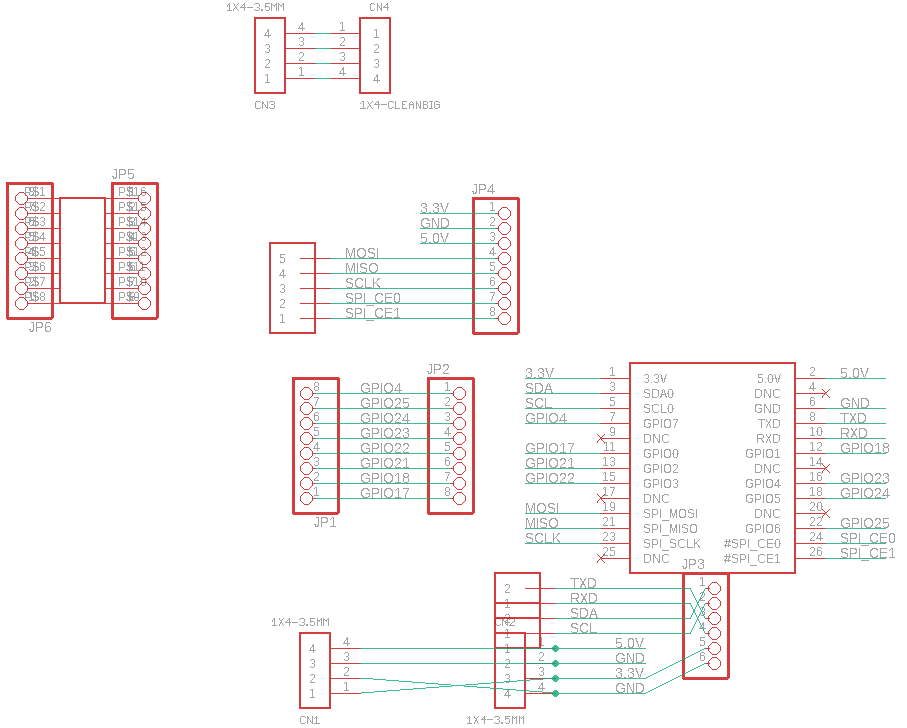
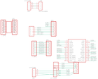

Contents
========

* [PRA801 > Adafruit](#pra801--adafruit)
	* [Schematic](#schematic)
	* [Interactive BOM](#interactive-bom)
	* [OOMP Parts](#oomp-parts)
	* [Images](#images)
	* [Tags](#tags)
  
![][im]
# PRA801 > Adafruit

- ID: PROJ-ADAF-801-STAN-01
- Hex ID: PRA801
- Name: Adafruit
- Description: Adafruit
- Long Link: [http://oom.lt/PROJ-ADAF-801-STAN-01](http://oom.lt/PROJ-ADAF-801-STAN-01)
- Short Link: [http://oom.lt/PRA801](http://oom.lt/PRA801)

## Schematic
  

## Interactive BOM

- Interactive BOM page: [ibom.html](https://htmlpreview.github.io/?https://github.com/oomlout/oomlout_OOMP_projects/blob/main/PROJ-ADAF-801-STAN-01/kicad/bom/ibom.html)

## OOMP Parts
  

|OOMP Parts|
| :---: |
|CN1,UNMATCHED-UNMATCHED-X-UNMATCHED-01,CN1,1X4-3.5MM,1X4-3.5MM,1X04-3.5MM,4-pin connector,,|
|CN2,UNMATCHED-UNMATCHED-X-UNMATCHED-01,CN2,1X4-3.5MM,1X4-3.5MM,1X04-3.5MM,4-pin connector,,|
|CN3,UNMATCHED-UNMATCHED-X-UNMATCHED-01,CN3,1X4-3.5MM,1X4-3.5MM,1X04-3.5MM,4-pin connector,,|
|CN4,UNMATCHED-UNMATCHED-X-UNMATCHED-01,CN4,1X4-CLEANBIG,1X4-CLEANBIG,1X04-CLEANBIG,4-pin connector,,|
|J1,UNMATCHED-UNMATCHED-X-UNMATCHED-01,J1,1X2-3.5MM,1X2-3.5MM,1X2-3.5MM,3.5mm Terminal block,,|
|J2,UNMATCHED-UNMATCHED-X-UNMATCHED-01,J2,1X2-3.5MM,1X2-3.5MM,1X2-3.5MM,3.5mm Terminal block,,|
|J3,UNMATCHED-UNMATCHED-X-UNMATCHED-01,J3,1X5,1X5,1X05-3.5MM,,,|
|JP1,HEAD-UNMATCHED-X-PI08-01,JP1,,PINHD-1X8-3.5MM,1X08-3.5MM,PIN HEADER,,|
|JP2,HEAD-I01-X-PI08-01,JP2,,PINHD-1X8BIG,1X08-BIG,PIN HEADER,,|
|JP3,HEAD-I01-X-PI06-01,JP3,,PINHD-1X6B,1X06-BIG,PIN HEADER,,|
|JP4,HEAD-I01-X-PI08-01,JP4,,PINHD-1X8BIG,1X08-BIG,PIN HEADER,,|
|JP5,HEAD-I01-X-PI08-01,JP5,,PINHD-1X8BIG,1X08-BIG,PIN HEADER,,|
|JP6,HEAD-I01-X-PI08-01,JP6,,PINHD-1X8BIG,1X08-BIG,PIN HEADER,,|
|U$1,UNMATCHED-UNMATCHED-X-UNMATCHED-01,U$1,RASPBERRYPI_BB,RASPBERRYPI_BB,RASBERRYPI_SHIELD,,,|
|U$2,UNMATCHED-UNMATCHED-X-UNMATCHED-01,U$2,SMD-16SOIC,SMD-16SOIC,SO-16NMW,,,|

## Images
  
  

|kicadPcb3d|kicadPcb3dFront|kicadPcb3dBack|eagleImage|eagleSchemImage|
| :---: | :---: | :---: | :---: | :---: |
||||||

## Tags

- hexID: PRA801
- oompType: PROJ
- oompSize: ADAF
- oompColor: 801
- oompDesc: STAN
- oompIndex: 01
- oompName: Adafruit Prototyping Pi Plate PCB
- sources: All source files from https://github.com/adafruit/Adafruit-Prototyping-Pi-Plate-PCB (source licence details in srcLicense.md)
- linkBuyPage: http://www.adafruit.com/products/801
- oompID: PROJ-ADAF-801-STAN-01
- oompParts: CN1,UNMATCHED-UNMATCHED-X-UNMATCHED-01
- oompParts: CN2,UNMATCHED-UNMATCHED-X-UNMATCHED-01
- oompParts: CN3,UNMATCHED-UNMATCHED-X-UNMATCHED-01
- oompParts: CN4,UNMATCHED-UNMATCHED-X-UNMATCHED-01
- oompParts: J1,UNMATCHED-UNMATCHED-X-UNMATCHED-01
- oompParts: J2,UNMATCHED-UNMATCHED-X-UNMATCHED-01
- oompParts: J3,UNMATCHED-UNMATCHED-X-UNMATCHED-01
- oompParts: JP1,HEAD-UNMATCHED-X-PI08-01
- oompParts: JP2,HEAD-I01-X-PI08-01
- oompParts: JP3,HEAD-I01-X-PI06-01
- oompParts: JP4,HEAD-I01-X-PI08-01
- oompParts: JP5,HEAD-I01-X-PI08-01
- oompParts: JP6,HEAD-I01-X-PI08-01
- oompParts: U$1,UNMATCHED-UNMATCHED-X-UNMATCHED-01
- oompParts: U$2,UNMATCHED-UNMATCHED-X-UNMATCHED-01
- rawParts: CN1,1X4-3.5MM,1X4-3.5MM,1X04-3.5MM,4-pin connector,,
- rawParts: CN2,1X4-3.5MM,1X4-3.5MM,1X04-3.5MM,4-pin connector,,
- rawParts: CN3,1X4-3.5MM,1X4-3.5MM,1X04-3.5MM,4-pin connector,,
- rawParts: CN4,1X4-CLEANBIG,1X4-CLEANBIG,1X04-CLEANBIG,4-pin connector,,
- rawParts: J1,1X2-3.5MM,1X2-3.5MM,1X2-3.5MM,3.5mm Terminal block,,
- rawParts: J2,1X2-3.5MM,1X2-3.5MM,1X2-3.5MM,3.5mm Terminal block,,
- rawParts: J3,1X5,1X5,1X05-3.5MM,,,
- rawParts: JP1,,PINHD-1X8-3.5MM,1X08-3.5MM,PIN HEADER,,
- rawParts: JP2,,PINHD-1X8BIG,1X08-BIG,PIN HEADER,,
- rawParts: JP3,,PINHD-1X6B,1X06-BIG,PIN HEADER,,
- rawParts: JP4,,PINHD-1X8BIG,1X08-BIG,PIN HEADER,,
- rawParts: JP5,,PINHD-1X8BIG,1X08-BIG,PIN HEADER,,
- rawParts: JP6,,PINHD-1X8BIG,1X08-BIG,PIN HEADER,,
- rawParts: U$1,RASPBERRYPI_BB,RASPBERRYPI_BB,RASBERRYPI_SHIELD,,,
- rawParts: U$2,SMD-16SOIC,SMD-16SOIC,SO-16NMW,,,

[im]: kicadPcb3d_450.png
