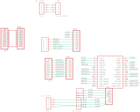

Contents
========

* [PRA801 > Adafruit](#pra801--adafruit)
	* [Images](#images)
	* [Tags](#tags)
  
![][im]
# PRA801 > Adafruit

- ID: PROJ-ADAF-801-STAN-01
- Hex ID: PRA801
- Name: Adafruit
- Description: Adafruit

## Images
  
  

|kicadPcb3d|kicadPcb3dFront|kicadPcb3dBack|eagleImage|eagleSchemImage|
| :---: | :---: | :---: | :---: | :---: |
||||||

## Tags

- hexID: PRA801
- oompType: PROJ
- oompSize: ADAF
- oompColor: 801
- oompDesc: STAN
- oompIndex: 01
- oompName: Adafruit Prototyping Pi Plate PCB
- sources: All source files from https://github.com/adafruit/Adafruit-Prototyping-Pi-Plate-PCB (source licence details in srcLicense.md)
- linkBuyPage: http://www.adafruit.com/products/801
- oompID: PROJ-ADAF-801-STAN-01
- oompParts: CN1,UNMATCHED-UNMATCHED-UNMATCHED-UNMATCHED-UNMATCHED
- oompParts: CN2,UNMATCHED-UNMATCHED-UNMATCHED-UNMATCHED-UNMATCHED
- oompParts: CN3,UNMATCHED-UNMATCHED-UNMATCHED-UNMATCHED-UNMATCHED
- oompParts: CN4,UNMATCHED-UNMATCHED-UNMATCHED-UNMATCHED-UNMATCHED
- oompParts: J1,UNMATCHED-UNMATCHED-UNMATCHED-UNMATCHED-UNMATCHED
- oompParts: J2,UNMATCHED-UNMATCHED-UNMATCHED-UNMATCHED-UNMATCHED
- oompParts: J3,UNMATCHED-UNMATCHED-UNMATCHED-UNMATCHED-UNMATCHED
- oompParts: JP1,UNMATCHED-UNMATCHED-UNMATCHED-UNMATCHED-UNMATCHED
- oompParts: JP2,UNMATCHED-UNMATCHED-UNMATCHED-UNMATCHED-UNMATCHED
- oompParts: JP3,UNMATCHED-UNMATCHED-UNMATCHED-UNMATCHED-UNMATCHED
- oompParts: JP4,UNMATCHED-UNMATCHED-UNMATCHED-UNMATCHED-UNMATCHED
- oompParts: JP5,UNMATCHED-UNMATCHED-UNMATCHED-UNMATCHED-UNMATCHED
- oompParts: JP6,UNMATCHED-UNMATCHED-UNMATCHED-UNMATCHED-UNMATCHED
- oompParts: U$1,UNMATCHED-UNMATCHED-UNMATCHED-UNMATCHED-UNMATCHED
- oompParts: U$2,UNMATCHED-UNMATCHED-UNMATCHED-UNMATCHED-UNMATCHED
- rawParts: CN1,1X4-3.5MM,1X4-3.5MM,1X04-3.5MM,4-pin connector,,
- rawParts: CN2,1X4-3.5MM,1X4-3.5MM,1X04-3.5MM,4-pin connector,,
- rawParts: CN3,1X4-3.5MM,1X4-3.5MM,1X04-3.5MM,4-pin connector,,
- rawParts: CN4,1X4-CLEANBIG,1X4-CLEANBIG,1X04-CLEANBIG,4-pin connector,,
- rawParts: J1,1X2-3.5MM,1X2-3.5MM,1X2-3.5MM,3.5mm Terminal block,,
- rawParts: J2,1X2-3.5MM,1X2-3.5MM,1X2-3.5MM,3.5mm Terminal block,,
- rawParts: J3,1X5,1X5,1X05-3.5MM,,,
- rawParts: JP1,,PINHD-1X8-3.5MM,1X08-3.5MM,PIN HEADER,,
- rawParts: JP2,,PINHD-1X8BIG,1X08-BIG,PIN HEADER,,
- rawParts: JP3,,PINHD-1X6B,1X06-BIG,PIN HEADER,,
- rawParts: JP4,,PINHD-1X8BIG,1X08-BIG,PIN HEADER,,
- rawParts: JP5,,PINHD-1X8BIG,1X08-BIG,PIN HEADER,,
- rawParts: JP6,,PINHD-1X8BIG,1X08-BIG,PIN HEADER,,
- rawParts: U$1,RASPBERRYPI_BB,RASPBERRYPI_BB,RASBERRYPI_SHIELD,,,
- rawParts: U$2,SMD-16SOIC,SMD-16SOIC,SO-16NMW,,,

[im]: kicadPcb3d_450.png
