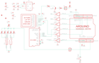

Contents
========

* [PRA802 > Adafruit](#pra802--adafruit)
	* [Schematic](#schematic)
	* [OOMP Parts](#oomp-parts)
	* [Images](#images)
	* [Tags](#tags)
  
![][im]
# PRA802 > Adafruit

- ID: PROJ-ADAF-802-STAN-01
- Hex ID: PRA802
- Name: Adafruit
- Description: Adafruit
- Long Link: [http://oom.lt/PROJ-ADAF-802-STAN-01](http://oom.lt/PROJ-ADAF-802-STAN-01)
- Long Link: [http://oom.lt/PRA802](http://oom.lt/PRA802)

## Schematic
  
![][schem]
## OOMP Parts
  

|OOMP Parts|
| :---: |
|ANALOGS,UNMATCHED-UNMATCHED-UNMATCHED-UNMATCHED-UNMATCHED,ANALOGS,,PINHD-1X6CB,1X06-CLEANBIG,PIN HEADER,,|
|BACKLITE,UNMATCHED-UNMATCHED-UNMATCHED-UNMATCHED-UNMATCHED,BACKLITE,,PINHD-1X1,1X01,PIN HEADER,,|
|BTN1,UNMATCHED-UNMATCHED-UNMATCHED-UNMATCHED-UNMATCHED,BTN1,,SWITCH_4WAY_TPA511GLFS,SWITCH_4WAY_TPA511GLFS,,,|
|C1,UNMATCHED-UNMATCHED-UNMATCHED-UNMATCHED-UNMATCHED,C1,10uF,C-USC0805K,C0805K,CAPACITOR, American symbol,,|
|C2,UNMATCHED-UNMATCHED-UNMATCHED-UNMATCHED-UNMATCHED,C2,10uF,C-USC0805K,C0805K,CAPACITOR, American symbol,,|
|C3,UNMATCHED-UNMATCHED-UNMATCHED-UNMATCHED-UNMATCHED,C3,0.1uF,C-USC0805K,C0805K,CAPACITOR, American symbol,,|
|C4,UNMATCHED-UNMATCHED-UNMATCHED-UNMATCHED-UNMATCHED,C4,0.1uF,C-USC0805K,C0805K,CAPACITOR, American symbol,,|
|DIGITALS,UNMATCHED-UNMATCHED-UNMATCHED-UNMATCHED-UNMATCHED,DIGITALS,,PINHD-1X8CLEANBIG,1X08-CLEANBIG,PIN HEADER,,|
|DIGITALS2,UNMATCHED-UNMATCHED-UNMATCHED-UNMATCHED-UNMATCHED,DIGITALS2,,PINHD-1X8CLEANBIG,1X08-CLEANBIG,PIN HEADER,,|
|IC1,UNMATCHED-UNMATCHED-UNMATCHED-UNMATCHED-UNMATCHED,FID1,FIDUCIAL1X2.5,FIDUCIAL1X2.5,FIDUCIAL-1X2.5,Fiducial Alignment Points,,|
|IC2,UNMATCHED-UNMATCHED-UNMATCHED-UNMATCHED-UNMATCHED,FID3,FIDUCIAL1X2.5,FIDUCIAL1X2.5,FIDUCIAL-1X2.5,Fiducial Alignment Points,,|
|NAV,UNMATCHED-UNMATCHED-UNMATCHED-UNMATCHED-UNMATCHED,IC1,4050D,4050D,SO16,Hex non-inverting BUFFER,,|
|POWER,UNMATCHED-UNMATCHED-UNMATCHED-UNMATCHED-UNMATCHED,IC2,RT9193-33GB,LP298XS,SOT23-5L,,,|
|Q1,UNMATCHED-UNMATCHED-UNMATCHED-UNMATCHED-UNMATCHED,NAV,,PINHD-1X1,1X01,PIN HEADER,,|
|R1,UNMATCHED-UNMATCHED-UNMATCHED-UNMATCHED-UNMATCHED,POWER,,PINHD-1X6CB,1X06-CLEANBIG,PIN HEADER,,|
|R2,UNMATCHED-UNMATCHED-UNMATCHED-UNMATCHED-UNMATCHED,Q1,2N2222,MMBT2222ALT1-NPN-SOT23-BEC,SOT23-BEC,NPN Transistror,,|
|R3,UNMATCHED-UNMATCHED-UNMATCHED-UNMATCHED-UNMATCHED,R1,22 ohm,R-US_R0805,R0805,RESISTOR, American symbol,,|
|R4,UNMATCHED-UNMATCHED-UNMATCHED-UNMATCHED-UNMATCHED,R2,1K,R-US_R0805,R0805,RESISTOR, American symbol,,|
|R5,UNMATCHED-UNMATCHED-UNMATCHED-UNMATCHED-UNMATCHED,R3,1.0K,R-US_R0805,R0805,RESISTOR, American symbol,,|
|R6,UNMATCHED-UNMATCHED-UNMATCHED-UNMATCHED-UNMATCHED,R4,470 ohm,R-US_R0805,R0805,RESISTOR, American symbol,,|
|R7,UNMATCHED-UNMATCHED-UNMATCHED-UNMATCHED-UNMATCHED,R5,220 ohm,R-US_R0805,R0805,RESISTOR, American symbol,,|
|R8,UNMATCHED-UNMATCHED-UNMATCHED-UNMATCHED-UNMATCHED,R6,10K,R-US_R0805,R0805,RESISTOR, American symbol,,|
|R9,UNMATCHED-UNMATCHED-UNMATCHED-UNMATCHED-UNMATCHED,R7,22 ohm,R-US_R0805,R0805,RESISTOR, American symbol,,|
|U$1,UNMATCHED-UNMATCHED-UNMATCHED-UNMATCHED-UNMATCHED,R8,1Kohm,R-US_R0805,R0805,RESISTOR, American symbol,,|
|U$2,UNMATCHED-UNMATCHED-UNMATCHED-UNMATCHED-UNMATCHED,R9,1K,R-US_R0805,R0805,RESISTOR, American symbol,,|
|U$3,UNMATCHED-UNMATCHED-UNMATCHED-UNMATCHED-UNMATCHED,U$1,JD-T1800,JD-T1800,JD-T1800,,,|
|U$4,UNMATCHED-UNMATCHED-UNMATCHED-UNMATCHED-UNMATCHED,U$2,ARDUINOUNO,ARDUINOUNO,ARDUINO,Arduino Diecimila/Duemilanove,,|

## Images
  
  

|kicadPcb3d|kicadPcb3dFront|kicadPcb3dBack|eagleImage|eagleSchemImage|
| :---: | :---: | :---: | :---: | :---: |
||||||

## Tags

- hexID: PRA802
- oompType: PROJ
- oompSize: ADAF
- oompColor: 802
- oompDesc: STAN
- oompIndex: 01
- oompName: Adafruit 1.8 TFT Shield PCB
- sources: All source files from https://github.com/adafruit/Adafruit-1.8-TFT-Shield-PCB (source licence details in srcLicense.md)
- linkBuyPage: http://www.adafruit.com/products/802
- oompID: PROJ-ADAF-802-STAN-01
- oompParts: ANALOGS,UNMATCHED-UNMATCHED-UNMATCHED-UNMATCHED-UNMATCHED
- oompParts: BACKLITE,UNMATCHED-UNMATCHED-UNMATCHED-UNMATCHED-UNMATCHED
- oompParts: BTN1,UNMATCHED-UNMATCHED-UNMATCHED-UNMATCHED-UNMATCHED
- oompParts: C1,UNMATCHED-UNMATCHED-UNMATCHED-UNMATCHED-UNMATCHED
- oompParts: C2,UNMATCHED-UNMATCHED-UNMATCHED-UNMATCHED-UNMATCHED
- oompParts: C3,UNMATCHED-UNMATCHED-UNMATCHED-UNMATCHED-UNMATCHED
- oompParts: C4,UNMATCHED-UNMATCHED-UNMATCHED-UNMATCHED-UNMATCHED
- oompParts: DIGITALS,UNMATCHED-UNMATCHED-UNMATCHED-UNMATCHED-UNMATCHED
- oompParts: DIGITALS2,UNMATCHED-UNMATCHED-UNMATCHED-UNMATCHED-UNMATCHED
- oompParts: IC1,UNMATCHED-UNMATCHED-UNMATCHED-UNMATCHED-UNMATCHED
- oompParts: IC2,UNMATCHED-UNMATCHED-UNMATCHED-UNMATCHED-UNMATCHED
- oompParts: NAV,UNMATCHED-UNMATCHED-UNMATCHED-UNMATCHED-UNMATCHED
- oompParts: POWER,UNMATCHED-UNMATCHED-UNMATCHED-UNMATCHED-UNMATCHED
- oompParts: Q1,UNMATCHED-UNMATCHED-UNMATCHED-UNMATCHED-UNMATCHED
- oompParts: R1,UNMATCHED-UNMATCHED-UNMATCHED-UNMATCHED-UNMATCHED
- oompParts: R2,UNMATCHED-UNMATCHED-UNMATCHED-UNMATCHED-UNMATCHED
- oompParts: R3,UNMATCHED-UNMATCHED-UNMATCHED-UNMATCHED-UNMATCHED
- oompParts: R4,UNMATCHED-UNMATCHED-UNMATCHED-UNMATCHED-UNMATCHED
- oompParts: R5,UNMATCHED-UNMATCHED-UNMATCHED-UNMATCHED-UNMATCHED
- oompParts: R6,UNMATCHED-UNMATCHED-UNMATCHED-UNMATCHED-UNMATCHED
- oompParts: R7,UNMATCHED-UNMATCHED-UNMATCHED-UNMATCHED-UNMATCHED
- oompParts: R8,UNMATCHED-UNMATCHED-UNMATCHED-UNMATCHED-UNMATCHED
- oompParts: R9,UNMATCHED-UNMATCHED-UNMATCHED-UNMATCHED-UNMATCHED
- oompParts: U$1,UNMATCHED-UNMATCHED-UNMATCHED-UNMATCHED-UNMATCHED
- oompParts: U$2,UNMATCHED-UNMATCHED-UNMATCHED-UNMATCHED-UNMATCHED
- oompParts: U$3,UNMATCHED-UNMATCHED-UNMATCHED-UNMATCHED-UNMATCHED
- oompParts: U$4,UNMATCHED-UNMATCHED-UNMATCHED-UNMATCHED-UNMATCHED
- rawParts: ANALOGS,,PINHD-1X6CB,1X06-CLEANBIG,PIN HEADER,,
- rawParts: BACKLITE,,PINHD-1X1,1X01,PIN HEADER,,
- rawParts: BTN1,,SWITCH_4WAY_TPA511GLFS,SWITCH_4WAY_TPA511GLFS,,,
- rawParts: C1,10uF,C-USC0805K,C0805K,CAPACITOR, American symbol,,
- rawParts: C2,10uF,C-USC0805K,C0805K,CAPACITOR, American symbol,,
- rawParts: C3,0.1uF,C-USC0805K,C0805K,CAPACITOR, American symbol,,
- rawParts: C4,0.1uF,C-USC0805K,C0805K,CAPACITOR, American symbol,,
- rawParts: DIGITALS,,PINHD-1X8CLEANBIG,1X08-CLEANBIG,PIN HEADER,,
- rawParts: DIGITALS2,,PINHD-1X8CLEANBIG,1X08-CLEANBIG,PIN HEADER,,
- rawParts: FID1,FIDUCIAL1X2.5,FIDUCIAL1X2.5,FIDUCIAL-1X2.5,Fiducial Alignment Points,,
- rawParts: FID3,FIDUCIAL1X2.5,FIDUCIAL1X2.5,FIDUCIAL-1X2.5,Fiducial Alignment Points,,
- rawParts: IC1,4050D,4050D,SO16,Hex non-inverting BUFFER,,
- rawParts: IC2,RT9193-33GB,LP298XS,SOT23-5L,,,
- rawParts: NAV,,PINHD-1X1,1X01,PIN HEADER,,
- rawParts: POWER,,PINHD-1X6CB,1X06-CLEANBIG,PIN HEADER,,
- rawParts: Q1,2N2222,MMBT2222ALT1-NPN-SOT23-BEC,SOT23-BEC,NPN Transistror,,
- rawParts: R1,22 ohm,R-US_R0805,R0805,RESISTOR, American symbol,,
- rawParts: R2,1K,R-US_R0805,R0805,RESISTOR, American symbol,,
- rawParts: R3,1.0K,R-US_R0805,R0805,RESISTOR, American symbol,,
- rawParts: R4,470 ohm,R-US_R0805,R0805,RESISTOR, American symbol,,
- rawParts: R5,220 ohm,R-US_R0805,R0805,RESISTOR, American symbol,,
- rawParts: R6,10K,R-US_R0805,R0805,RESISTOR, American symbol,,
- rawParts: R7,22 ohm,R-US_R0805,R0805,RESISTOR, American symbol,,
- rawParts: R8,1Kohm,R-US_R0805,R0805,RESISTOR, American symbol,,
- rawParts: R9,1K,R-US_R0805,R0805,RESISTOR, American symbol,,
- rawParts: U$1,JD-T1800,JD-T1800,JD-T1800,,,
- rawParts: U$2,ARDUINOUNO,ARDUINOUNO,ARDUINO,Arduino Diecimila/Duemilanove,,
- rawParts: U$3,MICROSD,MICROSD,MICROSD,Micro-SD / Transflash card holder with SPI pinout,,
- rawParts: U$4,EVQQ2,EVQQ2,EVQ-Q2,SMT 6mm switch, EVQQ2 series,,

[im]: kicadPcb3d_450.png
[schem]: eagleSchemImage.png
