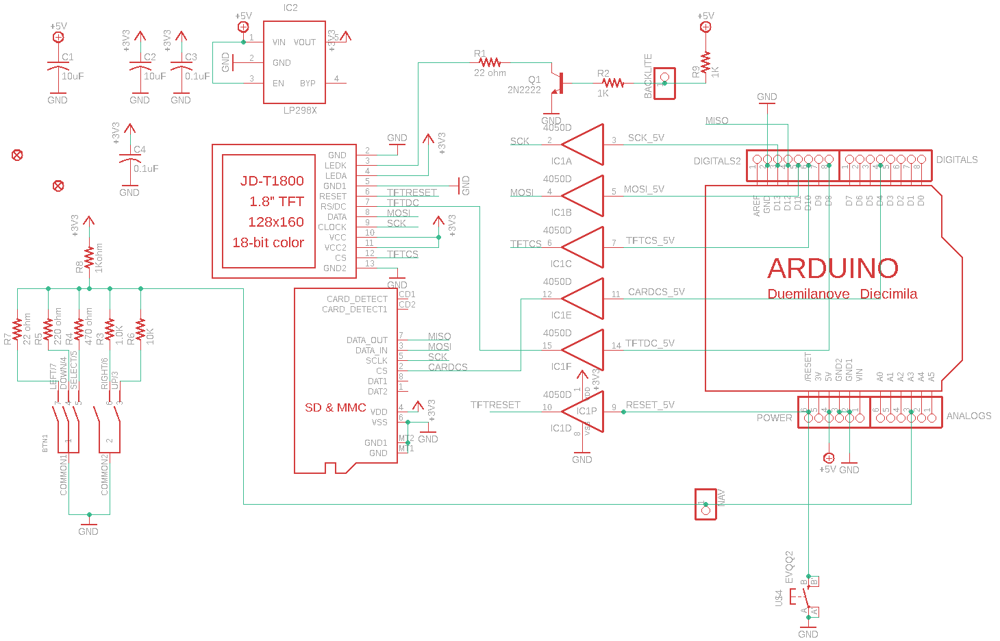
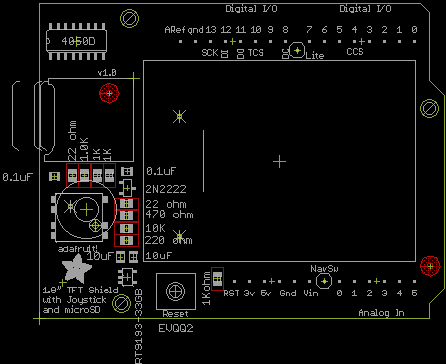

Contents
========

* [PRA802 > Adafruit 1.8 TFT Shield PCB](#pra802--adafruit-18-tft-shield-pcb)
	* [Schematic](#schematic)
	* [PCB](#pcb)
	* [OOMP Parts](#oomp-parts)
	* [Images](#images)
	* [Tags](#tags)
  
![][im]
# PRA802 > Adafruit 1.8 TFT Shield PCB

- ID: PROJ-ADAF-802-STAN-01
- Hex ID: PRA802
- Name: Adafruit
- Description: Adafruit
- Long Link: [http://oom.lt/PROJ-ADAF-802-STAN-01](http://oom.lt/PROJ-ADAF-802-STAN-01)
- Short Link: [http://oom.lt/PRA802](http://oom.lt/PRA802)

## Schematic
  

## PCB
  

## OOMP Parts
  

|OOMP ID|Name|Identifier|
| :---: | :---: | :---: |
|[HEAD-I01-X-PI06-01](https://github.com/oomlout/oomlout_OOMP_parts/tree/main/HEAD-I01-X-PI06-01/)|[2.54 mm 6 Pin Header](https://github.com/oomlout/oomlout_OOMP_parts/tree/main/HEAD-I01-X-PI06-01/)|[ANALOGS, POWER](https://github.com/oomlout/oomlout_OOMP_parts/tree/main/HEAD-I01-X-PI06-01/)|
|HEAD-I01-X-PI01-01||BACKLITE, NAV|
|UNMATCHED-UNMATCHED-X-UNMATCHED-01||BTN1, IC1, U$1, U$2, U$3|
|[CAPC-0805-X-UF10-V10](https://github.com/oomlout/oomlout_OOMP_parts/tree/main/CAPC-0805-X-UF10-V10/)|[SMD (0805) 10 uF Capacitor (Ceramic) 10v](https://github.com/oomlout/oomlout_OOMP_parts/tree/main/CAPC-0805-X-UF10-V10/)|[C1, C2](https://github.com/oomlout/oomlout_OOMP_parts/tree/main/CAPC-0805-X-UF10-V10/)|
|[CAPC-0805-X-NF100-V50](https://github.com/oomlout/oomlout_OOMP_parts/tree/main/CAPC-0805-X-NF100-V50/)|[SMD (0805) 100 nF Capacitor (Ceramic) 50v](https://github.com/oomlout/oomlout_OOMP_parts/tree/main/CAPC-0805-X-NF100-V50/)|[C3, C4](https://github.com/oomlout/oomlout_OOMP_parts/tree/main/CAPC-0805-X-NF100-V50/)|
|[HEAD-I01-X-PI08-01](https://github.com/oomlout/oomlout_OOMP_parts/tree/main/HEAD-I01-X-PI08-01/)|[2.54 mm 8 Pin Header](https://github.com/oomlout/oomlout_OOMP_parts/tree/main/HEAD-I01-X-PI08-01/)|[DIGITALS, DIGITALS2](https://github.com/oomlout/oomlout_OOMP_parts/tree/main/HEAD-I01-X-PI08-01/)|
|VREG-SO235-X-KLP298XS-V33D||IC2|
|UNMATCHED-SO23-X-UNMATCHED-01||Q1|
|RESE-0805-X-UNMATCHED-01||R1, R4, R5, R7, R8|
|[RESE-0805-X-O102-01](https://github.com/oomlout/oomlout_OOMP_parts/tree/main/RESE-0805-X-O102-01/)|[SMD (0805) 1k Ohm Resistor](https://github.com/oomlout/oomlout_OOMP_parts/tree/main/RESE-0805-X-O102-01/)|[R2, R3, R9](https://github.com/oomlout/oomlout_OOMP_parts/tree/main/RESE-0805-X-O102-01/)|
|[RESE-0805-X-O103-01](https://github.com/oomlout/oomlout_OOMP_parts/tree/main/RESE-0805-X-O103-01/)|[SMD (0805) 10k Ohm Resistor](https://github.com/oomlout/oomlout_OOMP_parts/tree/main/RESE-0805-X-O103-01/)|[R6](https://github.com/oomlout/oomlout_OOMP_parts/tree/main/RESE-0805-X-O103-01/)|
|[BUTA-6060-X-STAN-01](https://github.com/oomlout/oomlout_OOMP_parts/tree/main/BUTA-6060-X-STAN-01/)|[SMD (6060) Pushbutton (Tactile)](https://github.com/oomlout/oomlout_OOMP_parts/tree/main/BUTA-6060-X-STAN-01/)|[U$4](https://github.com/oomlout/oomlout_OOMP_parts/tree/main/BUTA-6060-X-STAN-01/)|

## Images
  
  

|kicadPcb3d|kicadPcb3dFront|kicadPcb3dBack|eagleImage|eagleSchemImage|
| :---: | :---: | :---: | :---: | :---: |
||||||

## Tags

- hexID: PRA802
- oompType: PROJ
- oompSize: ADAF
- oompColor: 802
- oompDesc: STAN
- oompIndex: 01
- oompName: Adafruit 1.8 TFT Shield PCB
- sources: All source files from https://github.com/adafruit/Adafruit-1.8-TFT-Shield-PCB (source licence details in srcLicense.md)
- linkBuyPage: http://www.adafruit.com/products/802
- oompID: PROJ-ADAF-802-STAN-01
- oompParts: ANALOGS,HEAD-I01-X-PI06-01
- oompParts: BACKLITE,HEAD-I01-X-PI01-01
- oompParts: BTN1,UNMATCHED-UNMATCHED-X-UNMATCHED-01
- oompParts: C1,CAPC-0805-X-UF10-V10
- oompParts: C2,CAPC-0805-X-UF10-V10
- oompParts: C3,CAPC-0805-X-NF100-V50
- oompParts: C4,CAPC-0805-X-NF100-V50
- oompParts: DIGITALS,HEAD-I01-X-PI08-01
- oompParts: DIGITALS2,HEAD-I01-X-PI08-01
- oompParts: IC1,UNMATCHED-UNMATCHED-X-UNMATCHED-01
- oompParts: IC2,VREG-SO235-X-KLP298XS-V33D
- oompParts: NAV,HEAD-I01-X-PI01-01
- oompParts: POWER,HEAD-I01-X-PI06-01
- oompParts: Q1,UNMATCHED-SO23-X-UNMATCHED-01
- oompParts: R1,RESE-0805-X-UNMATCHED-01
- oompParts: R2,RESE-0805-X-O102-01
- oompParts: R3,RESE-0805-X-O102-01
- oompParts: R4,RESE-0805-X-UNMATCHED-01
- oompParts: R5,RESE-0805-X-UNMATCHED-01
- oompParts: R6,RESE-0805-X-O103-01
- oompParts: R7,RESE-0805-X-UNMATCHED-01
- oompParts: R8,RESE-0805-X-UNMATCHED-01
- oompParts: R9,RESE-0805-X-O102-01
- oompParts: U$1,UNMATCHED-UNMATCHED-X-UNMATCHED-01
- oompParts: U$2,UNMATCHED-UNMATCHED-X-UNMATCHED-01
- oompParts: U$3,UNMATCHED-UNMATCHED-X-UNMATCHED-01
- oompParts: U$4,BUTA-6060-X-STAN-01
- rawParts: ANALOGS,,PINHD-1X6CB,1X06-CLEANBIG,PIN HEADER,,
- rawParts: BACKLITE,,PINHD-1X1,1X01,PIN HEADER,,
- rawParts: BTN1,,SWITCH_4WAY_TPA511GLFS,SWITCH_4WAY_TPA511GLFS,,,
- rawParts: C1,10uF,C-USC0805K,C0805K,CAPACITOR, American symbol,,
- rawParts: C2,10uF,C-USC0805K,C0805K,CAPACITOR, American symbol,,
- rawParts: C3,0.1uF,C-USC0805K,C0805K,CAPACITOR, American symbol,,
- rawParts: C4,0.1uF,C-USC0805K,C0805K,CAPACITOR, American symbol,,
- rawParts: DIGITALS,,PINHD-1X8CLEANBIG,1X08-CLEANBIG,PIN HEADER,,
- rawParts: DIGITALS2,,PINHD-1X8CLEANBIG,1X08-CLEANBIG,PIN HEADER,,
- rawParts: FID1,FIDUCIAL1X2.5,FIDUCIAL1X2.5,FIDUCIAL-1X2.5,Fiducial Alignment Points,,
- rawParts: FID3,FIDUCIAL1X2.5,FIDUCIAL1X2.5,FIDUCIAL-1X2.5,Fiducial Alignment Points,,
- rawParts: IC1,4050D,4050D,SO16,Hex non-inverting BUFFER,,
- rawParts: IC2,RT9193-33GB,LP298XS,SOT23-5L,,,
- rawParts: NAV,,PINHD-1X1,1X01,PIN HEADER,,
- rawParts: POWER,,PINHD-1X6CB,1X06-CLEANBIG,PIN HEADER,,
- rawParts: Q1,2N2222,MMBT2222ALT1-NPN-SOT23-BEC,SOT23-BEC,NPN Transistror,,
- rawParts: R1,22 ohm,R-US_R0805,R0805,RESISTOR, American symbol,,
- rawParts: R2,1K,R-US_R0805,R0805,RESISTOR, American symbol,,
- rawParts: R3,1.0K,R-US_R0805,R0805,RESISTOR, American symbol,,
- rawParts: R4,470 ohm,R-US_R0805,R0805,RESISTOR, American symbol,,
- rawParts: R5,220 ohm,R-US_R0805,R0805,RESISTOR, American symbol,,
- rawParts: R6,10K,R-US_R0805,R0805,RESISTOR, American symbol,,
- rawParts: R7,22 ohm,R-US_R0805,R0805,RESISTOR, American symbol,,
- rawParts: R8,1Kohm,R-US_R0805,R0805,RESISTOR, American symbol,,
- rawParts: R9,1K,R-US_R0805,R0805,RESISTOR, American symbol,,
- rawParts: U$1,JD-T1800,JD-T1800,JD-T1800,,,
- rawParts: U$2,ARDUINOUNO,ARDUINOUNO,ARDUINO,Arduino Diecimila/Duemilanove,,
- rawParts: U$3,MICROSD,MICROSD,MICROSD,Micro-SD / Transflash card holder with SPI pinout,,
- rawParts: U$4,EVQQ2,EVQQ2,EVQ-Q2,SMT 6mm switch, EVQQ2 series,,

[im]: kicadPcb3d_450.png
