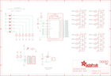

Contents
========

* [PRA815 > Adafruit](#pra815--adafruit)
	* [Schematic](#schematic)
	* [OOMP Parts](#oomp-parts)
	* [Images](#images)
	* [Tags](#tags)
  
![][im]
# PRA815 > Adafruit

- ID: PROJ-ADAF-815-STAN-01
- Hex ID: PRA815
- Name: Adafruit
- Description: Adafruit
- Long Link: [http://oom.lt/PROJ-ADAF-815-STAN-01](http://oom.lt/PROJ-ADAF-815-STAN-01)
- Short Link: [http://oom.lt/PRA815](http://oom.lt/PRA815)

## Schematic
  

## OOMP Parts
  

|OOMP Parts|
| :---: |
|C1,CAPC-0805-X-UF10-V10,C1,10uF,CAP_CERAMIC0805,0805,Ceramic Capacitors,,|
|C2,CAPX-UNMATCHED-X-UNMATCHED-01,C2,,CPOL-USE3.5-8,E3,5-8,POLARIZED CAPACITOR, American symbol,,|
|J1,UNMATCHED-UNMATCHED-X-UNMATCHED-01,FID1,FIDUCIAL,FIDUCIAL,FIDUCIAL_1MM,Fiducial Alignment Points,,|
|JP1,HEAD-I01-X-UNMATCHED-01,FID2,FIDUCIAL,FIDUCIAL,FIDUCIAL_1MM,Fiducial Alignment Points,,|
|JP2,HEAD-I01-X-UNMATCHED-01,J1,TERMBLOCK_1X2-3.5MM,TERMBLOCK_1X2-3.5MM,1X2-3.5MM,3.5mm Terminal block,,|
|JP3,HEAD-I01-X-PI06-01,JP1,,HEADER-3X04,3X04,,,|
|JP4,HEAD-I01-X-PI06-01,JP2,,HEADER-3X04,3X04,,,|
|JP5,HEAD-I01-X-UNMATCHED-01,JP3,,PINHD-1X6CB,1X06-CLEANBIG,PIN HEADER,,|
|JP6,HEAD-I01-X-UNMATCHED-01,JP4,,PINHD-1X6CB,1X06-CLEANBIG,PIN HEADER,,|
|LED1,LEDS-0805-G-STAN-01,JP5,,HEADER-3X04,3X04,,,|
|Q1,MOSP-SO23-X-UNMATCHED-01,JP6,,HEADER-3X04,3X04,,,|
|R1,RESE-0805-X-O103-01,LED1,VCC,LED0805,CHIPLED_0805,LED,,|
|R2,RESE-0805-X-O103-01,Q1,IRLML6401,MOSFET-PWIDE,SOT23-WIDE,P-Channel Mosfet,,|
|R3,RESE-0805-X-O103-01,R1,10K,RESISTOR0805,0805,Resistors,,|
|R4,RESE-0805-X-O103-01,R2,10K,RESISTOR0805,0805,Resistors,,|
|R5,RESE-0805-X-O103-01,R3,10K,RESISTOR0805,0805,Resistors,,|
|R6,RESE-0805-X-O103-01,R4,10K,RESISTOR0805,0805,Resistors,,|
|R7,RESE-0805-X-O103-01,R5,10K,RESISTOR0805,0805,Resistors,,|
|R8,RESE-0805-X-O103-01,R6,10K,RESISTOR0805,0805,Resistors,,|
|R9,RESE-0805-X-O103-01,R7,10K,RESISTOR0805,0805,Resistors,,|
|R10,RESE-0805-X-O221-01,R8,10K,RESISTOR0805,0805,Resistors,,|
|R11,RESE-0805-X-O221-01,R9,10K,RESISTOR0805,0805,Resistors,,|
|R12,RESE-0805-X-O221-01,R10,220,RESISTOR0805,0805,Resistors,,|
|R13,RESE-0805-X-O221-01,R11,220,RESISTOR0805,0805,Resistors,,|
|R14,RESE-0805-X-O221-01,R12,220,RESISTOR0805,0805,Resistors,,|
|R15,RESE-0805-X-O221-01,R13,220,RESISTOR0805,0805,Resistors,,|
|R16,RESE-0805-X-O221-01,R14,220,RESISTOR0805,0805,Resistors,,|
|R17,RESE-0805-X-O221-01,R15,220,RESISTOR0805,0805,Resistors,,|
|R18,RESE-0805-X-O221-01,R16,220,RESISTOR0805,0805,Resistors,,|
|R19,RESE-0805-X-O221-01,R17,220,RESISTOR0805,0805,Resistors,,|
|R20,RESE-0805-X-O221-01,R18,220,RESISTOR0805,0805,Resistors,,|
|R21,RESE-0805-X-O221-01,R19,220,RESISTOR0805,0805,Resistors,,|
|R22,RESE-0805-X-O221-01,R20,220,RESISTOR0805,0805,Resistors,,|
|R23,RESE-0805-X-O221-01,R21,220,RESISTOR0805,0805,Resistors,,|
|R24,RESE-0805-X-O221-01,R22,220,RESISTOR0805,0805,Resistors,,|
|R25,RESE-0805-X-O221-01,R23,220,RESISTOR0805,0805,Resistors,,|
|R26,RESE-0805-X-O221-01,R24,220,RESISTOR0805,0805,Resistors,,|
|U$47,UNMATCHED-UNMATCHED-X-UNMATCHED-01,R25,220,RESISTOR0805,0805,Resistors,,|
|U$48,UNMATCHED-UNMATCHED-X-UNMATCHED-01,R26,220,RESISTOR0805,0805,Resistors,,|
|U$49,UNMATCHED-UNMATCHED-X-UNMATCHED-01,SJ_A0,,SOLDERJUMPERREFLOW_NOPASTE,SOLDERJUMPER_REFLOW_NOPASTE,SMD Solder JUMPER,,|
|U$50,UNMATCHED-UNMATCHED-X-UNMATCHED-01,SJ_A1,,SOLDERJUMPERREFLOW_NOPASTE,SOLDERJUMPER_REFLOW_NOPASTE,SMD Solder JUMPER,,|
|U1,UNMATCHED-UNMATCHED-X-UNMATCHED-01,SJ_A2,,SOLDERJUMPERREFLOW_NOPASTE,SOLDERJUMPER_REFLOW_NOPASTE,SMD Solder JUMPER,,|

## Images
  
  

|kicadPcb3d|kicadPcb3dFront|kicadPcb3dBack|eagleImage|eagleSchemImage|
| :---: | :---: | :---: | :---: | :---: |
||||||

## Tags

- hexID: PRA815
- oompType: PROJ
- oompSize: ADAF
- oompColor: 815
- oompDesc: STAN
- oompIndex: 01
- oompName: Adafruit 16 Channel PWM Servo Driver PCB
- sources: All source files from https://github.com/adafruit/Adafruit-16-Channel-PWM-Servo-Driver-PCB (source licence details in srcLicense.md)
- linkBuyPage: http://www.adafruit.com/products/815
- oompID: PROJ-ADAF-815-STAN-01
- oompParts: C1,CAPC-0805-X-UF10-V10
- oompParts: C2,CAPX-UNMATCHED-X-UNMATCHED-01
- oompParts: J1,UNMATCHED-UNMATCHED-X-UNMATCHED-01
- oompParts: JP1,HEAD-I01-X-UNMATCHED-01
- oompParts: JP2,HEAD-I01-X-UNMATCHED-01
- oompParts: JP3,HEAD-I01-X-PI06-01
- oompParts: JP4,HEAD-I01-X-PI06-01
- oompParts: JP5,HEAD-I01-X-UNMATCHED-01
- oompParts: JP6,HEAD-I01-X-UNMATCHED-01
- oompParts: LED1,LEDS-0805-G-STAN-01
- oompParts: Q1,MOSP-SO23-X-UNMATCHED-01
- oompParts: R1,RESE-0805-X-O103-01
- oompParts: R2,RESE-0805-X-O103-01
- oompParts: R3,RESE-0805-X-O103-01
- oompParts: R4,RESE-0805-X-O103-01
- oompParts: R5,RESE-0805-X-O103-01
- oompParts: R6,RESE-0805-X-O103-01
- oompParts: R7,RESE-0805-X-O103-01
- oompParts: R8,RESE-0805-X-O103-01
- oompParts: R9,RESE-0805-X-O103-01
- oompParts: R10,RESE-0805-X-O221-01
- oompParts: R11,RESE-0805-X-O221-01
- oompParts: R12,RESE-0805-X-O221-01
- oompParts: R13,RESE-0805-X-O221-01
- oompParts: R14,RESE-0805-X-O221-01
- oompParts: R15,RESE-0805-X-O221-01
- oompParts: R16,RESE-0805-X-O221-01
- oompParts: R17,RESE-0805-X-O221-01
- oompParts: R18,RESE-0805-X-O221-01
- oompParts: R19,RESE-0805-X-O221-01
- oompParts: R20,RESE-0805-X-O221-01
- oompParts: R21,RESE-0805-X-O221-01
- oompParts: R22,RESE-0805-X-O221-01
- oompParts: R23,RESE-0805-X-O221-01
- oompParts: R24,RESE-0805-X-O221-01
- oompParts: R25,RESE-0805-X-O221-01
- oompParts: R26,RESE-0805-X-O221-01
- oompParts: U$47,UNMATCHED-UNMATCHED-X-UNMATCHED-01
- oompParts: U$48,UNMATCHED-UNMATCHED-X-UNMATCHED-01
- oompParts: U$49,UNMATCHED-UNMATCHED-X-UNMATCHED-01
- oompParts: U$50,UNMATCHED-UNMATCHED-X-UNMATCHED-01
- oompParts: U1,UNMATCHED-UNMATCHED-X-UNMATCHED-01
- rawParts: C1,10uF,CAP_CERAMIC0805,0805,Ceramic Capacitors,,
- rawParts: C2,,CPOL-USE3.5-8,E3,5-8,POLARIZED CAPACITOR, American symbol,,
- rawParts: FID1,FIDUCIAL,FIDUCIAL,FIDUCIAL_1MM,Fiducial Alignment Points,,
- rawParts: FID2,FIDUCIAL,FIDUCIAL,FIDUCIAL_1MM,Fiducial Alignment Points,,
- rawParts: J1,TERMBLOCK_1X2-3.5MM,TERMBLOCK_1X2-3.5MM,1X2-3.5MM,3.5mm Terminal block,,
- rawParts: JP1,,HEADER-3X04,3X04,,,
- rawParts: JP2,,HEADER-3X04,3X04,,,
- rawParts: JP3,,PINHD-1X6CB,1X06-CLEANBIG,PIN HEADER,,
- rawParts: JP4,,PINHD-1X6CB,1X06-CLEANBIG,PIN HEADER,,
- rawParts: JP5,,HEADER-3X04,3X04,,,
- rawParts: JP6,,HEADER-3X04,3X04,,,
- rawParts: LED1,VCC,LED0805,CHIPLED_0805,LED,,
- rawParts: Q1,IRLML6401,MOSFET-PWIDE,SOT23-WIDE,P-Channel Mosfet,,
- rawParts: R1,10K,RESISTOR0805,0805,Resistors,,
- rawParts: R2,10K,RESISTOR0805,0805,Resistors,,
- rawParts: R3,10K,RESISTOR0805,0805,Resistors,,
- rawParts: R4,10K,RESISTOR0805,0805,Resistors,,
- rawParts: R5,10K,RESISTOR0805,0805,Resistors,,
- rawParts: R6,10K,RESISTOR0805,0805,Resistors,,
- rawParts: R7,10K,RESISTOR0805,0805,Resistors,,
- rawParts: R8,10K,RESISTOR0805,0805,Resistors,,
- rawParts: R9,10K,RESISTOR0805,0805,Resistors,,
- rawParts: R10,220,RESISTOR0805,0805,Resistors,,
- rawParts: R11,220,RESISTOR0805,0805,Resistors,,
- rawParts: R12,220,RESISTOR0805,0805,Resistors,,
- rawParts: R13,220,RESISTOR0805,0805,Resistors,,
- rawParts: R14,220,RESISTOR0805,0805,Resistors,,
- rawParts: R15,220,RESISTOR0805,0805,Resistors,,
- rawParts: R16,220,RESISTOR0805,0805,Resistors,,
- rawParts: R17,220,RESISTOR0805,0805,Resistors,,
- rawParts: R18,220,RESISTOR0805,0805,Resistors,,
- rawParts: R19,220,RESISTOR0805,0805,Resistors,,
- rawParts: R20,220,RESISTOR0805,0805,Resistors,,
- rawParts: R21,220,RESISTOR0805,0805,Resistors,,
- rawParts: R22,220,RESISTOR0805,0805,Resistors,,
- rawParts: R23,220,RESISTOR0805,0805,Resistors,,
- rawParts: R24,220,RESISTOR0805,0805,Resistors,,
- rawParts: R25,220,RESISTOR0805,0805,Resistors,,
- rawParts: R26,220,RESISTOR0805,0805,Resistors,,
- rawParts: SJ_A0,,SOLDERJUMPERREFLOW_NOPASTE,SOLDERJUMPER_REFLOW_NOPASTE,SMD Solder JUMPER,,
- rawParts: SJ_A1,,SOLDERJUMPERREFLOW_NOPASTE,SOLDERJUMPER_REFLOW_NOPASTE,SMD Solder JUMPER,,
- rawParts: SJ_A2,,SOLDERJUMPERREFLOW_NOPASTE,SOLDERJUMPER_REFLOW_NOPASTE,SMD Solder JUMPER,,
- rawParts: SJ_A3,,SOLDERJUMPERREFLOW_NOPASTE,SOLDERJUMPER_REFLOW_NOPASTE,SMD Solder JUMPER,,
- rawParts: SJ_A4,,SOLDERJUMPERREFLOW_NOPASTE,SOLDERJUMPER_REFLOW_NOPASTE,SMD Solder JUMPER,,
- rawParts: SJ_A5,,SOLDERJUMPERREFLOW_NOPASTE,SOLDERJUMPER_REFLOW_NOPASTE,SMD Solder JUMPER,,
- rawParts: U$47,MOUNTINGHOLE2.5,MOUNTINGHOLE2.5,MOUNTINGHOLE_2.5_PLATED,Mounting Hole,,
- rawParts: U$48,MOUNTINGHOLE2.5,MOUNTINGHOLE2.5,MOUNTINGHOLE_2.5_PLATED,Mounting Hole,,
- rawParts: U$49,MOUNTINGHOLE2.5,MOUNTINGHOLE2.5,MOUNTINGHOLE_2.5_PLATED,Mounting Hole,,
- rawParts: U$50,MOUNTINGHOLE2.5,MOUNTINGHOLE2.5,MOUNTINGHOLE_2.5_PLATED,Mounting Hole,,
- rawParts: U1,PCA9685,PCA9685,TSSOP28,PCA9685 - 16 Channel 12-Bit I2C PWM Controller,,

[im]: kicadPcb3d_450.png
