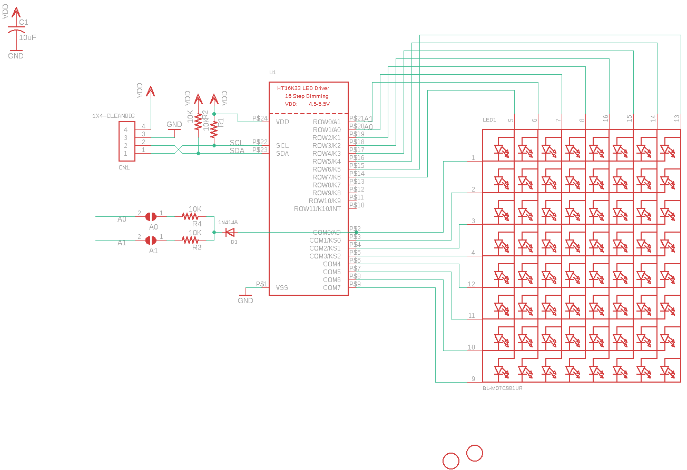

Contents
========

* [PRA878 > Adafruit](#pra878--adafruit)
	* [Schematic](#schematic)
	* [Interactive BOM](#interactive-bom)
	* [OOMP Parts](#oomp-parts)
	* [Images](#images)
	* [Tags](#tags)
  
![][im]
# PRA878 > Adafruit

- ID: PROJ-ADAF-878-STAN-01
- Hex ID: PRA878
- Name: Adafruit
- Description: Adafruit
- Long Link: [http://oom.lt/PROJ-ADAF-878-STAN-01](http://oom.lt/PROJ-ADAF-878-STAN-01)
- Short Link: [http://oom.lt/PRA878](http://oom.lt/PRA878)

## Schematic
  

## Interactive BOM

- Interactive BOM page: [ibom.html](https://htmlpreview.github.io/?https://github.com/oomlout/oomlout_OOMP_projects/blob/main/PROJ-ADAF-878-STAN-01/kicad/bom/ibom.html)

## OOMP Parts
  

|OOMP Parts|
| :---: |
|C1,CAPC-0805-X-UF10-V10,A0,,SOLDERJUMPERREFLOW_NOPASTE,SOLDERJUMPER_REFLOW_NOPASTE,SMD Solder JUMPER,,|
|CN1,UNMATCHED-UNMATCHED-X-UNMATCHED-01,A1,,SOLDERJUMPERREFLOW_NOPASTE,SOLDERJUMPER_REFLOW_NOPASTE,SMD Solder JUMPER,,|
|D1,DIOD-S323-X-K4148-01,C1,10uF,C-USC0805,C0805,CAPACITOR, American symbol,,|
|LED1,UNMATCHED-UNMATCHED-X-UNMATCHED-01,CN1,1X4-CLEANBIG,1X4-CLEANBIG,1X04-CLEANBIG,4-pin connector,,|
|R1,RESE-0805-X-O103-01,D1,1N4148,DIODESOD-323F,SOD-323F,Diode,,|
|R2,RESE-0805-X-O103-01,LED1,BL-M07C881UR,DISP_SEGMENT_8X8_ROWCATHODE,SEGMENT_BL-M07C881UR,8x8 LED Segment Displays: Row = Cathode,,|
|R3,RESE-0805-X-O103-01,R1,10K,R-US_R0805,R0805,RESISTOR, American symbol,,|
|R4,RESE-0805-X-O103-01,R2,10K,R-US_R0805,R0805,RESISTOR, American symbol,,|
|U1,UNMATCHED-UNMATCHED-X-UNMATCHED-01,R3,10K,R-US_R0805,R0805,RESISTOR, American symbol,,|

## Images
  
  

|kicadPcb3d|kicadPcb3dFront|kicadPcb3dBack|eagleImage|eagleSchemImage|
| :---: | :---: | :---: | :---: | :---: |
||||||

## Tags

- hexID: PRA878
- oompType: PROJ
- oompSize: ADAF
- oompColor: 878
- oompDesc: STAN
- oompIndex: 01
- oompName: Adafruit LED Backpacks
- sources: All source files from https://github.com/adafruit/Adafruit-LED-Backpacks (source licence details in srcLicense.md)
- linkBuyPage: http://www.adafruit.com/products/878
- oompID: PROJ-ADAF-878-STAN-01
- oompParts: C1,CAPC-0805-X-UF10-V10
- oompParts: CN1,UNMATCHED-UNMATCHED-X-UNMATCHED-01
- oompParts: D1,DIOD-S323-X-K4148-01
- oompParts: LED1,UNMATCHED-UNMATCHED-X-UNMATCHED-01
- oompParts: R1,RESE-0805-X-O103-01
- oompParts: R2,RESE-0805-X-O103-01
- oompParts: R3,RESE-0805-X-O103-01
- oompParts: R4,RESE-0805-X-O103-01
- oompParts: U1,UNMATCHED-UNMATCHED-X-UNMATCHED-01
- rawParts: A0,,SOLDERJUMPERREFLOW_NOPASTE,SOLDERJUMPER_REFLOW_NOPASTE,SMD Solder JUMPER,,
- rawParts: A1,,SOLDERJUMPERREFLOW_NOPASTE,SOLDERJUMPER_REFLOW_NOPASTE,SMD Solder JUMPER,,
- rawParts: C1,10uF,C-USC0805,C0805,CAPACITOR, American symbol,,
- rawParts: CN1,1X4-CLEANBIG,1X4-CLEANBIG,1X04-CLEANBIG,4-pin connector,,
- rawParts: D1,1N4148,DIODESOD-323F,SOD-323F,Diode,,
- rawParts: LED1,BL-M07C881UR,DISP_SEGMENT_8X8_ROWCATHODE,SEGMENT_BL-M07C881UR,8x8 LED Segment Displays: Row = Cathode,,
- rawParts: R1,10K,R-US_R0805,R0805,RESISTOR, American symbol,,
- rawParts: R2,10K,R-US_R0805,R0805,RESISTOR, American symbol,,
- rawParts: R3,10K,R-US_R0805,R0805,RESISTOR, American symbol,,
- rawParts: R4,10K,R-US_R0805,R0805,RESISTOR, American symbol,,
- rawParts: U$1,FIDUCIAL,FIDUCIAL,FIDUCIAL_1MM,For use by pick and place machines to calibrate the vision/machine, 1mm,,
- rawParts: U$2,FIDUCIAL,FIDUCIAL,FIDUCIAL_1MM,For use by pick and place machines to calibrate the vision/machine, 1mm,,
- rawParts: U1,,HT16K33_SOP24,SOP24_300MIL,,,

[im]: kicadPcb3d_450.png
