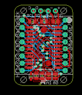
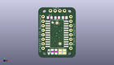
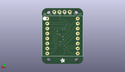
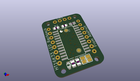

Contents
========

* [PROJ-ADAF-878-STAN-01>Adafruit LED Backpacks](#proj-adaf-878-stan-01adafruit-led-backpacks)
	* [Images](#images)
	* [Interactive BOM](#interactive-bom)
	* [OOMP Parts](#oomp-parts)
	* [Tags](#tags)
  
![][im]
# PROJ-ADAF-878-STAN-01>Adafruit LED Backpacks

- ID: PROJ-ADAF-878-STAN-01
- Hex ID: PRA878
- Name: Adafruit LED Backpacks
- Description: 

## Images
  
  

|eagleImage|kicadPcb3dFront|kicadPcb3dBack|kicadPcb3d|
| :---: | :---: | :---: | :---: |
|||||

## Interactive BOM

- Interactive BOM page: [ibom.html](kicad/bom/ibom.html)

## OOMP Parts
  

|OOMP Parts|
| :---: |
|UNMATCHED-UNMATCHED-X-UNMATCHED-01, A0, 4.064, -10.668, 90,A0, SOLDERJUMPER_REFLOW_NOPASTE, microbuilder, (0.16, -0.42), R90|
|UNMATCHED-UNMATCHED-X-UNMATCHED-01, A1, 1.778, -10.668, 90,A1, SOLDERJUMPER_REFLOW_NOPASTE, microbuilder, (0.07, -0.42), R90|
|CAPE-0805-X-UNMATCHED-01, C1, 4.191, 8.254999999999999, 180,C1, 10uF, C0805, rcl, (0.165, 0.325), R180|
|UNMATCHED-UNMATCHED-X-UNMATCHED-01, CN1, 0.254, 12.065, 0,CN1, 1X4-CLEANBIG, 1X04-CLEANBIG, adafruit, (0.01, 0.475), R0|
|UNMATCHED-UNMATCHED-X-UNMATCHED-01, D1, -4.444999999999999, -10.795, 270,D1, 1N4148, SOD-323F, adafruit, (-0.175, -0.425), R270|
|UNMATCHED-UNMATCHED-X-UNMATCHED-01, LED1, 0.0, 0.0, M270,LED1, BL-M07C881UR, SEGMENT_BL-M07C881UR, microbuilder, (0, 0), MR270|
|<table><tr><td></td><td> R1</td><td>[RESE-0805-X-O103-01 SMD (0805) 10k Ohm Resistor](https://github.com/oomlout/oomlout_OOMP_parts/tree/main/RESE-0805-X-O103-01/)</td><td>[R85103](https://github.com/oomlout/oomlout_OOMP_parts/tree/main/RESE-0805-X-O103-01/)</td></tr></table>|
|<table><tr><td></td><td> R2</td><td>[RESE-0805-X-O103-01 SMD (0805) 10k Ohm Resistor](https://github.com/oomlout/oomlout_OOMP_parts/tree/main/RESE-0805-X-O103-01/)</td><td>[R85103](https://github.com/oomlout/oomlout_OOMP_parts/tree/main/RESE-0805-X-O103-01/)</td></tr></table>|
|<table><tr><td></td><td> R3</td><td>[RESE-0805-X-O103-01 SMD (0805) 10k Ohm Resistor](https://github.com/oomlout/oomlout_OOMP_parts/tree/main/RESE-0805-X-O103-01/)</td><td>[R85103](https://github.com/oomlout/oomlout_OOMP_parts/tree/main/RESE-0805-X-O103-01/)</td></tr></table>|
|<table><tr><td></td><td> R4</td><td>[RESE-0805-X-O103-01 SMD (0805) 10k Ohm Resistor](https://github.com/oomlout/oomlout_OOMP_parts/tree/main/RESE-0805-X-O103-01/)</td><td>[R85103](https://github.com/oomlout/oomlout_OOMP_parts/tree/main/RESE-0805-X-O103-01/)</td></tr></table>|
|UNMATCHED-UNMATCHED-X-UNMATCHED-01, U1, 0.0, -0.7619999999999999, 270,U1, SOP24_300MIL, microbuilder, (0, -0.03), R270|

## Tags

- hexID: PRA878
- oompType: PROJ
- oompSize: ADAF
- oompColor: 878
- oompDesc: STAN
- oompIndex: 01
- oompName: Adafruit LED Backpacks
- sources: All source files from https://github.com/adafruit/Adafruit-LED-Backpacks (source licence details in srcLicense.md)
- linkBuyPage: http://www.adafruit.com/products/878
- oompPart: UNMATCHED-UNMATCHED-X-UNMATCHED-01, A0, 4.064, -10.668, 90
- oompPart: UNMATCHED-UNMATCHED-X-UNMATCHED-01, A1, 1.778, -10.668, 90
- oompPart: CAPE-0805-X-UNMATCHED-01, C1, 4.191, 8.254999999999999, 180
- oompPart: UNMATCHED-UNMATCHED-X-UNMATCHED-01, CN1, 0.254, 12.065, 0
- oompPart: UNMATCHED-UNMATCHED-X-UNMATCHED-01, D1, -4.444999999999999, -10.795, 270
- oompPart: UNMATCHED-UNMATCHED-X-UNMATCHED-01, LED1, 0.0, 0.0, M270
- oompPart: RESE-0805-X-O103-01, R1, -3.937, 8.254999999999999, 0
- oompPart: RESE-0805-X-O103-01, R2, 0.127, 8.254999999999999, 180
- oompPart: RESE-0805-X-O103-01, R3, -0.508, -10.668, 90
- oompPart: RESE-0805-X-O103-01, R4, -2.54, -10.668, 90
- oompPart: SKIP-UNMATCHED-X-UNMATCHED-01, U$1, 1.651, -6.223, 0
- oompPart: SKIP-UNMATCHED-X-UNMATCHED-01, U$2, 0.0, 5.334, 0
- oompPart: UNMATCHED-UNMATCHED-X-UNMATCHED-01, U1, 0.0, -0.7619999999999999, 270
- rawPart: A0, SOLDERJUMPER_REFLOW_NOPASTE, microbuilder, (0.16, -0.42), R90
- rawPart: A1, SOLDERJUMPER_REFLOW_NOPASTE, microbuilder, (0.07, -0.42), R90
- rawPart: C1, 10uF, C0805, rcl, (0.165, 0.325), R180
- rawPart: CN1, 1X4-CLEANBIG, 1X04-CLEANBIG, adafruit, (0.01, 0.475), R0
- rawPart: D1, 1N4148, SOD-323F, adafruit, (-0.175, -0.425), R270
- rawPart: LED1, BL-M07C881UR, SEGMENT_BL-M07C881UR, microbuilder, (0, 0), MR270
- rawPart: R1, 10K, R0805, adafruit, (-0.155, 0.325), R0
- rawPart: R2, 10K, R0805, adafruit, (0.005, 0.325), R180
- rawPart: R3, 10K, R0805, adafruit, (-0.02, -0.42), R90
- rawPart: R4, 10K, R0805, adafruit, (-0.1, -0.42), R90
- rawPart: U$1, FIDUCIAL, FIDUCIAL_1MM, adafruit, (0.065, -0.245), R0
- rawPart: U$2, FIDUCIAL, FIDUCIAL_1MM, adafruit, (0, 0.21), R0
- rawPart: U1, SOP24_300MIL, microbuilder, (0, -0.03), R270

[im]: kicadPcb3d_450.png
