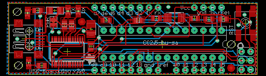
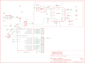

Contents
========

* [PRA91 > Adafruit_USB_Boarduino_PCB](#pra91--adafruit_usb_boarduino_pcb)
	* [Schematic](#schematic)
	* [PCB](#pcb)
	* [OOMP Parts](#oomp-parts)
	* [Images](#images)
	* [Tags](#tags)
  
![][im]
# PRA91 > Adafruit_USB_Boarduino_PCB

- ID: PROJ-ADAF-91-STAN-01
- Hex ID: PRA91
- Name: Adafruit
- Description: Adafruit
- Long Link: [http://oom.lt/PROJ-ADAF-91-STAN-01](http://oom.lt/PROJ-ADAF-91-STAN-01)
- Short Link: [http://oom.lt/PRA91](http://oom.lt/PRA91)

## Schematic
  

## PCB
  

## OOMP Parts
  

|OOMP Parts|
| :---: |
|CAPC-0805-X-UF1D-01 C1, C3, C4|
|CAPX-UNMATCHED-X-UNMATCHED-01 C2|
|CAPC-0805-X-PF15-01 C5, C6|
|[LEDS-0805-G-STAN-01  SMD (0805) Green LED  D1, D2, RX, TX](https://github.com/oomlout/oomlout_OOMP_parts/tree/main/LEDS-0805-G-STAN-01/)|
|UNMATCHED-UNMATCHED-X-UNMATCHED-01 IC1, IC2, USB, X1|
|[HEAD-I01-X-PI06-01  2.54 mm 6 Pin Header  JA1](https://github.com/oomlout/oomlout_OOMP_parts/tree/main/HEAD-I01-X-PI06-01/)|
|[HEAD-I01-X-PI08-01  2.54 mm 8 Pin Header  JD1, JD2](https://github.com/oomlout/oomlout_OOMP_parts/tree/main/HEAD-I01-X-PI08-01/)|
|[HEAD-I01-X-PI2X03-01  2.54 mm 6 Pin (2x3) Header  JP3](https://github.com/oomlout/oomlout_OOMP_parts/tree/main/HEAD-I01-X-PI2X03-01/)|
|[HEAD-I01-X-PI04-01  2.54 mm 4 Pin Header  JP4](https://github.com/oomlout/oomlout_OOMP_parts/tree/main/HEAD-I01-X-PI04-01/)|
|UNMATCHED-1206-X-UNMATCHED-01 L1|
|[RESE-0805-X-O103-01  SMD (0805) 10k Ohm Resistor  R1](https://github.com/oomlout/oomlout_OOMP_parts/tree/main/RESE-0805-X-O103-01/)|
|RESE-0805-X-UNMATCHED-01 R2, R3, R5, R6|
|[RESE-0805-X-O102-01  SMD (0805) 1k Ohm Resistor  R4](https://github.com/oomlout/oomlout_OOMP_parts/tree/main/RESE-0805-X-O102-01/)|
|[BUTA-6060-X-STAN-01  SMD (6060) Pushbutton (Tactile)  S1](https://github.com/oomlout/oomlout_OOMP_parts/tree/main/BUTA-6060-X-STAN-01/)|

## Images
  
  

|kicadPcb3d|kicadPcb3dFront|kicadPcb3dBack|eagleImage|eagleSchemImage|
| :---: | :---: | :---: | :---: | :---: |
||||||

## Tags

- hexID: PRA91
- oompType: PROJ
- oompSize: ADAF
- oompColor: 91
- oompDesc: STAN
- oompIndex: 01
- oompName: Adafruit_USB_Boarduino_PCB
- sources: All source files from https://github.com/adafruit/Adafruit_USB_Boarduino_PCB (source licence details in srcLicense.md)
- linkBuyPage: http://www.adafruit.com/products/91
- oompID: PROJ-ADAF-91-STAN-01
- oompParts: C1,CAPC-0805-X-UF1D-01
- oompParts: C2,CAPX-UNMATCHED-X-UNMATCHED-01
- oompParts: C3,CAPC-0805-X-UF1D-01
- oompParts: C4,CAPC-0805-X-UF1D-01
- oompParts: C5,CAPC-0805-X-PF15-01
- oompParts: C6,CAPC-0805-X-PF15-01
- oompParts: D1,LEDS-0805-G-STAN-01
- oompParts: D2,LEDS-0805-G-STAN-01
- oompParts: IC1,UNMATCHED-UNMATCHED-X-UNMATCHED-01
- oompParts: IC2,UNMATCHED-UNMATCHED-X-UNMATCHED-01
- oompParts: JA1,HEAD-I01-X-PI06-01
- oompParts: JD1,HEAD-I01-X-PI08-01
- oompParts: JD2,HEAD-I01-X-PI08-01
- oompParts: JP3,HEAD-I01-X-PI2X03-01
- oompParts: JP4,HEAD-I01-X-PI04-01
- oompParts: L1,UNMATCHED-1206-X-UNMATCHED-01
- oompParts: R1,RESE-0805-X-O103-01
- oompParts: R2,RESE-0805-X-UNMATCHED-01
- oompParts: R3,RESE-0805-X-UNMATCHED-01
- oompParts: R4,RESE-0805-X-O102-01
- oompParts: R5,RESE-0805-X-UNMATCHED-01
- oompParts: R6,RESE-0805-X-UNMATCHED-01
- oompParts: RX,LEDS-0805-G-STAN-01
- oompParts: S1,BUTA-6060-X-STAN-01
- oompParts: TX,LEDS-0805-G-STAN-01
- oompParts: USB,UNMATCHED-UNMATCHED-X-UNMATCHED-01
- oompParts: X1,UNMATCHED-UNMATCHED-X-UNMATCHED-01
- rawParts: C1,0.1uF,C-USC0805K,C0805K,CAPACITOR, American symbol,,
- rawParts: C2,100/6VuF,CPOL-USB/3528-21R,B/3528-21R,POLARIZED CAPACITOR, American symbol,,
- rawParts: C3,0.1uF,C-USC0805K,C0805K,CAPACITOR, American symbol,,
- rawParts: C4,0.1uF,C-USC0805K,C0805K,CAPACITOR, American symbol,,
- rawParts: C5,15pF,C-USC0805K,C0805K,CAPACITOR, American symbol,,
- rawParts: C6,15pF,C-USC0805K,C0805K,CAPACITOR, American symbol,,
- rawParts: D1,,LEDCHIPLED_0805,CHIPLED_0805,LED,,
- rawParts: D2,Green,LEDCHIPLED_0805,CHIPLED_0805,LED,,
- rawParts: IC1,ATMEGA168P,ATMEGA168PROUND,DIL28/3,MICROCONTROLLER,,
- rawParts: IC2,FT232R,FT232R,TSSOP28,,,
- rawParts: JA1,,PINHD-1X6CB,1X06-CLEANBIG,PIN HEADER,,
- rawParts: JD1,,PINHD-1X8CLEANBIG,1X08-CLEANBIG,PIN HEADER,,
- rawParts: JD2,,PINHD-1X8CLEANBIG,1X08-CLEANBIG,PIN HEADER,,
- rawParts: JP3,,PINHD-2X3,2X03,PIN HEADER,,
- rawParts: JP4,,PINHD-1X4CB,1X04-CB,PIN HEADER,,
- rawParts: L1,,PTC1206,1206,PTC (Resettable Fuse),,
- rawParts: R1,10K,R-US_R0805,R0805,RESISTOR, American symbol,,
- rawParts: R2,1.0 K,R-US_R0805,R0805,RESISTOR, American symbol,,
- rawParts: R3,1.0 K,R-US_R0805,R0805,RESISTOR, American symbol,,
- rawParts: R4,1K,R-US_R0805,R0805,RESISTOR, American symbol,,
- rawParts: R5,1.0 K,R-US_R0805,R0805,RESISTOR, American symbol,,
- rawParts: R6,1.0 K,R-US_R0805,R0805,RESISTOR, American symbol,,
- rawParts: RX,Green,LEDCHIPLED_0805,CHIPLED_0805,LED,,
- rawParts: S1,EVQQ2,EVQQ2,EVQ-Q2,SMT 6mm switch, EVQQ2 series,,
- rawParts: SJ1,,SOLDERJUMPERREFLOW,SOLDERJUMPER_REFLOW,SMD Solder JUMPER,,
- rawParts: TX,Green,LEDCHIPLED_0805,CHIPLED_0805,LED,,
- rawParts: U$1,FIDUCIAL,FIDUCIAL,FIDUCIAL_1MM,For use by pick and place machines to calibrate the vision/machine, 1mm,,
- rawParts: U$2,FIDUCIAL,FIDUCIAL,FIDUCIAL_1MM,For use by pick and place machines to calibrate the vision/machine, 1mm,,
- rawParts: USB,,USBMINIB,USB-MINIB,USB Connectors,,
- rawParts: X1,,XTALNX5032,NX5032,Low cost SMT crystals, no capacitors included,,

[im]: kicadPcb3d_450.png
