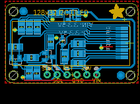
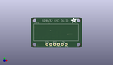
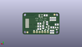
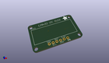

Contents
========

* [PROJ-ADAF-931-STAN-01>Adafruit 128x32 I2C OLED Breakout PCB](#proj-adaf-931-stan-01adafruit-128x32-i2c-oled-breakout-pcb)
	* [Images](#images)
	* [Interactive BOM](#interactive-bom)
	* [OOMP Parts](#oomp-parts)
	* [Tags](#tags)
  
![][im]
# PROJ-ADAF-931-STAN-01>Adafruit 128x32 I2C OLED Breakout PCB

- ID: PROJ-ADAF-931-STAN-01
- Hex ID: PRA931
- Name: Adafruit 128x32 I2C OLED Breakout PCB
- Description: 

## Images
  
  

|eagleImage|kicadPcb3dFront|kicadPcb3dBack|kicadPcb3d|
| :---: | :---: | :---: | :---: |
|||||

## Interactive BOM

- Interactive BOM page: [ibom.html](kicad/bom/ibom.html)

## OOMP Parts
  

|OOMP Parts|
| :---: |
|CAPC-0805-X-UNMATCHED-01, C1, 18.541999999999998, 5.08, M180,C1, 1uF, 0805, microbuilder, (0.73, 0.2), MR180|
|CAPC-0805-X-UNMATCHED-01, C2, 18.541999999999998, 7.619999999999999, M180,C2, 1uF, 0805, microbuilder, (0.73, 0.3), MR180|
|CAPC-0805-X-UNMATCHED-01, C3, 11.43, 10.668, M270,C3, 1uF, 0805, microbuilder, (0.45, 0.42), MR270|
|CAPC-0805-X-UNMATCHED-01, C4, 18.541999999999998, 10.16, M0,C4, 1uF, 0805, microbuilder, (0.73, 0.4), MR0|
|CAPC-0805-X-UNMATCHED-01, C5, 4.064, 14.477999999999998, M90,C5, 10uF, 0805, microbuilder, (0.16, 0.57), MR90|
|CAPC-0805-X-UNMATCHED-01, C6, 6.095999999999999, 14.477999999999998, M90,C6, 10uF, 0805, microbuilder, (0.24, 0.57), MR90|
|CAPC-0805-X-UNMATCHED-01, C7, 12.7, 17.906999999999996, M0,C7, 10uF, 0805, microbuilder, (0.5, 0.705), MR0|
|UNMATCHED-UNMATCHED-X-UNMATCHED-01, D1, 14.477999999999998, 10.795, M90,D1, 1N4148, SOD-323F, adafruit, (0.57, 0.425), MR90|
|<table><tr><td></td><td> JP1</td><td>[HEAD-I01-X-PI06-01 2.54 mm 6 Pin Header](https://github.com/oomlout/oomlout_OOMP_parts/tree/main/HEAD-I01-X-PI06-01/)</td><td>[H06](https://github.com/oomlout/oomlout_OOMP_parts/tree/main/HEAD-I01-X-PI06-01/)</td></tr></table>|
|UNMATCHED-UNMATCHED-X-UNMATCHED-01, LCD1, 31.75, 10.410000007999999, 0,LCD1, UG-2832HSWEG02_WRAPUNDER, microbuilder, (1.25, 0.40984252), R0|
|UNMATCHED-UNMATCHED-X-UNMATCHED-01, Q1, 2.54, 5.588, M180,Q1, BSS138, SOT23-WIDE, microbuilder, (0.1, 0.22), MR180|
|UNMATCHED-UNMATCHED-X-UNMATCHED-01, Q2, 10.921999999999999, 6.858, M90,Q2, BSS138, SOT23-WIDE, microbuilder, (0.43, 0.27), MR90|
|RESE-0805-X-O394-01, R3, 8.128, 14.477999999999998, M90,R3, 390K, 0805, microbuilder, (0.32, 0.57), MR90|
|<table><tr><td></td><td> R4</td><td>[RESE-0805-X-O103-01 SMD (0805) 10k Ohm Resistor](https://github.com/oomlout/oomlout_OOMP_parts/tree/main/RESE-0805-X-O103-01/)</td><td>[R85103](https://github.com/oomlout/oomlout_OOMP_parts/tree/main/RESE-0805-X-O103-01/)</td></tr></table>|
|<table><tr><td></td><td> R5</td><td>[RESE-0805-X-O103-01 SMD (0805) 10k Ohm Resistor](https://github.com/oomlout/oomlout_OOMP_parts/tree/main/RESE-0805-X-O103-01/)</td><td>[R85103](https://github.com/oomlout/oomlout_OOMP_parts/tree/main/RESE-0805-X-O103-01/)</td></tr></table>|
|<table><tr><td></td><td> R7</td><td>[RESE-0805-X-O103-01 SMD (0805) 10k Ohm Resistor](https://github.com/oomlout/oomlout_OOMP_parts/tree/main/RESE-0805-X-O103-01/)</td><td>[R85103](https://github.com/oomlout/oomlout_OOMP_parts/tree/main/RESE-0805-X-O103-01/)</td></tr></table>|
|<table><tr><td></td><td> R8</td><td>[RESE-0805-X-O103-01 SMD (0805) 10k Ohm Resistor](https://github.com/oomlout/oomlout_OOMP_parts/tree/main/RESE-0805-X-O103-01/)</td><td>[R85103](https://github.com/oomlout/oomlout_OOMP_parts/tree/main/RESE-0805-X-O103-01/)</td></tr></table>|
|<table><tr><td></td><td> R9</td><td>[RESE-0805-X-O103-01 SMD (0805) 10k Ohm Resistor](https://github.com/oomlout/oomlout_OOMP_parts/tree/main/RESE-0805-X-O103-01/)</td><td>[R85103](https://github.com/oomlout/oomlout_OOMP_parts/tree/main/RESE-0805-X-O103-01/)</td></tr></table>|
|UNMATCHED-UNMATCHED-X-UNMATCHED-01, U1, 17.272000000000002, 17.399, M270,U1, RT9193, SOT23-5, microbuilder, (0.68, 0.685), MR270|

## Tags

- hexID: PRA931
- oompType: PROJ
- oompSize: ADAF
- oompColor: 931
- oompDesc: STAN
- oompIndex: 01
- oompName: Adafruit 128x32 I2C OLED Breakout PCB
- sources: All source files from https://github.com/adafruit/Adafruit-128x32-I2C-OLED-Breakout-PCB (source licence details in srcLicense.md)
- linkBuyPage: http://www.adafruit.com/products/931
- oompPart: CAPC-0805-X-UNMATCHED-01, C1, 18.541999999999998, 5.08, M180
- oompPart: CAPC-0805-X-UNMATCHED-01, C2, 18.541999999999998, 7.619999999999999, M180
- oompPart: CAPC-0805-X-UNMATCHED-01, C3, 11.43, 10.668, M270
- oompPart: CAPC-0805-X-UNMATCHED-01, C4, 18.541999999999998, 10.16, M0
- oompPart: CAPC-0805-X-UNMATCHED-01, C5, 4.064, 14.477999999999998, M90
- oompPart: CAPC-0805-X-UNMATCHED-01, C6, 6.095999999999999, 14.477999999999998, M90
- oompPart: CAPC-0805-X-UNMATCHED-01, C7, 12.7, 17.906999999999996, M0
- oompPart: UNMATCHED-UNMATCHED-X-UNMATCHED-01, D1, 14.477999999999998, 10.795, M90
- oompPart: SKIP-UNMATCHED-X-UNMATCHED-01, FID1, 4.571999999999999, 18.541999999999998, M0
- oompPart: SKIP-UNMATCHED-X-UNMATCHED-01, FID2, 29.463999999999995, 2.032, M0
- oompPart: HEAD-I01-X-PI06-01, JP1, 17.000000036, 2.254000064, 180
- oompPart: UNMATCHED-UNMATCHED-X-UNMATCHED-01, LCD1, 31.75, 10.410000007999999, 0
- oompPart: UNMATCHED-UNMATCHED-X-UNMATCHED-01, Q1, 2.54, 5.588, M180
- oompPart: UNMATCHED-UNMATCHED-X-UNMATCHED-01, Q2, 10.921999999999999, 6.858, M90
- oompPart: RESE-0805-X-O394-01, R3, 8.128, 14.477999999999998, M90
- oompPart: RESE-0805-X-O103-01, R4, 2.54, 9.270999999999999, M0
- oompPart: RESE-0805-X-O103-01, R5, 14.985999999999999, 6.858, M270
- oompPart: RESE-0805-X-O103-01, R7, 6.604, 6.604, M0
- oompPart: RESE-0805-X-O103-01, R8, 5.842, 2.54, M270
- oompPart: RESE-0805-X-O103-01, R9, 7.874, 2.54, M90
- oompPart: UNMATCHED-UNMATCHED-X-UNMATCHED-01, U1, 17.272000000000002, 17.399, M270
- rawPart: C1, 1uF, 0805, microbuilder, (0.73, 0.2), MR180
- rawPart: C2, 1uF, 0805, microbuilder, (0.73, 0.3), MR180
- rawPart: C3, 1uF, 0805, microbuilder, (0.45, 0.42), MR270
- rawPart: C4, 1uF, 0805, microbuilder, (0.73, 0.4), MR0
- rawPart: C5, 10uF, 0805, microbuilder, (0.16, 0.57), MR90
- rawPart: C6, 10uF, 0805, microbuilder, (0.24, 0.57), MR90
- rawPart: C7, 10uF, 0805, microbuilder, (0.5, 0.705), MR0
- rawPart: D1, 1N4148, SOD-323F, adafruit, (0.57, 0.425), MR90
- rawPart: FID1, FIDUCIAL, FIDUCIAL_1MM, microbuilder, (0.18, 0.73), MR0
- rawPart: FID2, FIDUCIAL, FIDUCIAL_1MM, microbuilder, (1.16, 0.08), MR0
- rawPart: JP1, 1X06_ROUND_70, microbuilder, (0.66929134, 0.08874016), R180
- rawPart: LCD1, UG-2832HSWEG02_WRAPUNDER, microbuilder, (1.25, 0.40984252), R0
- rawPart: Q1, BSS138, SOT23-WIDE, microbuilder, (0.1, 0.22), MR180
- rawPart: Q2, BSS138, SOT23-WIDE, microbuilder, (0.43, 0.27), MR90
- rawPart: R3, 390K, 0805, microbuilder, (0.32, 0.57), MR90
- rawPart: R4, 10K, 0805, microbuilder, (0.1, 0.365), MR0
- rawPart: R5, 10K, 0805, microbuilder, (0.59, 0.27), MR270
- rawPart: R7, 10K, 0805, microbuilder, (0.26, 0.26), MR0
- rawPart: R8, 10K, 0805, microbuilder, (0.23, 0.1), MR270
- rawPart: R9, 10K, 0805, microbuilder, (0.31, 0.1), MR90
- rawPart: U1, RT9193, SOT23-5, microbuilder, (0.68, 0.685), MR270
- oompID: PROJ-ADAF-931-STAN-01

[im]: kicadPcb3d_450.png
