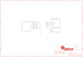

Contents
========

* [PRA966 > Adafruit Low profile microSD to SD Adapter PCB](#pra966--adafruit-low-profile-microsd-to-sd-adapter-pcb)
	* [Schematic](#schematic)
	* [PCB](#pcb)
	* [Interactive BOM](#interactive-bom)
	* [OOMP Parts](#oomp-parts)
	* [Images](#images)
	* [Tags](#tags)
  
![][im]
# PRA966 > Adafruit Low profile microSD to SD Adapter PCB

- ID: PROJ-ADAF-966-STAN-01
- Hex ID: PRA966
- Name: Adafruit
- Description: Adafruit
- Long Link: [http://oom.lt/PROJ-ADAF-966-STAN-01](http://oom.lt/PROJ-ADAF-966-STAN-01)
- Short Link: [http://oom.lt/PRA966](http://oom.lt/PRA966)

## Schematic
  

## PCB
  

## Interactive BOM

- Interactive BOM page: [ibom.html](https://htmlpreview.github.io/?https://github.com/oomlout/oomlout_OOMP_projects/blob/main/PROJ-ADAF-966-STAN-01/kicad/bom/ibom.html)

## OOMP Parts
  

|OOMP ID|Name|Identifier|
| :---: | :---: | :---: |
|UNMATCHED-UNMATCHED-X-UNMATCHED-01||CN1, U$2|

## Images
  
  

|bominteractivefront|bominteractiveback|kicadPcb3d|kicadPcb3dFront|kicadPcb3dBack|kicadSchem|eagleImage|eagleSchemImage|pcbdraw|pcbdrawback|
| :---: | :---: | :---: | :---: | :---: | :---: | :---: | :---: | :---: | :---: |
|||||||||||

## Tags

- hexID: PRA966
- oompType: PROJ
- oompSize: ADAF
- oompColor: 966
- oompDesc: STAN
- oompIndex: 01
- oompName: Adafruit Low profile microSD to SD Adapter PCB
- sources: All source files from https://github.com/adafruit/Adafruit-Low-profile-microSD-to-SD-Adapter-PCB (source licence details in srcLicense.md)
- linkBuyPage: http://www.adafruit.com/products/966
- oompID: PROJ-ADAF-966-STAN-01
- oompParts: CN1,UNMATCHED-UNMATCHED-X-UNMATCHED-01
- oompParts: U$2,UNMATCHED-UNMATCHED-X-UNMATCHED-01
- rawParts: CN1,,MICROSD,MICROSD,MicroSD/Transflash Card Holder with SPI pinout,,
- rawParts: FID1,FIDUCIAL1X2.5,FIDUCIAL1X2.5,FIDUCIAL-1X2.5,Fiducial Alignment Points,,
- rawParts: FID2,FIDUCIAL1X2.5,FIDUCIAL1X2.5,FIDUCIAL-1X2.5,Fiducial Alignment Points,,
- rawParts: U$2,SDCARD_PCBCARRIERTDOCU,SDCARD_PCBCARRIERTDOCU,SDCARD_PCBCARRIER_DOCU,Physical PCB representing an SD Card,,

[im]: kicadPcb3d_450.png
