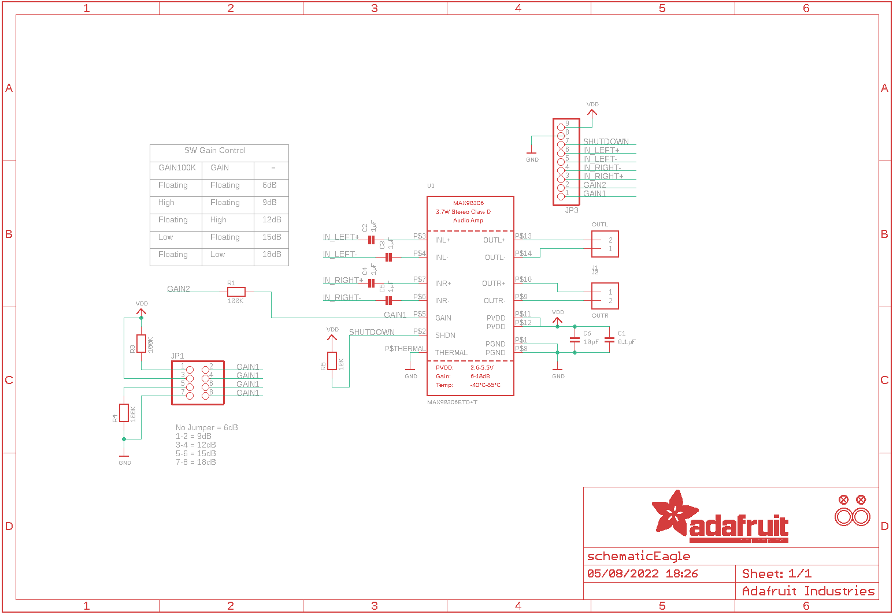
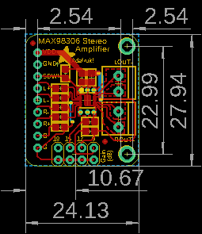

Contents
========

* [PRA987 > Adafruit MAX98306 Class D Amp PCB](#pra987--adafruit-max98306-class-d-amp-pcb)
	* [Schematic](#schematic)
	* [PCB](#pcb)
	* [Interactive BOM](#interactive-bom)
	* [OOMP Parts](#oomp-parts)
	* [Images](#images)
	* [Tags](#tags)
  
![][im]
# PRA987 > Adafruit MAX98306 Class D Amp PCB

- ID: PROJ-ADAF-987-STAN-01
- Hex ID: PRA987
- Name: Adafruit
- Description: Adafruit
- Long Link: [http://oom.lt/PROJ-ADAF-987-STAN-01](http://oom.lt/PROJ-ADAF-987-STAN-01)
- Short Link: [http://oom.lt/PRA987](http://oom.lt/PRA987)

## Schematic
  

## PCB
  

## Interactive BOM

- Interactive BOM page: [ibom.html](https://htmlpreview.github.io/?https://github.com/oomlout/oomlout_OOMP_projects/blob/main/PROJ-ADAF-987-STAN-01/kicad/bom/ibom.html)

## OOMP Parts
  

|OOMP Parts|
| :---: |
|CAPC-0805-X-UF1D-01 C1|
|[CAPC-0805-X-UF1-V25  SMD (0805) 1 uF Capacitor (Ceramic) 25v  C2, C3, C4, C5](https://github.com/oomlout/oomlout_OOMP_parts/tree/main/CAPC-0805-X-UF1-V25/)|
|[CAPC-0805-X-UF10-V10  SMD (0805) 10 uF Capacitor (Ceramic) 10v  C6](https://github.com/oomlout/oomlout_OOMP_parts/tree/main/CAPC-0805-X-UF10-V10/)|
|[TERS-35D-L-PI02-01  3.5 mm 2 Pin Blue Screw Terminal  J1, J2](https://github.com/oomlout/oomlout_OOMP_parts/tree/main/TERS-35D-L-PI02-01/)|
|HEAD-I01-X-PI2X04-01 JP1|
|[HEAD-I01-X-PI09-01  2.54 mm 9 Pin Header  JP3](https://github.com/oomlout/oomlout_OOMP_parts/tree/main/HEAD-I01-X-PI09-01/)|
|RESE-0805-X-O1003-01 R1, R3, R4|
|[RESE-0805-X-O103-01  SMD (0805) 10k Ohm Resistor  R5](https://github.com/oomlout/oomlout_OOMP_parts/tree/main/RESE-0805-X-O103-01/)|
|UNMATCHED-UNMATCHED-X-UNMATCHED-01 U1|

## Images
  
  

|kicadPcb3d|kicadPcb3dFront|kicadPcb3dBack|eagleImage|eagleSchemImage|
| :---: | :---: | :---: | :---: | :---: |
||||||

## Tags

- hexID: PRA987
- oompType: PROJ
- oompSize: ADAF
- oompColor: 987
- oompDesc: STAN
- oompIndex: 01
- oompName: Adafruit MAX98306 Class D Amp PCB
- sources: All source files from https://github.com/adafruit/Adafruit-MAX98306-Class-D-Amp-PCB (source licence details in srcLicense.md)
- linkBuyPage: http://www.adafruit.com/products/987
- oompID: PROJ-ADAF-987-STAN-01
- oompParts: C1,CAPC-0805-X-UF1D-01
- oompParts: C2,CAPC-0805-X-UF1-V25
- oompParts: C3,CAPC-0805-X-UF1-V25
- oompParts: C4,CAPC-0805-X-UF1-V25
- oompParts: C5,CAPC-0805-X-UF1-V25
- oompParts: C6,CAPC-0805-X-UF10-V10
- oompParts: J1,TERS-35D-L-PI02-01
- oompParts: J2,TERS-35D-L-PI02-01
- oompParts: JP1,HEAD-I01-X-PI2X04-01
- oompParts: JP3,HEAD-I01-X-PI09-01
- oompParts: R1,RESE-0805-X-O1003-01
- oompParts: R3,RESE-0805-X-O1003-01
- oompParts: R4,RESE-0805-X-O1003-01
- oompParts: R5,RESE-0805-X-O103-01
- oompParts: U1,UNMATCHED-UNMATCHED-X-UNMATCHED-01
- rawParts: C1,0.1µF,CAP_CERAMIC0805,0805,Ceramic Capacitors,,
- rawParts: C2,1µF,CAP_CERAMIC0805,0805,Ceramic Capacitors,,
- rawParts: C3,1µF,CAP_CERAMIC0805,0805,Ceramic Capacitors,,
- rawParts: C4,1µF,CAP_CERAMIC0805,0805,Ceramic Capacitors,,
- rawParts: C5,1µF,CAP_CERAMIC0805,0805,Ceramic Capacitors,,
- rawParts: C6,10µF,CAP_CERAMIC0805,0805,Ceramic Capacitors,,
- rawParts: FID1,FIDUCIAL,FIDUCIAL,FIDUCIAL_1MM,Fiducial Alignment Points,,
- rawParts: FID2,FIDUCIAL,FIDUCIAL,FIDUCIAL_1MM,Fiducial Alignment Points,,
- rawParts: J1,OUTL,TERMBLOCK_1X2,TERMBLOCK_1X2-3.5MM,3.5mm Terminal block,,
- rawParts: J2,OUTR,TERMBLOCK_1X2,TERMBLOCK_1X2-3.5MM,3.5mm Terminal block,,
- rawParts: JP1,,PINHD-2X4,2X04,PIN HEADER,,
- rawParts: JP3,,HEADER-1X970MIL,1X09_ROUND_70,PIN HEADER,,
- rawParts: R1,100K,RESISTOR0805,0805,Resistors,,
- rawParts: R3,100K,RESISTOR0805,0805,Resistors,,
- rawParts: R4,100K,RESISTOR0805,0805,Resistors,,
- rawParts: R5,10K,RESISTOR0805,0805,Resistors,,
- rawParts: U$6,MOUNTINGHOLE2.5,MOUNTINGHOLE2.5,MOUNTINGHOLE_2.5_PLATED,Mounting Hole,,
- rawParts: U$7,MOUNTINGHOLE2.5,MOUNTINGHOLE2.5,MOUNTINGHOLE_2.5_PLATED,Mounting Hole,,
- rawParts: U1,MAX98306ETD+T,AUDIOAMP_MAX98306,TDFN14_3X3MM,MAX98306 3.7W Stereo Audio Amp - TDFN14,,

[im]: kicadPcb3d_450.png
