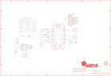

Contents
========

* [PRA987 > Adafruit](#pra987--adafruit)
	* [Images](#images)
	* [Tags](#tags)
  
![][im]
# PRA987 > Adafruit

- ID: PROJ-ADAF-987-STAN-01
- Hex ID: PRA987
- Name: Adafruit
- Description: Adafruit

## Images
  
  

|kicadPcb3d|kicadPcb3dFront|kicadPcb3dBack|eagleImage|eagleSchemImage|
| :---: | :---: | :---: | :---: | :---: |
||||||

## Tags

- hexID: PRA987
- oompType: PROJ
- oompSize: ADAF
- oompColor: 987
- oompDesc: STAN
- oompIndex: 01
- oompName: Adafruit MAX98306 Class D Amp PCB
- sources: All source files from https://github.com/adafruit/Adafruit-MAX98306-Class-D-Amp-PCB (source licence details in srcLicense.md)
- linkBuyPage: http://www.adafruit.com/products/987
- oompID: PROJ-ADAF-987-STAN-01
- oompParts: C1,UNMATCHED-UNMATCHED-UNMATCHED-UNMATCHED-UNMATCHED
- oompParts: C2,UNMATCHED-UNMATCHED-UNMATCHED-UNMATCHED-UNMATCHED
- oompParts: C3,UNMATCHED-UNMATCHED-UNMATCHED-UNMATCHED-UNMATCHED
- oompParts: C4,UNMATCHED-UNMATCHED-UNMATCHED-UNMATCHED-UNMATCHED
- oompParts: C5,UNMATCHED-UNMATCHED-UNMATCHED-UNMATCHED-UNMATCHED
- oompParts: C6,UNMATCHED-UNMATCHED-UNMATCHED-UNMATCHED-UNMATCHED
- oompParts: J1,UNMATCHED-UNMATCHED-UNMATCHED-UNMATCHED-UNMATCHED
- oompParts: J2,UNMATCHED-UNMATCHED-UNMATCHED-UNMATCHED-UNMATCHED
- oompParts: JP1,UNMATCHED-UNMATCHED-UNMATCHED-UNMATCHED-UNMATCHED
- oompParts: JP3,UNMATCHED-UNMATCHED-UNMATCHED-UNMATCHED-UNMATCHED
- oompParts: R1,UNMATCHED-UNMATCHED-UNMATCHED-UNMATCHED-UNMATCHED
- oompParts: R3,UNMATCHED-UNMATCHED-UNMATCHED-UNMATCHED-UNMATCHED
- oompParts: R4,UNMATCHED-UNMATCHED-UNMATCHED-UNMATCHED-UNMATCHED
- oompParts: R5,UNMATCHED-UNMATCHED-UNMATCHED-UNMATCHED-UNMATCHED
- oompParts: U$6,UNMATCHED-UNMATCHED-UNMATCHED-UNMATCHED-UNMATCHED
- oompParts: U$7,UNMATCHED-UNMATCHED-UNMATCHED-UNMATCHED-UNMATCHED
- oompParts: U1,UNMATCHED-UNMATCHED-UNMATCHED-UNMATCHED-UNMATCHED
- rawParts: C1,0.1µF,CAP_CERAMIC0805,0805,Ceramic Capacitors,,
- rawParts: C2,1µF,CAP_CERAMIC0805,0805,Ceramic Capacitors,,
- rawParts: C3,1µF,CAP_CERAMIC0805,0805,Ceramic Capacitors,,
- rawParts: C4,1µF,CAP_CERAMIC0805,0805,Ceramic Capacitors,,
- rawParts: C5,1µF,CAP_CERAMIC0805,0805,Ceramic Capacitors,,
- rawParts: C6,10µF,CAP_CERAMIC0805,0805,Ceramic Capacitors,,
- rawParts: FID1,FIDUCIAL,FIDUCIAL,FIDUCIAL_1MM,Fiducial Alignment Points,,
- rawParts: FID2,FIDUCIAL,FIDUCIAL,FIDUCIAL_1MM,Fiducial Alignment Points,,
- rawParts: J1,OUTL,TERMBLOCK_1X2,TERMBLOCK_1X2-3.5MM,3.5mm Terminal block,,
- rawParts: J2,OUTR,TERMBLOCK_1X2,TERMBLOCK_1X2-3.5MM,3.5mm Terminal block,,
- rawParts: JP1,,PINHD-2X4,2X04,PIN HEADER,,
- rawParts: JP3,,HEADER-1X970MIL,1X09_ROUND_70,PIN HEADER,,
- rawParts: R1,100K,RESISTOR0805,0805,Resistors,,
- rawParts: R3,100K,RESISTOR0805,0805,Resistors,,
- rawParts: R4,100K,RESISTOR0805,0805,Resistors,,
- rawParts: R5,10K,RESISTOR0805,0805,Resistors,,
- rawParts: U$6,MOUNTINGHOLE2.5,MOUNTINGHOLE2.5,MOUNTINGHOLE_2.5_PLATED,Mounting Hole,,
- rawParts: U$7,MOUNTINGHOLE2.5,MOUNTINGHOLE2.5,MOUNTINGHOLE_2.5_PLATED,Mounting Hole,,
- rawParts: U1,MAX98306ETD+T,AUDIOAMP_MAX98306,TDFN14_3X3MM,MAX98306 3.7W Stereo Audio Amp - TDFN14,,

[im]: kicadPcb3d_450.png
