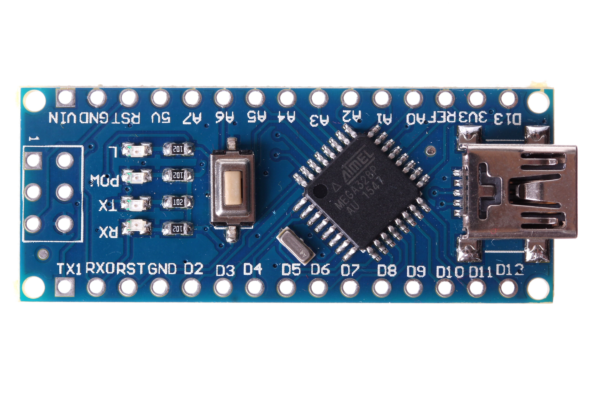
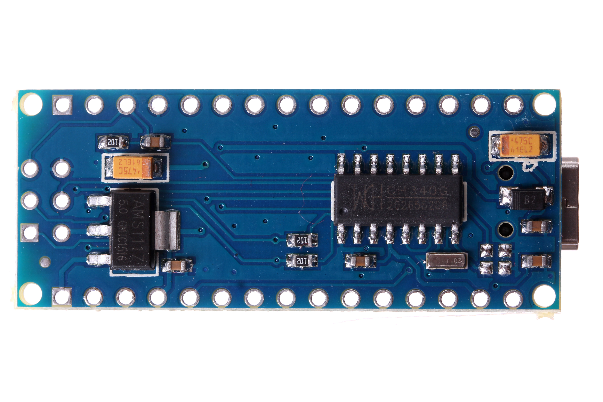
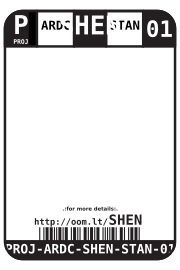
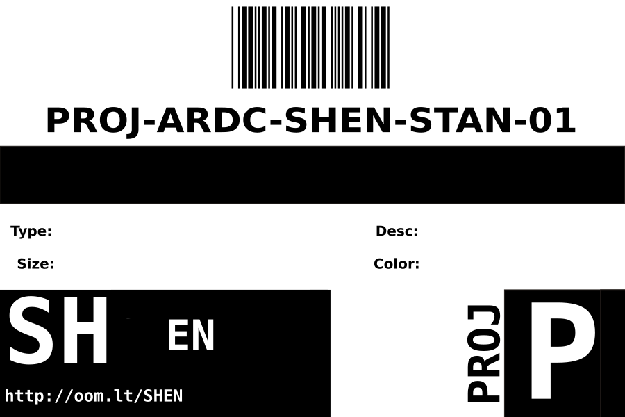
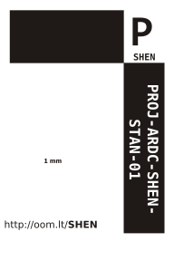

Contents
========

* [PROJ-ARDC-SHEN-STAN-01>](#proj-ardc-shen-stan-01)
	* [Images](#images)
	* [Diagrams](#diagrams)
	* [Datasheets](#datasheets)
	* [Labels](#labels)
	* [Tags](#tags)
  
![][im]
# PROJ-ARDC-SHEN-STAN-01>

- ID: PROJ-ARDC-SHEN-STAN-01
- Name: PROJ-ARDC-SHEN-STAN-01

## Images
  
  

|Main|Top|Bottom|
| :---: | :---: | :---: |
||||

## Diagrams
  
  

|Breadboard Layout|Diagram|Identifier|Schematic|Simple|
| :---: | :---: | :---: | :---: | :---: |
||||||

## Datasheets

- Datasheet: [datasheet.pdf](datasheet.pdf)

## Labels
  
  

|Front|Inventory|Specifications|
| :---: | :---: | :---: |
||||

## Tags

- index: 12536
- oompType: PROJ
- oompSize: ARDC
- oompColor: SHEN
- oompDesc: STAN
- oompIndex: 01
- hexID: SHEN
- oompAbout: An open sourced version of the widely available Shennie Arduino Compatible board (like an Arduino nano but with a CH340 USB to serial converter).
- numComponents: 14
- numUniqueComponents: 9
- component: [['compIndex', '1'], ['compIden', 'U1'], ['compIden', 'U1'], ['compID', 'ICIC-TQ32-X-K328-01'], ['compWhy', ''], ['compDesc', '']]
- ooPin1: TX1
- ooPin2: RX0
- ooPin3: RST
- ooPin4: GND
- ooPin5: D2
- ooPin6: D3
- ooPin7: D4
- ooPin8: D5
- ooPin9: D6
- ooPin10: D7
- ooPin11: D8
- ooPin12: D9
- ooPin13: D10
- ooPin14: D11
- ooPin15: D12
- ooPin16: D13
- ooPin17: 3V3
- ooPin18: REF
- ooPin19: A0
- ooPin20: A1
- ooPin21: A2
- ooPin22: A3
- ooPin23: A4
- ooPin24: A5
- ooPin25: A6
- ooPin26: A7
- ooPin27: 5V
- ooPin28: RST
- ooPin29: GND
- ooPin30: VIN
- ooNumPins: 30
- oompSymbol: twoSidedPackage;##ooNumPins@@
- ooDesignator: U1
- ooDesignator1: U

[im]: image_600.jpg
