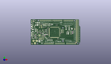
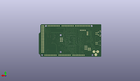
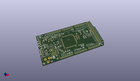

Contents
========

* [PROJ-ARDU-DUE-STAN-01>](#proj-ardu-due-stan-01)
	* [Images](#images)
	* [Interactive BOM](#interactive-bom)
	* [OOMP Parts](#oomp-parts)
	* [Tags](#tags)
  
![][im]
# PROJ-ARDU-DUE-STAN-01>

- ID: PROJ-ARDU-DUE-STAN-01
- Hex ID: PRARSTAN
- Name: 
- Description: 

## Images
  
  

|eagleImage|kicadPcb3dFront|kicadPcb3dBack|kicadPcb3d|
| :---: | :---: | :---: | :---: |
|||||

## Interactive BOM

- Interactive BOM page: [ibom.html](kicad/bom/ibom.html)

## OOMP Parts
  

|OOMP Parts|
| :---: |
|UNMATCHED-UNMATCHED-X-UNMATCHED-01, ADCH, 3250.0, 100.0, 0,ADCH, FH254-108DF08500V, 1X08, Connettori, (3250, 100), R0|
|UNMATCHED-UNMATCHED-X-UNMATCHED-01, ADCL, 2350.0, 100.0, 0,ADCL, FH254-108DF08500V, 1X08, Connettori, (2350, 100), R0|
|UNMATCHED-0402-X-UNMATCHED-01, BR1, 1108.0, 834.0, 270,BR1, NM, J0402, bibaja, (1108, 834), R270|
|CAPE-UNMATCHED-X-UNMATCHED-01, C1, 1432.0, 376.0, 0,C1, 22uF, SMC_B, Condensatori, (1432, 376), R0|
|CAPE-UNMATCHED-X-UNMATCHED-01, C2, 1087.0, 1592.0, 180,C2, 22uF, SMC_B, Condensatori, (1087, 1592), R180|
|CAPE-UNMATCHED-X-UNMATCHED-01, C3, 1672.0, 376.0, 0,C3, 22uF, SMC_B, Condensatori, (1672, 376), R0|
|CAPE-0402-X-UNMATCHED-01, C4, 1416.0, 804.0, 0,C4, 100nF, C0402, Condensatori, (1416, 804), R0|
|CAPE-0402-X-UNMATCHED-01, C5, 2052.0, 1604.0, 270,C5, 100nF, C0402, Condensatori, (2052, 1604), R270|
|CAPE-0402-X-UNMATCHED-01, C6, 1376.0, 904.0, 0,C6, 100nF, C0402, Condensatori, (1376, 904), R0|
|CAPE-0402-X-UNMATCHED-01, C7, 2240.0, 484.0, 90,C7, 100nF, C0402, Condensatori, (2240, 484), R90|
|CAPE-0402-X-UNMATCHED-01, C8, 2420.0, 1024.0, 270,C8, 100nF, C0402, Condensatori, (2420, 1024), R270|
|CAPE-0402-X-UNMATCHED-01, C9, 1376.0, 1284.0, 0,C9, 100nF, C0402, Condensatori, (1376, 1284), R0|
|CAPE-0402-X-UNMATCHED-01, C10, 1476.0, 588.0, 90,C10, 100nF, C0402, Condensatori, (1476, 588), R90|
|CAPE-UNMATCHED-X-UNMATCHED-01, C11, 1231.0, 861.0, 180,C11, 22uF, SMC_B, Condensatori, (1231, 861), R180|
|CAPE-0402-X-UNMATCHED-01, C12, 1348.0, 820.0, 90,C12, 100nF, C0402, Condensatori, (1348, 820), R90|
|CAPE-0402-X-UNMATCHED-01, C13, 2132.0, 1604.0, 270,C13, 100nF, C0402, Condensatori, (2132, 1604), R270|
|CAPE-0402-X-UNMATCHED-01, C14, 1364.0, 1200.0, 0,C14, 100nF, C0402, Condensatori, (1364, 1200), R0|
|CAPE-0402-X-UNMATCHED-01, C15, 1364.0, 1000.0, 0,C15, 100nF, C0402, Condensatori, (1364, 1000), R0|
|CAPE-0402-X-UNMATCHED-01, C16, 2168.0, 484.0, 90,C16, 100nF, C0402, Condensatori, (2168, 484), R90|
|CAPE-0402-X-UNMATCHED-01, C17, 2424.0, 920.0, 90,C17, 100nF, C0402, Condensatori, (2424, 920), R90|
|CAPE-0402-X-UNMATCHED-01, C18, 1490.9001, 464.29995, 180,C18, 100nF, C0402, Condensatori, (1490.9001, 464.29995), R180|
|CAPE-0402-X-UNMATCHED-01, C19, 1608.0, 484.0, 90,C19, 100nF, C0402, Condensatori, (1608, 484), R90|
|CAPE-0402-X-NF10-01, C20, 88.0, 1772.0, 180,C20, 10n, C0402, Condensatori, (88, 1772), R180|
|CAPE-0402-X-UNMATCHED-01, C21, 1584.0, 1624.0, 90,C21, 22pF, C0402, Condensatori, (1584, 1624), R90|
|CAPE-0402-X-UNMATCHED-01, C22, 1376.0, 1608.0, 90,C22, 22pF, C0402, Condensatori, (1376, 1608), R90|
|CAPE-0402-X-UNMATCHED-01, C23, 1144.0, 1096.0, 180,C23, 22pF, C0402, Condensatori, (1144, 1096), R180|
|CAPE-0402-X-UNMATCHED-01, C24, 1144.0, 1200.0, 180,C24, 22pF, C0402, Condensatori, (1144, 1200), R180|
|CAPE-0402-X-UNMATCHED-01, C25, 1136.0, 1466.0, 180,C25, 22pF, C0402, Condensatori, (1136, 1466), R180|
|CAPE-0402-X-NF10-01, C26, 416.0, 1732.0, 180,C26, 10n, C0402, Condensatori, (416, 1732), R180|
|CAPE-UNMATCHED-X-UNMATCHED-01, C27, 668.0, 1776.0, 90,C27, 22uF, SMC_B, Condensatori, (668, 1776), R90|
|CAPE-0402-X-UNMATCHED-01, C28, 68.0, 1240.0, 90,C28, 100nF, C0402, Condensatori, (68, 1240), R90|
|CAPE-UNMATCHED-X-UNMATCHED-01, C29, 2856.0, 1320.0, 90,C29, 22uF, SMC_B, Condensatori, (2856, 1320), R90|
|CAPE-0402-X-UNMATCHED-01, C30, 717.0, 985.0, 90,C30, 100nF, C0402, Condensatori, (717, 985), R90|
|CAPE-0402-X-UNMATCHED-01, C31, 731.0, 1201.0, 180,C31, 100nF, C0402, Condensatori, (731, 1201), R180|
|CAPE-0402-X-UNMATCHED-01, C32, 1668.0, 1596.0, 180,C32, 100nF, C0402, Condensatori, (1668, 1596), R180|
|CAPE-UNMATCHED-X-UNMATCHED-01, C33, 1720.0, 1688.0, 0,C33, 22uF, SMC_B, Condensatori, (1720, 1688), R0|
|CAPE-0402-X-UNMATCHED-01, C34, 1168.0, 776.0, 180,C34, 100nF, C0402, Condensatori, (1168, 776), R180|
|CAPE-UNMATCHED-X-UNMATCHED-01, C35, 540.0, 1776.0, 90,C35, 22uF, SMC_B, Condensatori, (540, 1776), R90|
|CAPE-0402-X-UNMATCHED-01, C36, 544.0, 756.0, 90,C36, 100nF, C0402, Condensatori, (544, 756), R90|
|CAPE-0402-X-UNMATCHED-01, C37, 420.8189, 537.54331, 180,C37, 100nF, C0402, Condensatori, (420.8189, 537.54331), R180|
|CAPE-0402-X-UNMATCHED-01, C38, 772.0, 984.0, 90,C38, 1uF, C0402, Condensatori, (772, 984), R90|
|CAPE-0402-X-UNMATCHED-01, C39, 348.0, 537.54331, 0,C39, 22pF, C0402, Condensatori, (348, 537.54331), R0|
|CAPE-0402-X-UNMATCHED-01, C40, 452.0, 722.0, 0,C40, 22pF, C0402, Condensatori, (452, 722), R0|
|CAPE-0603-X-UNMATCHED-01, C41, 3257.70005, 876.19993, 0,C41, 100nF, C0603-ROUND, Condensatori, (3257.70005, 876.19993), R0|
|CAPE-UNMATCHED-X-UNMATCHED-01, C49, 2988.0, 903.0, 180,C49, 22uF, SMC_B, Condensatori, (2988, 903), R180|
|CAPE-0603-X-UNMATCHED-01, C50, 2992.0, 1108.0, 180,C50, 100nF, C0603-ROUND, Condensatori, (2992, 1108), R180|
|UNMATCHED-UNMATCHED-X-UNMATCHED-01, CN2, 880.0, 1516.0, 180,CN2, PINHEAD-2x5-P1.27, PINHEAD_2X05_127, Connettori, (880, 1516), R180|
|UNMATCHED-UNMATCHED-X-UNMATCHED-01, COMMUNICATION, 3050.0, 2000.0, 0,COMMUNICATION, FH254-108DF08500V, 1X08, Connettori, (3050, 2000), R0|
|UNMATCHED-UNMATCHED-X-UNMATCHED-01, D1, 704.0, 232.0, 180,D1, MSS1P3L-M3/89A, MICROSMP, Diodi, (704, 232), R180|
|UNMATCHED-UNMATCHED-X-UNMATCHED-01, D2, 992.0, 868.0, 270,D2, CD1206-S01575, MINIMELF, Diodi, (992, 868), R270|
|UNMATCHED-UNMATCHED-X-UNMATCHED-01, D5, 690.0, 320.0, 180,D5, SS1P3L, DO220AAL, Diodi, (690, 320), R180|
|UNMATCHED-UNMATCHED-X-UNMATCHED-01, DEBUG, 1325.0, 1712.0, 180,DEBUG, PH1X4-THT, Connettori, (1325, 1712), R180|
|UNMATCHED-UNMATCHED-X-UNMATCHED-01, ERASE, 2940.0, 1524.0, 180,ERASE, 157SW, SMD_157SW, Switches, (2940, 1524), R180|
|ERROR, F1 MF-MSMF050-2 500mA, 0, 0, 0,F1, MF-MSMF050-2, 500mA, L1812, Protezione, (494, 1606), R180|
|ERROR, F2 MF-MSMF050-2 500mA, 0, 0, 0,F2, MF-MSMF050-2, 500mA, L1812, Protezione, (168, 1176), R270|
|UNMATCHED-UNMATCHED-X-UNMATCHED-01, IC1, 762.0, 1100.0, 90,IC1, LMV358IDGKR, MSOP08, IntegratedCircuits, (762, 1100), R90|
|UNMATCHED-UNMATCHED-X-UNMATCHED-01, IC4, 3214.0, 1318.0, 270,IC4, NX1117CE33Z, SOT223, IntegratedCircuits, (3214, 1318), R270|
|UNMATCHED-UNMATCHED-X-UNMATCHED-01, IC5, 3210.0, 1056.0, 180,IC5, MPM3610, QFN-20, IntegratedCircuits, (3210, 1056), R180|
|UNMATCHED-UNMATCHED-X-UNMATCHED-01, IC6, 716.0, 768.0, 0,IC6, ATMEGA16U2-MU, MLF32, IntegratedCircuits, (716, 768), R0|
|UNMATCHED-UNMATCHED-X-UNMATCHED-01, IC10, 522.17323, 574.80315, 0,IC10, 74LVC1G125DCKR, SC70-5, IntegratedCircuits, (522.17323, 574.80315), R0|
|UNMATCHED-UNMATCHED-X-UNMATCHED-01, ICSP1, 975.93701, 580.0, 90,ICSP1, ICSP, 2X03, Connettori, (975.93701, 580), R90|
|ERROR, JP5 2x2M -, 0, 0, 0,JP5, 2x2M, -, NM, 2X02, Connettori, (760.06299, 492), R180|
|UNMATCHED-0402-X-UNMATCHED-01, JR1, 1108.0, 784.0, 90,JR1, 0R, R0402, Resistenze, (1108, 784), R90|
|UNMATCHED-0805-X-UNMATCHED-01, L, 415.0, 1164.0, 90,L, Yellow, CHIPLED_0805, Opto, (415, 1164), R90|
|UNMATCHED-0805-X-UNMATCHED-01, L1, 1280.0, 552.0, 0,L1, MH2029-300Y, 0805, Protezione, (1280, 552), R0|
|UNMATCHED-0805-X-UNMATCHED-01, L2, 1268.0, 1552.0, 180,L2, MH2029-300Y, 0805, Protezione, (1268, 1552), R180|
|UNMATCHED-0805-X-UNMATCHED-01, L3, 1278.0, 476.0, 0,L3, MH2029-300Y, 0805, Protezione, (1278, 476), R0|
|UNMATCHED-0805-X-UNMATCHED-01, L5, 1508.0, 1724.0, 0,L5, MH2029-300Y, 0805, Protezione, (1508, 1724), R0|
|UNMATCHED-0805-X-UNMATCHED-01, L6, 576.0, 310.0, 90,L6, MH2029-300Y, 0805, Protezione, (576, 310), R90|
|UNMATCHED-0805-X-UNMATCHED-01, ON, 415.0, 1090.0, 90,ON, Green, CHIPLED_0805, Opto, (415, 1090), R90|
|UNMATCHED-UNMATCHED-X-UNMATCHED-01, PC1, 907.0, 236.0, 270,PC1, 47uF, PANASONIC_D, Condensatori, (907, 236), R270|
|UNMATCHED-UNMATCHED-X-UNMATCHED-01, PC2, 2988.0, 1018.0, 180,PC2, 22uF, SMC_B, Condensatori, (2988, 1018), R180|
|UNMATCHED-UNMATCHED-X-UNMATCHED-01, POWER, 1450.0, 100.0, 0,POWER, FH254-108DF08500V, 1X08, Connettori, (1450, 100), R0|
|UNMATCHED-UNMATCHED-X-UNMATCHED-01, PWMH, 1190.0, 2000.0, 180,PWMH, FH254-110DF08500V, 1X10, Connettori, (1190, 2000), R180|
|UNMATCHED-UNMATCHED-X-UNMATCHED-01, PWML, 2150.0, 2000.0, 180,PWML, FH254-108DF08500V, 1X08, Connettori, (2150, 2000), R180|
|UNMATCHED-UNMATCHED-X-UNMATCHED-01, Q2, 1000.0, 1054.0, 90,Q2, BC847B, SOT23, Transistors, (1000, 1054), R90|
|RESE-0402-X-UNMATCHED-01, R1, 904.0, 1704.0, 90,R1, 0R, R0402, Resistenze, (904, 1704), R90|
|<table><tr><td></td><td> R2</td><td>[RESE-0402-X-O103-01 SMD (0402) 10k Ohm Resistor](https://github.com/oomlout/oomlout_OOMP_parts/tree/main/RESE-0402-X-O103-01/)</td><td>[R42103](https://github.com/oomlout/oomlout_OOMP_parts/tree/main/RESE-0402-X-O103-01/)</td></tr></table>|
|RESE-0402-X-UNMATCHED-01, R3, 1144.0, 1000.0, 180,R3, 1K, R0402, Resistenze, (1144, 1000), R180|
|<table><tr><td></td><td> R4</td><td>[RESE-0402-X-O104-01 SMD (0402) 100k Ohm Resistor](https://github.com/oomlout/oomlout_OOMP_parts/tree/main/RESE-0402-X-O104-01/)</td><td>[R42104](https://github.com/oomlout/oomlout_OOMP_parts/tree/main/RESE-0402-X-O104-01/)</td></tr></table>|
|ERROR, R5 39R 1%, 0, 0, 0,R5, 39R, 1%, R0402, Resistenze, (1456, 1428), R90|
|ERROR, R6 39R 1%, 0, 0, 0,R6, 39R, 1%, R0402, Resistenze, (1356, 1378), R270|
|RESE-0603-X-UNMATCHED-01, R7, 1036.0, 1444.0, 90,R7, 6K8, R0603-ROUND, Resistenze, (1036, 1444), R90|
|RESE-0402-X-UNMATCHED-01, R8, 1364.0, 1112.0, 0,R8, 0R-DNP, R0402, Resistenze, (1364, 1112), R0|
|RESE-0402-X-UNMATCHED-01, R9, 376.0, 722.0, 0,R9, 1M, R0402, Resistenze, (376, 722), R0|
|<table><tr><td></td><td> R13</td><td>[RESE-0402-X-O103-01 SMD (0402) 10k Ohm Resistor](https://github.com/oomlout/oomlout_OOMP_parts/tree/main/RESE-0402-X-O103-01/)</td><td>[R42103](https://github.com/oomlout/oomlout_OOMP_parts/tree/main/RESE-0402-X-O103-01/)</td></tr></table>|
|RESE-0402-X-UNMATCHED-01, R14, 132.0, 596.0, 270,R14, 1K, R0402, Resistenze, (132, 596), R270|
|RESE-0402-X-UNMATCHED-01, R15, 80.0, 596.0, 90,R15, 1K, R0402, Resistenze, (80, 596), R90|
|<table><tr><td></td><td> R16</td><td>[RESE-0402-X-O104-01 SMD (0402) 100k Ohm Resistor](https://github.com/oomlout/oomlout_OOMP_parts/tree/main/RESE-0402-X-O104-01/)</td><td>[R42104](https://github.com/oomlout/oomlout_OOMP_parts/tree/main/RESE-0402-X-O104-01/)</td></tr></table>|
|RESE-0603-X-O753-01, R17, 334.0, 808.0, 0,R17, 75K, R0603-ROUND, Resistenze, (334, 808), R0|
|<table><tr><td></td><td> R18</td><td>[RESE-0402-X-O103-01 SMD (0402) 10k Ohm Resistor](https://github.com/oomlout/oomlout_OOMP_parts/tree/main/RESE-0402-X-O103-01/)</td><td>[R42103](https://github.com/oomlout/oomlout_OOMP_parts/tree/main/RESE-0402-X-O103-01/)</td></tr></table>|
|RESE-0402-X-UNMATCHED-01, R19, 572.0, 948.0, 180,R19, 22R, R0402, Resistenze, (572, 948), R180|
|RESE-0402-X-UNMATCHED-01, R20, 572.0, 992.0, 180,R20, 22R, R0402, Resistenze, (572, 992), R180|
|RESE-0402-X-UNMATCHED-01, R21, 824.0, 944.0, 90,R21, 1K, R0402, Resistenze, (824, 944), R90|
|RESE-0402-X-UNMATCHED-01, R23, 904.0, 792.0, 0,R23, 1K, R0402, Resistenze, (904, 792), R0|
|RESE-0603-X-UNMATCHED-01, R28, 3381.0, 1129.0, 180,R28, 100K_1%, R0603-ROUND, Resistenze, (3381, 1129), R180|
|RESE-0603-X-UNMATCHED-01, R29, 3381.0, 1055.0, 180,R29, 19K1_0,1%, R0603-ROUND, Resistenze, (3381, 1055), R180|
|<table><tr><td></td><td> R30</td><td>[RESE-0603-X-O104-01 SMD (0603) 100k Ohm Resistor](https://github.com/oomlout/oomlout_OOMP_parts/tree/main/RESE-0603-X-O104-01/)</td><td>[R6104](https://github.com/oomlout/oomlout_OOMP_parts/tree/main/RESE-0603-X-O104-01/)</td></tr></table>|
|<table><tr><td></td><td> R31</td><td>[RESE-0603-X-O563-01 SMD (0603) 56k Ohm Resistor](https://github.com/oomlout/oomlout_OOMP_parts/tree/main/RESE-0603-X-O563-01/)</td><td>[R6563](https://github.com/oomlout/oomlout_OOMP_parts/tree/main/RESE-0603-X-O563-01/)</td></tr></table>|
|<table><tr><td></td><td> R99</td><td>[RESE-0402-X-O103-01 SMD (0402) 10k Ohm Resistor](https://github.com/oomlout/oomlout_OOMP_parts/tree/main/RESE-0402-X-O103-01/)</td><td>[R42103](https://github.com/oomlout/oomlout_OOMP_parts/tree/main/RESE-0402-X-O103-01/)</td></tr></table>|
|UNMATCHED-UNMATCHED-X-UNMATCHED-01, RESET, 245.0, 1920.0, 0,RESET, TS42, TS42, Switches, (245, 1920), R0|
|UNMATCHED-UNMATCHED-X-UNMATCHED-01, RN1, 738.0, 1572.0, 90,RN1, 100k, CAY16, Resistenze, (738, 1572), R90|
|UNMATCHED-UNMATCHED-X-UNMATCHED-01, RN2, 700.0, 1431.0, 270,RN2, 100k, CAY16, Resistenze, (700, 1431), R270|
|UNMATCHED-UNMATCHED-X-UNMATCHED-01, RN3, 547.0, 1218.0, 270,RN3, 1K, CAY16, Resistenze, (547, 1218), R270|
|UNMATCHED-UNMATCHED-X-UNMATCHED-01, RN4, 972.0, 1200.0, 270,RN4, 100k, CAY16, Resistenze, (972, 1200), R270|
|UNMATCHED-UNMATCHED-X-UNMATCHED-01, RN5, 3100.0, 1524.0, 180,RN5, 1K5, CAY16, Resistenze, (3100, 1524), R180|
|UNMATCHED-0805-X-UNMATCHED-01, RX, 415.0, 1312.0, 90,RX, Yellow, CHIPLED_0805, Opto, (415, 1312), R90|
|UNMATCHED-0805-X-UNMATCHED-01, RX1, 168.0, 664.0, 270,RX1, Yellow, CHIPLED_0805, Opto, (168, 664), R270|
|UNMATCHED-UNMATCHED-X-UNMATCHED-01, SPI, 2555.0, 1100.0, 270,SPI, ICSP, 2X03, Connettori, (2555, 1100), R270|
|UNMATCHED-UNMATCHED-X-UNMATCHED-01, T1, 560.0, 1079.0, 180,T1, PMV48XP, SOT-23, Transistors, (560, 1079), R180|
|UNMATCHED-UNMATCHED-X-UNMATCHED-01, T2, 412.0, 871.0, 270,T2, PMV48XP, SOT-23, Transistors, (412, 871), R270|
|UNMATCHED-UNMATCHED-X-UNMATCHED-01, T3, 1186.0, 614.0, 90,T3, PMV48XP, SOT-23, Transistors, (1186, 614), R90|
|UNMATCHED-0805-X-UNMATCHED-01, TX, 415.0, 1238.0, 90,TX, Yellow, CHIPLED_0805, Opto, (415, 1238), R90|
|UNMATCHED-0805-X-UNMATCHED-01, TX1, 172.0, 528.0, 270,TX1, Yellow, CHIPLED_0805, Opto, (172, 528), R270|
|UNMATCHED-UNMATCHED-X-UNMATCHED-01, U1, 1925.0, 1025.0, 180,U1, ATSAM3X8EA-AU, LQFP144, IntegratedCircuits, (1925, 1025), R180|
|UNMATCHED-UNMATCHED-X-UNMATCHED-01, UD+1, 335.7874, 1550.0, 0,UD+1, DNP, TP-1.00MM, Arduino-utility, (335.7874, 1550), R0|
|UNMATCHED-UNMATCHED-X-UNMATCHED-01, UD+2, 335.7874, 916.0, 0,UD+2, DNP, TP-1.00MM, Arduino-utility, (335.7874, 916), R0|
|UNMATCHED-UNMATCHED-X-UNMATCHED-01, UD-1, 255.90551, 1550.0, 0,UD-1, DNP, TP-1.00MM, Arduino-utility, (255.90551, 1550), R0|
|UNMATCHED-UNMATCHED-X-UNMATCHED-01, UD-2, 255.90551, 916.0, 0,UD-2, DNP, TP-1.00MM, Arduino-utility, (255.90551, 916), R0|
|UNMATCHED-UNMATCHED-X-UNMATCHED-01, UGND1, 255.90551, 1450.0, 0,UGND1, DNP, TP-1.00MM, Arduino-utility, (255.90551, 1450), R0|
|UNMATCHED-UNMATCHED-X-UNMATCHED-01, UGND2, 255.90551, 816.0, 0,UGND2, DNP, TP-1.00MM, Arduino-utility, (255.90551, 816), R0|
|UNMATCHED-UNMATCHED-X-UNMATCHED-01, USB1, 55.0, 1500.0, 270,USB1, MCR-AB1-S-RA-SMT-TR, MCR-AB1-S-RA-SMT, Connettori, (55, 1500), R270|
|UNMATCHED-UNMATCHED-X-UNMATCHED-01, USB2, 55.0, 875.0, 270,USB2, MCR-B-S-RA-SMT-CS1TR, CON2_USB_MICRO_B_AT, Connettori, (55, 875), R270|
|UNMATCHED-UNMATCHED-X-UNMATCHED-01, UVB1, 335.7874, 1450.0, 0,UVB1, DNP, TP-1.00MM, Arduino-utility, (335.7874, 1450), R0|
|UNMATCHED-UNMATCHED-X-UNMATCHED-01, UVB2, 335.7874, 816.0, 0,UVB2, DNP, TP-1.00MM, Arduino-utility, (335.7874, 816), R0|
|UNMATCHED-UNMATCHED-X-UNMATCHED-01, X2, 210.0, 330.0, 90,X2, POWER-SUPPLY, POWERSUPPLY_DC-21MM, Connettori, (210, 330), R90|
|UNMATCHED-UNMATCHED-X-UNMATCHED-01, XIO, 3750.0, 1150.0, 270,XIO, 18x2F-H8.5, 2X18, Connettori, (3750, 1150), R270|
|UNMATCHED-UNMATCHED-X-UNMATCHED-01, Y1, 1477.0, 1595.0, 270,Y1, 12mHz-12pF-K7, CRYSTAL-3.2-2.5, Cristalli, (1477, 1595), R270|
|UNMATCHED-UNMATCHED-X-UNMATCHED-01, Y2, 1232.0, 1152.0, 90,Y2, 32,768Khz_SMD, RESONATOR_EPSON_FC_145, Cristalli, (1232, 1152), R90|
|UNMATCHED-UNMATCHED-X-UNMATCHED-01, Y4, 376.0, 628.0, 0,Y4, 16Mhz-KX-7, CRYSTAL-3.2-2.5, Cristalli, (376, 628), R0|
|UNMATCHED-UNMATCHED-X-UNMATCHED-01, Z1, 312.0, 1432.0, 270,Z1, BRNCG0603MLC-05E, CT/CN0603, Protezione, (312, 1432), R270|
|UNMATCHED-UNMATCHED-X-UNMATCHED-01, Z2, 312.0, 1576.0, 90,Z2, BRNCG0603MLC-05E, CT/CN0603, Protezione, (312, 1576), R90|
|UNMATCHED-UNMATCHED-X-UNMATCHED-01, Z3, 260.0, 972.0, 270,Z3, BRNCG0603MLC-05E, CT/CN0603, Protezione, (260, 972), R270|
|UNMATCHED-UNMATCHED-X-UNMATCHED-01, Z4, 232.0, 816.0, 90,Z4, BRNCG0603MLC-05E, CT/CN0603, Protezione, (232, 816), R90|
|UNMATCHED-UNMATCHED-X-UNMATCHED-01, Z5, 176.0, 1716.0, 0,Z5, BRNCG0603MLC-05E, CT/CN0603, Protezione, (176, 1716), R0|

## Tags

- hexID: PRARSTAN
- oompType: PROJ
- oompSize: ARDU
- oompColor: DUE
- oompDesc: STAN
- oompIndex: 01
- sources: All source files from https://store.arduino.cc/collections/boards/products/arduino-due
- linkBuyPage: https://store.arduino.cc/collections/boards/products/arduino-due
- oompPart: UNMATCHED-UNMATCHED-X-UNMATCHED-01, ADCH, 3250.0, 100.0, 0
- oompPart: UNMATCHED-UNMATCHED-X-UNMATCHED-01, ADCL, 2350.0, 100.0, 0
- oompPart: UNMATCHED-0402-X-UNMATCHED-01, BR1, 1108.0, 834.0, 270
- oompPart: CAPE-UNMATCHED-X-UNMATCHED-01, C1, 1432.0, 376.0, 0
- oompPart: CAPE-UNMATCHED-X-UNMATCHED-01, C2, 1087.0, 1592.0, 180
- oompPart: CAPE-UNMATCHED-X-UNMATCHED-01, C3, 1672.0, 376.0, 0
- oompPart: CAPE-0402-X-UNMATCHED-01, C4, 1416.0, 804.0, 0
- oompPart: CAPE-0402-X-UNMATCHED-01, C5, 2052.0, 1604.0, 270
- oompPart: CAPE-0402-X-UNMATCHED-01, C6, 1376.0, 904.0, 0
- oompPart: CAPE-0402-X-UNMATCHED-01, C7, 2240.0, 484.0, 90
- oompPart: CAPE-0402-X-UNMATCHED-01, C8, 2420.0, 1024.0, 270
- oompPart: CAPE-0402-X-UNMATCHED-01, C9, 1376.0, 1284.0, 0
- oompPart: CAPE-0402-X-UNMATCHED-01, C10, 1476.0, 588.0, 90
- oompPart: CAPE-UNMATCHED-X-UNMATCHED-01, C11, 1231.0, 861.0, 180
- oompPart: CAPE-0402-X-UNMATCHED-01, C12, 1348.0, 820.0, 90
- oompPart: CAPE-0402-X-UNMATCHED-01, C13, 2132.0, 1604.0, 270
- oompPart: CAPE-0402-X-UNMATCHED-01, C14, 1364.0, 1200.0, 0
- oompPart: CAPE-0402-X-UNMATCHED-01, C15, 1364.0, 1000.0, 0
- oompPart: CAPE-0402-X-UNMATCHED-01, C16, 2168.0, 484.0, 90
- oompPart: CAPE-0402-X-UNMATCHED-01, C17, 2424.0, 920.0, 90
- oompPart: CAPE-0402-X-UNMATCHED-01, C18, 1490.9001, 464.29995, 180
- oompPart: CAPE-0402-X-UNMATCHED-01, C19, 1608.0, 484.0, 90
- oompPart: CAPE-0402-X-NF10-01, C20, 88.0, 1772.0, 180
- oompPart: CAPE-0402-X-UNMATCHED-01, C21, 1584.0, 1624.0, 90
- oompPart: CAPE-0402-X-UNMATCHED-01, C22, 1376.0, 1608.0, 90
- oompPart: CAPE-0402-X-UNMATCHED-01, C23, 1144.0, 1096.0, 180
- oompPart: CAPE-0402-X-UNMATCHED-01, C24, 1144.0, 1200.0, 180
- oompPart: CAPE-0402-X-UNMATCHED-01, C25, 1136.0, 1466.0, 180
- oompPart: CAPE-0402-X-NF10-01, C26, 416.0, 1732.0, 180
- oompPart: CAPE-UNMATCHED-X-UNMATCHED-01, C27, 668.0, 1776.0, 90
- oompPart: CAPE-0402-X-UNMATCHED-01, C28, 68.0, 1240.0, 90
- oompPart: CAPE-UNMATCHED-X-UNMATCHED-01, C29, 2856.0, 1320.0, 90
- oompPart: CAPE-0402-X-UNMATCHED-01, C30, 717.0, 985.0, 90
- oompPart: CAPE-0402-X-UNMATCHED-01, C31, 731.0, 1201.0, 180
- oompPart: CAPE-0402-X-UNMATCHED-01, C32, 1668.0, 1596.0, 180
- oompPart: CAPE-UNMATCHED-X-UNMATCHED-01, C33, 1720.0, 1688.0, 0
- oompPart: CAPE-0402-X-UNMATCHED-01, C34, 1168.0, 776.0, 180
- oompPart: CAPE-UNMATCHED-X-UNMATCHED-01, C35, 540.0, 1776.0, 90
- oompPart: CAPE-0402-X-UNMATCHED-01, C36, 544.0, 756.0, 90
- oompPart: CAPE-0402-X-UNMATCHED-01, C37, 420.8189, 537.54331, 180
- oompPart: CAPE-0402-X-UNMATCHED-01, C38, 772.0, 984.0, 90
- oompPart: CAPE-0402-X-UNMATCHED-01, C39, 348.0, 537.54331, 0
- oompPart: CAPE-0402-X-UNMATCHED-01, C40, 452.0, 722.0, 0
- oompPart: CAPE-0603-X-UNMATCHED-01, C41, 3257.70005, 876.19993, 0
- oompPart: CAPE-UNMATCHED-X-UNMATCHED-01, C49, 2988.0, 903.0, 180
- oompPart: CAPE-0603-X-UNMATCHED-01, C50, 2992.0, 1108.0, 180
- oompPart: UNMATCHED-UNMATCHED-X-UNMATCHED-01, CN2, 880.0, 1516.0, 180
- oompPart: UNMATCHED-UNMATCHED-X-UNMATCHED-01, COMMUNICATION, 3050.0, 2000.0, 0
- oompPart: UNMATCHED-UNMATCHED-X-UNMATCHED-01, D1, 704.0, 232.0, 180
- oompPart: UNMATCHED-UNMATCHED-X-UNMATCHED-01, D2, 992.0, 868.0, 270
- oompPart: UNMATCHED-UNMATCHED-X-UNMATCHED-01, D5, 690.0, 320.0, 180
- oompPart: UNMATCHED-UNMATCHED-X-UNMATCHED-01, DEBUG, 1325.0, 1712.0, 180
- oompPart: UNMATCHED-UNMATCHED-X-UNMATCHED-01, ERASE, 2940.0, 1524.0, 180
- oompPart: ERROR, F1 MF-MSMF050-2 500mA, 0, 0, 0
- oompPart: ERROR, F2 MF-MSMF050-2 500mA, 0, 0, 0
- oompPart: SKIP-UNMATCHED-X-UNMATCHED-01, FID1, 3540.0, 1286.62992, 0
- oompPart: SKIP-UNMATCHED-X-UNMATCHED-01, FID2, 3669.0, 177.0, 0
- oompPart: SKIP-UNMATCHED-X-UNMATCHED-01, FID3, 245.0, 1920.0, 0
- oompPart: SKIP-UNMATCHED-X-UNMATCHED-01, FID4, 105.0, 95.0, 0
- oompPart: UNMATCHED-UNMATCHED-X-UNMATCHED-01, IC1, 762.0, 1100.0, 90
- oompPart: UNMATCHED-UNMATCHED-X-UNMATCHED-01, IC4, 3214.0, 1318.0, 270
- oompPart: UNMATCHED-UNMATCHED-X-UNMATCHED-01, IC5, 3210.0, 1056.0, 180
- oompPart: UNMATCHED-UNMATCHED-X-UNMATCHED-01, IC6, 716.0, 768.0, 0
- oompPart: UNMATCHED-UNMATCHED-X-UNMATCHED-01, IC10, 522.17323, 574.80315, 0
- oompPart: UNMATCHED-UNMATCHED-X-UNMATCHED-01, ICSP1, 975.93701, 580.0, 90
- oompPart: ERROR, JP5 2x2M -, 0, 0, 0
- oompPart: UNMATCHED-0402-X-UNMATCHED-01, JR1, 1108.0, 784.0, 90
- oompPart: UNMATCHED-0805-X-UNMATCHED-01, L, 415.0, 1164.0, 90
- oompPart: UNMATCHED-0805-X-UNMATCHED-01, L1, 1280.0, 552.0, 0
- oompPart: UNMATCHED-0805-X-UNMATCHED-01, L2, 1268.0, 1552.0, 180
- oompPart: UNMATCHED-0805-X-UNMATCHED-01, L3, 1278.0, 476.0, 0
- oompPart: UNMATCHED-0805-X-UNMATCHED-01, L5, 1508.0, 1724.0, 0
- oompPart: UNMATCHED-0805-X-UNMATCHED-01, L6, 576.0, 310.0, 90
- oompPart: UNMATCHED-0805-X-UNMATCHED-01, ON, 415.0, 1090.0, 90
- oompPart: UNMATCHED-UNMATCHED-X-UNMATCHED-01, PC1, 907.0, 236.0, 270
- oompPart: UNMATCHED-UNMATCHED-X-UNMATCHED-01, PC2, 2988.0, 1018.0, 180
- oompPart: UNMATCHED-UNMATCHED-X-UNMATCHED-01, POWER, 1450.0, 100.0, 0
- oompPart: UNMATCHED-UNMATCHED-X-UNMATCHED-01, PWMH, 1190.0, 2000.0, 180
- oompPart: UNMATCHED-UNMATCHED-X-UNMATCHED-01, PWML, 2150.0, 2000.0, 180
- oompPart: UNMATCHED-UNMATCHED-X-UNMATCHED-01, Q2, 1000.0, 1054.0, 90
- oompPart: RESE-0402-X-UNMATCHED-01, R1, 904.0, 1704.0, 90
- oompPart: RESE-0402-X-O103-01, R2, 772.0, 1688.0, 180
- oompPart: RESE-0402-X-UNMATCHED-01, R3, 1144.0, 1000.0, 180
- oompPart: RESE-0402-X-O104-01, R4, 1284.0, 1000.0, 180
- oompPart: ERROR, R5 39R 1%, 0, 0, 0
- oompPart: ERROR, R6 39R 1%, 0, 0, 0
- oompPart: RESE-0603-X-UNMATCHED-01, R7, 1036.0, 1444.0, 90
- oompPart: RESE-0402-X-UNMATCHED-01, R8, 1364.0, 1112.0, 0
- oompPart: RESE-0402-X-UNMATCHED-01, R9, 376.0, 722.0, 0
- oompPart: RESE-0402-X-O103-01, R13, 908.0, 938.0, 0
- oompPart: RESE-0402-X-UNMATCHED-01, R14, 132.0, 596.0, 270
- oompPart: RESE-0402-X-UNMATCHED-01, R15, 80.0, 596.0, 90
- oompPart: RESE-0402-X-O104-01, R16, 306.0, 722.0, 180
- oompPart: RESE-0603-X-O753-01, R17, 334.0, 808.0, 0
- oompPart: RESE-0402-X-O103-01, R18, 636.11024, 451.05512, 270
- oompPart: RESE-0402-X-UNMATCHED-01, R19, 572.0, 948.0, 180
- oompPart: RESE-0402-X-UNMATCHED-01, R20, 572.0, 992.0, 180
- oompPart: RESE-0402-X-UNMATCHED-01, R21, 824.0, 944.0, 90
- oompPart: RESE-0402-X-UNMATCHED-01, R23, 904.0, 792.0, 0
- oompPart: RESE-0603-X-UNMATCHED-01, R28, 3381.0, 1129.0, 180
- oompPart: RESE-0603-X-UNMATCHED-01, R29, 3381.0, 1055.0, 180
- oompPart: RESE-0603-X-O104-01, R30, 3382.0, 931.0, 180
- oompPart: RESE-0603-X-O563-01, R31, 3380.0, 990.0, 180
- oompPart: RESE-0402-X-O103-01, R99, 1116.0, 702.0, 90
- oompPart: UNMATCHED-UNMATCHED-X-UNMATCHED-01, RESET, 245.0, 1920.0, 0
- oompPart: UNMATCHED-UNMATCHED-X-UNMATCHED-01, RN1, 738.0, 1572.0, 90
- oompPart: UNMATCHED-UNMATCHED-X-UNMATCHED-01, RN2, 700.0, 1431.0, 270
- oompPart: UNMATCHED-UNMATCHED-X-UNMATCHED-01, RN3, 547.0, 1218.0, 270
- oompPart: UNMATCHED-UNMATCHED-X-UNMATCHED-01, RN4, 972.0, 1200.0, 270
- oompPart: UNMATCHED-UNMATCHED-X-UNMATCHED-01, RN5, 3100.0, 1524.0, 180
- oompPart: UNMATCHED-0805-X-UNMATCHED-01, RX, 415.0, 1312.0, 90
- oompPart: UNMATCHED-0805-X-UNMATCHED-01, RX1, 168.0, 664.0, 270
- oompPart: UNMATCHED-UNMATCHED-X-UNMATCHED-01, SPI, 2555.0, 1100.0, 270
- oompPart: UNMATCHED-UNMATCHED-X-UNMATCHED-01, T1, 560.0, 1079.0, 180
- oompPart: UNMATCHED-UNMATCHED-X-UNMATCHED-01, T2, 412.0, 871.0, 270
- oompPart: UNMATCHED-UNMATCHED-X-UNMATCHED-01, T3, 1186.0, 614.0, 90
- oompPart: UNMATCHED-0805-X-UNMATCHED-01, TX, 415.0, 1238.0, 90
- oompPart: UNMATCHED-0805-X-UNMATCHED-01, TX1, 172.0, 528.0, 270
- oompPart: UNMATCHED-UNMATCHED-X-UNMATCHED-01, U1, 1925.0, 1025.0, 180
- oompPart: UNMATCHED-UNMATCHED-X-UNMATCHED-01, UD+1, 335.7874, 1550.0, 0
- oompPart: UNMATCHED-UNMATCHED-X-UNMATCHED-01, UD+2, 335.7874, 916.0, 0
- oompPart: UNMATCHED-UNMATCHED-X-UNMATCHED-01, UD-1, 255.90551, 1550.0, 0
- oompPart: UNMATCHED-UNMATCHED-X-UNMATCHED-01, UD-2, 255.90551, 916.0, 0
- oompPart: UNMATCHED-UNMATCHED-X-UNMATCHED-01, UGND1, 255.90551, 1450.0, 0
- oompPart: UNMATCHED-UNMATCHED-X-UNMATCHED-01, UGND2, 255.90551, 816.0, 0
- oompPart: UNMATCHED-UNMATCHED-X-UNMATCHED-01, USB1, 55.0, 1500.0, 270
- oompPart: UNMATCHED-UNMATCHED-X-UNMATCHED-01, USB2, 55.0, 875.0, 270
- oompPart: UNMATCHED-UNMATCHED-X-UNMATCHED-01, UVB1, 335.7874, 1450.0, 0
- oompPart: UNMATCHED-UNMATCHED-X-UNMATCHED-01, UVB2, 335.7874, 816.0, 0
- oompPart: UNMATCHED-UNMATCHED-X-UNMATCHED-01, X2, 210.0, 330.0, 90
- oompPart: UNMATCHED-UNMATCHED-X-UNMATCHED-01, XIO, 3750.0, 1150.0, 270
- oompPart: UNMATCHED-UNMATCHED-X-UNMATCHED-01, Y1, 1477.0, 1595.0, 270
- oompPart: UNMATCHED-UNMATCHED-X-UNMATCHED-01, Y2, 1232.0, 1152.0, 90
- oompPart: UNMATCHED-UNMATCHED-X-UNMATCHED-01, Y4, 376.0, 628.0, 0
- oompPart: UNMATCHED-UNMATCHED-X-UNMATCHED-01, Z1, 312.0, 1432.0, 270
- oompPart: UNMATCHED-UNMATCHED-X-UNMATCHED-01, Z2, 312.0, 1576.0, 90
- oompPart: UNMATCHED-UNMATCHED-X-UNMATCHED-01, Z3, 260.0, 972.0, 270
- oompPart: UNMATCHED-UNMATCHED-X-UNMATCHED-01, Z4, 232.0, 816.0, 90
- oompPart: UNMATCHED-UNMATCHED-X-UNMATCHED-01, Z5, 176.0, 1716.0, 0
- rawPart: ADCH, FH254-108DF08500V, 1X08, Connettori, (3250, 100), R0
- rawPart: ADCL, FH254-108DF08500V, 1X08, Connettori, (2350, 100), R0
- rawPart: BR1, NM, J0402, bibaja, (1108, 834), R270
- rawPart: C1, 22uF, SMC_B, Condensatori, (1432, 376), R0
- rawPart: C2, 22uF, SMC_B, Condensatori, (1087, 1592), R180
- rawPart: C3, 22uF, SMC_B, Condensatori, (1672, 376), R0
- rawPart: C4, 100nF, C0402, Condensatori, (1416, 804), R0
- rawPart: C5, 100nF, C0402, Condensatori, (2052, 1604), R270
- rawPart: C6, 100nF, C0402, Condensatori, (1376, 904), R0
- rawPart: C7, 100nF, C0402, Condensatori, (2240, 484), R90
- rawPart: C8, 100nF, C0402, Condensatori, (2420, 1024), R270
- rawPart: C9, 100nF, C0402, Condensatori, (1376, 1284), R0
- rawPart: C10, 100nF, C0402, Condensatori, (1476, 588), R90
- rawPart: C11, 22uF, SMC_B, Condensatori, (1231, 861), R180
- rawPart: C12, 100nF, C0402, Condensatori, (1348, 820), R90
- rawPart: C13, 100nF, C0402, Condensatori, (2132, 1604), R270
- rawPart: C14, 100nF, C0402, Condensatori, (1364, 1200), R0
- rawPart: C15, 100nF, C0402, Condensatori, (1364, 1000), R0
- rawPart: C16, 100nF, C0402, Condensatori, (2168, 484), R90
- rawPart: C17, 100nF, C0402, Condensatori, (2424, 920), R90
- rawPart: C18, 100nF, C0402, Condensatori, (1490.9001, 464.29995), R180
- rawPart: C19, 100nF, C0402, Condensatori, (1608, 484), R90
- rawPart: C20, 10n, C0402, Condensatori, (88, 1772), R180
- rawPart: C21, 22pF, C0402, Condensatori, (1584, 1624), R90
- rawPart: C22, 22pF, C0402, Condensatori, (1376, 1608), R90
- rawPart: C23, 22pF, C0402, Condensatori, (1144, 1096), R180
- rawPart: C24, 22pF, C0402, Condensatori, (1144, 1200), R180
- rawPart: C25, 22pF, C0402, Condensatori, (1136, 1466), R180
- rawPart: C26, 10n, C0402, Condensatori, (416, 1732), R180
- rawPart: C27, 22uF, SMC_B, Condensatori, (668, 1776), R90
- rawPart: C28, 100nF, C0402, Condensatori, (68, 1240), R90
- rawPart: C29, 22uF, SMC_B, Condensatori, (2856, 1320), R90
- rawPart: C30, 100nF, C0402, Condensatori, (717, 985), R90
- rawPart: C31, 100nF, C0402, Condensatori, (731, 1201), R180
- rawPart: C32, 100nF, C0402, Condensatori, (1668, 1596), R180
- rawPart: C33, 22uF, SMC_B, Condensatori, (1720, 1688), R0
- rawPart: C34, 100nF, C0402, Condensatori, (1168, 776), R180
- rawPart: C35, 22uF, SMC_B, Condensatori, (540, 1776), R90
- rawPart: C36, 100nF, C0402, Condensatori, (544, 756), R90
- rawPart: C37, 100nF, C0402, Condensatori, (420.8189, 537.54331), R180
- rawPart: C38, 1uF, C0402, Condensatori, (772, 984), R90
- rawPart: C39, 22pF, C0402, Condensatori, (348, 537.54331), R0
- rawPart: C40, 22pF, C0402, Condensatori, (452, 722), R0
- rawPart: C41, 100nF, C0603-ROUND, Condensatori, (3257.70005, 876.19993), R0
- rawPart: C49, 22uF, SMC_B, Condensatori, (2988, 903), R180
- rawPart: C50, 100nF, C0603-ROUND, Condensatori, (2992, 1108), R180
- rawPart: CN2, PINHEAD-2x5-P1.27, PINHEAD_2X05_127, Connettori, (880, 1516), R180
- rawPart: COMMUNICATION, FH254-108DF08500V, 1X08, Connettori, (3050, 2000), R0
- rawPart: D1, MSS1P3L-M3/89A, MICROSMP, Diodi, (704, 232), R180
- rawPart: D2, CD1206-S01575, MINIMELF, Diodi, (992, 868), R270
- rawPart: D5, SS1P3L, DO220AAL, Diodi, (690, 320), R180
- rawPart: DEBUG, PH1X4-THT, Connettori, (1325, 1712), R180
- rawPart: ERASE, 157SW, SMD_157SW, Switches, (2940, 1524), R180
- rawPart: F1, MF-MSMF050-2, 500mA, L1812, Protezione, (494, 1606), R180
- rawPart: F2, MF-MSMF050-2, 500mA, L1812, Protezione, (168, 1176), R270
- rawPart: FID1, FIDUCIALMOUNT, FIDUCIA-MOUNT, SmartPrj, (3540, 1286.62992), R0
- rawPart: FID2, FIDUCIALMOUNT, FIDUCIA-MOUNT, SmartPrj, (3669, 177), R0
- rawPart: FID3, FIDUCIALMOUNT, FIDUCIA-MOUNT, SmartPrj, (245, 1920), R0
- rawPart: FID4, FIDUCIALMOUNT, FIDUCIA-MOUNT, SmartPrj, (105, 95), R0
- rawPart: IC1, LMV358IDGKR, MSOP08, IntegratedCircuits, (762, 1100), R90
- rawPart: IC4, NX1117CE33Z, SOT223, IntegratedCircuits, (3214, 1318), R270
- rawPart: IC5, MPM3610, QFN-20, IntegratedCircuits, (3210, 1056), R180
- rawPart: IC6, ATMEGA16U2-MU, MLF32, IntegratedCircuits, (716, 768), R0
- rawPart: IC10, 74LVC1G125DCKR, SC70-5, IntegratedCircuits, (522.17323, 574.80315), R0
- rawPart: ICSP1, ICSP, 2X03, Connettori, (975.93701, 580), R90
- rawPart: JP5, 2x2M, -, NM, 2X02, Connettori, (760.06299, 492), R180
- rawPart: JR1, 0R, R0402, Resistenze, (1108, 784), R90
- rawPart: L, Yellow, CHIPLED_0805, Opto, (415, 1164), R90
- rawPart: L1, MH2029-300Y, 0805, Protezione, (1280, 552), R0
- rawPart: L2, MH2029-300Y, 0805, Protezione, (1268, 1552), R180
- rawPart: L3, MH2029-300Y, 0805, Protezione, (1278, 476), R0
- rawPart: L5, MH2029-300Y, 0805, Protezione, (1508, 1724), R0
- rawPart: L6, MH2029-300Y, 0805, Protezione, (576, 310), R90
- rawPart: ON, Green, CHIPLED_0805, Opto, (415, 1090), R90
- rawPart: PC1, 47uF, PANASONIC_D, Condensatori, (907, 236), R270
- rawPart: PC2, 22uF, SMC_B, Condensatori, (2988, 1018), R180
- rawPart: POWER, FH254-108DF08500V, 1X08, Connettori, (1450, 100), R0
- rawPart: PWMH, FH254-110DF08500V, 1X10, Connettori, (1190, 2000), R180
- rawPart: PWML, FH254-108DF08500V, 1X08, Connettori, (2150, 2000), R180
- rawPart: Q2, BC847B, SOT23, Transistors, (1000, 1054), R90
- rawPart: R1, 0R, R0402, Resistenze, (904, 1704), R90
- rawPart: R2, 10K, R0402, Resistenze, (772, 1688), R180
- rawPart: R3, 1K, R0402, Resistenze, (1144, 1000), R180
- rawPart: R4, 100k, R0402, Resistenze, (1284, 1000), R180
- rawPart: R5, 39R, 1%, R0402, Resistenze, (1456, 1428), R90
- rawPart: R6, 39R, 1%, R0402, Resistenze, (1356, 1378), R270
- rawPart: R7, 6K8, R0603-ROUND, Resistenze, (1036, 1444), R90
- rawPart: R8, 0R-DNP, R0402, Resistenze, (1364, 1112), R0
- rawPart: R9, 1M, R0402, Resistenze, (376, 722), R0
- rawPart: R13, 10K, R0402, Resistenze, (908, 938), R0
- rawPart: R14, 1K, R0402, Resistenze, (132, 596), R270
- rawPart: R15, 1K, R0402, Resistenze, (80, 596), R90
- rawPart: R16, 100k, R0402, Resistenze, (306, 722), R180
- rawPart: R17, 75K, R0603-ROUND, Resistenze, (334, 808), R0
- rawPart: R18, 10K, R0402, Resistenze, (636.11024, 451.05512), R270
- rawPart: R19, 22R, R0402, Resistenze, (572, 948), R180
- rawPart: R20, 22R, R0402, Resistenze, (572, 992), R180
- rawPart: R21, 1K, R0402, Resistenze, (824, 944), R90
- rawPart: R23, 1K, R0402, Resistenze, (904, 792), R0
- rawPart: R28, 100K_1%, R0603-ROUND, Resistenze, (3381, 1129), R180
- rawPart: R29, 19K1_0,1%, R0603-ROUND, Resistenze, (3381, 1055), R180
- rawPart: R30, 100k, R0603-ROUND, Resistenze, (3382, 931), R180
- rawPart: R31, 56k, R0603-ROUND, Resistenze, (3380, 990), R180
- rawPart: R99, 10K, R0402, Resistenze, (1116, 702), R90
- rawPart: RESET, TS42, TS42, Switches, (245, 1920), R0
- rawPart: RN1, 100k, CAY16, Resistenze, (738, 1572), R90
- rawPart: RN2, 100k, CAY16, Resistenze, (700, 1431), R270
- rawPart: RN3, 1K, CAY16, Resistenze, (547, 1218), R270
- rawPart: RN4, 100k, CAY16, Resistenze, (972, 1200), R270
- rawPart: RN5, 1K5, CAY16, Resistenze, (3100, 1524), R180
- rawPart: RX, Yellow, CHIPLED_0805, Opto, (415, 1312), R90
- rawPart: RX1, Yellow, CHIPLED_0805, Opto, (168, 664), R270
- rawPart: SPI, ICSP, 2X03, Connettori, (2555, 1100), R270
- rawPart: T1, PMV48XP, SOT-23, Transistors, (560, 1079), R180
- rawPart: T2, PMV48XP, SOT-23, Transistors, (412, 871), R270
- rawPart: T3, PMV48XP, SOT-23, Transistors, (1186, 614), R90
- rawPart: TX, Yellow, CHIPLED_0805, Opto, (415, 1238), R90
- rawPart: TX1, Yellow, CHIPLED_0805, Opto, (172, 528), R270
- rawPart: U1, ATSAM3X8EA-AU, LQFP144, IntegratedCircuits, (1925, 1025), R180
- rawPart: UD+1, DNP, TP-1.00MM, Arduino-utility, (335.7874, 1550), R0
- rawPart: UD+2, DNP, TP-1.00MM, Arduino-utility, (335.7874, 916), R0
- rawPart: UD-1, DNP, TP-1.00MM, Arduino-utility, (255.90551, 1550), R0
- rawPart: UD-2, DNP, TP-1.00MM, Arduino-utility, (255.90551, 916), R0
- rawPart: UGND1, DNP, TP-1.00MM, Arduino-utility, (255.90551, 1450), R0
- rawPart: UGND2, DNP, TP-1.00MM, Arduino-utility, (255.90551, 816), R0
- rawPart: USB1, MCR-AB1-S-RA-SMT-TR, MCR-AB1-S-RA-SMT, Connettori, (55, 1500), R270
- rawPart: USB2, MCR-B-S-RA-SMT-CS1TR, CON2_USB_MICRO_B_AT, Connettori, (55, 875), R270
- rawPart: UVB1, DNP, TP-1.00MM, Arduino-utility, (335.7874, 1450), R0
- rawPart: UVB2, DNP, TP-1.00MM, Arduino-utility, (335.7874, 816), R0
- rawPart: X2, POWER-SUPPLY, POWERSUPPLY_DC-21MM, Connettori, (210, 330), R90
- rawPart: XIO, 18x2F-H8.5, 2X18, Connettori, (3750, 1150), R270
- rawPart: Y1, 12mHz-12pF-K7, CRYSTAL-3.2-2.5, Cristalli, (1477, 1595), R270
- rawPart: Y2, 32,768Khz_SMD, RESONATOR_EPSON_FC_145, Cristalli, (1232, 1152), R90
- rawPart: Y4, 16Mhz-KX-7, CRYSTAL-3.2-2.5, Cristalli, (376, 628), R0
- rawPart: Z1, BRNCG0603MLC-05E, CT/CN0603, Protezione, (312, 1432), R270
- rawPart: Z2, BRNCG0603MLC-05E, CT/CN0603, Protezione, (312, 1576), R90
- rawPart: Z3, BRNCG0603MLC-05E, CT/CN0603, Protezione, (260, 972), R270
- rawPart: Z4, BRNCG0603MLC-05E, CT/CN0603, Protezione, (232, 816), R90
- rawPart: Z5, BRNCG0603MLC-05E, CT/CN0603, Protezione, (176, 1716), R0

[im]: kicadPcb3d_450.png
