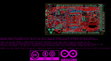
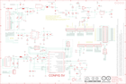

Contents
========

* [PRARSTAN > Arduino DUE](#prarstan--arduino-due)
	* [Schematic](#schematic)
	* [Interactive BOM](#interactive-bom)
	* [OOMP Parts](#oomp-parts)
	* [Images](#images)
	* [Tags](#tags)
  
![][im]
# PRARSTAN > Arduino DUE

- ID: PROJ-ARDU-DUE-STAN-01
- Hex ID: PRARSTAN
- Name: Arduino DUE
- Description: Arduino DUE
- Long Link: [http://oom.lt/PROJ-ARDU-DUE-STAN-01](http://oom.lt/PROJ-ARDU-DUE-STAN-01)
- Short Link: [http://oom.lt/PRARSTAN](http://oom.lt/PRARSTAN)

## Schematic
  

## Interactive BOM

- Interactive BOM page: [ibom.html](https://htmlpreview.github.io/?https://github.com/oomlout/oomlout_OOMP_projects/blob/main/PROJ-ARDU-DUE-STAN-01/kicad/bom/ibom.html)

## OOMP Parts
  

|OOMP Parts|
| :---: |
|ADCH,UNMATCHED-UNMATCHED-X-UNMATCHED-01,ADCH,FH254-108DF08500V,1683_20TW-536,1X08,Female Gray Connector strip for Arduino 3V3 bases - 8x1 F V h 8,5 p2,54mm,,,,,,,,_____,,20TW-536,_____,_____,Connettori,FH254-108DF08500V,|
|ADCL,UNMATCHED-UNMATCHED-X-UNMATCHED-01,ADCL,FH254-108DF08500V,1683_20TW-536,1X08,Female Gray Connector strip for Arduino 3V3 bases - 8x1 F V h 8,5 p2,54mm,,,,,,,,_____,,20TW-536,_____,_____,Connettori,FH254-108DF08500V,|
|BR1,UNMATCHED-0402-X-UNMATCHED-01,BR1,NM,J0402,J0402,Three terminal jumper made from two 0402, 0603, 0805, etc.,,,,,,,,,,,,,,,|
|C1,CAPX-UNMATCHED-X-UF22-01,C1,22uF,0167_,SMC_B,22uF 25V,,,,,,,,_____,,,_____,_____,Condensatori,22uF,|
|C2,CAPX-UNMATCHED-X-UF22-01,C2,22uF,0167_,SMC_B,22uF 25V,,,,,,,,_____,,,_____,_____,Condensatori,22uF,|
|C3,CAPX-UNMATCHED-X-UF22-01,C3,22uF,0167_,SMC_B,22uF 25V,,,,,,,,_____,,,_____,_____,Condensatori,22uF,|
|C4,CAPC-0402-X-UNMATCHED-01,C4,100nF,0132_100NF_0402,C0402,100nF 0402,0402,,,,,,,_____,,100nF_0402,_____,_____,Condensatori,100nF,|
|C5,CAPC-0402-X-UNMATCHED-01,C5,100nF,0132_100NF_0402,C0402,100nF 0402,0402,,,,,,,_____,,100nF_0402,_____,_____,Condensatori,100nF,|
|C6,CAPC-0402-X-UNMATCHED-01,C6,100nF,0132_100NF_0402,C0402,100nF 0402,0402,,,,,,,_____,,100nF_0402,_____,_____,Condensatori,100nF,|
|C7,CAPC-0402-X-UNMATCHED-01,C7,100nF,0132_100NF_0402,C0402,100nF 0402,0402,,,,,,,_____,,100nF_0402,_____,_____,Condensatori,100nF,|
|C8,CAPC-0402-X-UNMATCHED-01,C8,100nF,0132_100NF_0402,C0402,100nF 0402,0402,,,,,,,_____,,100nF_0402,_____,_____,Condensatori,100nF,|
|C9,CAPC-0402-X-UNMATCHED-01,C9,100nF,0132_100NF_0402,C0402,100nF 0402,0402,,,,,,,_____,,100nF_0402,_____,_____,Condensatori,100nF,|
|C10,CAPC-0402-X-UNMATCHED-01,C10,100nF,0132_100NF_0402,C0402,100nF 0402,0402,,,,,,,_____,,100nF_0402,_____,_____,Condensatori,100nF,|
|C11,CAPX-UNMATCHED-X-UF22-01,C11,22uF,0167_,SMC_B,22uF 25V,,,,,,,,_____,,,_____,_____,Condensatori,22uF,|
|C12,CAPC-0402-X-UNMATCHED-01,C12,100nF,0132_100NF_0402,C0402,100nF 0402,0402,,,,,,,_____,,100nF_0402,_____,_____,Condensatori,100nF,|
|C13,CAPC-0402-X-UNMATCHED-01,C13,100nF,0132_100NF_0402,C0402,100nF 0402,0402,,,,,,,_____,,100nF_0402,_____,_____,Condensatori,100nF,|
|C14,CAPC-0402-X-UNMATCHED-01,C14,100nF,0132_100NF_0402,C0402,100nF 0402,0402,,,,,,,_____,,100nF_0402,_____,_____,Condensatori,100nF,|
|C15,CAPC-0402-X-UNMATCHED-01,C15,100nF,0132_100NF_0402,C0402,100nF 0402,0402,,,,,,,_____,,100nF_0402,_____,_____,Condensatori,100nF,|
|C16,CAPC-0402-X-UNMATCHED-01,C16,100nF,0132_100NF_0402,C0402,100nF 0402,0402,,,,,,,_____,,100nF_0402,_____,_____,Condensatori,100nF,|
|C17,CAPC-0402-X-UNMATCHED-01,C17,100nF,0132_100NF_0402,C0402,100nF 0402,0402,,,,,,,_____,,100nF_0402,_____,_____,Condensatori,100nF,|
|C18,CAPC-0402-X-UNMATCHED-01,C18,100nF,0132_100NF_0402,C0402,100nF 0402,0402,,,,,,,_____,,100nF_0402,_____,_____,Condensatori,100nF,|
|C19,CAPC-0402-X-UNMATCHED-01,C19,100nF,0132_100NF_0402,C0402,100nF 0402,0402,,,,,,,_____,,100nF_0402,_____,_____,Condensatori,100nF,|
|C20,CAPC-0402-X-UNMATCHED-01,C20,10n,0165_10NF_0402,C0402,10nF 0402,,,,,,,,,,,,,,,|
|C21,CAPC-0402-X-UNMATCHED-01,C21,22pF,0137_22PF_0402,C0402,22pF 0402,0402,,,,,,,_____,,22pF_0402,_____,_____,Condensatori,22pF,|
|C22,CAPC-0402-X-UNMATCHED-01,C22,22pF,0137_22PF_0402,C0402,22pF 0402,0402,,,,,,,_____,,22pF_0402,_____,_____,Condensatori,22pF,|
|C23,CAPC-0402-X-UNMATCHED-01,C23,22pF,0137_22PF_0402,C0402,22pF 0402,0402,,,,,,,_____,,22pF_0402,_____,_____,Condensatori,22pF,|
|C24,CAPC-0402-X-UNMATCHED-01,C24,22pF,0137_22PF_0402,C0402,22pF 0402,0402,,,,,,,_____,,22pF_0402,_____,_____,Condensatori,22pF,|
|C25,CAPC-0402-X-UNMATCHED-01,C25,22pF,0137_22PF_0402,C0402,22pF 0402,0402,,,,,,,_____,,22pF_0402,_____,_____,Condensatori,22pF,|
|C26,CAPC-0402-X-UNMATCHED-01,C26,10n,0165_10NF_0402,C0402,10nF 0402,,,,,,,,,,,,,,,|
|C27,CAPX-UNMATCHED-X-UF22-01,C27,22uF,0167_,SMC_B,22uF 25V,,,,,,,,_____,,,_____,_____,Condensatori,22uF,|
|C28,CAPC-0402-X-UNMATCHED-01,C28,100nF,0132_100NF_0402,C0402,100nF 0402,0402,,,,,,,_____,,100nF_0402,_____,_____,Condensatori,100nF,|
|C29,CAPX-UNMATCHED-X-UF22-01,C29,22uF,0167_,SMC_B,22uF 25V,,,,,,,,_____,,,_____,_____,Condensatori,22uF,|
|C30,CAPC-0402-X-UNMATCHED-01,C30,100nF,0132_100NF_0402,C0402,100nF 0402,0402,,,,,,,_____,,100nF_0402,_____,_____,Condensatori,100nF,|
|C31,CAPC-0402-X-UNMATCHED-01,C31,100nF,0132_100NF_0402,C0402,100nF 0402,0402,,,,,,,_____,,100nF_0402,_____,_____,Condensatori,100nF,|
|C32,CAPC-0402-X-UNMATCHED-01,C32,100nF,0132_100NF_0402,C0402,100nF 0402,0402,,,,,,,_____,,100nF_0402,_____,_____,Condensatori,100nF,|
|C33,CAPX-UNMATCHED-X-UF22-01,C33,22uF,0167_,SMC_B,22uF 25V,,,,,,,,_____,,,_____,_____,Condensatori,22uF,|
|C34,CAPC-0402-X-UNMATCHED-01,C34,100nF,0132_100NF_0402,C0402,100nF 0402,0402,,,,,,,_____,,100nF_0402,_____,_____,Condensatori,100nF,|
|C35,CAPX-UNMATCHED-X-UF22-01,C35,22uF,0167_,SMC_B,22uF 25V,,,,,,,,_____,,,_____,_____,Condensatori,22uF,|
|C36,CAPC-0402-X-UNMATCHED-01,C36,100nF,0132_100NF_0402,C0402,100nF 0402,0402,,,,,,,_____,,100nF_0402,_____,_____,Condensatori,100nF,|
|C37,CAPC-0402-X-UNMATCHED-01,C37,100nF,0132_100NF_0402,C0402,100nF 0402,0402,,,,,,,_____,,100nF_0402,_____,_____,Condensatori,100nF,|
|C38,CAPC-0402-X-UF1-01,C38,1uF,0133_1UF_0402,C0402,1uF 0402,0402,,,,,,,_____,,1uF_0402,_____,_____,Condensatori,1uF,|
|C39,CAPC-0402-X-UNMATCHED-01,C39,22pF,0137_22PF_0402,C0402,22pF 0402,0402,,,,,,,_____,,22pF_0402,_____,_____,Condensatori,22pF,|
|C40,CAPC-0402-X-UNMATCHED-01,C40,22pF,0137_22PF_0402,C0402,22pF 0402,0402,,,,,,,_____,,22pF_0402,_____,_____,Condensatori,22pF,|
|C41,CAPC-0603-X-UNMATCHED-01,C41,100nF,0015_100NF_0603,C0603-ROUND,100nF 0603 50V,0603,,,,,,,_____,,cl10b104kbnc,_____,_____,Condensatori,100nF,|
|C49,CAPX-UNMATCHED-X-UF22-01,C49,22uF,0167_,SMC_B,22uF 25V,,,,,,,,_____,,,_____,_____,Condensatori,22uF,|
|C50,CAPC-0603-X-UNMATCHED-01,C50,100nF,0015_100NF_0603,C0603-ROUND,100nF 0603 50V,0603,,,,,,,_____,,cl10b104kbnc,_____,_____,Condensatori,100nF,|
|CN2,UNMATCHED-UNMATCHED-X-UNMATCHED-01,CN2,PINHEAD-2x5-P1.27,0171_PH127-205DF055G00AROUND-PADS,PINHEAD_2X05_127,2x5 PASSO 1,27,,,,,,,,,,,,,,,|
|COMMUNICATION,UNMATCHED-UNMATCHED-X-UNMATCHED-01,COMMUNICATION,FH254-108DF08500V,1683_20TW-536,1X08,Female Gray Connector strip for Arduino 3V3 bases - 8x1 F V h 8,5 p2,54mm,,,,,,,,_____,,20TW-536,_____,_____,Connettori,FH254-108DF08500V,|
|D1,DIOD-UNMATCHED-X-UNMATCHED-01,D1,MSS1P3L-M3/89A,1653_MSS1P3L-M3/89A,MICROSMP,Surface Mount Schottky Barrier Rectifiers - Case microSMP,,,,,,,,,,,,,,MSS1P3L-M3/89A,|
|D2,DIOD-UNMATCHED-X-UNMATCHED-01,D2,CD1206-S01575,0012_CD1206-S01575,MINIMELF,small-signal high-speed Switching Diodes   CD1206,1206,,,,,,,_____,,CD1206-S01575,_____,_____,Diodi,CD1206-S01575,|
|D5,DIOD-UNMATCHED-X-UNMATCHED-01,D5,SS1P3L,0025_SS1P3L-M3/84A,DO220AAL,1A 30V Schottky Barrier Rectifiers -SS1P3L-M3/84A,SMP,,,,,,,_____,,SS1P3L-M3/84A,_____,_____,Diodi,SS1P3L,|
|DEBUG,UNMATCHED-UNMATCHED-X-UNMATCHED-01,DEBUG,,0644_4X1VP.2,54H11,8,PH1X4-THT,4x1 V P.2,54 H11,8,,,,,,,,,,,,,,,|
|ERASE,UNMATCHED-UNMATCHED-X-UNMATCHED-01,ERASE,157SW,0173_IT-1185AP1C-160G-G_T&R,SMD_157SW,Pushbutton 4x3 SMD H2,5mm,,,,,,,,_____,,IT-1185AP1C-160G-G_T&R,_____,_____,Switches,157SW,|
|F1,UNMATCHED-UNMATCHED-X-UNMATCHED-01,F1,MF-MSMF050-2 500mA,0002_MF-MSMF050-2,L1812,500 mA Multifuse � Polyfuse,,,,,,,,_____,,MF-MSMF050-2,_____,_____,Protezione,MF-MSMF050-2 500mA,|
|F2,UNMATCHED-UNMATCHED-X-UNMATCHED-01,F2,MF-MSMF050-2 500mA,0002_MF-MSMF050-2,L1812,500 mA Multifuse � Polyfuse,,,,,,,,_____,,MF-MSMF050-2,_____,_____,Protezione,MF-MSMF050-2 500mA,|
|IC1,UNMATCHED-UNMATCHED-X-UNMATCHED-01,FID1,FIDUCIALMOUNT,FIDUCIALMOUNT,FIDUCIA-MOUNT,,,,,,,,,,,,,,,,|
|IC4,UNMATCHED-UNMATCHED-X-UNMATCHED-01,FID2,FIDUCIALMOUNT,FIDUCIALMOUNT,FIDUCIA-MOUNT,,,,,,,,,,,,,,,,|
|IC5,UNMATCHED-UNMATCHED-X-UNMATCHED-01,FID3,FIDUCIALMOUNT,FIDUCIALMOUNT,FIDUCIA-MOUNT,,,,,,,,,,,,,,,,|
|IC6,UNMATCHED-UNMATCHED-X-UNMATCHED-01,FID4,FIDUCIALMOUNT,FIDUCIALMOUNT,FIDUCIA-MOUNT,,,,,,,,,,,,,,,,|
|IC10,UNMATCHED-UNMATCHED-X-UNMATCHED-01,IC1,LMV358IDGKR,0021_LMV358IDGKR,MSOP08,Dual low-voltage (2.7 V to 5.5 V), operational amplifiers with rail-to-rail output swing   LMV358IDGKR,MSOP8,,,,,,,_____,,LMV358IDGKR,_____,_____,Circuito_Integrato,LMV358IDGKR,|
|ICSP1,UNMATCHED-UNMATCHED-X-UNMATCHED-01,IC4,NX1117CE33Z,0045_NX1117CE33Z,115,SOT223,Low-dropout linear regulator 3V3   NX1117CE33Z,115,SOT223,,,,,,,_____,,NX1117CE33Z,115,_____,_____,Circuito_Integrato,NX1117CE33Z,|
|JP5,UNMATCHED-UNMATCHED-X-UNMATCHED-01,IC5,MPM3610,2093_MPM3610GQV-P,QFN-20,MPM3610 Step Down Regulator,QFN-20,,,,,,,,,MPM3610GQV-P,,,Circuito_Integrato,MPM3610,|
|JR1,UNMATCHED-0402-X-UNMATCHED-01,IC6,ATMEGA16U2-MU,0007_ATMEGA16U2-MUR,MLF32,8-bit Microcontroller with 16K Bytes of ISP Flash and USB Controller   ATMEGA16U2-MUR,QFN32_5x5,,,,,,,_____,,ATMEGA16U2-MUR,_____,_____,Circuito_Integrato,ATMEGA16U2-MU,|
|L,UNMATCHED-0805-X-UNMATCHED-01,IC10,74LVC1G125DCKR,0040_SN74LVC1G125DCKR,SC70-5,Single bus buffer with 3-state output,SC70,,,,,,,_____,,SN74LVC1G125DCKR,_____,_____,Circuito_Integrato,74LVC1G125DCKR,|
|L1,UNMATCHED-0805-X-UNMATCHED-01,ICSP1,ICSP,0114_PH254-203DF118A00V,2X03,3x2 M V h 8,5 mm p2,54,,,,,,,,_____,,PH254-203DF118A00V,_____,_____,Connettori,ICSP,|
|L2,UNMATCHED-0805-X-UNMATCHED-01,JP5,2x2M - NM,XXXX_PINHD-2X2,2X02,PIN HEADER,,,,,,,,,,,,,,,|
|L3,UNMATCHED-0805-X-UNMATCHED-01,JR1,0R,0039_JUMP_0402,R0402,0R 0402,0402,,,,,,,_____,,JUMP_0402,_____,_____,Resistenze,0R,|
|L5,UNMATCHED-0805-X-UNMATCHED-01,L,Yellow,0044_KPT-2012YC,CHIPLED_0805,LED YELLOW - SMD - 0805,,,,,,,,_____,,KPT-2012YC,_____,_____,Opto,Yellow,|
|L6,UNMATCHED-0805-X-UNMATCHED-01,L1,MH2029-300Y,0001_BLM21PG300SN1D_/_MH2029-300Y,0805,BLM21,,,,,,,,_____,,BLM21PG300SN1D_/_MH2029-300Y,_____,_____,Protezione,MH2029-300Y,|
|ON,UNMATCHED-0805-X-UNMATCHED-01,L2,MH2029-300Y,0001_BLM21PG300SN1D_/_MH2029-300Y,0805,BLM21,,,,,,,,_____,,BLM21PG300SN1D_/_MH2029-300Y,_____,_____,Protezione,MH2029-300Y,|
|PC1,UNMATCHED-UNMATCHED-X-UF47-01,L3,MH2029-300Y,0001_BLM21PG300SN1D_/_MH2029-300Y,0805,BLM21,,,,,,,,_____,,BLM21PG300SN1D_/_MH2029-300Y,_____,_____,Protezione,MH2029-300Y,|
|PC2,UNMATCHED-UNMATCHED-X-UF22-01,L5,MH2029-300Y,0001_BLM21PG300SN1D_/_MH2029-300Y,0805,BLM21,,,,,,,,_____,,BLM21PG300SN1D_/_MH2029-300Y,_____,_____,Protezione,MH2029-300Y,|
|POWER,UNMATCHED-UNMATCHED-X-UNMATCHED-01,L6,MH2029-300Y,0001_BLM21PG300SN1D_/_MH2029-300Y,0805,BLM21,,,,,,,,_____,,BLM21PG300SN1D_/_MH2029-300Y,_____,_____,Protezione,MH2029-300Y,|
|PWMH,UNMATCHED-UNMATCHED-X-UNMATCHED-01,ON,Green,0043_KPT-2012SGC,CHIPLED_0805,LED GREEN - SMD-0805,,,,,,,,_____,,KPT-2012SGC,_____,_____,Opto,Green,|
|PWML,UNMATCHED-UNMATCHED-X-UNMATCHED-01,PC1,47uF,0113_47UF,PANASONIC_D,47uF,,,,,,,,_____,,47uF,_____,_____,Condensatori,47uF,|
|Q2,UNMATCHED-SO23-X-UNMATCHED-01,PC2,22uF,0167_,SMC_B,22uF 25V,,,,,,,,_____,,,_____,_____,Condensatori,22uF,|
|R1,RESE-0402-X-UNMATCHED-01,POWER,FH254-108DF08500V,1683_20TW-536,1X08,Female Gray Connector strip for Arduino 3V3 bases - 8x1 F V h 8,5 p2,54mm,,,,,,,,_____,,20TW-536,_____,_____,Connettori,FH254-108DF08500V,|
|R2,RESE-0402-X-O103-01,PWMH,FH254-110DF08500V,1684_20TW-537,1X10,Female Gray Connector strip for Arduino 3V3 bases - 10x1 F V h 8,5 p2,54mm,,,,,,,,_____,,20TW-537,_____,_____,Connettori,FH254-110DF08500V,|
|R3,RESE-0402-X-O102-01,PWML,FH254-108DF08500V,1683_20TW-536,1X08,Female Gray Connector strip for Arduino 3V3 bases - 8x1 F V h 8,5 p2,54mm,,,,,,,,_____,,20TW-536,_____,_____,Connettori,FH254-108DF08500V,|
|R4,RESE-0402-X-O1003-01,Q2,BC847B,0169_BC847B,SOT23,BC847BSMD,,,,,,,,_____,,BC847B,_____,_____,Transistor,BC847B,|
|R5,RESE-0402-X-UNMATCHED-01,R1,0R,0039_JUMP_0402,R0402,0R 0402,0402,,,,,,,_____,,JUMP_0402,_____,_____,Resistenze,0R,|
|R6,RESE-0402-X-UNMATCHED-01,R2,10K,0136_CR0402FX1002_L,R0402,10K 0402,0402,,,,,,,_____,,CR0402FX1002_L,_____,_____,Resistenze,10K,|
|R7,RESE-0603-X-UNMATCHED-01,R3,1K,0140_1K_0402,R0402,1K 0402,0402,,,,,,,_____,,1K_0402,_____,_____,Resistenze,1K,|
|R8,RESE-0402-X-UNMATCHED-01,R4,100k,0134_CR0402FX1003L,R0402,100K 0402,0402,,,,,,,,,CR0402FX1003 L,,,Resistenze,100k,|
|R9,RESE-0402-X-O105-01,R5,39R 1%,0138_39R_0402,R0402,39R 0402,,,,,,,,,,,,,,,|
|R13,RESE-0402-X-O103-01,R6,39R 1%,0138_39R_0402,R0402,39R 0402,,,,,,,,,,,,,,,|
|R14,RESE-0402-X-O102-01,R7,6K8,0164_6K8_0603,R0603-ROUND,6K8 0603,0603,,,,,,,_____,,6K8_0603,_____,_____,Resistenze,6K8,|
|R15,RESE-0402-X-O102-01,R8,0R-DNP,0039_JUMP_0402,R0402,0R 0402,0402,,,,,,,_____,,JUMP_0402,_____,_____,Resistenze,0R,|
|R16,RESE-0402-X-O1003-01,R9,1M,0139_1M_0402,R0402,1M 0402,0402,,,,,,,_____,,1M_0402,_____,_____,Resistenze,1M,|
|R17,RESE-0603-X-O753-01,R13,10K,0136_CR0402FX1002_L,R0402,10K 0402,0402,,,,,,,_____,,CR0402FX1002_L,_____,_____,Resistenze,10K,|
|R18,RESE-0402-X-O103-01,R14,1K,0140_1K_0402,R0402,1K 0402,0402,,,,,,,_____,,1K_0402,_____,_____,Resistenze,1K,|
|R19,RESE-0402-X-UNMATCHED-01,R15,1K,0140_1K_0402,R0402,1K 0402,0402,,,,,,,_____,,1K_0402,_____,_____,Resistenze,1K,|
|R20,RESE-0402-X-UNMATCHED-01,R16,100k,0134_CR0402FX1003L,R0402,100K 0402,0402,,,,,,,,,CR0402FX1003 L,,,Resistenze,100k,|
|R21,RESE-0402-X-O102-01,R17,75K,0376_CR0603FX7502_L,R0603-ROUND,75K 0603,0603,,,,,,,_____,,CR0603FX7502_L,_____,_____,Resistenze,75K,|
|R23,RESE-0402-X-O102-01,R18,10K,0136_CR0402FX1002_L,R0402,10K 0402,0402,,,,,,,_____,,CR0402FX1002_L,_____,_____,Resistenze,10K,|
|R28,RESE-0603-X-UNMATCHED-01,R19,22R,0468_22R_0402,R0402,22R 0402,0402,,,,,,,_____,,22R_0402,_____,_____,Resistenze,22R,|
|R29,RESE-UNMATCHED-X-UNMATCHED-01,R20,22R,0468_22R_0402,R0402,22R 0402,0402,,,,,,,_____,,22R_0402,_____,_____,Resistenze,22R,|
|R30,RESE-0603-X-O1003-01,R21,1K,0140_1K_0402,R0402,1K 0402,0402,,,,,,,_____,,1K_0402,_____,_____,Resistenze,1K,|
|R31,RESE-0603-X-O563-01,R23,1K,0140_1K_0402,R0402,1K 0402,0402,,,,,,,_____,,1K_0402,_____,_____,Resistenze,1K,|
|R99,RESE-0402-X-O103-01,R28,100K_1%,2022_CR0603FW104L,R0603-ROUND,0603 Resistor 100K  1%,,,,,,,,,,CR0603FW104L,,,,100K_1%,|
|RESET,UNMATCHED-UNMATCHED-X-UNMATCHED-01,R29,19K1_0,1%,2339_,R0603-ROUND,19K1 0,1% 0603,0603,,,,,,,_____,,,_____,_____,Resistenze,19K1_0,1%,|
|RN1,UNMATCHED-UNMATCHED-X-UNMATCHED-01,R30,100k,0026_100K_0603,R0603-ROUND,100K 0603,0603,,,,,,,_____,,100K_0603,_____,_____,Resistenze,100k,|
|RN2,UNMATCHED-UNMATCHED-X-UNMATCHED-01,R31,56k,0411_56K_0603,R0603-ROUND,56K 0603,0603,,,,,,,_____,,56K_0603,_____,_____,Resistenze,56k,|
|RN3,UNMATCHED-UNMATCHED-X-UNMATCHED-01,R99,10K,0136_CR0402FX1002_L,R0402,10K 0402,0402,,,,,,,_____,,CR0402FX1002_L,_____,_____,Resistenze,10K,|
|RN4,UNMATCHED-UNMATCHED-X-UNMATCHED-01,RESET,TS42,0946_TS42031-160W-TR-7260,TS42,Pushbutton 6x6 Smd - White,,,,,,,,_____,,IT-1157AHNP-160G-G_GTR,_____,_____,Switches,TS42,|
|RN5,UNMATCHED-UNMATCHED-X-UNMATCHED-01,RN1,100k,0168_CAY16-104J4LF,CAY16,100K 064 R,SMD 3,2x1,6,,,,,,,,,CAY16-104J4LF,,,Resistenze,100k,|
|RX,UNMATCHED-0805-X-UNMATCHED-01,RN2,100k,0168_CAY16-104J4LF,CAY16,100K 064 R,SMD 3,2x1,6,,,,,,,,,CAY16-104J4LF,,,Resistenze,100k,|
|RX1,UNMATCHED-0805-X-UNMATCHED-01,RN3,1K,0005_064R_1K_/_CAY16-102J4LF,CAY16,1K 064R,SMD_3,2x1,6,,,,,,,_____,,064R_1K_/_CAY16-102J4LF,_____,_____,Resistenze,1K,|
|SPI,UNMATCHED-UNMATCHED-X-UNMATCHED-01,RN4,100k,0168_CAY16-104J4LF,CAY16,100K 064 R,SMD 3,2x1,6,,,,,,,,,CAY16-104J4LF,,,Resistenze,100k,|
|T1,UNMATCHED-UNMATCHED-X-UNMATCHED-01,RN5,1K5,0163_1K5_ARRAY,CAY16,1K5 064 R,,,,,,,,,,,,,,,|
|T2,UNMATCHED-UNMATCHED-X-UNMATCHED-01,RX,Yellow,0044_KPT-2012YC,CHIPLED_0805,LED YELLOW - SMD - 0805,,,,,,,,_____,,KPT-2012YC,_____,_____,Opto,Yellow,|
|T3,UNMATCHED-UNMATCHED-X-UNMATCHED-01,RX1,Yellow,0044_KPT-2012YC,CHIPLED_0805,LED YELLOW - SMD - 0805,,,,,,,,_____,,KPT-2012YC,_____,_____,Opto,Yellow,|
|TX,UNMATCHED-0805-X-UNMATCHED-01,SPI,ICSP,0114_PH254-203DF118A00V,2X03,3x2 M V h 8,5 mm p2,54,,,,,,,,_____,,PH254-203DF118A00V,_____,_____,Connettori,ICSP,|
|TX1,UNMATCHED-0805-X-UNMATCHED-01,T1,PMV48XP,0297_PMV48XP,SOT-23,20 V, 3.5 A P-channel Trench MOSFET - PMV48XP,SOT23,,,,,,,_____,,PMV48XP,_____,_____,Transistor,PMV48XP,|
|U1,UNMATCHED-UNMATCHED-X-UNMATCHED-01,T2,PMV48XP,0297_PMV48XP,SOT-23,20 V, 3.5 A P-channel Trench MOSFET - PMV48XP,SOT23,,,,,,,_____,,PMV48XP,_____,_____,Transistor,PMV48XP,|
|USB1,UNMATCHED-UNMATCHED-X-UNMATCHED-01,T3,PMV48XP,0297_PMV48XP,SOT-23,20 V, 3.5 A P-channel Trench MOSFET - PMV48XP,SOT23,,,,,,,_____,,PMV48XP,_____,_____,Transistor,PMV48XP,|
|USB2,UNMATCHED-UNMATCHED-X-UNMATCHED-01,TX,Yellow,0044_KPT-2012YC,CHIPLED_0805,LED YELLOW - SMD - 0805,,,,,,,,_____,,KPT-2012YC,_____,_____,Opto,Yellow,|
|X2,UNMATCHED-UNMATCHED-X-UNMATCHED-01,TX1,Yellow,0044_KPT-2012YC,CHIPLED_0805,LED YELLOW - SMD - 0805,,,,,,,,_____,,KPT-2012YC,_____,_____,Opto,Yellow,|
|XIO,UNMATCHED-UNMATCHED-X-UNMATCHED-01,U$1,DNP,A3-FRAME,FRAME,,,DNP,DNP,DNP,DNP,DNP,DNP,,DNP,,,,,DNP,|
|Y1,UNMATCHED-UNMATCHED-X-UNMATCHED-01,U$2,DNP,A3-FRAME,FRAME,,,DNP,DNP,DNP,DNP,DNP,DNP,,DNP,,,,,DNP,|
|Y2,UNMATCHED-UNMATCHED-X-UNMATCHED-01,U1,ATSAM3X8EA-AU,0162_ATSAM3X8EA-AUAU,LQFP144,AT91SAM ARM-based Flash MCU   ATSAM3X8EA-AU,LQFP144,,,,,,,,,ATSAM3X8EA-AU,,,Circuito_Integrato,ATSAM3X8EA-AU,|
|Y4,UNMATCHED-UNMATCHED-X-UNMATCHED-01,UD+1,DNP,TPTP-1.00MM,TP-1.00MM,Testpoint,,,DNP,DNP,DNP,DNP,DNP,,,,,,,DNP,|
|Z1,UNMATCHED-0603-X-UNMATCHED-01,UD+2,DNP,TPTP-1.00MM,TP-1.00MM,Testpoint,,,DNP,DNP,DNP,DNP,DNP,,,,,,,DNP,|
|Z2,UNMATCHED-0603-X-UNMATCHED-01,UD-1,DNP,TPTP-1.00MM,TP-1.00MM,Testpoint,,,DNP,DNP,DNP,DNP,DNP,,,,,,,DNP,|
|Z3,UNMATCHED-0603-X-UNMATCHED-01,UD-2,DNP,TPTP-1.00MM,TP-1.00MM,Testpoint,,,DNP,DNP,DNP,DNP,DNP,,,,,,,DNP,|
|Z4,UNMATCHED-0603-X-UNMATCHED-01,UGND1,DNP,TPTP-1.00MM,TP-1.00MM,Testpoint,,,DNP,DNP,DNP,DNP,DNP,,,,,,,DNP,|
|Z5,UNMATCHED-0603-X-UNMATCHED-01,UGND2,DNP,TPTP-1.00MM,TP-1.00MM,Testpoint,,,DNP,DNP,DNP,DNP,DNP,,,,,,,DNP,|

## Images
  
  

|kicadPcb3d|kicadPcb3dFront|kicadPcb3dBack|eagleImage|eagleSchemImage|
| :---: | :---: | :---: | :---: | :---: |
||||||

## Tags

- hexID: PRARSTAN
- oompType: PROJ
- oompSize: ARDU
- oompColor: DUE
- oompDesc: STAN
- oompIndex: 01
- sources: All source files from https://store.arduino.cc/collections/boards/products/arduino-due
- linkBuyPage: https://store.arduino.cc/collections/boards/products/arduino-due
- oompID: PROJ-ARDU-DUE-STAN-01
- oompParts: ADCH,UNMATCHED-UNMATCHED-X-UNMATCHED-01
- oompParts: ADCL,UNMATCHED-UNMATCHED-X-UNMATCHED-01
- oompParts: BR1,UNMATCHED-0402-X-UNMATCHED-01
- oompParts: C1,CAPX-UNMATCHED-X-UF22-01
- oompParts: C2,CAPX-UNMATCHED-X-UF22-01
- oompParts: C3,CAPX-UNMATCHED-X-UF22-01
- oompParts: C4,CAPC-0402-X-UNMATCHED-01
- oompParts: C5,CAPC-0402-X-UNMATCHED-01
- oompParts: C6,CAPC-0402-X-UNMATCHED-01
- oompParts: C7,CAPC-0402-X-UNMATCHED-01
- oompParts: C8,CAPC-0402-X-UNMATCHED-01
- oompParts: C9,CAPC-0402-X-UNMATCHED-01
- oompParts: C10,CAPC-0402-X-UNMATCHED-01
- oompParts: C11,CAPX-UNMATCHED-X-UF22-01
- oompParts: C12,CAPC-0402-X-UNMATCHED-01
- oompParts: C13,CAPC-0402-X-UNMATCHED-01
- oompParts: C14,CAPC-0402-X-UNMATCHED-01
- oompParts: C15,CAPC-0402-X-UNMATCHED-01
- oompParts: C16,CAPC-0402-X-UNMATCHED-01
- oompParts: C17,CAPC-0402-X-UNMATCHED-01
- oompParts: C18,CAPC-0402-X-UNMATCHED-01
- oompParts: C19,CAPC-0402-X-UNMATCHED-01
- oompParts: C20,CAPC-0402-X-UNMATCHED-01
- oompParts: C21,CAPC-0402-X-UNMATCHED-01
- oompParts: C22,CAPC-0402-X-UNMATCHED-01
- oompParts: C23,CAPC-0402-X-UNMATCHED-01
- oompParts: C24,CAPC-0402-X-UNMATCHED-01
- oompParts: C25,CAPC-0402-X-UNMATCHED-01
- oompParts: C26,CAPC-0402-X-UNMATCHED-01
- oompParts: C27,CAPX-UNMATCHED-X-UF22-01
- oompParts: C28,CAPC-0402-X-UNMATCHED-01
- oompParts: C29,CAPX-UNMATCHED-X-UF22-01
- oompParts: C30,CAPC-0402-X-UNMATCHED-01
- oompParts: C31,CAPC-0402-X-UNMATCHED-01
- oompParts: C32,CAPC-0402-X-UNMATCHED-01
- oompParts: C33,CAPX-UNMATCHED-X-UF22-01
- oompParts: C34,CAPC-0402-X-UNMATCHED-01
- oompParts: C35,CAPX-UNMATCHED-X-UF22-01
- oompParts: C36,CAPC-0402-X-UNMATCHED-01
- oompParts: C37,CAPC-0402-X-UNMATCHED-01
- oompParts: C38,CAPC-0402-X-UF1-01
- oompParts: C39,CAPC-0402-X-UNMATCHED-01
- oompParts: C40,CAPC-0402-X-UNMATCHED-01
- oompParts: C41,CAPC-0603-X-UNMATCHED-01
- oompParts: C49,CAPX-UNMATCHED-X-UF22-01
- oompParts: C50,CAPC-0603-X-UNMATCHED-01
- oompParts: CN2,UNMATCHED-UNMATCHED-X-UNMATCHED-01
- oompParts: COMMUNICATION,UNMATCHED-UNMATCHED-X-UNMATCHED-01
- oompParts: D1,DIOD-UNMATCHED-X-UNMATCHED-01
- oompParts: D2,DIOD-UNMATCHED-X-UNMATCHED-01
- oompParts: D5,DIOD-UNMATCHED-X-UNMATCHED-01
- oompParts: DEBUG,UNMATCHED-UNMATCHED-X-UNMATCHED-01
- oompParts: ERASE,UNMATCHED-UNMATCHED-X-UNMATCHED-01
- oompParts: F1,UNMATCHED-UNMATCHED-X-UNMATCHED-01
- oompParts: F2,UNMATCHED-UNMATCHED-X-UNMATCHED-01
- oompParts: IC1,UNMATCHED-UNMATCHED-X-UNMATCHED-01
- oompParts: IC4,UNMATCHED-UNMATCHED-X-UNMATCHED-01
- oompParts: IC5,UNMATCHED-UNMATCHED-X-UNMATCHED-01
- oompParts: IC6,UNMATCHED-UNMATCHED-X-UNMATCHED-01
- oompParts: IC10,UNMATCHED-UNMATCHED-X-UNMATCHED-01
- oompParts: ICSP1,UNMATCHED-UNMATCHED-X-UNMATCHED-01
- oompParts: JP5,UNMATCHED-UNMATCHED-X-UNMATCHED-01
- oompParts: JR1,UNMATCHED-0402-X-UNMATCHED-01
- oompParts: L,UNMATCHED-0805-X-UNMATCHED-01
- oompParts: L1,UNMATCHED-0805-X-UNMATCHED-01
- oompParts: L2,UNMATCHED-0805-X-UNMATCHED-01
- oompParts: L3,UNMATCHED-0805-X-UNMATCHED-01
- oompParts: L5,UNMATCHED-0805-X-UNMATCHED-01
- oompParts: L6,UNMATCHED-0805-X-UNMATCHED-01
- oompParts: ON,UNMATCHED-0805-X-UNMATCHED-01
- oompParts: PC1,UNMATCHED-UNMATCHED-X-UF47-01
- oompParts: PC2,UNMATCHED-UNMATCHED-X-UF22-01
- oompParts: POWER,UNMATCHED-UNMATCHED-X-UNMATCHED-01
- oompParts: PWMH,UNMATCHED-UNMATCHED-X-UNMATCHED-01
- oompParts: PWML,UNMATCHED-UNMATCHED-X-UNMATCHED-01
- oompParts: Q2,UNMATCHED-SO23-X-UNMATCHED-01
- oompParts: R1,RESE-0402-X-UNMATCHED-01
- oompParts: R2,RESE-0402-X-O103-01
- oompParts: R3,RESE-0402-X-O102-01
- oompParts: R4,RESE-0402-X-O1003-01
- oompParts: R5,RESE-0402-X-UNMATCHED-01
- oompParts: R6,RESE-0402-X-UNMATCHED-01
- oompParts: R7,RESE-0603-X-UNMATCHED-01
- oompParts: R8,RESE-0402-X-UNMATCHED-01
- oompParts: R9,RESE-0402-X-O105-01
- oompParts: R13,RESE-0402-X-O103-01
- oompParts: R14,RESE-0402-X-O102-01
- oompParts: R15,RESE-0402-X-O102-01
- oompParts: R16,RESE-0402-X-O1003-01
- oompParts: R17,RESE-0603-X-O753-01
- oompParts: R18,RESE-0402-X-O103-01
- oompParts: R19,RESE-0402-X-UNMATCHED-01
- oompParts: R20,RESE-0402-X-UNMATCHED-01
- oompParts: R21,RESE-0402-X-O102-01
- oompParts: R23,RESE-0402-X-O102-01
- oompParts: R28,RESE-0603-X-UNMATCHED-01
- oompParts: R29,RESE-UNMATCHED-X-UNMATCHED-01
- oompParts: R30,RESE-0603-X-O1003-01
- oompParts: R31,RESE-0603-X-O563-01
- oompParts: R99,RESE-0402-X-O103-01
- oompParts: RESET,UNMATCHED-UNMATCHED-X-UNMATCHED-01
- oompParts: RN1,UNMATCHED-UNMATCHED-X-UNMATCHED-01
- oompParts: RN2,UNMATCHED-UNMATCHED-X-UNMATCHED-01
- oompParts: RN3,UNMATCHED-UNMATCHED-X-UNMATCHED-01
- oompParts: RN4,UNMATCHED-UNMATCHED-X-UNMATCHED-01
- oompParts: RN5,UNMATCHED-UNMATCHED-X-UNMATCHED-01
- oompParts: RX,UNMATCHED-0805-X-UNMATCHED-01
- oompParts: RX1,UNMATCHED-0805-X-UNMATCHED-01
- oompParts: SPI,UNMATCHED-UNMATCHED-X-UNMATCHED-01
- oompParts: T1,UNMATCHED-UNMATCHED-X-UNMATCHED-01
- oompParts: T2,UNMATCHED-UNMATCHED-X-UNMATCHED-01
- oompParts: T3,UNMATCHED-UNMATCHED-X-UNMATCHED-01
- oompParts: TX,UNMATCHED-0805-X-UNMATCHED-01
- oompParts: TX1,UNMATCHED-0805-X-UNMATCHED-01
- oompParts: U1,UNMATCHED-UNMATCHED-X-UNMATCHED-01
- oompParts: USB1,UNMATCHED-UNMATCHED-X-UNMATCHED-01
- oompParts: USB2,UNMATCHED-UNMATCHED-X-UNMATCHED-01
- oompParts: X2,UNMATCHED-UNMATCHED-X-UNMATCHED-01
- oompParts: XIO,UNMATCHED-UNMATCHED-X-UNMATCHED-01
- oompParts: Y1,UNMATCHED-UNMATCHED-X-UNMATCHED-01
- oompParts: Y2,UNMATCHED-UNMATCHED-X-UNMATCHED-01
- oompParts: Y4,UNMATCHED-UNMATCHED-X-UNMATCHED-01
- oompParts: Z1,UNMATCHED-0603-X-UNMATCHED-01
- oompParts: Z2,UNMATCHED-0603-X-UNMATCHED-01
- oompParts: Z3,UNMATCHED-0603-X-UNMATCHED-01
- oompParts: Z4,UNMATCHED-0603-X-UNMATCHED-01
- oompParts: Z5,UNMATCHED-0603-X-UNMATCHED-01
- rawParts: ADCH,FH254-108DF08500V,1683_20TW-536,1X08,Female Gray Connector strip for Arduino 3V3 bases - 8x1 F V h 8,5 p2,54mm,,,,,,,,_____,,20TW-536,_____,_____,Connettori,FH254-108DF08500V,
- rawParts: ADCL,FH254-108DF08500V,1683_20TW-536,1X08,Female Gray Connector strip for Arduino 3V3 bases - 8x1 F V h 8,5 p2,54mm,,,,,,,,_____,,20TW-536,_____,_____,Connettori,FH254-108DF08500V,
- rawParts: BR1,NM,J0402,J0402,Three terminal jumper made from two 0402, 0603, 0805, etc.,,,,,,,,,,,,,,,
- rawParts: C1,22uF,0167_,SMC_B,22uF 25V,,,,,,,,_____,,,_____,_____,Condensatori,22uF,
- rawParts: C2,22uF,0167_,SMC_B,22uF 25V,,,,,,,,_____,,,_____,_____,Condensatori,22uF,
- rawParts: C3,22uF,0167_,SMC_B,22uF 25V,,,,,,,,_____,,,_____,_____,Condensatori,22uF,
- rawParts: C4,100nF,0132_100NF_0402,C0402,100nF 0402,0402,,,,,,,_____,,100nF_0402,_____,_____,Condensatori,100nF,
- rawParts: C5,100nF,0132_100NF_0402,C0402,100nF 0402,0402,,,,,,,_____,,100nF_0402,_____,_____,Condensatori,100nF,
- rawParts: C6,100nF,0132_100NF_0402,C0402,100nF 0402,0402,,,,,,,_____,,100nF_0402,_____,_____,Condensatori,100nF,
- rawParts: C7,100nF,0132_100NF_0402,C0402,100nF 0402,0402,,,,,,,_____,,100nF_0402,_____,_____,Condensatori,100nF,
- rawParts: C8,100nF,0132_100NF_0402,C0402,100nF 0402,0402,,,,,,,_____,,100nF_0402,_____,_____,Condensatori,100nF,
- rawParts: C9,100nF,0132_100NF_0402,C0402,100nF 0402,0402,,,,,,,_____,,100nF_0402,_____,_____,Condensatori,100nF,
- rawParts: C10,100nF,0132_100NF_0402,C0402,100nF 0402,0402,,,,,,,_____,,100nF_0402,_____,_____,Condensatori,100nF,
- rawParts: C11,22uF,0167_,SMC_B,22uF 25V,,,,,,,,_____,,,_____,_____,Condensatori,22uF,
- rawParts: C12,100nF,0132_100NF_0402,C0402,100nF 0402,0402,,,,,,,_____,,100nF_0402,_____,_____,Condensatori,100nF,
- rawParts: C13,100nF,0132_100NF_0402,C0402,100nF 0402,0402,,,,,,,_____,,100nF_0402,_____,_____,Condensatori,100nF,
- rawParts: C14,100nF,0132_100NF_0402,C0402,100nF 0402,0402,,,,,,,_____,,100nF_0402,_____,_____,Condensatori,100nF,
- rawParts: C15,100nF,0132_100NF_0402,C0402,100nF 0402,0402,,,,,,,_____,,100nF_0402,_____,_____,Condensatori,100nF,
- rawParts: C16,100nF,0132_100NF_0402,C0402,100nF 0402,0402,,,,,,,_____,,100nF_0402,_____,_____,Condensatori,100nF,
- rawParts: C17,100nF,0132_100NF_0402,C0402,100nF 0402,0402,,,,,,,_____,,100nF_0402,_____,_____,Condensatori,100nF,
- rawParts: C18,100nF,0132_100NF_0402,C0402,100nF 0402,0402,,,,,,,_____,,100nF_0402,_____,_____,Condensatori,100nF,
- rawParts: C19,100nF,0132_100NF_0402,C0402,100nF 0402,0402,,,,,,,_____,,100nF_0402,_____,_____,Condensatori,100nF,
- rawParts: C20,10n,0165_10NF_0402,C0402,10nF 0402,,,,,,,,,,,,,,,
- rawParts: C21,22pF,0137_22PF_0402,C0402,22pF 0402,0402,,,,,,,_____,,22pF_0402,_____,_____,Condensatori,22pF,
- rawParts: C22,22pF,0137_22PF_0402,C0402,22pF 0402,0402,,,,,,,_____,,22pF_0402,_____,_____,Condensatori,22pF,
- rawParts: C23,22pF,0137_22PF_0402,C0402,22pF 0402,0402,,,,,,,_____,,22pF_0402,_____,_____,Condensatori,22pF,
- rawParts: C24,22pF,0137_22PF_0402,C0402,22pF 0402,0402,,,,,,,_____,,22pF_0402,_____,_____,Condensatori,22pF,
- rawParts: C25,22pF,0137_22PF_0402,C0402,22pF 0402,0402,,,,,,,_____,,22pF_0402,_____,_____,Condensatori,22pF,
- rawParts: C26,10n,0165_10NF_0402,C0402,10nF 0402,,,,,,,,,,,,,,,
- rawParts: C27,22uF,0167_,SMC_B,22uF 25V,,,,,,,,_____,,,_____,_____,Condensatori,22uF,
- rawParts: C28,100nF,0132_100NF_0402,C0402,100nF 0402,0402,,,,,,,_____,,100nF_0402,_____,_____,Condensatori,100nF,
- rawParts: C29,22uF,0167_,SMC_B,22uF 25V,,,,,,,,_____,,,_____,_____,Condensatori,22uF,
- rawParts: C30,100nF,0132_100NF_0402,C0402,100nF 0402,0402,,,,,,,_____,,100nF_0402,_____,_____,Condensatori,100nF,
- rawParts: C31,100nF,0132_100NF_0402,C0402,100nF 0402,0402,,,,,,,_____,,100nF_0402,_____,_____,Condensatori,100nF,
- rawParts: C32,100nF,0132_100NF_0402,C0402,100nF 0402,0402,,,,,,,_____,,100nF_0402,_____,_____,Condensatori,100nF,
- rawParts: C33,22uF,0167_,SMC_B,22uF 25V,,,,,,,,_____,,,_____,_____,Condensatori,22uF,
- rawParts: C34,100nF,0132_100NF_0402,C0402,100nF 0402,0402,,,,,,,_____,,100nF_0402,_____,_____,Condensatori,100nF,
- rawParts: C35,22uF,0167_,SMC_B,22uF 25V,,,,,,,,_____,,,_____,_____,Condensatori,22uF,
- rawParts: C36,100nF,0132_100NF_0402,C0402,100nF 0402,0402,,,,,,,_____,,100nF_0402,_____,_____,Condensatori,100nF,
- rawParts: C37,100nF,0132_100NF_0402,C0402,100nF 0402,0402,,,,,,,_____,,100nF_0402,_____,_____,Condensatori,100nF,
- rawParts: C38,1uF,0133_1UF_0402,C0402,1uF 0402,0402,,,,,,,_____,,1uF_0402,_____,_____,Condensatori,1uF,
- rawParts: C39,22pF,0137_22PF_0402,C0402,22pF 0402,0402,,,,,,,_____,,22pF_0402,_____,_____,Condensatori,22pF,
- rawParts: C40,22pF,0137_22PF_0402,C0402,22pF 0402,0402,,,,,,,_____,,22pF_0402,_____,_____,Condensatori,22pF,
- rawParts: C41,100nF,0015_100NF_0603,C0603-ROUND,100nF 0603 50V,0603,,,,,,,_____,,cl10b104kbnc,_____,_____,Condensatori,100nF,
- rawParts: C49,22uF,0167_,SMC_B,22uF 25V,,,,,,,,_____,,,_____,_____,Condensatori,22uF,
- rawParts: C50,100nF,0015_100NF_0603,C0603-ROUND,100nF 0603 50V,0603,,,,,,,_____,,cl10b104kbnc,_____,_____,Condensatori,100nF,
- rawParts: CN2,PINHEAD-2x5-P1.27,0171_PH127-205DF055G00AROUND-PADS,PINHEAD_2X05_127,2x5 PASSO 1,27,,,,,,,,,,,,,,,
- rawParts: COMMUNICATION,FH254-108DF08500V,1683_20TW-536,1X08,Female Gray Connector strip for Arduino 3V3 bases - 8x1 F V h 8,5 p2,54mm,,,,,,,,_____,,20TW-536,_____,_____,Connettori,FH254-108DF08500V,
- rawParts: D1,MSS1P3L-M3/89A,1653_MSS1P3L-M3/89A,MICROSMP,Surface Mount Schottky Barrier Rectifiers - Case microSMP,,,,,,,,,,,,,,MSS1P3L-M3/89A,
- rawParts: D2,CD1206-S01575,0012_CD1206-S01575,MINIMELF,small-signal high-speed Switching Diodes   CD1206,1206,,,,,,,_____,,CD1206-S01575,_____,_____,Diodi,CD1206-S01575,
- rawParts: D5,SS1P3L,0025_SS1P3L-M3/84A,DO220AAL,1A 30V Schottky Barrier Rectifiers -SS1P3L-M3/84A,SMP,,,,,,,_____,,SS1P3L-M3/84A,_____,_____,Diodi,SS1P3L,
- rawParts: DEBUG,,0644_4X1VP.2,54H11,8,PH1X4-THT,4x1 V P.2,54 H11,8,,,,,,,,,,,,,,,
- rawParts: ERASE,157SW,0173_IT-1185AP1C-160G-G_T&R,SMD_157SW,Pushbutton 4x3 SMD H2,5mm,,,,,,,,_____,,IT-1185AP1C-160G-G_T&R,_____,_____,Switches,157SW,
- rawParts: F1,MF-MSMF050-2 500mA,0002_MF-MSMF050-2,L1812,500 mA Multifuse � Polyfuse,,,,,,,,_____,,MF-MSMF050-2,_____,_____,Protezione,MF-MSMF050-2 500mA,
- rawParts: F2,MF-MSMF050-2 500mA,0002_MF-MSMF050-2,L1812,500 mA Multifuse � Polyfuse,,,,,,,,_____,,MF-MSMF050-2,_____,_____,Protezione,MF-MSMF050-2 500mA,
- rawParts: FID1,FIDUCIALMOUNT,FIDUCIALMOUNT,FIDUCIA-MOUNT,,,,,,,,,,,,,,,,
- rawParts: FID2,FIDUCIALMOUNT,FIDUCIALMOUNT,FIDUCIA-MOUNT,,,,,,,,,,,,,,,,
- rawParts: FID3,FIDUCIALMOUNT,FIDUCIALMOUNT,FIDUCIA-MOUNT,,,,,,,,,,,,,,,,
- rawParts: FID4,FIDUCIALMOUNT,FIDUCIALMOUNT,FIDUCIA-MOUNT,,,,,,,,,,,,,,,,
- rawParts: IC1,LMV358IDGKR,0021_LMV358IDGKR,MSOP08,Dual low-voltage (2.7 V to 5.5 V), operational amplifiers with rail-to-rail output swing   LMV358IDGKR,MSOP8,,,,,,,_____,,LMV358IDGKR,_____,_____,Circuito_Integrato,LMV358IDGKR,
- rawParts: IC4,NX1117CE33Z,0045_NX1117CE33Z,115,SOT223,Low-dropout linear regulator 3V3   NX1117CE33Z,115,SOT223,,,,,,,_____,,NX1117CE33Z,115,_____,_____,Circuito_Integrato,NX1117CE33Z,
- rawParts: IC5,MPM3610,2093_MPM3610GQV-P,QFN-20,MPM3610 Step Down Regulator,QFN-20,,,,,,,,,MPM3610GQV-P,,,Circuito_Integrato,MPM3610,
- rawParts: IC6,ATMEGA16U2-MU,0007_ATMEGA16U2-MUR,MLF32,8-bit Microcontroller with 16K Bytes of ISP Flash and USB Controller   ATMEGA16U2-MUR,QFN32_5x5,,,,,,,_____,,ATMEGA16U2-MUR,_____,_____,Circuito_Integrato,ATMEGA16U2-MU,
- rawParts: IC10,74LVC1G125DCKR,0040_SN74LVC1G125DCKR,SC70-5,Single bus buffer with 3-state output,SC70,,,,,,,_____,,SN74LVC1G125DCKR,_____,_____,Circuito_Integrato,74LVC1G125DCKR,
- rawParts: ICSP1,ICSP,0114_PH254-203DF118A00V,2X03,3x2 M V h 8,5 mm p2,54,,,,,,,,_____,,PH254-203DF118A00V,_____,_____,Connettori,ICSP,
- rawParts: JP5,2x2M - NM,XXXX_PINHD-2X2,2X02,PIN HEADER,,,,,,,,,,,,,,,
- rawParts: JR1,0R,0039_JUMP_0402,R0402,0R 0402,0402,,,,,,,_____,,JUMP_0402,_____,_____,Resistenze,0R,
- rawParts: L,Yellow,0044_KPT-2012YC,CHIPLED_0805,LED YELLOW - SMD - 0805,,,,,,,,_____,,KPT-2012YC,_____,_____,Opto,Yellow,
- rawParts: L1,MH2029-300Y,0001_BLM21PG300SN1D_/_MH2029-300Y,0805,BLM21,,,,,,,,_____,,BLM21PG300SN1D_/_MH2029-300Y,_____,_____,Protezione,MH2029-300Y,
- rawParts: L2,MH2029-300Y,0001_BLM21PG300SN1D_/_MH2029-300Y,0805,BLM21,,,,,,,,_____,,BLM21PG300SN1D_/_MH2029-300Y,_____,_____,Protezione,MH2029-300Y,
- rawParts: L3,MH2029-300Y,0001_BLM21PG300SN1D_/_MH2029-300Y,0805,BLM21,,,,,,,,_____,,BLM21PG300SN1D_/_MH2029-300Y,_____,_____,Protezione,MH2029-300Y,
- rawParts: L5,MH2029-300Y,0001_BLM21PG300SN1D_/_MH2029-300Y,0805,BLM21,,,,,,,,_____,,BLM21PG300SN1D_/_MH2029-300Y,_____,_____,Protezione,MH2029-300Y,
- rawParts: L6,MH2029-300Y,0001_BLM21PG300SN1D_/_MH2029-300Y,0805,BLM21,,,,,,,,_____,,BLM21PG300SN1D_/_MH2029-300Y,_____,_____,Protezione,MH2029-300Y,
- rawParts: ON,Green,0043_KPT-2012SGC,CHIPLED_0805,LED GREEN - SMD-0805,,,,,,,,_____,,KPT-2012SGC,_____,_____,Opto,Green,
- rawParts: PC1,47uF,0113_47UF,PANASONIC_D,47uF,,,,,,,,_____,,47uF,_____,_____,Condensatori,47uF,
- rawParts: PC2,22uF,0167_,SMC_B,22uF 25V,,,,,,,,_____,,,_____,_____,Condensatori,22uF,
- rawParts: POWER,FH254-108DF08500V,1683_20TW-536,1X08,Female Gray Connector strip for Arduino 3V3 bases - 8x1 F V h 8,5 p2,54mm,,,,,,,,_____,,20TW-536,_____,_____,Connettori,FH254-108DF08500V,
- rawParts: PWMH,FH254-110DF08500V,1684_20TW-537,1X10,Female Gray Connector strip for Arduino 3V3 bases - 10x1 F V h 8,5 p2,54mm,,,,,,,,_____,,20TW-537,_____,_____,Connettori,FH254-110DF08500V,
- rawParts: PWML,FH254-108DF08500V,1683_20TW-536,1X08,Female Gray Connector strip for Arduino 3V3 bases - 8x1 F V h 8,5 p2,54mm,,,,,,,,_____,,20TW-536,_____,_____,Connettori,FH254-108DF08500V,
- rawParts: Q2,BC847B,0169_BC847B,SOT23,BC847BSMD,,,,,,,,_____,,BC847B,_____,_____,Transistor,BC847B,
- rawParts: R1,0R,0039_JUMP_0402,R0402,0R 0402,0402,,,,,,,_____,,JUMP_0402,_____,_____,Resistenze,0R,
- rawParts: R2,10K,0136_CR0402FX1002_L,R0402,10K 0402,0402,,,,,,,_____,,CR0402FX1002_L,_____,_____,Resistenze,10K,
- rawParts: R3,1K,0140_1K_0402,R0402,1K 0402,0402,,,,,,,_____,,1K_0402,_____,_____,Resistenze,1K,
- rawParts: R4,100k,0134_CR0402FX1003L,R0402,100K 0402,0402,,,,,,,,,CR0402FX1003 L,,,Resistenze,100k,
- rawParts: R5,39R 1%,0138_39R_0402,R0402,39R 0402,,,,,,,,,,,,,,,
- rawParts: R6,39R 1%,0138_39R_0402,R0402,39R 0402,,,,,,,,,,,,,,,
- rawParts: R7,6K8,0164_6K8_0603,R0603-ROUND,6K8 0603,0603,,,,,,,_____,,6K8_0603,_____,_____,Resistenze,6K8,
- rawParts: R8,0R-DNP,0039_JUMP_0402,R0402,0R 0402,0402,,,,,,,_____,,JUMP_0402,_____,_____,Resistenze,0R,
- rawParts: R9,1M,0139_1M_0402,R0402,1M 0402,0402,,,,,,,_____,,1M_0402,_____,_____,Resistenze,1M,
- rawParts: R13,10K,0136_CR0402FX1002_L,R0402,10K 0402,0402,,,,,,,_____,,CR0402FX1002_L,_____,_____,Resistenze,10K,
- rawParts: R14,1K,0140_1K_0402,R0402,1K 0402,0402,,,,,,,_____,,1K_0402,_____,_____,Resistenze,1K,
- rawParts: R15,1K,0140_1K_0402,R0402,1K 0402,0402,,,,,,,_____,,1K_0402,_____,_____,Resistenze,1K,
- rawParts: R16,100k,0134_CR0402FX1003L,R0402,100K 0402,0402,,,,,,,,,CR0402FX1003 L,,,Resistenze,100k,
- rawParts: R17,75K,0376_CR0603FX7502_L,R0603-ROUND,75K 0603,0603,,,,,,,_____,,CR0603FX7502_L,_____,_____,Resistenze,75K,
- rawParts: R18,10K,0136_CR0402FX1002_L,R0402,10K 0402,0402,,,,,,,_____,,CR0402FX1002_L,_____,_____,Resistenze,10K,
- rawParts: R19,22R,0468_22R_0402,R0402,22R 0402,0402,,,,,,,_____,,22R_0402,_____,_____,Resistenze,22R,
- rawParts: R20,22R,0468_22R_0402,R0402,22R 0402,0402,,,,,,,_____,,22R_0402,_____,_____,Resistenze,22R,
- rawParts: R21,1K,0140_1K_0402,R0402,1K 0402,0402,,,,,,,_____,,1K_0402,_____,_____,Resistenze,1K,
- rawParts: R23,1K,0140_1K_0402,R0402,1K 0402,0402,,,,,,,_____,,1K_0402,_____,_____,Resistenze,1K,
- rawParts: R28,100K_1%,2022_CR0603FW104L,R0603-ROUND,0603 Resistor 100K  1%,,,,,,,,,,CR0603FW104L,,,,100K_1%,
- rawParts: R29,19K1_0,1%,2339_,R0603-ROUND,19K1 0,1% 0603,0603,,,,,,,_____,,,_____,_____,Resistenze,19K1_0,1%,
- rawParts: R30,100k,0026_100K_0603,R0603-ROUND,100K 0603,0603,,,,,,,_____,,100K_0603,_____,_____,Resistenze,100k,
- rawParts: R31,56k,0411_56K_0603,R0603-ROUND,56K 0603,0603,,,,,,,_____,,56K_0603,_____,_____,Resistenze,56k,
- rawParts: R99,10K,0136_CR0402FX1002_L,R0402,10K 0402,0402,,,,,,,_____,,CR0402FX1002_L,_____,_____,Resistenze,10K,
- rawParts: RESET,TS42,0946_TS42031-160W-TR-7260,TS42,Pushbutton 6x6 Smd - White,,,,,,,,_____,,IT-1157AHNP-160G-G_GTR,_____,_____,Switches,TS42,
- rawParts: RN1,100k,0168_CAY16-104J4LF,CAY16,100K 064 R,SMD 3,2x1,6,,,,,,,,,CAY16-104J4LF,,,Resistenze,100k,
- rawParts: RN2,100k,0168_CAY16-104J4LF,CAY16,100K 064 R,SMD 3,2x1,6,,,,,,,,,CAY16-104J4LF,,,Resistenze,100k,
- rawParts: RN3,1K,0005_064R_1K_/_CAY16-102J4LF,CAY16,1K 064R,SMD_3,2x1,6,,,,,,,_____,,064R_1K_/_CAY16-102J4LF,_____,_____,Resistenze,1K,
- rawParts: RN4,100k,0168_CAY16-104J4LF,CAY16,100K 064 R,SMD 3,2x1,6,,,,,,,,,CAY16-104J4LF,,,Resistenze,100k,
- rawParts: RN5,1K5,0163_1K5_ARRAY,CAY16,1K5 064 R,,,,,,,,,,,,,,,
- rawParts: RX,Yellow,0044_KPT-2012YC,CHIPLED_0805,LED YELLOW - SMD - 0805,,,,,,,,_____,,KPT-2012YC,_____,_____,Opto,Yellow,
- rawParts: RX1,Yellow,0044_KPT-2012YC,CHIPLED_0805,LED YELLOW - SMD - 0805,,,,,,,,_____,,KPT-2012YC,_____,_____,Opto,Yellow,
- rawParts: SPI,ICSP,0114_PH254-203DF118A00V,2X03,3x2 M V h 8,5 mm p2,54,,,,,,,,_____,,PH254-203DF118A00V,_____,_____,Connettori,ICSP,
- rawParts: T1,PMV48XP,0297_PMV48XP,SOT-23,20 V, 3.5 A P-channel Trench MOSFET - PMV48XP,SOT23,,,,,,,_____,,PMV48XP,_____,_____,Transistor,PMV48XP,
- rawParts: T2,PMV48XP,0297_PMV48XP,SOT-23,20 V, 3.5 A P-channel Trench MOSFET - PMV48XP,SOT23,,,,,,,_____,,PMV48XP,_____,_____,Transistor,PMV48XP,
- rawParts: T3,PMV48XP,0297_PMV48XP,SOT-23,20 V, 3.5 A P-channel Trench MOSFET - PMV48XP,SOT23,,,,,,,_____,,PMV48XP,_____,_____,Transistor,PMV48XP,
- rawParts: TX,Yellow,0044_KPT-2012YC,CHIPLED_0805,LED YELLOW - SMD - 0805,,,,,,,,_____,,KPT-2012YC,_____,_____,Opto,Yellow,
- rawParts: TX1,Yellow,0044_KPT-2012YC,CHIPLED_0805,LED YELLOW - SMD - 0805,,,,,,,,_____,,KPT-2012YC,_____,_____,Opto,Yellow,
- rawParts: U$1,DNP,A3-FRAME,FRAME,,,DNP,DNP,DNP,DNP,DNP,DNP,,DNP,,,,,DNP,
- rawParts: U$2,DNP,A3-FRAME,FRAME,,,DNP,DNP,DNP,DNP,DNP,DNP,,DNP,,,,,DNP,
- rawParts: U1,ATSAM3X8EA-AU,0162_ATSAM3X8EA-AUAU,LQFP144,AT91SAM ARM-based Flash MCU   ATSAM3X8EA-AU,LQFP144,,,,,,,,,ATSAM3X8EA-AU,,,Circuito_Integrato,ATSAM3X8EA-AU,
- rawParts: UD+1,DNP,TPTP-1.00MM,TP-1.00MM,Testpoint,,,DNP,DNP,DNP,DNP,DNP,,,,,,,DNP,
- rawParts: UD+2,DNP,TPTP-1.00MM,TP-1.00MM,Testpoint,,,DNP,DNP,DNP,DNP,DNP,,,,,,,DNP,
- rawParts: UD-1,DNP,TPTP-1.00MM,TP-1.00MM,Testpoint,,,DNP,DNP,DNP,DNP,DNP,,,,,,,DNP,
- rawParts: UD-2,DNP,TPTP-1.00MM,TP-1.00MM,Testpoint,,,DNP,DNP,DNP,DNP,DNP,,,,,,,DNP,
- rawParts: UGND1,DNP,TPTP-1.00MM,TP-1.00MM,Testpoint,,,DNP,DNP,DNP,DNP,DNP,,,,,,,DNP,
- rawParts: UGND2,DNP,TPTP-1.00MM,TP-1.00MM,Testpoint,,,DNP,DNP,DNP,DNP,DNP,,,,,,,DNP,
- rawParts: USB1,MCR-AB1-S-RA-SMT-TR,0631_MCR-AB1-S-RA-SMT-TR,MCR-AB1-S-RA-SMT,Usb Micro F/90  Smd Tipo AB,,,,,,,,_____,,MCR-AB1-S-RA-SMT-TR,_____,_____,Connettori,MCR-AB1-S-RA-SMT-TR,
- rawParts: USB2,MCR-B-S-RA-SMT-CS1TR,0158_MCR-B-S-RA-SMT-CS1TR,CON2_USB_MICRO_B_AT,Usb Micro F/90  Smd Tipo B,,,,,,,,_____,,MCR-B-S-RA-SMT-CS1TR,_____,_____,Connettori,MCR-B-S-RA-SMT-CS1TR,
- rawParts: UVB1,DNP,TPTP-1.00MM,TP-1.00MM,Testpoint,,,DNP,DNP,DNP,DNP,DNP,,,,,,,DNP,
- rawParts: UVB2,DNP,TPTP-1.00MM,TP-1.00MM,Testpoint,,,DNP,DNP,DNP,DNP,DNP,,,,,,,DNP,
- rawParts: X2,POWER-SUPPLY,0018_19746-POWER-SUPPLY,POWERSUPPLY_DC-21MM,JACK,,,,,,,,_____,,19746,_____,_____,Connettori,POWER-SUPPLY,
- rawParts: XIO,18x2F-H8.5,1756_12TW323,2X18,Female Gray Connector strip for Arduino 3V3 bases 18x2 F V h 8,5 p2,54,,,,,,,,_____,,12TW323,_____,_____,Connettori,18x2F-H8.5,
- rawParts: Y1,12mHz-12pF-K7,0396_12MHZ-12PF-K7,CRYSTAL-3.2-2.5,12Mhz - K7    12pF - SMD,,,,,,,,,,,,,,12mHz-12pF-K7,
- rawParts: Y2,32,768Khz_SMD,0213_ABS07-32.768KHZ-T,RESONATOR_EPSON_FC_145,32,768KHz - SMD,,,,,,,,_____,,ABS07-32.768KHZ-T,_____,_____,Cristalli,32,768Khz_SMD,
- rawParts: Y4,16Mhz-KX-7,0395_16.000MHZ__12PF,CRYSTAL-3.2-2.5,16Mhz - K7   12pF - SMD,,,,,,,,_____,,16.000Mhz__12pF,_____,_____,Cristalli,16Mhz-KX-7,
- rawParts: Z1,BRNCG0603MLC-05E,0010_BRNCG0603MLC-05E,CT/CN0603,CG0603MLC-05E,,,,,,,,_____,,BRNCG0603MLC-05E,_____,_____,Protezione,BRNCG0603MLC-05E,
- rawParts: Z2,BRNCG0603MLC-05E,0010_BRNCG0603MLC-05E,CT/CN0603,CG0603MLC-05E,,,,,,,,_____,,BRNCG0603MLC-05E,_____,_____,Protezione,BRNCG0603MLC-05E,
- rawParts: Z3,BRNCG0603MLC-05E,0010_BRNCG0603MLC-05E,CT/CN0603,CG0603MLC-05E,,,,,,,,_____,,BRNCG0603MLC-05E,_____,_____,Protezione,BRNCG0603MLC-05E,
- rawParts: Z4,BRNCG0603MLC-05E,0010_BRNCG0603MLC-05E,CT/CN0603,CG0603MLC-05E,,,,,,,,_____,,BRNCG0603MLC-05E,_____,_____,Protezione,BRNCG0603MLC-05E,
- rawParts: Z5,BRNCG0603MLC-05E,0010_BRNCG0603MLC-05E,CT/CN0603,CG0603MLC-05E,,,,,,,,_____,,BRNCG0603MLC-05E,_____,_____,Protezione,BRNCG0603MLC-05E,

[im]: kicadPcb3d_450.png
