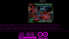
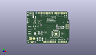
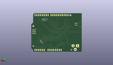
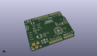

Contents
========

* [PROJ-ARDU-LEO-STAN-01>](#proj-ardu-leo-stan-01)
	* [Images](#images)
	* [Interactive BOM](#interactive-bom)
	* [OOMP Parts](#oomp-parts)
	* [Tags](#tags)
  
![][im]
# PROJ-ARDU-LEO-STAN-01>

- ID: PROJ-ARDU-LEO-STAN-01
- Hex ID: PRARSTAN
- Name: 
- Description: 

## Images
  
  

|eagleImage|kicadPcb3dFront|kicadPcb3dBack|kicadPcb3d|
| :---: | :---: | :---: | :---: |
|||||

## Interactive BOM

- Interactive BOM page: [ibom.html](kicad/bom/ibom.html)

## OOMP Parts
  

|OOMP Parts|
| :---: |
|CAPE-0603-X-NF100-01, C1, 39.235, 10.425, 180,C1, 100n, C0603-ROUND, SmartPrj, (39.235, 10.425), R180|
|CAPE-0603-X-NF100-01, C2, 53.34, 26.67, 90,C2, 100n, C0603-ROUND, SmartPrj, (53.34, 26.67), R90|
|CAPE-0603-X-PF22-01, C3, 51.435, 26.67, 90,C3, 22p, C0603-ROUND, SmartPrj, (51.435, 26.67), R90|
|CAPE-0603-X-PF22-01, C4, 48.26, 31.75, 0,C4, 22p, C0603-ROUND, SmartPrj, (48.26, 31.75), R0|
|CAPE-0603-X-UNMATCHED-01, C5, 57.15, 26.67, 270,C5, 1uF, C0603-ROUND, SmartPrj, (57.15, 26.67), R270|
|CAPE-0603-X-NF100-01, C6, 55.075, 10.45, 0,C6, 100n, C0603-ROUND, SmartPrj, (55.075, 10.45), R0|
|CAPE-0603-X-UNMATCHED-01, C7, 57.15, 16.51, 0,C7, 1uF, C0603-ROUND, SmartPrj, (57.15, 16.51), R0|
|CAPE-UNMATCHED-X-UF10-01, C8, 12.7, 28.575, 180,C8, 10u, SMC_B, rcl, (12.7, 28.575), R180|
|CAPE-0603-X-NF100-01, C9, 57.15, 18.034, 180,C9, 100n, C0603-ROUND, SmartPrj, (57.15, 18.034), R180|
|CAPE-UNMATCHED-X-UF10-01, C10, 17.78, 7.62, 270,C10, 10u, SMC_B, rcl, (17.78, 7.62), R270|
|CAPE-0603-X-UNMATCHED-01, C11, 24.765, 19.685, 180,C11, 1uF, C0603-ROUND, SmartPrj, (24.765, 19.685), R180|
|CAPE-UNMATCHED-X-UF10-01, C12, 25.4, 7.62, 270,C12, 10u, SMC_B, rcl, (25.4, 7.62), R270|
|CAPE-0603-X-NF100-01, C13, 22.86, 30.48, 0,C13, 100n, C0603-ROUND, SmartPrj, (22.86, 30.48), R0|
|CAPE-0603-X-UNMATCHED-01, C14, 24.765, 14.605, 0,C14, 1uF, C0603-ROUND, SmartPrj, (24.765, 14.605), R0|
|CAPE-0603-X-NF100-01, C22, 22.86, 38.354, 180,C22, 100n, C0603-ROUND, SmartPrj, (22.86, 38.354), R180|
|UNMATCHED-UNMATCHED-X-UNMATCHED-01, D+, 6.5, 39.37, 0,D+, DNP, TP-1.00MM, Arduino-utility, (6.5, 39.37), R0|
|UNMATCHED-UNMATCHED-X-UNMATCHED-01, D-, 8.509, 39.37, 0,D-, DNP, TP-1.00MM, Arduino-utility, (8.509, 39.37), R0|
|UNMATCHED-UNMATCHED-X-UNMATCHED-01, D1, 21.59, 7.62, 270,D1, M7, SMB, diode, (21.59, 7.62), R270|
|UNMATCHED-UNMATCHED-X-UNMATCHED-01, D2, 58.928, 26.67, 270,D2, CD1206-S01575, MINIMELF, diode, (58.928, 26.67), R270|
|UNMATCHED-UNMATCHED-X-UNMATCHED-01, EXTPOWER, 5.334, 8.382, 90,EXTPOWER, POWERSUPPLY_DC21MMX, POWERSUPPLY_DC-21MM, SmartPrj, (5.334, 8.382), R90|
|ERROR, F1 MF-MSMF050-2 500mA, 0, 0, 0,F1, MF-MSMF050-2, 500mA, L1812, rcl, (12.7, 43.815), R180|
|UNMATCHED-UNMATCHED-X-UNMATCHED-01, GND, 6.5, 36.83, 0,GND, DNP, TP-1.00MM, Arduino-utility, (6.5, 36.83), R0|
|UNMATCHED-UNMATCHED-X-UNMATCHED-01, IC1, 16.51, 17.145, 90,IC1, NCP1117ST50T3G, SOT223, linear, (16.51, 17.145), R90|
|UNMATCHED-UNMATCHED-X-UNMATCHED-01, IC2, 20.955, 34.29, 0,IC2, LMV358IDGKR, MSOP08, linear, (20.955, 34.29), R0|
|UNMATCHED-UNMATCHED-X-UNMATCHED-01, ICSP, 64.897, 27.94, 270,ICSP, ICSP, 2X03, SmartPrj, (64.897, 27.94), R270|
|ERROR, J1 USB Micro, 0, 0, 0,J1, USB, Micro, CON2_USB_MICRO_B_AT, Arduino-connectors, (1.4478, 38.1), R270|
|UNMATCHED-UNMATCHED-X-UNMATCHED-01, J2, 54.61, 50.8, 180,J2, 8x1F-H8.5, 1X08, SmartPrj, (54.61, 50.8), R180|
|UNMATCHED-UNMATCHED-X-UNMATCHED-01, J3, 36.83, 2.54, 0,J3, 8x1F-H8.5, 1X08, SmartPrj, (36.83, 2.54), R0|
|UNMATCHED-UNMATCHED-X-UNMATCHED-01, J4, 57.15, 2.54, 0,J4, 6x1F-H8.5, 1X06, SmartPrj, (57.15, 2.54), R0|
|UNMATCHED-UNMATCHED-X-UNMATCHED-01, JP1, 30.226, 50.8, 180,JP1, 10x1F-H8.5, 1X10, SmartPrj, (30.226, 50.8), R180|
|UNMATCHED-0805-X-UNMATCHED-01, L, 4.445, 20.32, 90,L, Yellow, CHIPLED_0805, led, (4.445, 20.32), R90|
|UNMATCHED-0805-X-UNMATCHED-01, L1, 55.245, 26.67, 270,L1, MH2029-300Y, 0805, wuerth-elektronik, (55.245, 26.67), R270|
|UNMATCHED-0805-X-UNMATCHED-01, L2, 12.7, 32.385, 0,L2, MH2029-300Y, 0805, wuerth-elektronik, (12.7, 32.385), R0|
|UNMATCHED-0805-X-UNMATCHED-01, ON, 4.445, 16.51, 90,ON, Green, CHIPLED_0805, led, (4.445, 16.51), R90|
|RESE-0603-X-UNMATCHED-01, R1, 48.26, 25.4, 0,R1, 1M, R0603-ROUND, SmartPrj, (48.26, 25.4), R0|
|RESE-0402-X-UNMATCHED-01, R2, 55.88, 14.3256, M90,R2, NM, R0402, SmartPrj, (55.88, 14.3256), MR90|
|RESE-0402-X-UNMATCHED-01, R3, 55.88, 14.9606, M90,R3, NM, R0402, SmartPrj, (55.88, 14.9606), MR90|
|<table><tr><td></td><td> R4</td><td>[RESE-0603-X-O103-01 SMD (0603) 10k Ohm Resistor](https://github.com/oomlout/oomlout_OOMP_parts/tree/main/RESE-0603-X-O103-01/)</td><td>[R6103](https://github.com/oomlout/oomlout_OOMP_parts/tree/main/RESE-0603-X-O103-01/)</td></tr></table>|
|UNMATCHED-UNMATCHED-X-UNMATCHED-01, RESET, 6.35, 49.403, 180,RESET, TS42, TS42, SmartPrj, (6.35, 49.403), R180|
|UNMATCHED-UNMATCHED-X-UNMATCHED-01, RN1, 30.48, 18.415, 270,RN1, 10K, CAY16, resistor-dil, (30.48, 18.415), R270|
|UNMATCHED-UNMATCHED-X-UNMATCHED-01, RN2, 12.7, 24.765, 90,RN2, 1K, CAY16, resistor-dil, (12.7, 24.765), R90|
|UNMATCHED-UNMATCHED-X-UNMATCHED-01, RN3, 12.7, 37.465, 90,RN3, 22R, CAY16, resistor-dil, (12.7, 37.465), R90|
|UNMATCHED-0805-X-UNMATCHED-01, RX, 4.445, 27.94, 90,RX, Yellow, CHIPLED_0805, led, (4.445, 27.94), R90|
|UNMATCHED-UNMATCHED-X-UNMATCHED-01, T1, 17.78, 28.575, 270,T1, FDN340P, SOT-23, zetex, (17.78, 28.575), R270|
|UNMATCHED-0805-X-UNMATCHED-01, TX, 4.445, 24.13, 90,TX, Yellow, CHIPLED_0805, led, (4.445, 24.13), R90|
|UNMATCHED-UNMATCHED-X-UNMATCHED-01, U1, 46.99, 16.51, 180,U1, ATMEGA32U4-XUMU, QFN44ML7X7, SmartPrj, (46.99, 16.51), R180|
|UNMATCHED-UNMATCHED-X-UNMATCHED-01, U2, 46.99, 16.51, 180,U2, ATMEGA32U4-XUAU, TQFP44-PAD, SmartPrj, (46.99, 16.51), R180|
|UNMATCHED-UNMATCHED-X-UNMATCHED-01, U3, 24.765, 17.145, 270,U3, LP2985-33DBVR, SOT23-DBV, SmartPrj, (24.765, 17.145), R270|
|UNMATCHED-UNMATCHED-X-UNMATCHED-01, VUSB, 8.509, 36.83, 0,VUSB, DNP, TP-1.00MM, Arduino-utility, (8.509, 36.83), R0|
|ERROR, Y1 16MHz KX-7, 0, 0, 0,Y1, 16MHz, KX-7, CRYSTAL-3.2-2.5, SmartPrj, (48.895, 28.575), R270|
|UNMATCHED-UNMATCHED-X-UNMATCHED-01, Z1, 12.7, 34.29, 0,Z1, CG0603MLC-05E, CT/CN0603, varistor, (12.7, 34.29), R0|
|UNMATCHED-UNMATCHED-X-UNMATCHED-01, Z2, 12.7, 40.64, 0,Z2, CG0603MLC-05E, CT/CN0603, varistor, (12.7, 40.64), R0|

## Tags

- hexID: PRARSTAN
- oompType: PROJ
- oompSize: ARDU
- oompColor: LEO
- oompDesc: STAN
- oompIndex: 01
- sources: All source files from https://store.arduino.cc/collections/boards/products/arduino-leonardo-with-headers
- linkBuyPage: https://store.arduino.cc/collections/boards/products/arduino-leonardo-with-headers
- oompPart: CAPE-0603-X-NF100-01, C1, 39.235, 10.425, 180
- oompPart: CAPE-0603-X-NF100-01, C2, 53.34, 26.67, 90
- oompPart: CAPE-0603-X-PF22-01, C3, 51.435, 26.67, 90
- oompPart: CAPE-0603-X-PF22-01, C4, 48.26, 31.75, 0
- oompPart: CAPE-0603-X-UNMATCHED-01, C5, 57.15, 26.67, 270
- oompPart: CAPE-0603-X-NF100-01, C6, 55.075, 10.45, 0
- oompPart: CAPE-0603-X-UNMATCHED-01, C7, 57.15, 16.51, 0
- oompPart: CAPE-UNMATCHED-X-UF10-01, C8, 12.7, 28.575, 180
- oompPart: CAPE-0603-X-NF100-01, C9, 57.15, 18.034, 180
- oompPart: CAPE-UNMATCHED-X-UF10-01, C10, 17.78, 7.62, 270
- oompPart: CAPE-0603-X-UNMATCHED-01, C11, 24.765, 19.685, 180
- oompPart: CAPE-UNMATCHED-X-UF10-01, C12, 25.4, 7.62, 270
- oompPart: CAPE-0603-X-NF100-01, C13, 22.86, 30.48, 0
- oompPart: CAPE-0603-X-UNMATCHED-01, C14, 24.765, 14.605, 0
- oompPart: CAPE-0603-X-NF100-01, C22, 22.86, 38.354, 180
- oompPart: UNMATCHED-UNMATCHED-X-UNMATCHED-01, D+, 6.5, 39.37, 0
- oompPart: UNMATCHED-UNMATCHED-X-UNMATCHED-01, D-, 8.509, 39.37, 0
- oompPart: UNMATCHED-UNMATCHED-X-UNMATCHED-01, D1, 21.59, 7.62, 270
- oompPart: UNMATCHED-UNMATCHED-X-UNMATCHED-01, D2, 58.928, 26.67, 270
- oompPart: UNMATCHED-UNMATCHED-X-UNMATCHED-01, EXTPOWER, 5.334, 8.382, 90
- oompPart: ERROR, F1 MF-MSMF050-2 500mA, 0, 0, 0
- oompPart: SKIP-UNMATCHED-X-UNMATCHED-01, FID1, 6.35, 49.403, 0
- oompPart: SKIP-UNMATCHED-X-UNMATCHED-01, FID2, 59.69, 34.925, 0
- oompPart: SKIP-UNMATCHED-X-UNMATCHED-01, FID3, 2.505, 4.88, 0
- oompPart: UNMATCHED-UNMATCHED-X-UNMATCHED-01, GND, 6.5, 36.83, 0
- oompPart: UNMATCHED-UNMATCHED-X-UNMATCHED-01, IC1, 16.51, 17.145, 90
- oompPart: UNMATCHED-UNMATCHED-X-UNMATCHED-01, IC2, 20.955, 34.29, 0
- oompPart: UNMATCHED-UNMATCHED-X-UNMATCHED-01, ICSP, 64.897, 27.94, 270
- oompPart: ERROR, J1 USB Micro, 0, 0, 0
- oompPart: UNMATCHED-UNMATCHED-X-UNMATCHED-01, J2, 54.61, 50.8, 180
- oompPart: UNMATCHED-UNMATCHED-X-UNMATCHED-01, J3, 36.83, 2.54, 0
- oompPart: UNMATCHED-UNMATCHED-X-UNMATCHED-01, J4, 57.15, 2.54, 0
- oompPart: UNMATCHED-UNMATCHED-X-UNMATCHED-01, JP1, 30.226, 50.8, 180
- oompPart: UNMATCHED-0805-X-UNMATCHED-01, L, 4.445, 20.32, 90
- oompPart: UNMATCHED-0805-X-UNMATCHED-01, L1, 55.245, 26.67, 270
- oompPart: UNMATCHED-0805-X-UNMATCHED-01, L2, 12.7, 32.385, 0
- oompPart: UNMATCHED-0805-X-UNMATCHED-01, ON, 4.445, 16.51, 90
- oompPart: RESE-0603-X-UNMATCHED-01, R1, 48.26, 25.4, 0
- oompPart: RESE-0402-X-UNMATCHED-01, R2, 55.88, 14.3256, M90
- oompPart: RESE-0402-X-UNMATCHED-01, R3, 55.88, 14.9606, M90
- oompPart: RESE-0603-X-O103-01, R4, 19.05, 38.354, 180
- oompPart: UNMATCHED-UNMATCHED-X-UNMATCHED-01, RESET, 6.35, 49.403, 180
- oompPart: UNMATCHED-UNMATCHED-X-UNMATCHED-01, RN1, 30.48, 18.415, 270
- oompPart: UNMATCHED-UNMATCHED-X-UNMATCHED-01, RN2, 12.7, 24.765, 90
- oompPart: UNMATCHED-UNMATCHED-X-UNMATCHED-01, RN3, 12.7, 37.465, 90
- oompPart: UNMATCHED-0805-X-UNMATCHED-01, RX, 4.445, 27.94, 90
- oompPart: UNMATCHED-UNMATCHED-X-UNMATCHED-01, T1, 17.78, 28.575, 270
- oompPart: UNMATCHED-0805-X-UNMATCHED-01, TX, 4.445, 24.13, 90
- oompPart: UNMATCHED-UNMATCHED-X-UNMATCHED-01, U1, 46.99, 16.51, 180
- oompPart: UNMATCHED-UNMATCHED-X-UNMATCHED-01, U2, 46.99, 16.51, 180
- oompPart: UNMATCHED-UNMATCHED-X-UNMATCHED-01, U3, 24.765, 17.145, 270
- oompPart: UNMATCHED-UNMATCHED-X-UNMATCHED-01, VUSB, 8.509, 36.83, 0
- oompPart: ERROR, Y1 16MHz KX-7, 0, 0, 0
- oompPart: UNMATCHED-UNMATCHED-X-UNMATCHED-01, Z1, 12.7, 34.29, 0
- oompPart: UNMATCHED-UNMATCHED-X-UNMATCHED-01, Z2, 12.7, 40.64, 0
- rawPart: C1, 100n, C0603-ROUND, SmartPrj, (39.235, 10.425), R180
- rawPart: C2, 100n, C0603-ROUND, SmartPrj, (53.34, 26.67), R90
- rawPart: C3, 22p, C0603-ROUND, SmartPrj, (51.435, 26.67), R90
- rawPart: C4, 22p, C0603-ROUND, SmartPrj, (48.26, 31.75), R0
- rawPart: C5, 1uF, C0603-ROUND, SmartPrj, (57.15, 26.67), R270
- rawPart: C6, 100n, C0603-ROUND, SmartPrj, (55.075, 10.45), R0
- rawPart: C7, 1uF, C0603-ROUND, SmartPrj, (57.15, 16.51), R0
- rawPart: C8, 10u, SMC_B, rcl, (12.7, 28.575), R180
- rawPart: C9, 100n, C0603-ROUND, SmartPrj, (57.15, 18.034), R180
- rawPart: C10, 10u, SMC_B, rcl, (17.78, 7.62), R270
- rawPart: C11, 1uF, C0603-ROUND, SmartPrj, (24.765, 19.685), R180
- rawPart: C12, 10u, SMC_B, rcl, (25.4, 7.62), R270
- rawPart: C13, 100n, C0603-ROUND, SmartPrj, (22.86, 30.48), R0
- rawPart: C14, 1uF, C0603-ROUND, SmartPrj, (24.765, 14.605), R0
- rawPart: C22, 100n, C0603-ROUND, SmartPrj, (22.86, 38.354), R180
- rawPart: D+, DNP, TP-1.00MM, Arduino-utility, (6.5, 39.37), R0
- rawPart: D-, DNP, TP-1.00MM, Arduino-utility, (8.509, 39.37), R0
- rawPart: D1, M7, SMB, diode, (21.59, 7.62), R270
- rawPart: D2, CD1206-S01575, MINIMELF, diode, (58.928, 26.67), R270
- rawPart: EXTPOWER, POWERSUPPLY_DC21MMX, POWERSUPPLY_DC-21MM, SmartPrj, (5.334, 8.382), R90
- rawPart: F1, MF-MSMF050-2, 500mA, L1812, rcl, (12.7, 43.815), R180
- rawPart: FID1, DNP, FD-1-1.5, Arduino-utility, (6.35, 49.403), R0
- rawPart: FID2, DNP, FD-1-1.5, Arduino-utility, (59.69, 34.925), R0
- rawPart: FID3, DNP, FD-1-1.5, Arduino-utility, (2.505, 4.88), R0
- rawPart: GND, DNP, TP-1.00MM, Arduino-utility, (6.5, 36.83), R0
- rawPart: IC1, NCP1117ST50T3G, SOT223, linear, (16.51, 17.145), R90
- rawPart: IC2, LMV358IDGKR, MSOP08, linear, (20.955, 34.29), R0
- rawPart: ICSP, ICSP, 2X03, SmartPrj, (64.897, 27.94), R270
- rawPart: J1, USB, Micro, CON2_USB_MICRO_B_AT, Arduino-connectors, (1.4478, 38.1), R270
- rawPart: J2, 8x1F-H8.5, 1X08, SmartPrj, (54.61, 50.8), R180
- rawPart: J3, 8x1F-H8.5, 1X08, SmartPrj, (36.83, 2.54), R0
- rawPart: J4, 6x1F-H8.5, 1X06, SmartPrj, (57.15, 2.54), R0
- rawPart: JP1, 10x1F-H8.5, 1X10, SmartPrj, (30.226, 50.8), R180
- rawPart: L, Yellow, CHIPLED_0805, led, (4.445, 20.32), R90
- rawPart: L1, MH2029-300Y, 0805, wuerth-elektronik, (55.245, 26.67), R270
- rawPart: L2, MH2029-300Y, 0805, wuerth-elektronik, (12.7, 32.385), R0
- rawPart: ON, Green, CHIPLED_0805, led, (4.445, 16.51), R90
- rawPart: R1, 1M, R0603-ROUND, SmartPrj, (48.26, 25.4), R0
- rawPart: R2, NM, R0402, SmartPrj, (55.88, 14.3256), MR90
- rawPart: R3, NM, R0402, SmartPrj, (55.88, 14.9606), MR90
- rawPart: R4, 10K, R0603-ROUND, SmartPrj, (19.05, 38.354), R180
- rawPart: RESET, TS42, TS42, SmartPrj, (6.35, 49.403), R180
- rawPart: RN1, 10K, CAY16, resistor-dil, (30.48, 18.415), R270
- rawPart: RN2, 1K, CAY16, resistor-dil, (12.7, 24.765), R90
- rawPart: RN3, 22R, CAY16, resistor-dil, (12.7, 37.465), R90
- rawPart: RX, Yellow, CHIPLED_0805, led, (4.445, 27.94), R90
- rawPart: T1, FDN340P, SOT-23, zetex, (17.78, 28.575), R270
- rawPart: TX, Yellow, CHIPLED_0805, led, (4.445, 24.13), R90
- rawPart: U1, ATMEGA32U4-XUMU, QFN44ML7X7, SmartPrj, (46.99, 16.51), R180
- rawPart: U2, ATMEGA32U4-XUAU, TQFP44-PAD, SmartPrj, (46.99, 16.51), R180
- rawPart: U3, LP2985-33DBVR, SOT23-DBV, SmartPrj, (24.765, 17.145), R270
- rawPart: VUSB, DNP, TP-1.00MM, Arduino-utility, (8.509, 36.83), R0
- rawPart: Y1, 16MHz, KX-7, CRYSTAL-3.2-2.5, SmartPrj, (48.895, 28.575), R270
- rawPart: Z1, CG0603MLC-05E, CT/CN0603, varistor, (12.7, 34.29), R0
- rawPart: Z2, CG0603MLC-05E, CT/CN0603, varistor, (12.7, 40.64), R0

[im]: kicadPcb3d_450.png
