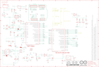

Contents
========

* [PRARSTAN > Arduino Leonardo](#prarstan--arduino-leonardo)
	* [Images](#images)
	* [Tags](#tags)
  
![][im]
# PRARSTAN > Arduino Leonardo

- ID: PROJ-ARDU-LEO-STAN-01
- Hex ID: PRARSTAN
- Name: Arduino Leonardo
- Description: Arduino Leonardo

## Images
  
  

|kicadPcb3d|kicadPcb3dFront|kicadPcb3dBack|eagleImage|eagleSchemImage|
| :---: | :---: | :---: | :---: | :---: |
||||||

## Tags

- hexID: PRARSTAN
- oompType: PROJ
- oompSize: ARDU
- oompColor: LEO
- oompDesc: STAN
- oompIndex: 01
- sources: All source files from https://store.arduino.cc/collections/boards/products/arduino-leonardo-with-headers
- linkBuyPage: https://store.arduino.cc/collections/boards/products/arduino-leonardo-with-headers
- oompID: PROJ-ARDU-LEO-STAN-01
- oompParts: C1,UNMATCHED-UNMATCHED-UNMATCHED-UNMATCHED-UNMATCHED
- oompParts: C2,UNMATCHED-UNMATCHED-UNMATCHED-UNMATCHED-UNMATCHED
- oompParts: C3,UNMATCHED-UNMATCHED-UNMATCHED-UNMATCHED-UNMATCHED
- oompParts: C4,UNMATCHED-UNMATCHED-UNMATCHED-UNMATCHED-UNMATCHED
- oompParts: C5,UNMATCHED-UNMATCHED-UNMATCHED-UNMATCHED-UNMATCHED
- oompParts: C6,UNMATCHED-UNMATCHED-UNMATCHED-UNMATCHED-UNMATCHED
- oompParts: C7,UNMATCHED-UNMATCHED-UNMATCHED-UNMATCHED-UNMATCHED
- oompParts: C8,UNMATCHED-UNMATCHED-UNMATCHED-UNMATCHED-UNMATCHED
- oompParts: C9,UNMATCHED-UNMATCHED-UNMATCHED-UNMATCHED-UNMATCHED
- oompParts: C10,UNMATCHED-UNMATCHED-UNMATCHED-UNMATCHED-UNMATCHED
- oompParts: C11,UNMATCHED-UNMATCHED-UNMATCHED-UNMATCHED-UNMATCHED
- oompParts: C12,UNMATCHED-UNMATCHED-UNMATCHED-UNMATCHED-UNMATCHED
- oompParts: C13,UNMATCHED-UNMATCHED-UNMATCHED-UNMATCHED-UNMATCHED
- oompParts: C14,UNMATCHED-UNMATCHED-UNMATCHED-UNMATCHED-UNMATCHED
- oompParts: C22,UNMATCHED-UNMATCHED-UNMATCHED-UNMATCHED-UNMATCHED
- oompParts: D+,UNMATCHED-UNMATCHED-UNMATCHED-UNMATCHED-UNMATCHED
- oompParts: D-,UNMATCHED-UNMATCHED-UNMATCHED-UNMATCHED-UNMATCHED
- oompParts: D1,UNMATCHED-UNMATCHED-UNMATCHED-UNMATCHED-UNMATCHED
- oompParts: D2,UNMATCHED-UNMATCHED-UNMATCHED-UNMATCHED-UNMATCHED
- oompParts: EXTPOWER,UNMATCHED-UNMATCHED-UNMATCHED-UNMATCHED-UNMATCHED
- oompParts: F1,UNMATCHED-UNMATCHED-UNMATCHED-UNMATCHED-UNMATCHED
- oompParts: FID1,UNMATCHED-UNMATCHED-UNMATCHED-UNMATCHED-UNMATCHED
- oompParts: FID2,UNMATCHED-UNMATCHED-UNMATCHED-UNMATCHED-UNMATCHED
- oompParts: FID3,UNMATCHED-UNMATCHED-UNMATCHED-UNMATCHED-UNMATCHED
- oompParts: FRAME1,UNMATCHED-UNMATCHED-UNMATCHED-UNMATCHED-UNMATCHED
- oompParts: GND,UNMATCHED-UNMATCHED-UNMATCHED-UNMATCHED-UNMATCHED
- oompParts: IC1,UNMATCHED-UNMATCHED-UNMATCHED-UNMATCHED-UNMATCHED
- oompParts: IC2,UNMATCHED-UNMATCHED-UNMATCHED-UNMATCHED-UNMATCHED
- oompParts: ICSP,UNMATCHED-UNMATCHED-UNMATCHED-UNMATCHED-UNMATCHED
- oompParts: J1,UNMATCHED-UNMATCHED-UNMATCHED-UNMATCHED-UNMATCHED
- oompParts: J2,UNMATCHED-UNMATCHED-UNMATCHED-UNMATCHED-UNMATCHED
- oompParts: J3,UNMATCHED-UNMATCHED-UNMATCHED-UNMATCHED-UNMATCHED
- oompParts: J4,UNMATCHED-UNMATCHED-UNMATCHED-UNMATCHED-UNMATCHED
- oompParts: JP1,UNMATCHED-UNMATCHED-UNMATCHED-UNMATCHED-UNMATCHED
- oompParts: L,UNMATCHED-UNMATCHED-UNMATCHED-UNMATCHED-UNMATCHED
- oompParts: L1,UNMATCHED-UNMATCHED-UNMATCHED-UNMATCHED-UNMATCHED
- oompParts: L2,UNMATCHED-UNMATCHED-UNMATCHED-UNMATCHED-UNMATCHED
- oompParts: ON,UNMATCHED-UNMATCHED-UNMATCHED-UNMATCHED-UNMATCHED
- oompParts: R1,UNMATCHED-UNMATCHED-UNMATCHED-UNMATCHED-UNMATCHED
- oompParts: R2,UNMATCHED-UNMATCHED-UNMATCHED-UNMATCHED-UNMATCHED
- oompParts: R3,UNMATCHED-UNMATCHED-UNMATCHED-UNMATCHED-UNMATCHED
- oompParts: R4,UNMATCHED-UNMATCHED-UNMATCHED-UNMATCHED-UNMATCHED
- oompParts: RESET,UNMATCHED-UNMATCHED-UNMATCHED-UNMATCHED-UNMATCHED
- oompParts: RN1,UNMATCHED-UNMATCHED-UNMATCHED-UNMATCHED-UNMATCHED
- oompParts: RN2,UNMATCHED-UNMATCHED-UNMATCHED-UNMATCHED-UNMATCHED
- oompParts: RN3,UNMATCHED-UNMATCHED-UNMATCHED-UNMATCHED-UNMATCHED
- oompParts: RX,UNMATCHED-UNMATCHED-UNMATCHED-UNMATCHED-UNMATCHED
- oompParts: T1,UNMATCHED-UNMATCHED-UNMATCHED-UNMATCHED-UNMATCHED
- oompParts: TX,UNMATCHED-UNMATCHED-UNMATCHED-UNMATCHED-UNMATCHED
- oompParts: U1,UNMATCHED-UNMATCHED-UNMATCHED-UNMATCHED-UNMATCHED
- oompParts: U2,UNMATCHED-UNMATCHED-UNMATCHED-UNMATCHED-UNMATCHED
- oompParts: U3,UNMATCHED-UNMATCHED-UNMATCHED-UNMATCHED-UNMATCHED
- oompParts: VUSB,UNMATCHED-UNMATCHED-UNMATCHED-UNMATCHED-UNMATCHED
- oompParts: Y1,UNMATCHED-UNMATCHED-UNMATCHED-UNMATCHED-UNMATCHED
- oompParts: Z1,UNMATCHED-UNMATCHED-UNMATCHED-UNMATCHED-UNMATCHED
- oompParts: Z2,UNMATCHED-UNMATCHED-UNMATCHED-UNMATCHED-UNMATCHED
- rawParts: C1,100n,C-EUC0603,C0603-ROUND,CAPACITOR, European symbol,,,,,,,,,
- rawParts: C2,100n,C-EUC0603,C0603-ROUND,CAPACITOR, European symbol,,,,,,,,,
- rawParts: C3,22p,C-EUC0603,C0603-ROUND,CAPACITOR, European symbol,,,,,,,,,
- rawParts: C4,22p,C-EUC0603,C0603-ROUND,CAPACITOR, European symbol,,,,,,,,,
- rawParts: C5,1uF,C-EUC0603,C0603-ROUND,CAPACITOR, European symbol,,,,,,,,,
- rawParts: C6,100n,C-EUC0603,C0603-ROUND,CAPACITOR, European symbol,,,,,,,,,
- rawParts: C7,1uF,C-EUC0603,C0603-ROUND,CAPACITOR, European symbol,,,,,,,,,
- rawParts: C8,10u,CPOL-EUSMCB,SMC_B,POLARIZED CAPACITOR, European symbol,,,,,,,,,
- rawParts: C9,100n,C-EUC0603,C0603-ROUND,CAPACITOR, European symbol,,,,,,,,,
- rawParts: C10,10u,CPOL-EUSMCB,SMC_B,POLARIZED CAPACITOR, European symbol,,,,,,,,,
- rawParts: C11,1uF,C-EUC0603,C0603-ROUND,CAPACITOR, European symbol,,,,,,,,,
- rawParts: C12,10u,CPOL-EUSMCB,SMC_B,POLARIZED CAPACITOR, European symbol,,,,,,,,,
- rawParts: C13,100n,C-EUC0603,C0603-ROUND,CAPACITOR, European symbol,,,,,,,,,
- rawParts: C14,1uF,C-EUC0603,C0603-ROUND,CAPACITOR, European symbol,,,,,,,,,
- rawParts: C22,100n,C-EUC0603,C0603-ROUND,CAPACITOR, European symbol,,,,,,,,,
- rawParts: D+,DNP,TPTP-1.00MM,TP-1.00MM,Testpoint,,DNP,DNP,DNP,DNP,DNP,,DNP,
- rawParts: D-,DNP,TPTP-1.00MM,TP-1.00MM,Testpoint,,DNP,DNP,DNP,DNP,DNP,,DNP,
- rawParts: D1,M7,DIODE-SMB,SMB,DIODE,,,,,,,,,
- rawParts: D2,CD1206-S01575,DIODE-MINIMELF,MINIMELF,DIODE,,,,,,,,,
- rawParts: EXTPOWER,POWERSUPPLY_DC21MMX,POWERSUPPLY_DC21MMX,POWERSUPPLY_DC-21MM,,,,,,,,,,
- rawParts: F1,MF-MSMF050-2 500mA,L-EUL1812,L1812,INDUCTOR, European symbol,,,,,,,,,
- rawParts: FID1,DNP,FIDUCIAL-1.5MM,FD-1-1.5,Fiducial mount,,DNP,DNP,DNP,DNP,DNP,,DNP,
- rawParts: FID2,DNP,FIDUCIAL-1.5MM,FD-1-1.5,Fiducial mount,,DNP,DNP,DNP,DNP,DNP,,DNP,
- rawParts: FID3,DNP,FIDUCIAL-1.5MM,FD-1-1.5,Fiducial mount,,DNP,DNP,DNP,DNP,DNP,,DNP,
- rawParts: FRAME1,DNP,A3-FRAME,FRAME,,DNP,DNP,DNP,DNP,DNP,DNP,DNP,DNP,
- rawParts: GND,DNP,TPTP-1.00MM,TP-1.00MM,Testpoint,,DNP,DNP,DNP,DNP,DNP,,DNP,
- rawParts: IC1,NCP1117ST50T3G,MC33269ST-3.3T3,SOT223,Adjustable Output Low Dropout Voltage Regulator 800 mA,,,,,,,,,
- rawParts: IC2,LMV358IDGKR,LMV358MMX,MSOP08,Dual General Purpose, Low Voltage, Rail-to-Rail Output Operational Amplifiers,,,,,,,,,
- rawParts: ICSP,ICSP,PINHD-2X3,2X03,PIN HEADER,,,,,,,,,
- rawParts: J1,USB Micro,USB-MICRO-LEGACY,CON2_USB_MICRO_B_AT,,,http://media.digikey.com/pdf/Data%20Sheets/FCI%20PDFs/10118193-0001LF_Webpage.PDF,http://www.digikey.it/product-detail/en/10118193-0001LF/609-4616-2-ND/2785388,609-4616-2-ND,FCI,10118193-0001LF,,USB Micro,
- rawParts: J2,8x1F-H8.5,PINHD-1X8,1X08,PIN HEADER,,,,,,,,,
- rawParts: J3,8x1F-H8.5,PINHD-1X8,1X08,PIN HEADER,,,,,,,,,
- rawParts: J4,6x1F-H8.5,PINHD-1X6,1X06,PIN HEADER,,,,,,,,,
- rawParts: JP1,10x1F-H8.5,PINHD-1X10,1X10,PIN HEADER,,,,,,,,,
- rawParts: L,Yellow,LEDCHIPLED_0805,CHIPLED_0805,LED,,,,,,,,,
- rawParts: L1,MH2029-300Y,WE-CBF_0805,0805,SMD EMI Suppression Ferrite Beads,,,,,,,,,
- rawParts: L2,MH2029-300Y,WE-CBF_0805,0805,SMD EMI Suppression Ferrite Beads,,,,,,,,,
- rawParts: ON,Green,LEDCHIPLED_0805,CHIPLED_0805,LED,,,,,,,,,
- rawParts: R1,1M,R-EU_R0603,R0603-ROUND,RESISTOR, European symbol,,,,,,,,,
- rawParts: R2,NM,R-EU_R0402,R0402,RESISTOR, European symbol,,,,,,,,,
- rawParts: R3,NM,R-EU_R0402,R0402,RESISTOR, European symbol,,,,,,,,,
- rawParts: R4,10K,R-EU_R0603,R0603-ROUND,RESISTOR, European symbol,,,,,,,,,
- rawParts: RESET,TS42,TS42,TS42,TS42,,,,,,,,,
- rawParts: RN1,10K,4R-NCAY16,CAY16,Array Chip Resistor,,,,,,,,,
- rawParts: RN2,1K,4R-NCAY16,CAY16,Array Chip Resistor,,,,,,,,,
- rawParts: RN3,22R,4R-NCAY16,CAY16,Array Chip Resistor,,,,,,,,,
- rawParts: RX,Yellow,LEDCHIPLED_0805,CHIPLED_0805,LED,,,,,,,,,
- rawParts: T1,FDN340P,PMOSSOT23,SOT-23,MOS FET,,,,,,,,,
- rawParts: TX,Yellow,LEDCHIPLED_0805,CHIPLED_0805,LED,,,,,,,,,
- rawParts: U1,ATMEGA32U4-XUMU,ATMEGA32U4-XUMU,QFN44ML7X7,,,,,,,,,,
- rawParts: U2,ATMEGA32U4-XUAU,ATMEGA32U4-XUAU,TQFP44-PAD,,,,,,,,,,
- rawParts: U3,LP2985-33DBVR,LP2985-XXDBVR33,SOT23-DBV,ULTRALOW-POWER 50-mA LOW-DROPOUT LINEAR REGULATORS,,,,,,,,,
- rawParts: VUSB,DNP,TPTP-1.00MM,TP-1.00MM,Testpoint,,DNP,DNP,DNP,DNP,DNP,,DNP,
- rawParts: Y1,16MHz KX-7,CRYSTAL-3.2-2.5,CRYSTAL-3.2-2.5,,,,,,,,,,
- rawParts: Z1,CG0603MLC-05E,VARISTORCN0603,CT/CN0603,VARISTOR,,,,,,,,,
- rawParts: Z2,CG0603MLC-05E,VARISTORCN0603,CT/CN0603,VARISTOR,,,,,,,,,

[im]: kicadPcb3d_450.png
