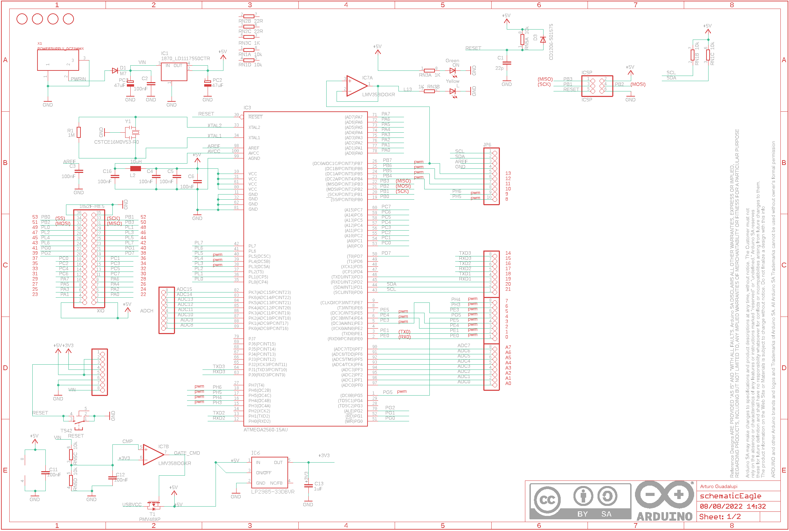
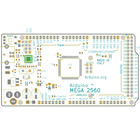
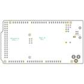
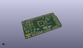
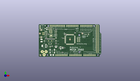
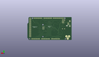
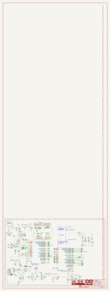
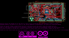
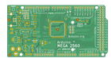
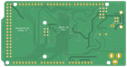

Contents
========

* [PRAR2560 > ](#prar2560--)
	* [Schematic](#schematic)
	* [PCB](#pcb)
	* [Interactive BOM](#interactive-bom)
	* [OOMP Parts](#oomp-parts)
	* [Images](#images)
	* [Tags](#tags)
  
![][im]
# PRAR2560 > 

- ID: PROJ-ARDU-MEGA-2560-01
- Hex ID: PRAR2560
- Name: Arduino 2560 Mega
- Description: Arduino 2560 Mega
- Long Link: [http://oom.lt/PROJ-ARDU-MEGA-2560-01](http://oom.lt/PROJ-ARDU-MEGA-2560-01)
- Short Link: [http://oom.lt/PRAR2560](http://oom.lt/PRAR2560)

## Schematic
  

## PCB
  

## Interactive BOM

- Interactive BOM page: [ibom.html](https://htmlpreview.github.io/?https://github.com/oomlout/oomlout_OOMP_projects/blob/main/PROJ-ARDU-MEGA-2560-01/kicad/bom/ibom.html)

## OOMP Parts
  

|OOMP ID|Name|Identifier|
| :---: | :---: | :---: |
|UNMATCHED-UNMATCHED-X-UNMATCHED-01||ADCH, ADCL, COMMUNICATION, F1, GROUND, IC1, IC3, IC4, IC7, ICSP, ICSP1, POWER, PWML, RESET, RESET-EN, RN1, RN2, RN3, RN4, RN5, T1, X1, X2, XIO, Y1, Y2|
|[CAPC-0603-X-PF22-V50](https://github.com/oomlout/oomlout_OOMP_parts/tree/main/CAPC-0603-X-PF22-V50/)|[SMD (0603) 22 pF Capacitor (Ceramic) 50v](https://github.com/oomlout/oomlout_OOMP_parts/tree/main/CAPC-0603-X-PF22-V50/)|[C1, C14, C15](https://github.com/oomlout/oomlout_OOMP_parts/tree/main/CAPC-0603-X-PF22-V50/)|
|[CAPC-0603-X-NF100-V50](https://github.com/oomlout/oomlout_OOMP_parts/tree/main/CAPC-0603-X-NF100-V50/)|[SMD (0603) 100 nF Capacitor (Ceramic) 50v](https://github.com/oomlout/oomlout_OOMP_parts/tree/main/CAPC-0603-X-NF100-V50/)|[C2, C3, C4, C5, C6, C7, C8, C9, C11, C12, C16](https://github.com/oomlout/oomlout_OOMP_parts/tree/main/CAPC-0603-X-NF100-V50/)|
|[CAPC-0603-X-UF1-V25](https://github.com/oomlout/oomlout_OOMP_parts/tree/main/CAPC-0603-X-UF1-V25/)|[SMD (0603) 1 uF Capacitor (Ceramic) 25v](https://github.com/oomlout/oomlout_OOMP_parts/tree/main/CAPC-0603-X-UF1-V25/)|[C10, C13](https://github.com/oomlout/oomlout_OOMP_parts/tree/main/CAPC-0603-X-UF1-V25/)|
|DIOD-UNMATCHED-X-UNMATCHED-01||D1, D2, D3|
|UNMATCHED-SO23-X-UNMATCHED-01||IC6|
|[HEAD-I01-X-PI2X02-01](https://github.com/oomlout/oomlout_OOMP_parts/tree/main/HEAD-I01-X-PI2X02-01/)|[2.54 mm 4 Pin (2x2) Header](https://github.com/oomlout/oomlout_OOMP_parts/tree/main/HEAD-I01-X-PI2X02-01/)|[JP5](https://github.com/oomlout/oomlout_OOMP_parts/tree/main/HEAD-I01-X-PI2X02-01/)|
|[HEAD-I01-X-PI10-01](https://github.com/oomlout/oomlout_OOMP_parts/tree/main/HEAD-I01-X-PI10-01/)|[2.54 mm 10 Pin Header](https://github.com/oomlout/oomlout_OOMP_parts/tree/main/HEAD-I01-X-PI10-01/)|[JP6](https://github.com/oomlout/oomlout_OOMP_parts/tree/main/HEAD-I01-X-PI10-01/)|
|UNMATCHED-0805-X-UNMATCHED-01||L, L1, L2, ON, RX, TX|
|CAPE-PAND-X-UF47-01||PC1, PC2|
|[RESE-0603-X-O105-01](https://github.com/oomlout/oomlout_OOMP_parts/tree/main/RESE-0603-X-O105-01/)|[SMD (0603) 1M Ohm Resistor](https://github.com/oomlout/oomlout_OOMP_parts/tree/main/RESE-0603-X-O105-01/)|[R1, R2](https://github.com/oomlout/oomlout_OOMP_parts/tree/main/RESE-0603-X-O105-01/)|
|UNMATCHED-0603-X-UNMATCHED-01||Z1, Z2|

## Images
  
  

|bominteractivefront|bominteractiveback|kicadPcb3d|kicadPcb3dFront|kicadPcb3dBack|kicadSchem|eagleImage|eagleSchemImage|pcbdraw|pcbdrawback|
| :---: | :---: | :---: | :---: | :---: | :---: | :---: | :---: | :---: | :---: |
|||||||||||

## Tags

- hexID: PRAR2560
- oompType: PROJ
- oompSize: ARDU
- oompColor: MEGA
- oompDesc: 2560
- oompIndex: 01
- sources: All source files from https://store.arduino.cc/collections/boards/products/arduino-mega-2560-rev3
- linkBuyPage: https://store.arduino.cc/collections/boards/products/arduino-mega-2560-rev3
- oompID: PROJ-ARDU-MEGA-2560-01
- oompParts: ADCH,UNMATCHED-UNMATCHED-X-UNMATCHED-01
- oompParts: ADCL,UNMATCHED-UNMATCHED-X-UNMATCHED-01
- oompParts: C1,CAPC-0603-X-PF22-V50
- oompParts: C2,CAPC-0603-X-NF100-V50
- oompParts: C3,CAPC-0603-X-NF100-V50
- oompParts: C4,CAPC-0603-X-NF100-V50
- oompParts: C5,CAPC-0603-X-NF100-V50
- oompParts: C6,CAPC-0603-X-NF100-V50
- oompParts: C7,CAPC-0603-X-NF100-V50
- oompParts: C8,CAPC-0603-X-NF100-V50
- oompParts: C9,CAPC-0603-X-NF100-V50
- oompParts: C10,CAPC-0603-X-UF1-V25
- oompParts: C11,CAPC-0603-X-NF100-V50
- oompParts: C12,CAPC-0603-X-NF100-V50
- oompParts: C13,CAPC-0603-X-UF1-V25
- oompParts: C14,CAPC-0603-X-PF22-V50
- oompParts: C15,CAPC-0603-X-PF22-V50
- oompParts: C16,CAPC-0603-X-NF100-V50
- oompParts: COMMUNICATION,UNMATCHED-UNMATCHED-X-UNMATCHED-01
- oompParts: D1,DIOD-UNMATCHED-X-UNMATCHED-01
- oompParts: D2,DIOD-UNMATCHED-X-UNMATCHED-01
- oompParts: D3,DIOD-UNMATCHED-X-UNMATCHED-01
- oompParts: F1,UNMATCHED-UNMATCHED-X-UNMATCHED-01
- oompParts: GROUND,UNMATCHED-UNMATCHED-X-UNMATCHED-01
- oompParts: IC1,UNMATCHED-UNMATCHED-X-UNMATCHED-01
- oompParts: IC3,UNMATCHED-UNMATCHED-X-UNMATCHED-01
- oompParts: IC4,UNMATCHED-UNMATCHED-X-UNMATCHED-01
- oompParts: IC6,UNMATCHED-SO23-X-UNMATCHED-01
- oompParts: IC7,UNMATCHED-UNMATCHED-X-UNMATCHED-01
- oompParts: ICSP,UNMATCHED-UNMATCHED-X-UNMATCHED-01
- oompParts: ICSP1,UNMATCHED-UNMATCHED-X-UNMATCHED-01
- oompParts: JP5,HEAD-I01-X-PI2X02-01
- oompParts: JP6,HEAD-I01-X-PI10-01
- oompParts: L,UNMATCHED-0805-X-UNMATCHED-01
- oompParts: L1,UNMATCHED-0805-X-UNMATCHED-01
- oompParts: L2,UNMATCHED-0805-X-UNMATCHED-01
- oompParts: ON,UNMATCHED-0805-X-UNMATCHED-01
- oompParts: PC1,CAPE-PAND-X-UF47-01
- oompParts: PC2,CAPE-PAND-X-UF47-01
- oompParts: POWER,UNMATCHED-UNMATCHED-X-UNMATCHED-01
- oompParts: PWML,UNMATCHED-UNMATCHED-X-UNMATCHED-01
- oompParts: R1,RESE-0603-X-O105-01
- oompParts: R2,RESE-0603-X-O105-01
- oompParts: RESET,UNMATCHED-UNMATCHED-X-UNMATCHED-01
- oompParts: RESET-EN,UNMATCHED-UNMATCHED-X-UNMATCHED-01
- oompParts: RN1,UNMATCHED-UNMATCHED-X-UNMATCHED-01
- oompParts: RN2,UNMATCHED-UNMATCHED-X-UNMATCHED-01
- oompParts: RN3,UNMATCHED-UNMATCHED-X-UNMATCHED-01
- oompParts: RN4,UNMATCHED-UNMATCHED-X-UNMATCHED-01
- oompParts: RN5,UNMATCHED-UNMATCHED-X-UNMATCHED-01
- oompParts: RX,UNMATCHED-0805-X-UNMATCHED-01
- oompParts: T1,UNMATCHED-UNMATCHED-X-UNMATCHED-01
- oompParts: TX,UNMATCHED-0805-X-UNMATCHED-01
- oompParts: X1,UNMATCHED-UNMATCHED-X-UNMATCHED-01
- oompParts: X2,UNMATCHED-UNMATCHED-X-UNMATCHED-01
- oompParts: XIO,UNMATCHED-UNMATCHED-X-UNMATCHED-01
- oompParts: Y1,UNMATCHED-UNMATCHED-X-UNMATCHED-01
- oompParts: Y2,UNMATCHED-UNMATCHED-X-UNMATCHED-01
- oompParts: Z1,UNMATCHED-0603-X-UNMATCHED-01
- oompParts: Z2,UNMATCHED-0603-X-UNMATCHED-01
- rawParts: ADCH,FH254-108DF08500V,0058_FH254-108DF08500V,1X08,Female Connector strip for Arduino bases - 8x1 F V h 8,5 p2,54mm,,,,,,,,_____,,FH254-108DF08500V,_____,_____,Connettori,FH254-108DF08500V,
- rawParts: ADCL,FH254-108DF08500V,0058_FH254-108DF08500V,1X08,Female Connector strip for Arduino bases - 8x1 F V h 8,5 p2,54mm,,,,,,,,_____,,FH254-108DF08500V,_____,_____,Connettori,FH254-108DF08500V,
- rawParts: C1,22p,0014_22PF_0603,C0603-ROUND,22pF 0603,0603,,,,,,,_____,,22pF_0603,_____,_____,Condensatori,22p,
- rawParts: C2,100nF,0015_100NF_0603,C0603-ROUND,100nF 0603 50V,0603,,,,,,,_____,,cl10b104kbnc,_____,_____,Condensatori,100nF,
- rawParts: C3,100nF,0015_100NF_0603,C0603-ROUND,100nF 0603 50V,0603,,,,,,,_____,,cl10b104kbnc,_____,_____,Condensatori,100nF,
- rawParts: C4,100nF,0015_100NF_0603,C0603-ROUND,100nF 0603 50V,0603,,,,,,,_____,,cl10b104kbnc,_____,_____,Condensatori,100nF,
- rawParts: C5,100nF,0015_100NF_0603,C0603-ROUND,100nF 0603 50V,0603,,,,,,,_____,,cl10b104kbnc,_____,_____,Condensatori,100nF,
- rawParts: C6,100nF,0015_100NF_0603,C0603-ROUND,100nF 0603 50V,0603,,,,,,,_____,,cl10b104kbnc,_____,_____,Condensatori,100nF,
- rawParts: C7,100nF,0015_100NF_0603,C0603-ROUND,100nF 0603 50V,0603,,,,,,,_____,,cl10b104kbnc,_____,_____,Condensatori,100nF,
- rawParts: C8,100nF,0015_100NF_0603,C0603-ROUND,100nF 0603 50V,0603,,,,,,,_____,,cl10b104kbnc,_____,_____,Condensatori,100nF,
- rawParts: C9,100nF,0015_100NF_0603,C0603-ROUND,100nF 0603 50V,0603,,,,,,,_____,,cl10b104kbnc,_____,_____,Condensatori,100nF,
- rawParts: C10,1uF,0006_1UF_0603/GRM188R61E105KA12D,C0603-ROUND,1uF 0603,0603,,,,,,,_____,,1uF_0603/GRM188R61E105KA12D,_____,_____,Condensatori,1uF,
- rawParts: C11,100nF,0015_100NF_0603,C0603-ROUND,100nF 0603 50V,0603,,,,,,,_____,,cl10b104kbnc,_____,_____,Condensatori,100nF,
- rawParts: C12,100nF,0015_100NF_0603,C0603-ROUND,100nF 0603 50V,0603,,,,,,,_____,,cl10b104kbnc,_____,_____,Condensatori,100nF,
- rawParts: C13,1uF,0006_1UF_0603/GRM188R61E105KA12D,C0603-ROUND,1uF 0603,0603,,,,,,,_____,,1uF_0603/GRM188R61E105KA12D,_____,_____,Condensatori,1uF,
- rawParts: C14,22p,0014_22PF_0603,C0603-ROUND,22pF 0603,0603,,,,,,,_____,,22pF_0603,_____,_____,Condensatori,22p,
- rawParts: C15,22p,0014_22PF_0603,C0603-ROUND,22pF 0603,0603,,,,,,,_____,,22pF_0603,_____,_____,Condensatori,22p,
- rawParts: C16,100nF,0015_100NF_0603,C0603-ROUND,100nF 0603 50V,0603,,,,,,,_____,,cl10b104kbnc,_____,_____,Condensatori,100nF,
- rawParts: COMMUNICATION,FH254-108DF08500V,0058_FH254-108DF08500V,1X08,Female Connector strip for Arduino bases - 8x1 F V h 8,5 p2,54mm,,,,,,,,_____,,FH254-108DF08500V,_____,_____,Connettori,FH254-108DF08500V,
- rawParts: D1,M7,0020_M7,SMB,1.0A 40V SURFACE MOUNT GLASS PASSIVATED RECTIFIER   M7,SMA,,,,,,,_____,,M7,_____,_____,Diodi,M7,
- rawParts: D2,CD1206-S01575,0012_CD1206-S01575,MINIMELF,small-signal high-speed Switching Diodes   CD1206,1206,,,,,,,_____,,CD1206-S01575,_____,_____,Diodi,CD1206-S01575,
- rawParts: D3,CD1206-S01575,0012_CD1206-S01575,MINIMELF,small-signal high-speed Switching Diodes   CD1206,1206,,,,,,,_____,,CD1206-S01575,_____,_____,Diodi,CD1206-S01575,
- rawParts: F1,MF-MSMF050-2 500mA,0002_MF-MSMF050-2,L1812,500 mA Multifuse � Polyfuse,,,,,,,,_____,,MF-MSMF050-2,_____,_____,Protezione,MF-MSMF050-2 500mA,
- rawParts: FD1,FIDUCIALMOUNT,FIDUCIALMOUNT,FIDUCIA-MOUNT,,,,,,,,,,,,,,,,
- rawParts: FD2,FIDUCIALMOUNT,FIDUCIALMOUNT,FIDUCIA-MOUNT,,,,,,,,,,,,,,,,
- rawParts: FD3,FIDUCIALMOUNT,FIDUCIALMOUNT,FIDUCIA-MOUNT,,,,,,,,,,,,,,,,
- rawParts: FD4,FIDUCIALMOUNT,FIDUCIALMOUNT,FIDUCIA-MOUNT,,,,,,,,,,,,,,,,
- rawParts: GROUND,,SJ,SJ,SMD solder JUMPER,,,,,,,,,,,,,,,
- rawParts: IC1,1870_LD1117S50CTR,1870_LD1117S50CTR,LINEAR_SOT223,Low-dropout linear regulator 5V  -LM1117IMPX-5.0,SOT223,,,,,,,_____,,LD1117S50CTR,_____,_____,Circuito_Integrato,LD1117S50CTR,
- rawParts: IC3,ATMEGA2560-15AU,0023_ATMEGA2560-16AU,TQFP100,8-bit Microcontroller with 256K Bytes In-System Programmable Flash - ATMEGA2560-16AU,TQFP100_14x14,,,,,,,_____,,ATMEGA2560-16AU,_____,_____,Circuito_Integrato,ATMEGA2560-15AU,
- rawParts: IC4,ATMEGA16U2-MU,0007_ATMEGA16U2-MUR,MLF32,8-bit Microcontroller with 16K Bytes of ISP Flash and USB Controller   ATMEGA16U2-MUR,QFN32_5x5,,,,,,,_____,,ATMEGA16U2-MUR,_____,_____,Circuito_Integrato,ATMEGA16U2-MU,
- rawParts: IC6,LP2985-33DBVR,0008_TEXLP2985-33DBVR,SOT23-DBV,150-mA LOW-NOISE LOW-DROPOUT REGULATOR WITH SHUTDOWN   LP2985-33DBVR,SOT23-5,,,,,,,_____,,TEXLP2985-33DBVR,_____,_____,Circuito_Integrato,LP2985-33DBVR,
- rawParts: IC7,LMV358IDGKR,0021_LMV358IDGKR,MSOP08,Dual low-voltage (2.7 V to 5.5 V), operational amplifiers with rail-to-rail output swing   LMV358IDGKR,MSOP8,,,,,,,_____,,LMV358IDGKR,_____,_____,Circuito_Integrato,LMV358IDGKR,
- rawParts: ICSP,ICSP,0114_PH254-203DF118A00V,2X03,3x2 M V h 8,5 mm p2,54,,,,,,,,_____,,PH254-203DF118A00V,_____,_____,Connettori,ICSP,
- rawParts: ICSP1,ICSP,0114_PH254-203DF118A00V,2X03,3x2 M V h 8,5 mm p2,54,,,,,,,,_____,,PH254-203DF118A00V,_____,_____,Connettori,ICSP,
- rawParts: JP5,2x2M - NM,PINHD-2X2,2X02,PIN HEADER,,,,,,,,,,,,,,,
- rawParts: JP6,FH254-110DF08500V,1216_FH254-110DF08500T30,1X10,Female Connector strip for Arduino bases - 10x1 F V h 8,5 p2,54 serigrafato STRISCIA VUOTA,,,,,,,,_____,,FH254-110DF08500T30,_____,_____,Connettori,FH254-110DF08500T30,
- rawParts: L,Yellow,0044_KPT-2012YC,CHIPLED_0805,LED YELLOW - SMD - 0805,,,,,,,,_____,,KPT-2012YC,_____,_____,Opto,Yellow,
- rawParts: L1,MH2029-300Y,0001_BLM21PG300SN1D_/_MH2029-300Y,0805,BLM21,,,,,,,,_____,,BLM21PG300SN1D_/_MH2029-300Y,_____,_____,Protezione,MH2029-300Y,
- rawParts: L2,10uH,0715_CV201210-100K,0805,10uH 0805,0805,,,,,,,_____,,CV201210-100K,_____,_____,Induttanze,10uH,
- rawParts: ON,Green,0043_KPT-2012SGC,CHIPLED_0805,LED GREEN - SMD-0805,,,,,,,,_____,,KPT-2012SGC,_____,_____,Opto,Green,
- rawParts: PC1,47uF,0113_47UF,PANASONIC_D,47uF,,,,,,,,_____,,47uF,_____,_____,Condensatori,47uF,
- rawParts: PC2,47uF,0113_47UF,PANASONIC_D,47uF,,,,,,,,_____,,47uF,_____,_____,Condensatori,47uF,
- rawParts: POWER,FH254-108DF08500V,1217_FH254-108DF08500T21,1X08,Female Connector strip for Arduino bases - 8x1 F V h 8,5 p2,54 serigrafato POWER,,,,,,,,_____,,FH254-108DF08500T21,_____,_____,Connettori,FH254-108DF08500T21,
- rawParts: PWML,FH254-108DF08500V,1218_FH254-108DF08500T20,1X08,Female Connector strip for Arduino bases - 8x1 F V h 8,5 p2,54 serigrafato DIGITAL,,,,,,,,_____,,FH254-108DF08500T20,_____,_____,Connettori,FH254-108DF08500T20,
- rawParts: R1,1M,0004_0603_1M,R0603-ROUND,1M 0603,0603,,,,,,,_____,,0603_1M,_____,_____,Resistenze,1M,
- rawParts: R2,1M,0004_0603_1M,R0603-ROUND,1M 0603,0603,,,,,,,_____,,0603_1M,_____,_____,Resistenze,1M,
- rawParts: RESET,TS42,0946_TS42031-160W-TR-7260,TS42,Pushbutton 6x6 Smd - White,,,,,,,,_____,,IT-1157AHNP-160G-G_GTR,_____,_____,Switches,TS42,
- rawParts: RESET-EN,,SJ,SJ,SMD solder JUMPER,,,,,,,,,,,,,,,
- rawParts: RN1,10k,0016_064R_10K_/_CAY16-103J4LF,CAY16,10K 064 R,SMD_3,2x1,6,,,,,,,_____,,064R_10K_/_CAY16-103J4LF,_____,_____,Resistenze,10k,
- rawParts: RN2,22R,0003_064R_22R_/_CAY16-220J4LF,CAY16,22R 064R,SMD_3,2x1,6,,,,,,,_____,,064R_22R_/_CAY16-220J4LF,_____,_____,Resistenze,22R,
- rawParts: RN3,1K,0005_064R_1K_/_CAY16-102J4LF,CAY16,1K 064R,SMD_3,2x1,6,,,,,,,_____,,064R_1K_/_CAY16-102J4LF,_____,_____,Resistenze,1K,
- rawParts: RN4,1K,0005_064R_1K_/_CAY16-102J4LF,CAY16,1K 064R,SMD_3,2x1,6,,,,,,,_____,,064R_1K_/_CAY16-102J4LF,_____,_____,Resistenze,1K,
- rawParts: RN5,10k,0016_064R_10K_/_CAY16-103J4LF,CAY16,10K 064 R,SMD_3,2x1,6,,,,,,,_____,,064R_10K_/_CAY16-103J4LF,_____,_____,Resistenze,10k,
- rawParts: RX,Yellow,0044_KPT-2012YC,CHIPLED_0805,LED YELLOW - SMD - 0805,,,,,,,,_____,,KPT-2012YC,_____,_____,Opto,Yellow,
- rawParts: T1,PMV48XP,0297_PMV48XP,SOT-23,20 V, 3.5 A P-channel Trench MOSFET - PMV48XP,SOT23,,,,,,,_____,,PMV48XP,_____,_____,Transistor,PMV48XP,
- rawParts: TX,Yellow,0044_KPT-2012YC,CHIPLED_0805,LED YELLOW - SMD - 0805,,,,,,,,_____,,KPT-2012YC,_____,_____,Opto,Yellow,
- rawParts: U$1,DNP,A3-FRAME,FRAME,,,DNP,DNP,DNP,DNP,DNP,DNP,,DNP,,,,,DNP,
- rawParts: U$2,DNP,A3-FRAME,FRAME,,,DNP,DNP,DNP,DNP,DNP,DNP,,DNP,,,,,DNP,
- rawParts: X1,POWERSUPPLY_DC21MMX,POWERSUPPLY_DC21MMX,POWERSUPPLY_DC-21MM,,,,,,,,,,,,,,,,
- rawParts: X2,,0056_USB-B-S-RA-WT-SPCC,PN61729,USB - B,,,,,,,,_____,,USB-B-S-RA-WT-SPCC,_____,_____,Connettori,,
- rawParts: XIO,18x2F-H8.5,0060_FH254-218DF08500V,2X18,18x2 F V h 8,5 p2,54,,,,,,,,_____,,FH254-218DF08500V,_____,_____,Connettori,18x2F-H8.5,
- rawParts: Y1,CSTCE16M0V53-R0,0011_CSTCE16M0V53-R0,RESONATOR,16Mhz - SMD,,,,,,,,_____,,CSTCE16M0V53-R0,_____,_____,Cristalli,CSTCE16M0V53-R0,
- rawParts: Y2,16MHz,0019_P011052006_16M,QS,16MHz THT,,,,,,,,,,P011052006 16M/FTX16M20S,,,Cristalli,16MHz,
- rawParts: Z1,BRNCG0603MLC-05E,0010_BRNCG0603MLC-05E,CT/CN0603,CG0603MLC-05E,,,,,,,,_____,,BRNCG0603MLC-05E,_____,_____,Protezione,BRNCG0603MLC-05E,
- rawParts: Z2,BRNCG0603MLC-05E,0010_BRNCG0603MLC-05E,CT/CN0603,CG0603MLC-05E,,,,,,,,_____,,BRNCG0603MLC-05E,_____,_____,Protezione,BRNCG0603MLC-05E,

[im]: kicadPcb3d_450.png
