Contents
========

* [PRARSTAN > ](#prarstan--)
	* [Schematic](#schematic)
	* [PCB](#pcb)
	* [Interactive BOM](#interactive-bom)
	* [OOMP Parts](#oomp-parts)
	* [Images](#images)
	* [Tags](#tags)
  
![][im]
# PRARSTAN > 

- ID: PROJ-ARDU-MICRO-STAN-01
- Hex ID: PRARSTAN
- Name: Arduino Micro
- Description: Arduino Micro
- Long Link: [http://oom.lt/PROJ-ARDU-MICRO-STAN-01](http://oom.lt/PROJ-ARDU-MICRO-STAN-01)
- Short Link: [http://oom.lt/PRARSTAN](http://oom.lt/PRARSTAN)

## Schematic
  
[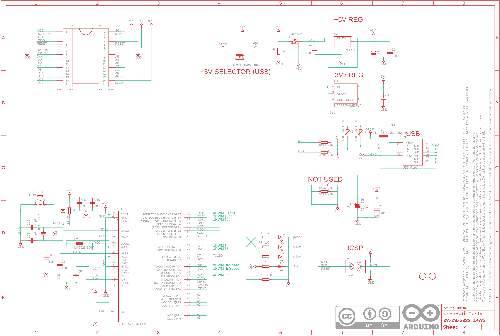](eagleSchemImage.png)
## PCB
  

## Interactive BOM

- Interactive BOM page: [ibom.html](https://htmlpreview.github.io/?https://github.com/oomlout/oomlout_OOMP_projects/blob/main/PROJ-ARDU-MICRO-STAN-01/kicad/bom/ibom.html)

## OOMP Parts
  

|OOMP ID|Name|Identifier|
| :---: | :---: | :---: |
|[CAPC-0402-X-NF100-V10](https://github.com/oomlout/oomlout_OOMP_parts/tree/main/CAPC-0402-X-NF100-V10/)|[SMD (0402) 100 nF Capacitor (Ceramic) 10v](https://github.com/oomlout/oomlout_OOMP_parts/tree/main/CAPC-0402-X-NF100-V10/)|[C1, C2, C6, C9, C10, C11](https://github.com/oomlout/oomlout_OOMP_parts/tree/main/CAPC-0402-X-NF100-V10/)|
|CAPX-UNMATCHED-X-UF22-01||C3, C14|
|[CAPC-0402-X-UF1-V63D](https://github.com/oomlout/oomlout_OOMP_parts/tree/main/CAPC-0402-X-UF1-V63D/)|[SMD (0402) 1 uF Capacitor (Ceramic) 6.3v](https://github.com/oomlout/oomlout_OOMP_parts/tree/main/CAPC-0402-X-UF1-V63D/)|[C4, C5, C7](https://github.com/oomlout/oomlout_OOMP_parts/tree/main/CAPC-0402-X-UF1-V63D/)|
|[CAPC-0402-X-PF22-V50](https://github.com/oomlout/oomlout_OOMP_parts/tree/main/CAPC-0402-X-PF22-V50/)|[SMD (0402) 22 pF Capacitor (Ceramic) 50v](https://github.com/oomlout/oomlout_OOMP_parts/tree/main/CAPC-0402-X-PF22-V50/)|[C12, C13](https://github.com/oomlout/oomlout_OOMP_parts/tree/main/CAPC-0402-X-PF22-V50/)|
|DIOD-UNMATCHED-X-UNMATCHED-01||D2|
|UNMATCHED-UNMATCHED-X-UNMATCHED-01||F1, J3, J5, J6, RESET, RP3, T1, T2, U1, U2, Y3|
|[HEAD-I01-X-PI2X03-01](https://github.com/oomlout/oomlout_OOMP_parts/tree/main/HEAD-I01-X-PI2X03-01/)|[2.54 mm 6 Pin (2x3) Header](https://github.com/oomlout/oomlout_OOMP_parts/tree/main/HEAD-I01-X-PI2X03-01/)|[J4](https://github.com/oomlout/oomlout_OOMP_parts/tree/main/HEAD-I01-X-PI2X03-01/)|
|[LEDS-0805-G-STAN-01](https://github.com/oomlout/oomlout_OOMP_parts/tree/main/LEDS-0805-G-STAN-01/)|[SMD (0805) Green LED](https://github.com/oomlout/oomlout_OOMP_parts/tree/main/LEDS-0805-G-STAN-01/)|[L](https://github.com/oomlout/oomlout_OOMP_parts/tree/main/LEDS-0805-G-STAN-01/)|
|UNMATCHED-0805-X-UNMATCHED-01||L2|
|[LEDS-0805-L-STAN-01](https://github.com/oomlout/oomlout_OOMP_parts/tree/main/LEDS-0805-L-STAN-01/)|[SMD (0805) Blue LED](https://github.com/oomlout/oomlout_OOMP_parts/tree/main/LEDS-0805-L-STAN-01/)|[ON](https://github.com/oomlout/oomlout_OOMP_parts/tree/main/LEDS-0805-L-STAN-01/)|
|[RESE-0402-X-O103-01](https://github.com/oomlout/oomlout_OOMP_parts/tree/main/RESE-0402-X-O103-01/)|[SMD (0402) 10k Ohm Resistor](https://github.com/oomlout/oomlout_OOMP_parts/tree/main/RESE-0402-X-O103-01/)|[R1, R2, R4, R9](https://github.com/oomlout/oomlout_OOMP_parts/tree/main/RESE-0402-X-O103-01/)|
|[RESE-0402-X-O102-01](https://github.com/oomlout/oomlout_OOMP_parts/tree/main/RESE-0402-X-O102-01/)|[SMD (0402) 1k Ohm Resistor](https://github.com/oomlout/oomlout_OOMP_parts/tree/main/RESE-0402-X-O102-01/)|[R5, R6, R7, R8](https://github.com/oomlout/oomlout_OOMP_parts/tree/main/RESE-0402-X-O102-01/)|
|[LEDS-0805-Y-STAN-01](https://github.com/oomlout/oomlout_OOMP_parts/tree/main/LEDS-0805-Y-STAN-01/)|[SMD (0805) Yellow LED](https://github.com/oomlout/oomlout_OOMP_parts/tree/main/LEDS-0805-Y-STAN-01/)|[RX, TX](https://github.com/oomlout/oomlout_OOMP_parts/tree/main/LEDS-0805-Y-STAN-01/)|
|UNMATCHED-SO23-X-UNMATCHED-01||U4|
|UNMATCHED-0603-X-UNMATCHED-01||Z1, Z2|

## Images
  
  

|bominteractivefront|bominteractiveback|kicadPcb3d|kicadPcb3dFront|kicadPcb3dBack|kicadSchem|eagleImage|eagleSchemImage|pcbdraw|pcbdrawback|
| :---: | :---: | :---: | :---: | :---: | :---: | :---: | :---: | :---: | :---: |
|[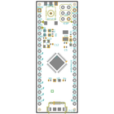](bomFront.png)|[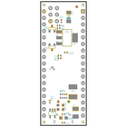](bomBack.png)|[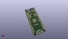](kicadPcb3d.png)|[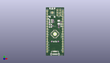](kicadPcb3dFront.png)|[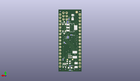](kicadPcb3dBack.png)|[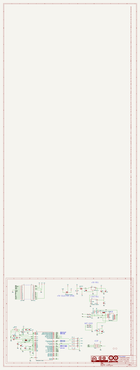](kicadSchem.png)|[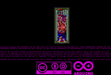](eagleImage.png)|[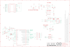](eagleSchemImage.png)|[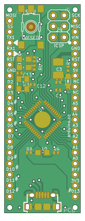](pcbdraw.png)|[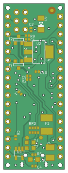](pcbdrawBack.png)|

## Tags

- hexID: PRARSTAN
- oompType: PROJ
- oompSize: ARDU
- oompColor: MICRO
- oompDesc: STAN
- oompIndex: 01
- sources: All source files from https://store.arduino.cc/collections/boards/products/arduino-micro
- linkBuyPage: https://store.arduino.cc/collections/boards/products/arduino-micro
- oompID: PROJ-ARDU-MICRO-STAN-01
- oompParts: C1,CAPC-0402-X-NF100-V10
- oompParts: C2,CAPC-0402-X-NF100-V10
- oompParts: C3,CAPX-UNMATCHED-X-UF22-01
- oompParts: C4,CAPC-0402-X-UF1-V63D
- oompParts: C5,CAPC-0402-X-UF1-V63D
- oompParts: C6,CAPC-0402-X-NF100-V10
- oompParts: C7,CAPC-0402-X-UF1-V63D
- oompParts: C9,CAPC-0402-X-NF100-V10
- oompParts: C10,CAPC-0402-X-NF100-V10
- oompParts: C11,CAPC-0402-X-NF100-V10
- oompParts: C12,CAPC-0402-X-PF22-V50
- oompParts: C13,CAPC-0402-X-PF22-V50
- oompParts: C14,CAPX-UNMATCHED-X-UF22-01
- oompParts: D2,DIOD-UNMATCHED-X-UNMATCHED-01
- oompParts: F1,UNMATCHED-UNMATCHED-X-UNMATCHED-01
- oompParts: J3,UNMATCHED-UNMATCHED-X-UNMATCHED-01
- oompParts: J4,HEAD-I01-X-PI2X03-01
- oompParts: J5,UNMATCHED-UNMATCHED-X-UNMATCHED-01
- oompParts: J6,UNMATCHED-UNMATCHED-X-UNMATCHED-01
- oompParts: L,LEDS-0805-G-STAN-01
- oompParts: L2,UNMATCHED-0805-X-UNMATCHED-01
- oompParts: ON,LEDS-0805-L-STAN-01
- oompParts: R1,RESE-0402-X-O103-01
- oompParts: R2,RESE-0402-X-O103-01
- oompParts: R4,RESE-0402-X-O103-01
- oompParts: R5,RESE-0402-X-O102-01
- oompParts: R6,RESE-0402-X-O102-01
- oompParts: R7,RESE-0402-X-O102-01
- oompParts: R8,RESE-0402-X-O102-01
- oompParts: R9,RESE-0402-X-O103-01
- oompParts: RESET,UNMATCHED-UNMATCHED-X-UNMATCHED-01
- oompParts: RP3,UNMATCHED-UNMATCHED-X-UNMATCHED-01
- oompParts: RX,LEDS-0805-Y-STAN-01
- oompParts: T1,UNMATCHED-UNMATCHED-X-UNMATCHED-01
- oompParts: T2,UNMATCHED-UNMATCHED-X-UNMATCHED-01
- oompParts: TX,LEDS-0805-Y-STAN-01
- oompParts: U1,UNMATCHED-UNMATCHED-X-UNMATCHED-01
- oompParts: U2,UNMATCHED-UNMATCHED-X-UNMATCHED-01
- oompParts: U4,UNMATCHED-SO23-X-UNMATCHED-01
- oompParts: Y3,UNMATCHED-UNMATCHED-X-UNMATCHED-01
- oompParts: Z1,UNMATCHED-0603-X-UNMATCHED-01
- oompParts: Z2,UNMATCHED-0603-X-UNMATCHED-01
- rawParts: C1,100n,C-EUC0402,C0402,CAPACITOR, European symbol,,,,,,,,,
- rawParts: C2,100n,C-EUC0402,C0402,CAPACITOR, European symbol,,,,,,,,,
- rawParts: C3,22u,CPOL-EUSMCB,SMC_B,POLARIZED CAPACITOR, European symbol,,,,,,,,,
- rawParts: C4,1uF,C-EUC0402,C0402,CAPACITOR, European symbol,,,,,,,,,
- rawParts: C5,1uF,C-EUC0402,C0402,CAPACITOR, European symbol,,,,,,,,,
- rawParts: C6,100n,C-EUC0402,C0402,CAPACITOR, European symbol,,,,,,,,,
- rawParts: C7,1uF,C-EUC0402,C0402,CAPACITOR, European symbol,,,,,,,,,
- rawParts: C9,100n,C-EUC0402,C0402,CAPACITOR, European symbol,,,,,,,,,
- rawParts: C10,100n,C-EUC0402,C0402,CAPACITOR, European symbol,,,,,,,,,
- rawParts: C11,100n,C-EUC0402,C0402,CAPACITOR, European symbol,,,,,,,,,
- rawParts: C12,22pF,C-EUC0402,C0402,CAPACITOR, European symbol,,,,,,,,,
- rawParts: C13,22pF,C-EUC0402,C0402,CAPACITOR, European symbol,,,,,,,,,
- rawParts: C14,22u,CPOL-EUSMCB,SMC_B,POLARIZED CAPACITOR, European symbol,,,,,,,,,
- rawParts: D+,DNP,TPTP-1.00MM,TP-1.00MM,Testpoint,,DNP,DNP,DNP,DNP,DNP,,DNP,
- rawParts: D-,DNP,TPTP-1.00MM,TP-1.00MM,Testpoint,,DNP,DNP,DNP,DNP,DNP,,DNP,
- rawParts: D2,CD1206-S01575,DIODE-MINIMELF,MINIMELF,DIODE,,,,,,,,,
- rawParts: F1,MF-MSMF050-2 500mA,L-EUL1812,L1812,INDUCTOR, European symbol,,,,,,,,,
- rawParts: FRAME1,DNP,A3-FRAME,FRAME,,DNP,DNP,DNP,DNP,DNP,DNP,DNP,DNP,
- rawParts: J3,USB Micro,USB-MICRO-LEGACY,CON2_USB_MICRO_B_AT,,,http://media.digikey.com/pdf/Data%20Sheets/FCI%20PDFs/10118193-0001LF_Webpage.PDF,http://www.digikey.it/product-detail/en/10118193-0001LF/609-4616-2-ND/2785388,609-4616-2-ND,FCI,10118193-0001LF,,USB Micro,
- rawParts: J4,3x2M,PINHD-2X3,2X03,PIN HEADER,,,,,,,,,
- rawParts: J5,HEAD17-NOSS,HEAD17-NOSS,HEAD17-NOSS,,,,,,,,,,
- rawParts: J6,HEAD17-NOSS-1,HEAD17-NOSS-1,HEAD17-NOSS-1,,,,,,,,,,
- rawParts: L,green,LEDCHIPLED_0805,CHIPLED_0805,LED,,,,,,,,,
- rawParts: L2,MH2029-300Y,WE-CBF_0805,0805,SMD EMI Suppression Ferrite Beads,,,,,,,,,
- rawParts: ON,blue,LEDCHIPLED_0805,CHIPLED_0805,LED,,,,,,,,,
- rawParts: R1,10K,R-EU_R0402,R0402,RESISTOR, European symbol,,,,,,,,,
- rawParts: R2,10K,R-EU_R0402,R0402,RESISTOR, European symbol,,,,,,,,,
- rawParts: R4,10K,R-EU_R0402,R0402,RESISTOR, European symbol,,,,,,,,,
- rawParts: R5,1K,R-EU_R0402,R0402,RESISTOR, European symbol,,,,,,,,,
- rawParts: R6,1K,R-EU_R0402,R0402,RESISTOR, European symbol,,,,,,,,,
- rawParts: R7,1K,R-EU_R0402,R0402,RESISTOR, European symbol,,,,,,,,,
- rawParts: R8,1K,R-EU_R0402,R0402,RESISTOR, European symbol,,,,,,,,,
- rawParts: R9,10K,R-EU_R0402,R0402,RESISTOR, European symbol,,,,,,,,,
- rawParts: RESET,TS42,TS42,TS42,TS42,,,,,,,,,
- rawParts: RP3,22R,4R-NCAY16,CAY16,Array Chip Resistor,,,,,,,,,
- rawParts: RX,yellow,LEDCHIPLED_0805,CHIPLED_0805,LED,,,,,,,,,
- rawParts: T1,FDN340P/PMV48XP,PMOSSOT23,SOT-23,MOS FET,,,,,,,,,
- rawParts: T2,PMV48XP,PMOSSOT23,SOT-23,MOS FET,,,,,,,,,
- rawParts: TX,yellow,LEDCHIPLED_0805,CHIPLED_0805,LED,,,,,,,,,
- rawParts: U$37,DNP,FIDUCIAL-1.5MM,FD-1-1.5,Fiducial mount,,DNP,DNP,DNP,DNP,DNP,,DNP,
- rawParts: U$53,DNP,FIDUCIAL-1.5MM,FD-1-1.5,Fiducial mount,,DNP,DNP,DNP,DNP,DNP,,DNP,
- rawParts: U1,ATMEGA32U4-XUMU,ATMEGA32U4-XUMU,QFN44ML7X7,,,,,,,,,,
- rawParts: U2,NCP1117-5,LINEAR_MC33269ST,SOT223,Adjustable Output Low Dropout Voltage Regulator 800 mA,,,,,,,,,
- rawParts: U4,LP2985-33DBVR,LP2985-XXDBVR33,SOT23-DBV,ULTRALOW-POWER 50-mA LOW-DROPOUT LINEAR REGULATORS,,,,,,,,,
- rawParts: Y3,16MHz KX-7,CRYSTAL-3.2-2.5,CRYSTAL-3.2-2.5,,,,,,,,,,
- rawParts: Z1,CG0603MLC-05E,VARISTORCN0603,CT/CN0603,VARISTOR,,,,,,,,,
- rawParts: Z2,CG0603MLC-05E,VARISTORCN0603,CT/CN0603,VARISTOR,,,,,,,,,

[im]: kicadPcb3d_450.png
