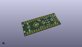
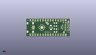
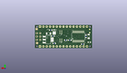
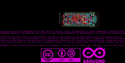
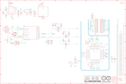

Contents
========

* [PRARSTAN > Arduino Nano](#prarstan--arduino-nano)
	* [Schematic](#schematic)
	* [Interactive BOM](#interactive-bom)
	* [OOMP Parts](#oomp-parts)
	* [Images](#images)
	* [Tags](#tags)
  
![][im]
# PRARSTAN > Arduino Nano

- ID: PROJ-ARDU-NANO-STAN-01
- Hex ID: PRARSTAN
- Name: Arduino Nano
- Description: Arduino Nano
- Long Link: [http://oom.lt/PROJ-ARDU-NANO-STAN-01](http://oom.lt/PROJ-ARDU-NANO-STAN-01)
- Long Link: [http://oom.lt/PRARSTAN](http://oom.lt/PRARSTAN)

## Schematic
  
![][schem]
## Interactive BOM

- Interactive BOM page: [ibom.html](https://htmlpreview.github.io/?https://github.com/oomlout/oomlout_OOMP_projects/blob/main/PROJ-ARDU-NANO-STAN-01/kicad/bom/ibom.html)

## OOMP Parts
  

|OOMP Parts|
| :---: |
|C1,UNMATCHED-UNMATCHED-UNMATCHED-UNMATCHED-UNMATCHED,C1,4n7,C4.7NF-0805,0805-R2013X50N,SMD Capacitor,0689,http://www.kemet.com/Lists/ProductCatalog/Attachments/40/KEM_C1010_X7R_HV_SMD.pdf,www.kemet.com/docfinder?Partnumber=C0805C472KDRACTU,399-6738-1-ND,Kemet,C0805C472KDRACTU,-,,4n7,1KV,|
|C2,UNMATCHED-UNMATCHED-UNMATCHED-UNMATCHED-UNMATCHED,C2,100n,C-100NF-0402,0402-1005X55N,SMD Capacitor,0132,http://www.tdk.com/pdf/TDKMLCCCapRange.pdf,http://www.digikey.com/product-detail/en/tdk-corporation/C1005X5R1H104K050BB/445-5942-1-ND/2443982,445-5942-1-ND,TDK,C1005X5R1H104K050BB,-,,100n,,|
|C3,UNMATCHED-UNMATCHED-UNMATCHED-UNMATCHED-UNMATCHED,C3,22u,C-22U-0805,0805-R2013X50N,SMD Capacitor,2233,https://media.digikey.com/pdf/Data%20Sheets/Samsung%20PDFs/CL21A226MQCLQNC_character.pdf,https://www.digikey.com/product-detail/en/samsung-electro-mechanics-america-inc/CL21A226MQCLQNC/1276-2412-1-ND/3890498,1276-2412-1-ND,Samsung,CL21A226MQCLQNC,-,,22u,,|
|C4,UNMATCHED-UNMATCHED-UNMATCHED-UNMATCHED-UNMATCHED,C4,22u,C-22U-0805,0805-R2013X50N,SMD Capacitor,2233,https://media.digikey.com/pdf/Data%20Sheets/Samsung%20PDFs/CL21A226MQCLQNC_character.pdf,https://www.digikey.com/product-detail/en/samsung-electro-mechanics-america-inc/CL21A226MQCLQNC/1276-2412-1-ND/3890498,1276-2412-1-ND,Samsung,CL21A226MQCLQNC,-,,22u,,|
|C5,UNMATCHED-UNMATCHED-UNMATCHED-UNMATCHED-UNMATCHED,C5,4u7,C-4.7UF-0402,0402-1005X55N,SMD Capacitor,0833,http://search.murata.co.jp/Ceramy/image/img/A01X/partnumbering_e_01.pdf,http://www.digikey.com/product-detail/en/murata-electronics-north-america/GRM155R60J475ME47D/490-5915-1-ND/3719860,490-5915-1-ND,Murata,GRM155R60J475ME47D ,-,,4u7,,|
|C6,UNMATCHED-UNMATCHED-UNMATCHED-UNMATCHED-UNMATCHED,C6,1u,C-1UF-0402,0402-1005X55N,SMD Capacitor,0133,http://search.murata.co.jp/Ceramy/image/img/A01X/partnumbering_e_01.pdf,http://www.digikey.com/product-detail/en/murata-electronics-north-america/GRM155R61E105KA12D/490-10017-1-ND/5026367,490-10017-1-ND,Murata,GRM155R61E105KA12D ,-,,1u,,|
|C7,UNMATCHED-UNMATCHED-UNMATCHED-UNMATCHED-UNMATCHED,C7,100n,C-100NF-0402,0402-1005X55N,SMD Capacitor,0132,http://www.tdk.com/pdf/TDKMLCCCapRange.pdf,http://www.digikey.com/product-detail/en/tdk-corporation/C1005X5R1H104K050BB/445-5942-1-ND/2443982,445-5942-1-ND,TDK,C1005X5R1H104K050BB,-,,100n,,|
|C8,UNMATCHED-UNMATCHED-UNMATCHED-UNMATCHED-UNMATCHED,C8,100n,C-100NF-0402,0402-1005X55N,SMD Capacitor,0132,http://www.tdk.com/pdf/TDKMLCCCapRange.pdf,http://www.digikey.com/product-detail/en/tdk-corporation/C1005X5R1H104K050BB/445-5942-1-ND/2443982,445-5942-1-ND,TDK,C1005X5R1H104K050BB,-,,100n,,|
|C9,UNMATCHED-UNMATCHED-UNMATCHED-UNMATCHED-UNMATCHED,C9,4u7,C-4.7UF-0402,0402-1005X55N,SMD Capacitor,0833,http://search.murata.co.jp/Ceramy/image/img/A01X/partnumbering_e_01.pdf,http://www.digikey.com/product-detail/en/murata-electronics-north-america/GRM155R60J475ME47D/490-5915-1-ND/3719860,490-5915-1-ND,Murata,GRM155R60J475ME47D ,-,,4u7,,|
|C10,UNMATCHED-UNMATCHED-UNMATCHED-UNMATCHED-UNMATCHED,C10,100n,C-100NF-0402,0402-1005X55N,SMD Capacitor,0132,http://www.tdk.com/pdf/TDKMLCCCapRange.pdf,http://www.digikey.com/product-detail/en/tdk-corporation/C1005X5R1H104K050BB/445-5942-1-ND/2443982,445-5942-1-ND,TDK,C1005X5R1H104K050BB,-,,100n,,|
|C11,UNMATCHED-UNMATCHED-UNMATCHED-UNMATCHED-UNMATCHED,C11,100n,C-100NF-0402,0402-1005X55N,SMD Capacitor,0132,http://www.tdk.com/pdf/TDKMLCCCapRange.pdf,http://www.digikey.com/product-detail/en/tdk-corporation/C1005X5R1H104K050BB/445-5942-1-ND/2443982,445-5942-1-ND,TDK,C1005X5R1H104K050BB,-,,100n,,|
|D+,UNMATCHED-UNMATCHED-UNMATCHED-UNMATCHED-UNMATCHED,D+,DNP,TPTP-1.00MM,TP-1.00MM,Testpoint,DNP,DNP,DNP,DNP,DNP,DNP,,,DNP,,|
|D-,UNMATCHED-UNMATCHED-UNMATCHED-UNMATCHED-UNMATCHED,D-,DNP,TPTP-1.00MM,TP-1.00MM,Testpoint,DNP,DNP,DNP,DNP,DNP,DNP,,,DNP,,|
|D1,UNMATCHED-UNMATCHED-UNMATCHED-UNMATCHED-UNMATCHED,D1,PRTR5V,PRTR5V0U2X,215,SOT190P230X110-4N,USB ESD protection,2209,http://www.nxp.com/documents/data_sheet/PRTR5V0U2X.pdf,http://www.digikey.com/product-detail/en/nxp-semiconductors/PRTR5V0U2X,215/568-4140-1-ND/1589981,568-4140-1-ND,NXP,PRTR5V0U2X,215,,,PRTR5V,,|
|D2,UNMATCHED-UNMATCHED-UNMATCHED-UNMATCHED-UNMATCHED,D2,PMEG6020,PMEG6020AELRX,SODFL3517X110N,60 V, 2 A low leakage current Schottky barrier rectifier,2208,http://www.nxp.com/documents/data_sheet/PMEG6020AELR.pdf,http://www.digikey.com/products/en?keywords=%20568-12710-1-ND, 568-12710-1-ND,NXP,PMEG6020AELRX,,,PMEG6020,,|
|D3,UNMATCHED-UNMATCHED-UNMATCHED-UNMATCHED-UNMATCHED,D3,DNP,PMEG6020AELRX-DNP,SODFL3517X110N,60 V, 2 A low leakage current Schottky barrier rectifier,DNP,DNP,DNP,DNP,DNP,DNP,,,DNP,,|
|DL1,UNMATCHED-UNMATCHED-UNMATCHED-UNMATCHED-UNMATCHED,DL1,YELLOW,LED-YELLOW-0603,LEDC1608X80N-AK,LED,2243,http://media.digikey.com/pdf/Data%20Sheets/Avago%20PDFs/HSMz-Czzz.pdf,http://www.digikey.com/product-detail/en/broadcom-limited/HSMY-C190/516-1424-1-ND/637748,516-1424-1-ND,Avago,HSMY-C190,,,YELLOW,,|
|DL2,UNMATCHED-UNMATCHED-UNMATCHED-UNMATCHED-UNMATCHED,DL2,GREEN,LED-GREEN-0603,LEDC1608X80N-AK,LED,2204,http://media.digikey.com/pdf/Data%20Sheets/Avago%20PDFs/HSMz-Czzz.pdf,http://www.digikey.com/product-detail/en/broadcom-limited/HSMG-C190/516-1425-1-ND/637749,516-1425-1-ND,Avago ,HSMG-C190 ,,,GREEN,,|
|DL3,UNMATCHED-UNMATCHED-UNMATCHED-UNMATCHED-UNMATCHED,DL3,YELLOW,LED-YELLOW-0603,LEDC1608X80N-AK,LED,2243,http://media.digikey.com/pdf/Data%20Sheets/Avago%20PDFs/HSMz-Czzz.pdf,http://www.digikey.com/product-detail/en/broadcom-limited/HSMY-C190/516-1424-1-ND/637748,516-1424-1-ND,Avago,HSMY-C190,,,YELLOW,,|
|DL4,UNMATCHED-UNMATCHED-UNMATCHED-UNMATCHED-UNMATCHED,DL4,YELLOW,LED-YELLOW-0603,LEDC1608X80N-AK,LED,2243,http://media.digikey.com/pdf/Data%20Sheets/Avago%20PDFs/HSMz-Czzz.pdf,http://www.digikey.com/product-detail/en/broadcom-limited/HSMY-C190/516-1424-1-ND/637748,516-1424-1-ND,Avago,HSMY-C190,,,YELLOW,,|
|FD1,UNMATCHED-UNMATCHED-UNMATCHED-UNMATCHED-UNMATCHED,FD1,DNP,FIDUCIAL-1.5MM,FD-1-1.5,Fiducial mount,DNP,DNP,DNP,DNP,DNP,DNP,,,DNP,,|
|FD2,UNMATCHED-UNMATCHED-UNMATCHED-UNMATCHED-UNMATCHED,FD2,DNP,FIDUCIAL-1.5MM,FD-1-1.5,Fiducial mount,DNP,DNP,DNP,DNP,DNP,DNP,,,DNP,,|
|FRAME1,UNMATCHED-UNMATCHED-UNMATCHED-UNMATCHED-UNMATCHED,FRAME1,DNP,A3-FRAME,FRAME,,DNP,DNP,DNP,DNP,DNP,DNP,DNP,,DNP,,|
|IC1,UNMATCHED-UNMATCHED-UNMATCHED-UNMATCHED-UNMATCHED,IC1,MPM3610,MPM3610,MPM3610,MPM3610 Step Down Regulator,2093,https://www.monolithicpower.com/pub/media/document/MPM3610_r1.01.pdf,https://www.digikey.com/product-detail/en/monolithic-power-systems-inc/MPM3610AGQV-P/1589-1249-1-ND/5298336,1589-1249-1-ND,MPS,MPM3610AGQV-P,,NO,MPM3610,,|
|J1,UNMATCHED-UNMATCHED-UNMATCHED-UNMATCHED-UNMATCHED,J1,-,USB-MICRO,ZX62-AB-5PA,USB - micro AB USB 2.0 Receptacle Connector 5 Position Surface Mount, Right Angle, Horizontal,2219,https://www.hirose.com/product/en/download_file/key_name/ZX/category/Catalog/doc_file_id/31704/?file_category_id=4&item_id=13&is_series=1,http://www.digikey.com/product-detail/en/hirose-electric-co-ltd/ZX62-AB-5PA(31)/H125279CT-ND/5994741,H125279CT-ND ,Hirose,ZX62-AB-5PA(31) ,,,-,,|
|J2,UNMATCHED-UNMATCHED-UNMATCHED-UNMATCHED-UNMATCHED,J2,DNP,PINHD-2X03-SMTP,2X03-TP,PIN HEADER,DNP,DNP,DNP,DNP,DNP,DNP,DNP,,DNP,,|
|JP2,UNMATCHED-UNMATCHED-UNMATCHED-UNMATCHED-UNMATCHED,JP2,-,PINHD-1X15-CASTELLATED,1X15-CASTELL,PIN HEADER,0646,-,-,-,-,-,DNM,,-,,|
|JP3,UNMATCHED-UNMATCHED-UNMATCHED-UNMATCHED-UNMATCHED,JP3,-,PINHD-1X15-CASTELLATED,1X15-CASTELL,PIN HEADER,0646,-,-,-,-,-,DNM,,-,,|
|PB1,UNMATCHED-UNMATCHED-UNMATCHED-UNMATCHED-UNMATCHED,PB1,PTS820,TACTILE1PTS820-NH,C&K_PTS820_NO_HOLES,Tactile Switch SPST-NO Top Actuated Surface Mount,0173,http://www.ckswitches.com/media/1474/pts820.pdf,https://www.digikey.com/product-detail/en/c-k/PTS820-J15M-SMTR-LFS/CKN10506CT-ND/4176681,PTS820 J25K SMTR LFS-ND,C&K,PTS820 J25K SMTR LFS,,,PTS820,,|
|Q1,UNMATCHED-UNMATCHED-UNMATCHED-UNMATCHED-UNMATCHED,Q1,BSS138PS,BSS138PS,SOT363,MOSFET 2N-CH 60V 0.32A 6TSSOP,2323,https://assets.nexperia.com/documents/data-sheet/BSS138PS.pdf,http://www.digikey.com/product-detail/en/nxp-semiconductors/BSS138PS,115/568-8393-1-ND/2763927,568-8393-1-ND,NXP,BSS138PS,115,,,,,|
|Q2,UNMATCHED-UNMATCHED-UNMATCHED-UNMATCHED-UNMATCHED,Q2,BSS138PS,BSS138PS,SOT363,MOSFET 2N-CH 60V 0.32A 6TSSOP,2323,https://assets.nexperia.com/documents/data-sheet/BSS138PS.pdf,http://www.digikey.com/product-detail/en/nxp-semiconductors/BSS138PS,115/568-8393-1-ND/2763927,568-8393-1-ND,NXP,BSS138PS,115,,,,,|
|R1,UNMATCHED-UNMATCHED-UNMATCHED-UNMATCHED-UNMATCHED,R1,1M,R-1M-0402,0402-1005X55N,SMD Resistor,0139,www.yageo.com.tw/exep/pages/download/literatures/PYu-R_INT-thick_7.pdf,http://www.digikey.com/product-detail/en/yageo/RC0402JR-07330RL/311-330JRCT-ND/729412 ,311-330JRCT-ND,Yageo,RC0402JR-07330RL,NO,,1M,,|
|R2,UNMATCHED-UNMATCHED-UNMATCHED-UNMATCHED-UNMATCHED,R2,330R,R-330R-0402,0402-1005X55N,SMD Resistor,2229,www.yageo.com.tw/exep/pages/download/literatures/PYu-R_INT-thick_7.pdf,http://www.digikey.com/product-detail/en/yageo/RC0402FR-07330RL/311-330LRCT-ND/729541,311-330LRCT-ND,Yageo ,RC0402FR-07330RL ,NO,,330R,,|
|R3,UNMATCHED-UNMATCHED-UNMATCHED-UNMATCHED-UNMATCHED,R3,330R,R-330R-0402,0402-1005X55N,SMD Resistor,2229,www.yageo.com.tw/exep/pages/download/literatures/PYu-R_INT-thick_7.pdf,http://www.digikey.com/product-detail/en/yageo/RC0402FR-07330RL/311-330LRCT-ND/729541,311-330LRCT-ND,Yageo ,RC0402FR-07330RL ,NO,,330R,,|
|R4,UNMATCHED-UNMATCHED-UNMATCHED-UNMATCHED-UNMATCHED,R4,100k,R-100K-0402,0402-1005X55N,SMD Resistor,0134,www.yageo.com.tw/exep/pages/download/literatures/PYu-R_INT-thick_7.pdf,http://www.digikey.com/product-detail/en/yageo/RC0402FR-07100KL/311-100KLRCT-ND/729473,311-100KLRCT-ND,Yageo ,RC0402FR-07100KL ,NO,,100k,,|
|R5,UNMATCHED-UNMATCHED-UNMATCHED-UNMATCHED-UNMATCHED,R5,4k7,R-4K7-0402,0402-1005X55N,SMD Resistor,2196,www.yageo.com.tw/exep/pages/download/literatures/PYu-R_INT-thick_7.pdf,http://www.digikey.com/product-detail/en/yageo/RC0402FR-074K7L/311-4.7KLRCT-ND/2827881,311-4.7KLRCT-ND,Yageo ,RC0402FR-074K7L ,NO,,4k7,,|
|R6,UNMATCHED-UNMATCHED-UNMATCHED-UNMATCHED-UNMATCHED,R6,100k,R-100K-0402,0402-1005X55N,SMD Resistor,0134,www.yageo.com.tw/exep/pages/download/literatures/PYu-R_INT-thick_7.pdf,http://www.digikey.com/product-detail/en/yageo/RC0402FR-07100KL/311-100KLRCT-ND/729473,311-100KLRCT-ND,Yageo ,RC0402FR-07100KL ,NO,,100k,,|
|R7,UNMATCHED-UNMATCHED-UNMATCHED-UNMATCHED-UNMATCHED,R7,0R,R-0R-0402,0402-1005X55N,SMD Resistor,0039,www.yageo.com.tw/exep/pages/download/literatures/PYu-R_INT-thick_7.pdf,http://www.digikey.com/product-detail/en/yageo/RC0402FR-070RL/311-0.0LRCT-ND/2827888,311-0.0LRCT-ND,Yageo,RC0402FR-070RL,NO,,0R,,|
|R8,UNMATCHED-UNMATCHED-UNMATCHED-UNMATCHED-UNMATCHED,R8,19k1,R-19K1-0402,0402-1005X55N,SMD Resistor,A5369,http://www.yageo.com/documents/recent/PYu-RC_Group_51_RoHS_L_10.pdf,https://www.digikey.it/product-detail/it/yageo/RC0402FR-0719K1L/311-19.1KLRTR-ND/726552,311-19.1KLRTR-ND,Yageo,RC0402FR-0719K1L,NO,,19k1,,|
|R9,UNMATCHED-UNMATCHED-UNMATCHED-UNMATCHED-UNMATCHED,R9,39k,R-39K-0402,0402-1005X55N,SMD Resistor,A5479,www.yageo.com.tw/exep/pages/download/literatures/PYu-R_INT-thick_7.pdf,https://www.digikey.com/product-detail/en/yageo/RC0402JR-0739KL/311-39KJRCT-ND/729420,311-39KJRCT-ND ,Yageo,RC0402JR-0739KL,NO,,39k,,|
|R10,UNMATCHED-UNMATCHED-UNMATCHED-UNMATCHED-UNMATCHED,R10,100k,R-100K-0402,0402-1005X55N,SMD Resistor,0134,www.yageo.com.tw/exep/pages/download/literatures/PYu-R_INT-thick_7.pdf,http://www.digikey.com/product-detail/en/yageo/RC0402FR-07100KL/311-100KLRCT-ND/729473,311-100KLRCT-ND,Yageo ,RC0402FR-07100KL ,NO,,100k,,|
|R11,UNMATCHED-UNMATCHED-UNMATCHED-UNMATCHED-UNMATCHED,R11,4k7,R-4K7-0402,0402-1005X55N,SMD Resistor,2196,www.yageo.com.tw/exep/pages/download/literatures/PYu-R_INT-thick_7.pdf,http://www.digikey.com/product-detail/en/yageo/RC0402FR-074K7L/311-4.7KLRCT-ND/2827881,311-4.7KLRCT-ND,Yageo ,RC0402FR-074K7L ,NO,,4k7,,|
|R12,UNMATCHED-UNMATCHED-UNMATCHED-UNMATCHED-UNMATCHED,R12,330R,R-330R-0402,0402-1005X55N,SMD Resistor,2229,www.yageo.com.tw/exep/pages/download/literatures/PYu-R_INT-thick_7.pdf,http://www.digikey.com/product-detail/en/yageo/RC0402FR-07330RL/311-330LRCT-ND/729541,311-330LRCT-ND,Yageo ,RC0402FR-07330RL ,NO,,330R,,|
|R13,UNMATCHED-UNMATCHED-UNMATCHED-UNMATCHED-UNMATCHED,R13,330R,R-330R-0402,0402-1005X55N,SMD Resistor,2229,www.yageo.com.tw/exep/pages/download/literatures/PYu-R_INT-thick_7.pdf,http://www.digikey.com/product-detail/en/yageo/RC0402FR-07330RL/311-330LRCT-ND/729541,311-330LRCT-ND,Yageo ,RC0402FR-07330RL ,NO,,330R,,|
|R14,UNMATCHED-UNMATCHED-UNMATCHED-UNMATCHED-UNMATCHED,R14,4k7,R-4K7-0402,0402-1005X55N,SMD Resistor,2196,www.yageo.com.tw/exep/pages/download/literatures/PYu-R_INT-thick_7.pdf,http://www.digikey.com/product-detail/en/yageo/RC0402FR-074K7L/311-4.7KLRCT-ND/2827881,311-4.7KLRCT-ND,Yageo ,RC0402FR-074K7L ,NO,,4k7,,|
|R15,UNMATCHED-UNMATCHED-UNMATCHED-UNMATCHED-UNMATCHED,R15,4k7,R-4K7-0402,0402-1005X55N,SMD Resistor,2196,www.yageo.com.tw/exep/pages/download/literatures/PYu-R_INT-thick_7.pdf,http://www.digikey.com/product-detail/en/yageo/RC0402FR-074K7L/311-4.7KLRCT-ND/2827881,311-4.7KLRCT-ND,Yageo ,RC0402FR-074K7L ,NO,,4k7,,|
|R16,UNMATCHED-UNMATCHED-UNMATCHED-UNMATCHED-UNMATCHED,R16,4k7,R-4K7-0402,0402-1005X55N,SMD Resistor,2196,www.yageo.com.tw/exep/pages/download/literatures/PYu-R_INT-thick_7.pdf,http://www.digikey.com/product-detail/en/yageo/RC0402FR-074K7L/311-4.7KLRCT-ND/2827881,311-4.7KLRCT-ND,Yageo ,RC0402FR-074K7L ,NO,,4k7,,|
|R17,UNMATCHED-UNMATCHED-UNMATCHED-UNMATCHED-UNMATCHED,R17,4k7,R-4K7-0402,0402-1005X55N,SMD Resistor,2196,www.yageo.com.tw/exep/pages/download/literatures/PYu-R_INT-thick_7.pdf,http://www.digikey.com/product-detail/en/yageo/RC0402FR-074K7L/311-4.7KLRCT-ND/2827881,311-4.7KLRCT-ND,Yageo ,RC0402FR-074K7L ,NO,,4k7,,|
|R18,UNMATCHED-UNMATCHED-UNMATCHED-UNMATCHED-UNMATCHED,R18,4k7,R-4K7-0402,0402-1005X55N,SMD Resistor,2196,www.yageo.com.tw/exep/pages/download/literatures/PYu-R_INT-thick_7.pdf,http://www.digikey.com/product-detail/en/yageo/RC0402FR-074K7L/311-4.7KLRCT-ND/2827881,311-4.7KLRCT-ND,Yageo ,RC0402FR-074K7L ,NO,,4k7,,|
|R19,UNMATCHED-UNMATCHED-UNMATCHED-UNMATCHED-UNMATCHED,R19,4k7,R-4K7-0402,0402-1005X55N,SMD Resistor,2196,www.yageo.com.tw/exep/pages/download/literatures/PYu-R_INT-thick_7.pdf,http://www.digikey.com/product-detail/en/yageo/RC0402FR-074K7L/311-4.7KLRCT-ND/2827881,311-4.7KLRCT-ND,Yageo ,RC0402FR-074K7L ,NO,,4k7,,|
|R20,UNMATCHED-UNMATCHED-UNMATCHED-UNMATCHED-UNMATCHED,R20,DNP,R-DNP-0402,0402-1005X55N,SMD Resistor,DNP,DNP,DNP,DNP,DNP,DNP,NO,,DNP,,|
|U1,UNMATCHED-UNMATCHED-UNMATCHED-UNMATCHED-UNMATCHED,U1,ATMEGA4809,ATMEGA4809,TQFP48,ATMEGA4809,ATMEGA4809,http://ww1.microchip.com/downloads/en/DeviceDoc/40002016A.pdf,https://www.digikey.com/product-detail/en/microchip-technology/ATMEGA4809-AFR/ATMEGA4809-AFRCT-ND/8540756,ATMEGA4809-AFRCT-ND,Microchip,ATMEGA4809-AFR,,,ATMEGA4809,,|
|U2,UNMATCHED-UNMATCHED-UNMATCHED-UNMATCHED-UNMATCHED,U2,AP2112K-3.3,AP2112K-3.3,SOT25,IC REG LINEAR 3.3V 600mA SOT25,2199,https://www.diodes.com/assets/Datasheets/AP2112.pdf,https://www.digikey.com/product-detail/en/diodes-incorporated/AP2112K-3.3TRG1/AP2112K-3.3TRG1DITR-ND/4470746,AP2112K-3.3TRG1DITR-ND,Diodes Inc,AP2112K-3.3TRG1,NO,,AP2112K-3.3,,|
|U3,UNMATCHED-UNMATCHED-UNMATCHED-UNMATCHED-UNMATCHED,U3,ATSAMD11D14A,ATSAMD11D14,HVQFN24,IC MCU 32BIT 16KB FLASH 24QFN,ATSAM-D11-D14A-MUT,http://ww1.microchip.com/downloads/en/DeviceDoc/Atmel-42363-SAM-D11_Datasheet.pdf,https://www.digikey.com/product-detail/it/microchip-technology/ATSAMD11D14A-MUT/ATSAMD11D14A-MUTCT-ND/5226480,ATSAMD11D14A-MUTCT-ND,Microchip,ATSAMD11D14A-MUT,,,ATSAMD11D14A,,|

## Images
  
  

|kicadPcb3d|kicadPcb3dFront|kicadPcb3dBack|eagleImage|eagleSchemImage|
| :---: | :---: | :---: | :---: | :---: |
||||||

## Tags

- hexID: PRARSTAN
- oompType: PROJ
- oompSize: ARDU
- oompColor: NANO
- oompDesc: STAN
- oompIndex: 01
- sources: All source files from https://store.arduino.cc/collections/boards/products/arduino-nano
- linkBuyPage: https://store.arduino.cc/collections/boards/products/arduino-nano
- oompID: PROJ-ARDU-NANO-STAN-01
- oompParts: C1,UNMATCHED-UNMATCHED-UNMATCHED-UNMATCHED-UNMATCHED
- oompParts: C2,UNMATCHED-UNMATCHED-UNMATCHED-UNMATCHED-UNMATCHED
- oompParts: C3,UNMATCHED-UNMATCHED-UNMATCHED-UNMATCHED-UNMATCHED
- oompParts: C4,UNMATCHED-UNMATCHED-UNMATCHED-UNMATCHED-UNMATCHED
- oompParts: C5,UNMATCHED-UNMATCHED-UNMATCHED-UNMATCHED-UNMATCHED
- oompParts: C6,UNMATCHED-UNMATCHED-UNMATCHED-UNMATCHED-UNMATCHED
- oompParts: C7,UNMATCHED-UNMATCHED-UNMATCHED-UNMATCHED-UNMATCHED
- oompParts: C8,UNMATCHED-UNMATCHED-UNMATCHED-UNMATCHED-UNMATCHED
- oompParts: C9,UNMATCHED-UNMATCHED-UNMATCHED-UNMATCHED-UNMATCHED
- oompParts: C10,UNMATCHED-UNMATCHED-UNMATCHED-UNMATCHED-UNMATCHED
- oompParts: C11,UNMATCHED-UNMATCHED-UNMATCHED-UNMATCHED-UNMATCHED
- oompParts: D+,UNMATCHED-UNMATCHED-UNMATCHED-UNMATCHED-UNMATCHED
- oompParts: D-,UNMATCHED-UNMATCHED-UNMATCHED-UNMATCHED-UNMATCHED
- oompParts: D1,UNMATCHED-UNMATCHED-UNMATCHED-UNMATCHED-UNMATCHED
- oompParts: D2,UNMATCHED-UNMATCHED-UNMATCHED-UNMATCHED-UNMATCHED
- oompParts: D3,UNMATCHED-UNMATCHED-UNMATCHED-UNMATCHED-UNMATCHED
- oompParts: DL1,UNMATCHED-UNMATCHED-UNMATCHED-UNMATCHED-UNMATCHED
- oompParts: DL2,UNMATCHED-UNMATCHED-UNMATCHED-UNMATCHED-UNMATCHED
- oompParts: DL3,UNMATCHED-UNMATCHED-UNMATCHED-UNMATCHED-UNMATCHED
- oompParts: DL4,UNMATCHED-UNMATCHED-UNMATCHED-UNMATCHED-UNMATCHED
- oompParts: FD1,UNMATCHED-UNMATCHED-UNMATCHED-UNMATCHED-UNMATCHED
- oompParts: FD2,UNMATCHED-UNMATCHED-UNMATCHED-UNMATCHED-UNMATCHED
- oompParts: FRAME1,UNMATCHED-UNMATCHED-UNMATCHED-UNMATCHED-UNMATCHED
- oompParts: IC1,UNMATCHED-UNMATCHED-UNMATCHED-UNMATCHED-UNMATCHED
- oompParts: J1,UNMATCHED-UNMATCHED-UNMATCHED-UNMATCHED-UNMATCHED
- oompParts: J2,UNMATCHED-UNMATCHED-UNMATCHED-UNMATCHED-UNMATCHED
- oompParts: JP2,UNMATCHED-UNMATCHED-UNMATCHED-UNMATCHED-UNMATCHED
- oompParts: JP3,UNMATCHED-UNMATCHED-UNMATCHED-UNMATCHED-UNMATCHED
- oompParts: PB1,UNMATCHED-UNMATCHED-UNMATCHED-UNMATCHED-UNMATCHED
- oompParts: Q1,UNMATCHED-UNMATCHED-UNMATCHED-UNMATCHED-UNMATCHED
- oompParts: Q2,UNMATCHED-UNMATCHED-UNMATCHED-UNMATCHED-UNMATCHED
- oompParts: R1,UNMATCHED-UNMATCHED-UNMATCHED-UNMATCHED-UNMATCHED
- oompParts: R2,UNMATCHED-UNMATCHED-UNMATCHED-UNMATCHED-UNMATCHED
- oompParts: R3,UNMATCHED-UNMATCHED-UNMATCHED-UNMATCHED-UNMATCHED
- oompParts: R4,UNMATCHED-UNMATCHED-UNMATCHED-UNMATCHED-UNMATCHED
- oompParts: R5,UNMATCHED-UNMATCHED-UNMATCHED-UNMATCHED-UNMATCHED
- oompParts: R6,UNMATCHED-UNMATCHED-UNMATCHED-UNMATCHED-UNMATCHED
- oompParts: R7,UNMATCHED-UNMATCHED-UNMATCHED-UNMATCHED-UNMATCHED
- oompParts: R8,UNMATCHED-UNMATCHED-UNMATCHED-UNMATCHED-UNMATCHED
- oompParts: R9,UNMATCHED-UNMATCHED-UNMATCHED-UNMATCHED-UNMATCHED
- oompParts: R10,UNMATCHED-UNMATCHED-UNMATCHED-UNMATCHED-UNMATCHED
- oompParts: R11,UNMATCHED-UNMATCHED-UNMATCHED-UNMATCHED-UNMATCHED
- oompParts: R12,UNMATCHED-UNMATCHED-UNMATCHED-UNMATCHED-UNMATCHED
- oompParts: R13,UNMATCHED-UNMATCHED-UNMATCHED-UNMATCHED-UNMATCHED
- oompParts: R14,UNMATCHED-UNMATCHED-UNMATCHED-UNMATCHED-UNMATCHED
- oompParts: R15,UNMATCHED-UNMATCHED-UNMATCHED-UNMATCHED-UNMATCHED
- oompParts: R16,UNMATCHED-UNMATCHED-UNMATCHED-UNMATCHED-UNMATCHED
- oompParts: R17,UNMATCHED-UNMATCHED-UNMATCHED-UNMATCHED-UNMATCHED
- oompParts: R18,UNMATCHED-UNMATCHED-UNMATCHED-UNMATCHED-UNMATCHED
- oompParts: R19,UNMATCHED-UNMATCHED-UNMATCHED-UNMATCHED-UNMATCHED
- oompParts: R20,UNMATCHED-UNMATCHED-UNMATCHED-UNMATCHED-UNMATCHED
- oompParts: U1,UNMATCHED-UNMATCHED-UNMATCHED-UNMATCHED-UNMATCHED
- oompParts: U2,UNMATCHED-UNMATCHED-UNMATCHED-UNMATCHED-UNMATCHED
- oompParts: U3,UNMATCHED-UNMATCHED-UNMATCHED-UNMATCHED-UNMATCHED
- rawParts: C1,4n7,C4.7NF-0805,0805-R2013X50N,SMD Capacitor,0689,http://www.kemet.com/Lists/ProductCatalog/Attachments/40/KEM_C1010_X7R_HV_SMD.pdf,www.kemet.com/docfinder?Partnumber=C0805C472KDRACTU,399-6738-1-ND,Kemet,C0805C472KDRACTU,-,,4n7,1KV,
- rawParts: C2,100n,C-100NF-0402,0402-1005X55N,SMD Capacitor,0132,http://www.tdk.com/pdf/TDKMLCCCapRange.pdf,http://www.digikey.com/product-detail/en/tdk-corporation/C1005X5R1H104K050BB/445-5942-1-ND/2443982,445-5942-1-ND,TDK,C1005X5R1H104K050BB,-,,100n,,
- rawParts: C3,22u,C-22U-0805,0805-R2013X50N,SMD Capacitor,2233,https://media.digikey.com/pdf/Data%20Sheets/Samsung%20PDFs/CL21A226MQCLQNC_character.pdf,https://www.digikey.com/product-detail/en/samsung-electro-mechanics-america-inc/CL21A226MQCLQNC/1276-2412-1-ND/3890498,1276-2412-1-ND,Samsung,CL21A226MQCLQNC,-,,22u,,
- rawParts: C4,22u,C-22U-0805,0805-R2013X50N,SMD Capacitor,2233,https://media.digikey.com/pdf/Data%20Sheets/Samsung%20PDFs/CL21A226MQCLQNC_character.pdf,https://www.digikey.com/product-detail/en/samsung-electro-mechanics-america-inc/CL21A226MQCLQNC/1276-2412-1-ND/3890498,1276-2412-1-ND,Samsung,CL21A226MQCLQNC,-,,22u,,
- rawParts: C5,4u7,C-4.7UF-0402,0402-1005X55N,SMD Capacitor,0833,http://search.murata.co.jp/Ceramy/image/img/A01X/partnumbering_e_01.pdf,http://www.digikey.com/product-detail/en/murata-electronics-north-america/GRM155R60J475ME47D/490-5915-1-ND/3719860,490-5915-1-ND,Murata,GRM155R60J475ME47D ,-,,4u7,,
- rawParts: C6,1u,C-1UF-0402,0402-1005X55N,SMD Capacitor,0133,http://search.murata.co.jp/Ceramy/image/img/A01X/partnumbering_e_01.pdf,http://www.digikey.com/product-detail/en/murata-electronics-north-america/GRM155R61E105KA12D/490-10017-1-ND/5026367,490-10017-1-ND,Murata,GRM155R61E105KA12D ,-,,1u,,
- rawParts: C7,100n,C-100NF-0402,0402-1005X55N,SMD Capacitor,0132,http://www.tdk.com/pdf/TDKMLCCCapRange.pdf,http://www.digikey.com/product-detail/en/tdk-corporation/C1005X5R1H104K050BB/445-5942-1-ND/2443982,445-5942-1-ND,TDK,C1005X5R1H104K050BB,-,,100n,,
- rawParts: C8,100n,C-100NF-0402,0402-1005X55N,SMD Capacitor,0132,http://www.tdk.com/pdf/TDKMLCCCapRange.pdf,http://www.digikey.com/product-detail/en/tdk-corporation/C1005X5R1H104K050BB/445-5942-1-ND/2443982,445-5942-1-ND,TDK,C1005X5R1H104K050BB,-,,100n,,
- rawParts: C9,4u7,C-4.7UF-0402,0402-1005X55N,SMD Capacitor,0833,http://search.murata.co.jp/Ceramy/image/img/A01X/partnumbering_e_01.pdf,http://www.digikey.com/product-detail/en/murata-electronics-north-america/GRM155R60J475ME47D/490-5915-1-ND/3719860,490-5915-1-ND,Murata,GRM155R60J475ME47D ,-,,4u7,,
- rawParts: C10,100n,C-100NF-0402,0402-1005X55N,SMD Capacitor,0132,http://www.tdk.com/pdf/TDKMLCCCapRange.pdf,http://www.digikey.com/product-detail/en/tdk-corporation/C1005X5R1H104K050BB/445-5942-1-ND/2443982,445-5942-1-ND,TDK,C1005X5R1H104K050BB,-,,100n,,
- rawParts: C11,100n,C-100NF-0402,0402-1005X55N,SMD Capacitor,0132,http://www.tdk.com/pdf/TDKMLCCCapRange.pdf,http://www.digikey.com/product-detail/en/tdk-corporation/C1005X5R1H104K050BB/445-5942-1-ND/2443982,445-5942-1-ND,TDK,C1005X5R1H104K050BB,-,,100n,,
- rawParts: D+,DNP,TPTP-1.00MM,TP-1.00MM,Testpoint,DNP,DNP,DNP,DNP,DNP,DNP,,,DNP,,
- rawParts: D-,DNP,TPTP-1.00MM,TP-1.00MM,Testpoint,DNP,DNP,DNP,DNP,DNP,DNP,,,DNP,,
- rawParts: D1,PRTR5V,PRTR5V0U2X,215,SOT190P230X110-4N,USB ESD protection,2209,http://www.nxp.com/documents/data_sheet/PRTR5V0U2X.pdf,http://www.digikey.com/product-detail/en/nxp-semiconductors/PRTR5V0U2X,215/568-4140-1-ND/1589981,568-4140-1-ND,NXP,PRTR5V0U2X,215,,,PRTR5V,,
- rawParts: D2,PMEG6020,PMEG6020AELRX,SODFL3517X110N,60 V, 2 A low leakage current Schottky barrier rectifier,2208,http://www.nxp.com/documents/data_sheet/PMEG6020AELR.pdf,http://www.digikey.com/products/en?keywords=%20568-12710-1-ND, 568-12710-1-ND,NXP,PMEG6020AELRX,,,PMEG6020,,
- rawParts: D3,DNP,PMEG6020AELRX-DNP,SODFL3517X110N,60 V, 2 A low leakage current Schottky barrier rectifier,DNP,DNP,DNP,DNP,DNP,DNP,,,DNP,,
- rawParts: DL1,YELLOW,LED-YELLOW-0603,LEDC1608X80N-AK,LED,2243,http://media.digikey.com/pdf/Data%20Sheets/Avago%20PDFs/HSMz-Czzz.pdf,http://www.digikey.com/product-detail/en/broadcom-limited/HSMY-C190/516-1424-1-ND/637748,516-1424-1-ND,Avago,HSMY-C190,,,YELLOW,,
- rawParts: DL2,GREEN,LED-GREEN-0603,LEDC1608X80N-AK,LED,2204,http://media.digikey.com/pdf/Data%20Sheets/Avago%20PDFs/HSMz-Czzz.pdf,http://www.digikey.com/product-detail/en/broadcom-limited/HSMG-C190/516-1425-1-ND/637749,516-1425-1-ND,Avago ,HSMG-C190 ,,,GREEN,,
- rawParts: DL3,YELLOW,LED-YELLOW-0603,LEDC1608X80N-AK,LED,2243,http://media.digikey.com/pdf/Data%20Sheets/Avago%20PDFs/HSMz-Czzz.pdf,http://www.digikey.com/product-detail/en/broadcom-limited/HSMY-C190/516-1424-1-ND/637748,516-1424-1-ND,Avago,HSMY-C190,,,YELLOW,,
- rawParts: DL4,YELLOW,LED-YELLOW-0603,LEDC1608X80N-AK,LED,2243,http://media.digikey.com/pdf/Data%20Sheets/Avago%20PDFs/HSMz-Czzz.pdf,http://www.digikey.com/product-detail/en/broadcom-limited/HSMY-C190/516-1424-1-ND/637748,516-1424-1-ND,Avago,HSMY-C190,,,YELLOW,,
- rawParts: FD1,DNP,FIDUCIAL-1.5MM,FD-1-1.5,Fiducial mount,DNP,DNP,DNP,DNP,DNP,DNP,,,DNP,,
- rawParts: FD2,DNP,FIDUCIAL-1.5MM,FD-1-1.5,Fiducial mount,DNP,DNP,DNP,DNP,DNP,DNP,,,DNP,,
- rawParts: FRAME1,DNP,A3-FRAME,FRAME,,DNP,DNP,DNP,DNP,DNP,DNP,DNP,,DNP,,
- rawParts: IC1,MPM3610,MPM3610,MPM3610,MPM3610 Step Down Regulator,2093,https://www.monolithicpower.com/pub/media/document/MPM3610_r1.01.pdf,https://www.digikey.com/product-detail/en/monolithic-power-systems-inc/MPM3610AGQV-P/1589-1249-1-ND/5298336,1589-1249-1-ND,MPS,MPM3610AGQV-P,,NO,MPM3610,,
- rawParts: J1,-,USB-MICRO,ZX62-AB-5PA,USB - micro AB USB 2.0 Receptacle Connector 5 Position Surface Mount, Right Angle, Horizontal,2219,https://www.hirose.com/product/en/download_file/key_name/ZX/category/Catalog/doc_file_id/31704/?file_category_id=4&item_id=13&is_series=1,http://www.digikey.com/product-detail/en/hirose-electric-co-ltd/ZX62-AB-5PA(31)/H125279CT-ND/5994741,H125279CT-ND ,Hirose,ZX62-AB-5PA(31) ,,,-,,
- rawParts: J2,DNP,PINHD-2X03-SMTP,2X03-TP,PIN HEADER,DNP,DNP,DNP,DNP,DNP,DNP,DNP,,DNP,,
- rawParts: JP2,-,PINHD-1X15-CASTELLATED,1X15-CASTELL,PIN HEADER,0646,-,-,-,-,-,DNM,,-,,
- rawParts: JP3,-,PINHD-1X15-CASTELLATED,1X15-CASTELL,PIN HEADER,0646,-,-,-,-,-,DNM,,-,,
- rawParts: PB1,PTS820,TACTILE1PTS820-NH,C&K_PTS820_NO_HOLES,Tactile Switch SPST-NO Top Actuated Surface Mount,0173,http://www.ckswitches.com/media/1474/pts820.pdf,https://www.digikey.com/product-detail/en/c-k/PTS820-J15M-SMTR-LFS/CKN10506CT-ND/4176681,PTS820 J25K SMTR LFS-ND,C&K,PTS820 J25K SMTR LFS,,,PTS820,,
- rawParts: Q1,BSS138PS,BSS138PS,SOT363,MOSFET 2N-CH 60V 0.32A 6TSSOP,2323,https://assets.nexperia.com/documents/data-sheet/BSS138PS.pdf,http://www.digikey.com/product-detail/en/nxp-semiconductors/BSS138PS,115/568-8393-1-ND/2763927,568-8393-1-ND,NXP,BSS138PS,115,,,,,
- rawParts: Q2,BSS138PS,BSS138PS,SOT363,MOSFET 2N-CH 60V 0.32A 6TSSOP,2323,https://assets.nexperia.com/documents/data-sheet/BSS138PS.pdf,http://www.digikey.com/product-detail/en/nxp-semiconductors/BSS138PS,115/568-8393-1-ND/2763927,568-8393-1-ND,NXP,BSS138PS,115,,,,,
- rawParts: R1,1M,R-1M-0402,0402-1005X55N,SMD Resistor,0139,www.yageo.com.tw/exep/pages/download/literatures/PYu-R_INT-thick_7.pdf,http://www.digikey.com/product-detail/en/yageo/RC0402JR-07330RL/311-330JRCT-ND/729412 ,311-330JRCT-ND,Yageo,RC0402JR-07330RL,NO,,1M,,
- rawParts: R2,330R,R-330R-0402,0402-1005X55N,SMD Resistor,2229,www.yageo.com.tw/exep/pages/download/literatures/PYu-R_INT-thick_7.pdf,http://www.digikey.com/product-detail/en/yageo/RC0402FR-07330RL/311-330LRCT-ND/729541,311-330LRCT-ND,Yageo ,RC0402FR-07330RL ,NO,,330R,,
- rawParts: R3,330R,R-330R-0402,0402-1005X55N,SMD Resistor,2229,www.yageo.com.tw/exep/pages/download/literatures/PYu-R_INT-thick_7.pdf,http://www.digikey.com/product-detail/en/yageo/RC0402FR-07330RL/311-330LRCT-ND/729541,311-330LRCT-ND,Yageo ,RC0402FR-07330RL ,NO,,330R,,
- rawParts: R4,100k,R-100K-0402,0402-1005X55N,SMD Resistor,0134,www.yageo.com.tw/exep/pages/download/literatures/PYu-R_INT-thick_7.pdf,http://www.digikey.com/product-detail/en/yageo/RC0402FR-07100KL/311-100KLRCT-ND/729473,311-100KLRCT-ND,Yageo ,RC0402FR-07100KL ,NO,,100k,,
- rawParts: R5,4k7,R-4K7-0402,0402-1005X55N,SMD Resistor,2196,www.yageo.com.tw/exep/pages/download/literatures/PYu-R_INT-thick_7.pdf,http://www.digikey.com/product-detail/en/yageo/RC0402FR-074K7L/311-4.7KLRCT-ND/2827881,311-4.7KLRCT-ND,Yageo ,RC0402FR-074K7L ,NO,,4k7,,
- rawParts: R6,100k,R-100K-0402,0402-1005X55N,SMD Resistor,0134,www.yageo.com.tw/exep/pages/download/literatures/PYu-R_INT-thick_7.pdf,http://www.digikey.com/product-detail/en/yageo/RC0402FR-07100KL/311-100KLRCT-ND/729473,311-100KLRCT-ND,Yageo ,RC0402FR-07100KL ,NO,,100k,,
- rawParts: R7,0R,R-0R-0402,0402-1005X55N,SMD Resistor,0039,www.yageo.com.tw/exep/pages/download/literatures/PYu-R_INT-thick_7.pdf,http://www.digikey.com/product-detail/en/yageo/RC0402FR-070RL/311-0.0LRCT-ND/2827888,311-0.0LRCT-ND,Yageo,RC0402FR-070RL,NO,,0R,,
- rawParts: R8,19k1,R-19K1-0402,0402-1005X55N,SMD Resistor,A5369,http://www.yageo.com/documents/recent/PYu-RC_Group_51_RoHS_L_10.pdf,https://www.digikey.it/product-detail/it/yageo/RC0402FR-0719K1L/311-19.1KLRTR-ND/726552,311-19.1KLRTR-ND,Yageo,RC0402FR-0719K1L,NO,,19k1,,
- rawParts: R9,39k,R-39K-0402,0402-1005X55N,SMD Resistor,A5479,www.yageo.com.tw/exep/pages/download/literatures/PYu-R_INT-thick_7.pdf,https://www.digikey.com/product-detail/en/yageo/RC0402JR-0739KL/311-39KJRCT-ND/729420,311-39KJRCT-ND ,Yageo,RC0402JR-0739KL,NO,,39k,,
- rawParts: R10,100k,R-100K-0402,0402-1005X55N,SMD Resistor,0134,www.yageo.com.tw/exep/pages/download/literatures/PYu-R_INT-thick_7.pdf,http://www.digikey.com/product-detail/en/yageo/RC0402FR-07100KL/311-100KLRCT-ND/729473,311-100KLRCT-ND,Yageo ,RC0402FR-07100KL ,NO,,100k,,
- rawParts: R11,4k7,R-4K7-0402,0402-1005X55N,SMD Resistor,2196,www.yageo.com.tw/exep/pages/download/literatures/PYu-R_INT-thick_7.pdf,http://www.digikey.com/product-detail/en/yageo/RC0402FR-074K7L/311-4.7KLRCT-ND/2827881,311-4.7KLRCT-ND,Yageo ,RC0402FR-074K7L ,NO,,4k7,,
- rawParts: R12,330R,R-330R-0402,0402-1005X55N,SMD Resistor,2229,www.yageo.com.tw/exep/pages/download/literatures/PYu-R_INT-thick_7.pdf,http://www.digikey.com/product-detail/en/yageo/RC0402FR-07330RL/311-330LRCT-ND/729541,311-330LRCT-ND,Yageo ,RC0402FR-07330RL ,NO,,330R,,
- rawParts: R13,330R,R-330R-0402,0402-1005X55N,SMD Resistor,2229,www.yageo.com.tw/exep/pages/download/literatures/PYu-R_INT-thick_7.pdf,http://www.digikey.com/product-detail/en/yageo/RC0402FR-07330RL/311-330LRCT-ND/729541,311-330LRCT-ND,Yageo ,RC0402FR-07330RL ,NO,,330R,,
- rawParts: R14,4k7,R-4K7-0402,0402-1005X55N,SMD Resistor,2196,www.yageo.com.tw/exep/pages/download/literatures/PYu-R_INT-thick_7.pdf,http://www.digikey.com/product-detail/en/yageo/RC0402FR-074K7L/311-4.7KLRCT-ND/2827881,311-4.7KLRCT-ND,Yageo ,RC0402FR-074K7L ,NO,,4k7,,
- rawParts: R15,4k7,R-4K7-0402,0402-1005X55N,SMD Resistor,2196,www.yageo.com.tw/exep/pages/download/literatures/PYu-R_INT-thick_7.pdf,http://www.digikey.com/product-detail/en/yageo/RC0402FR-074K7L/311-4.7KLRCT-ND/2827881,311-4.7KLRCT-ND,Yageo ,RC0402FR-074K7L ,NO,,4k7,,
- rawParts: R16,4k7,R-4K7-0402,0402-1005X55N,SMD Resistor,2196,www.yageo.com.tw/exep/pages/download/literatures/PYu-R_INT-thick_7.pdf,http://www.digikey.com/product-detail/en/yageo/RC0402FR-074K7L/311-4.7KLRCT-ND/2827881,311-4.7KLRCT-ND,Yageo ,RC0402FR-074K7L ,NO,,4k7,,
- rawParts: R17,4k7,R-4K7-0402,0402-1005X55N,SMD Resistor,2196,www.yageo.com.tw/exep/pages/download/literatures/PYu-R_INT-thick_7.pdf,http://www.digikey.com/product-detail/en/yageo/RC0402FR-074K7L/311-4.7KLRCT-ND/2827881,311-4.7KLRCT-ND,Yageo ,RC0402FR-074K7L ,NO,,4k7,,
- rawParts: R18,4k7,R-4K7-0402,0402-1005X55N,SMD Resistor,2196,www.yageo.com.tw/exep/pages/download/literatures/PYu-R_INT-thick_7.pdf,http://www.digikey.com/product-detail/en/yageo/RC0402FR-074K7L/311-4.7KLRCT-ND/2827881,311-4.7KLRCT-ND,Yageo ,RC0402FR-074K7L ,NO,,4k7,,
- rawParts: R19,4k7,R-4K7-0402,0402-1005X55N,SMD Resistor,2196,www.yageo.com.tw/exep/pages/download/literatures/PYu-R_INT-thick_7.pdf,http://www.digikey.com/product-detail/en/yageo/RC0402FR-074K7L/311-4.7KLRCT-ND/2827881,311-4.7KLRCT-ND,Yageo ,RC0402FR-074K7L ,NO,,4k7,,
- rawParts: R20,DNP,R-DNP-0402,0402-1005X55N,SMD Resistor,DNP,DNP,DNP,DNP,DNP,DNP,NO,,DNP,,
- rawParts: U1,ATMEGA4809,ATMEGA4809,TQFP48,ATMEGA4809,ATMEGA4809,http://ww1.microchip.com/downloads/en/DeviceDoc/40002016A.pdf,https://www.digikey.com/product-detail/en/microchip-technology/ATMEGA4809-AFR/ATMEGA4809-AFRCT-ND/8540756,ATMEGA4809-AFRCT-ND,Microchip,ATMEGA4809-AFR,,,ATMEGA4809,,
- rawParts: U2,AP2112K-3.3,AP2112K-3.3,SOT25,IC REG LINEAR 3.3V 600mA SOT25,2199,https://www.diodes.com/assets/Datasheets/AP2112.pdf,https://www.digikey.com/product-detail/en/diodes-incorporated/AP2112K-3.3TRG1/AP2112K-3.3TRG1DITR-ND/4470746,AP2112K-3.3TRG1DITR-ND,Diodes Inc,AP2112K-3.3TRG1,NO,,AP2112K-3.3,,
- rawParts: U3,ATSAMD11D14A,ATSAMD11D14,HVQFN24,IC MCU 32BIT 16KB FLASH 24QFN,ATSAM-D11-D14A-MUT,http://ww1.microchip.com/downloads/en/DeviceDoc/Atmel-42363-SAM-D11_Datasheet.pdf,https://www.digikey.com/product-detail/it/microchip-technology/ATSAMD11D14A-MUT/ATSAMD11D14A-MUTCT-ND/5226480,ATSAMD11D14A-MUTCT-ND,Microchip,ATSAMD11D14A-MUT,,,ATSAMD11D14A,,

[im]: kicadPcb3d_450.png
[schem]: eagleSchemImage.png
