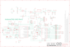

Contents
========

* [PRARREV3 > ](#prarrev3--)
	* [Schematic](#schematic)
	* [PCB](#pcb)
	* [Interactive BOM](#interactive-bom)
	* [OOMP Parts](#oomp-parts)
	* [Images](#images)
	* [Tags](#tags)
  
![][im]
# PRARREV3 > 

- ID: PROJ-ARDU-UNO-REV3-01
- Hex ID: PRARREV3
- Name: Arduino Rev3 Uno
- Description: Arduino Rev3 Uno
- Long Link: [http://oom.lt/PROJ-ARDU-UNO-REV3-01](http://oom.lt/PROJ-ARDU-UNO-REV3-01)
- Short Link: [http://oom.lt/PRARREV3](http://oom.lt/PRARREV3)

## Schematic
  

## PCB
  

## Interactive BOM

- Interactive BOM page: [ibom.html](https://htmlpreview.github.io/?https://github.com/oomlout/oomlout_OOMP_projects/blob/main/PROJ-ARDU-UNO-REV3-01/kicad/bom/ibom.html)

## OOMP Parts
  

|OOMP Parts|
| :---: |
|[HEAD-I01-X-PI06-01  2.54 mm 6 Pin Header  AD](https://github.com/oomlout/oomlout_OOMP_parts/tree/main/HEAD-I01-X-PI06-01/)|
|CAPC-0603-X-UNMATCHED-01 C1, C2, C4, C5, C6, C7, C9, C10, C11|
|[CAPC-0603-X-UF1-V25  SMD (0603) 1 uF Capacitor (Ceramic) 25v  C3, C8](https://github.com/oomlout/oomlout_OOMP_parts/tree/main/CAPC-0603-X-UF1-V25/)|
|DIOD-UNMATCHED-X-UNMATCHED-01 D1, D2, D3|
|UNMATCHED-UNMATCHED-X-UNMATCHED-01 F1, GROUND, PC1, PC2, RESET, RESET-EN, RN1, RN2, RN3, RN4, T1, U1, U3, U5, X1, X2, Y1, Y2, ZU4|
|[HEAD-I01-X-PI2X03-01  2.54 mm 6 Pin (2x3) Header  ICSP, ICSP1](https://github.com/oomlout/oomlout_OOMP_parts/tree/main/HEAD-I01-X-PI2X03-01/)|
|[HEAD-I01-X-PI10-01  2.54 mm 10 Pin Header  IOH](https://github.com/oomlout/oomlout_OOMP_parts/tree/main/HEAD-I01-X-PI10-01/)|
|[HEAD-I01-X-PI08-01  2.54 mm 8 Pin Header  IOL, POWER](https://github.com/oomlout/oomlout_OOMP_parts/tree/main/HEAD-I01-X-PI08-01/)|
|HEAD-I01-X-PI2X02-01 JP2|
|[LEDS-0805-Y-STAN-01  SMD (0805) Yellow LED  L, RX, TX](https://github.com/oomlout/oomlout_OOMP_parts/tree/main/LEDS-0805-Y-STAN-01/)|
|UNMATCHED-0805-X-UNMATCHED-01 L1, L2|
|[LEDS-0805-G-STAN-01  SMD (0805) Green LED  ON](https://github.com/oomlout/oomlout_OOMP_parts/tree/main/LEDS-0805-G-STAN-01/)|
|[RESE-0603-X-O105-01  SMD (0603) 1M Ohm Resistor  R1, R2](https://github.com/oomlout/oomlout_OOMP_parts/tree/main/RESE-0603-X-O105-01/)|
|UNMATCHED-SO23-X-UNMATCHED-01 U2|
|UNMATCHED-0603-X-UNMATCHED-01 Z1, Z2|

## Images
  
  

|bominteractivefront|bominteractiveback|kicadPcb3d|kicadPcb3dFront|kicadPcb3dBack|eagleImage|eagleSchemImage|
| :---: | :---: | :---: | :---: | :---: | :---: | :---: |
||||||||

## Tags

- hexID: PRARREV3
- oompType: PROJ
- oompSize: ARDU
- oompColor: UNO
- oompDesc: REV3
- oompIndex: 01
- sources: All source files from https://store.arduino.cc/collections/boards/products/arduino-uno-rev3
- linkBuyPage: https://store.arduino.cc/collections/boards/products/arduino-uno-rev3
- oompID: PROJ-ARDU-UNO-REV3-01
- oompParts: AD,HEAD-I01-X-PI06-01
- oompParts: C1,CAPC-0603-X-UNMATCHED-01
- oompParts: C2,CAPC-0603-X-UNMATCHED-01
- oompParts: C3,CAPC-0603-X-UF1-V25
- oompParts: C4,CAPC-0603-X-UNMATCHED-01
- oompParts: C5,CAPC-0603-X-UNMATCHED-01
- oompParts: C6,CAPC-0603-X-UNMATCHED-01
- oompParts: C7,CAPC-0603-X-UNMATCHED-01
- oompParts: C8,CAPC-0603-X-UF1-V25
- oompParts: C9,CAPC-0603-X-UNMATCHED-01
- oompParts: C10,CAPC-0603-X-UNMATCHED-01
- oompParts: C11,CAPC-0603-X-UNMATCHED-01
- oompParts: D1,DIOD-UNMATCHED-X-UNMATCHED-01
- oompParts: D2,DIOD-UNMATCHED-X-UNMATCHED-01
- oompParts: D3,DIOD-UNMATCHED-X-UNMATCHED-01
- oompParts: F1,UNMATCHED-UNMATCHED-X-UNMATCHED-01
- oompParts: GROUND,UNMATCHED-UNMATCHED-X-UNMATCHED-01
- oompParts: ICSP,HEAD-I01-X-PI2X03-01
- oompParts: ICSP1,HEAD-I01-X-PI2X03-01
- oompParts: IOH,HEAD-I01-X-PI10-01
- oompParts: IOL,HEAD-I01-X-PI08-01
- oompParts: JP2,HEAD-I01-X-PI2X02-01
- oompParts: L,LEDS-0805-Y-STAN-01
- oompParts: L1,UNMATCHED-0805-X-UNMATCHED-01
- oompParts: L2,UNMATCHED-0805-X-UNMATCHED-01
- oompParts: ON,LEDS-0805-G-STAN-01
- oompParts: PC1,UNMATCHED-UNMATCHED-X-UNMATCHED-01
- oompParts: PC2,UNMATCHED-UNMATCHED-X-UNMATCHED-01
- oompParts: POWER,HEAD-I01-X-PI08-01
- oompParts: R1,RESE-0603-X-O105-01
- oompParts: R2,RESE-0603-X-O105-01
- oompParts: RESET,UNMATCHED-UNMATCHED-X-UNMATCHED-01
- oompParts: RESET-EN,UNMATCHED-UNMATCHED-X-UNMATCHED-01
- oompParts: RN1,UNMATCHED-UNMATCHED-X-UNMATCHED-01
- oompParts: RN2,UNMATCHED-UNMATCHED-X-UNMATCHED-01
- oompParts: RN3,UNMATCHED-UNMATCHED-X-UNMATCHED-01
- oompParts: RN4,UNMATCHED-UNMATCHED-X-UNMATCHED-01
- oompParts: RX,LEDS-0805-Y-STAN-01
- oompParts: T1,UNMATCHED-UNMATCHED-X-UNMATCHED-01
- oompParts: TX,LEDS-0805-Y-STAN-01
- oompParts: U1,UNMATCHED-UNMATCHED-X-UNMATCHED-01
- oompParts: U2,UNMATCHED-SO23-X-UNMATCHED-01
- oompParts: U3,UNMATCHED-UNMATCHED-X-UNMATCHED-01
- oompParts: U5,UNMATCHED-UNMATCHED-X-UNMATCHED-01
- oompParts: X1,UNMATCHED-UNMATCHED-X-UNMATCHED-01
- oompParts: X2,UNMATCHED-UNMATCHED-X-UNMATCHED-01
- oompParts: Y1,UNMATCHED-UNMATCHED-X-UNMATCHED-01
- oompParts: Y2,UNMATCHED-UNMATCHED-X-UNMATCHED-01
- oompParts: Z1,UNMATCHED-0603-X-UNMATCHED-01
- oompParts: Z2,UNMATCHED-0603-X-UNMATCHED-01
- oompParts: ZU4,UNMATCHED-UNMATCHED-X-UNMATCHED-01
- rawParts: AD,6x1F-H8.5,PINHD-1X6,1X06,PIN HEADER,,,,,,,,,,,,,,,
- rawParts: C1,100n,C-EU0603-RND,C0603-ROUND,CAPACITOR, European symbol,,,,,,,,,,,,,,,
- rawParts: C2,100n,C-EU0603-RND,C0603-ROUND,CAPACITOR, European symbol,,,,,,,,,,,,,,,
- rawParts: C3,1u,C-EU0603-RND,C0603-ROUND,CAPACITOR, European symbol,,,,,,,,,,,,,,,
- rawParts: C4,100n,C-EU0603-RND,C0603-ROUND,CAPACITOR, European symbol,,,,,,,,,,,,,,,
- rawParts: C5,100n,C-EU0603-RND,C0603-ROUND,CAPACITOR, European symbol,,,,,,,,,,,,,,,
- rawParts: C6,100n,C-EU0603-RND,C0603-ROUND,CAPACITOR, European symbol,,,,,,,,,,,,,,,
- rawParts: C7,100n,C-EU0603-RND,C0603-ROUND,CAPACITOR, European symbol,,,,,,,,,,,,,,,
- rawParts: C8,1u,C-EU0603-RND,C0603-ROUND,CAPACITOR, European symbol,,,,,,,,,,,,,,,
- rawParts: C9,22p,C-EU0603-RND,C0603-ROUND,CAPACITOR, European symbol,,,,,,,,,,,,,,,
- rawParts: C10,100n,C-EU0603-RND,C0603-ROUND,CAPACITOR, European symbol,,,,,,,,,,,,,,,
- rawParts: C11,22p,C-EU0603-RND,C0603-ROUND,CAPACITOR, European symbol,,,,,,,,,,,,,,,
- rawParts: D1,M7,DIODE-SMB,SMB,DIODE,,,,,,,,,,,,,,,
- rawParts: D2,CD1206-S01575,DIODE-MINIMELF,MINIMELF,DIODE,,,,,,,,,,,,,,,
- rawParts: D3,CD1206-S01575,DIODE-MINIMELF,MINIMELF,DIODE,,,,,,,,,,,,,,,
- rawParts: F1,MF-MSMF050-2 500mA,L-EUL1812,L1812,INDUCTOR, European symbol,,,,,,,,,,,,,,,
- rawParts: FD1,FIDUCIALMOUNT,FIDUCIALMOUNT,FIDUCIA-MOUNT,,,,,,,,,,,,,,,,
- rawParts: FD2,FIDUCIALMOUNT,FIDUCIALMOUNT,FIDUCIA-MOUNT,,,,,,,,,,,,,,,,
- rawParts: FD3,FIDUCIALMOUNT,FIDUCIALMOUNT,FIDUCIA-MOUNT,,,,,,,,,,,,,,,,
- rawParts: FRAME1,DNP,A3-FRAME,FRAME,,,DNP,DNP,DNP,DNP,DNP,DNP,,DNP,,,,,DNP,
- rawParts: GND_TP,TP_SP,TP_SP,TP-SP,,,,,,,,,,,,,,,,
- rawParts: GND_TP1,TP_SP,TP_SP,TP-SP,,,,,,,,,,,,,,,,
- rawParts: GROUND,,SJ,SJ,SMD solder JUMPER,,,,,,,,,,,,,,,
- rawParts: ICSP,3x2 M,PINHD-2X3,2X03,PIN HEADER,,,,,,,,,,,,,,,
- rawParts: ICSP1,3x2 M,PINHD-2X3,2X03,PIN HEADER,,,,,,,,,,,,,,,
- rawParts: IOH,10x1F-H8.5,PINHD-1X10_ARD,1X10,PIN HEADER,,,,,,,,,,,,,,,
- rawParts: IOL,8x1F-H8.5,PINHD-1X8,1X08,PIN HEADER,,,,,,,,,,,,,,,
- rawParts: JP2,2x2 M - NM,PINHD-2X2,2X02,PIN HEADER,,,,,,,,,,,,,,,
- rawParts: L,YELLOW,LEDCHIP-LED0805,CHIP-LED0805,LED,,,,,,,,,,,,,,,
- rawParts: L1,BLM21,WE-CBF_0805,0805,SMD EMI Suppression Ferrite Beads,,,,,,,,,,,,,,,
- rawParts: L2,10uH,0715_CV201210-100K,0805,10uH 0805,0805,,,,,,,_____,,CV201210-100K,_____,_____,Induttanze,10uH,
- rawParts: ON,GREEN,LEDCHIP-LED0805,CHIP-LED0805,LED,,,,,,,,,,,,,,,
- rawParts: ORIGIN,TP_SP,TP_SP,TP-SP,,,,,,,,,,,,,,,,
- rawParts: PC1,47u,CPOL-EUD,PANASONIC_D,POLARIZED CAPACITOR, European symbol,,,,,,,,,,,,,,,
- rawParts: PC2,47u,CPOL-EUD,PANASONIC_D,POLARIZED CAPACITOR, European symbol,,,,,,,,,,,,,,,
- rawParts: POWER,8x1F-H8.5,PINHD-1X8,1X08,PIN HEADER,,,,,,,,,,,,,,,
- rawParts: R1,1M,R-EU_R0603,R0603-ROUND,RESISTOR, European symbol,,,,,,,,,,,,,,,
- rawParts: R2,1M,R-EU_R0603,R0603-ROUND,RESISTOR, European symbol,,,,,,,,,,,,,,,
- rawParts: RESET,TS42031-160R-TR-7260,TS42,TS42,TS42,,,,,,,,,,,,,,,
- rawParts: RESET-EN,,SJ,SJ,SMD solder JUMPER,,,,,,,,,,,,,,,
- rawParts: RN1,10K,4R-NCAY16,CAY16,Array Chip Resistor,,,,,,,,,,,,,,,
- rawParts: RN2,1K,4R-NCAY16,CAY16,Array Chip Resistor,,,,,,,,,,,,,,,
- rawParts: RN3,22R,4R-NCAY16,CAY16,Array Chip Resistor,,,,,,,,,,,,,,,
- rawParts: RN4,1K,4R-NCAY16,CAY16,Array Chip Resistor,,,,,,,,,,,,,,,
- rawParts: RX,YELLOW,LEDCHIP-LED0805,CHIP-LED0805,LED,,,,,,,,,,,,,,,
- rawParts: T1,FDN340P,PMOSSOT23,SOT-23,MOS FET,,,,,,,,,,,,,,,
- rawParts: TP_0,TP_SP,TP_SP,TP-SP,,,,,,,,,,,,,,,,
- rawParts: TP_1,TP_SP,TP_SP,TP-SP,,,,,,,,,,,,,,,,
- rawParts: TP_2,TP_SP,TP_SP,TP-SP,,,,,,,,,,,,,,,,
- rawParts: TP_3,TP_SP,TP_SP,TP-SP,,,,,,,,,,,,,,,,
- rawParts: TP_3V3,TP_SP,TP_SP,TP-SP,,,,,,,,,,,,,,,,
- rawParts: TP_4,TP_SP,TP_SP,TP-SP,,,,,,,,,,,,,,,,
- rawParts: TP_5,TP_SP,TP_SP,TP-SP,,,,,,,,,,,,,,,,
- rawParts: TP_5V,TP_SP,TP_SP,TP-SP,,,,,,,,,,,,,,,,
- rawParts: TP_5V1,TP_SP,TP_SP,TP-SP,,,,,,,,,,,,,,,,
- rawParts: TP_6,TP_SP,TP_SP,TP-SP,,,,,,,,,,,,,,,,
- rawParts: TP_7,TP_SP,TP_SP,TP-SP,,,,,,,,,,,,,,,,
- rawParts: TP_8,TP_SP,TP_SP,TP-SP,,,,,,,,,,,,,,,,
- rawParts: TP_9,TP_SP,TP_SP,TP-SP,,,,,,,,,,,,,,,,
- rawParts: TP_10,TP_SP,TP_SP,TP-SP,,,,,,,,,,,,,,,,
- rawParts: TP_11,TP_SP,TP_SP,TP-SP,,,,,,,,,,,,,,,,
- rawParts: TP_12,TP_SP,TP_SP,TP-SP,,,,,,,,,,,,,,,,
- rawParts: TP_13,TP_SP,TP_SP,TP-SP,,,,,,,,,,,,,,,,
- rawParts: TP_A0,TP_SP,TP_SP,TP-SP,,,,,,,,,,,,,,,,
- rawParts: TP_A1,TP_SP,TP_SP,TP-SP,,,,,,,,,,,,,,,,
- rawParts: TP_A2,TP_SP,TP_SP,TP-SP,,,,,,,,,,,,,,,,
- rawParts: TP_A3,TP_SP,TP_SP,TP-SP,,,,,,,,,,,,,,,,
- rawParts: TP_A4,TP_SP,TP_SP,TP-SP,,,,,,,,,,,,,,,,
- rawParts: TP_A5,TP_SP,TP_SP,TP-SP,,,,,,,,,,,,,,,,
- rawParts: TP_AREF,TP_SP,TP_SP,TP-SP,,,,,,,,,,,,,,,,
- rawParts: TP_CMP,TP_SP,TP_SP,TP-SP,,,,,,,,,,,,,,,,
- rawParts: TP_D+,TP_SP,TP_SP,TP-SP,,,,,,,,,,,,,,,,
- rawParts: TP_D-,TP_SP,TP_SP,TP-SP,,,,,,,,,,,,,,,,
- rawParts: TP_DTR,TP_SP,TP_SP,TP-SP,,,,,,,,,,,,,,,,
- rawParts: TP_GATE,TP_SP,TP_SP,TP-SP,,,,,,,,,,,,,,,,
- rawParts: TP_LCMD,TP_SP,TP_SP,TP-SP,,,,,,,,,,,,,,,,
- rawParts: TP_LL,TP_SP,TP_SP,TP-SP,,,,,,,,,,,,,,,,
- rawParts: TP_MISO2,TP_SP,TP_SP,TP-SP,,,,,,,,,,,,,,,,
- rawParts: TP_MOSI2,TP_SP,TP_SP,TP-SP,,,,,,,,,,,,,,,,
- rawParts: TP_ONL,TP_SP,TP_SP,TP-SP,,,,,,,,,,,,,,,,
- rawParts: TP_PB4,TP_SP,TP_SP,TP-SP,,,,,,,,,,,,,,,,
- rawParts: TP_PB5,TP_SP,TP_SP,TP-SP,,,,,,,,,,,,,,,,
- rawParts: TP_PB6,TP_SP,TP_SP,TP-SP,,,,,,,,,,,,,,,,
- rawParts: TP_PB7,TP_SP,TP_SP,TP-SP,,,,,,,,,,,,,,,,
- rawParts: TP_PWRIN,TP_SP,TP_SP,TP-SP,,,,,,,,,,,,,,,,
- rawParts: TP_RESET,TP_SP,TP_SP,TP-SP,,,,,,,,,,,,,,,,
- rawParts: TP_RESET2,TP_SP,TP_SP,TP-SP,,,,,,,,,,,,,,,,
- rawParts: TP_RX,TP_SP,TP_SP,TP-SP,,,,,,,,,,,,,,,,
- rawParts: TP_RXL,TP_SP,TP_SP,TP-SP,,,,,,,,,,,,,,,,
- rawParts: TP_SCK2,TP_SP,TP_SP,TP-SP,,,,,,,,,,,,,,,,
- rawParts: TP_SCL,TP_SP,TP_SP,TP-SP,,,,,,,,,,,,,,,,
- rawParts: TP_SDA,TP_SP,TP_SP,TP-SP,,,,,,,,,,,,,,,,
- rawParts: TP_TX,TP_SP,TP_SP,TP-SP,,,,,,,,,,,,,,,,
- rawParts: TP_TXL,TP_SP,TP_SP,TP-SP,,,,,,,,,,,,,,,,
- rawParts: TP_UGND,TP_SP,TP_SP,TP-SP,,,,,,,,,,,,,,,,
- rawParts: TP_USBVCC,TP_SP,TP_SP,TP-SP,,,,,,,,,,,,,,,,
- rawParts: TP_USH,TP_SP,TP_SP,TP-SP,,,,,,,,,,,,,,,,
- rawParts: TP_VIN,TP_SP,TP_SP,TP-SP,,,,,,,,,,,,,,,,
- rawParts: TP_VUCAP,TP_SP,TP_SP,TP-SP,,,,,,,,,,,,,,,,
- rawParts: TP_XT1,TP_SP,TP_SP,TP-SP,,,,,,,,,,,,,,,,
- rawParts: TP_XT2,TP_SP,TP_SP,TP-SP,,,,,,,,,,,,,,,,
- rawParts: TP_XT3,TP_SP,TP_SP,TP-SP,,,,,,,,,,,,,,,,
- rawParts: TP_XT4,TP_SP,TP_SP,TP-SP,,,,,,,,,,,,,,,,
- rawParts: TP_XUSB,TP_SP,TP_SP,TP-SP,,,,,,,,,,,,,,,,
- rawParts: TX,YELLOW,LEDCHIP-LED0805,CHIP-LED0805,LED,,,,,,,,,,,,,,,
- rawParts: U1,NCP1117ST50T3G,MC33269ST-3.3T3,SOT223,Adjustable Output Low Dropout Voltage Regulator 800 mA,,,,,,,,,,,,,,,
- rawParts: U2,LP2985-33DBVR,LP2985-XXDBVR33,SOT23-DBV,ULTRALOW-POWER 50-mA LOW-DROPOUT LINEAR REGULATORS,,,,,,,,,,,,,,,
- rawParts: U3,ATMEGA16U2-MU(R),ATMEGA16U2-MU,MLF32,,,,,,,,,,,,,,,,
- rawParts: U5,LMV358IDGKR,LMV358MMX,MSOP08,Dual General Purpose, Low Voltage, Rail-to-Rail Output Operational Amplifiers,,,,,,,,,,,,,,,
- rawParts: X1,POWERSUPPLY_DC21MMX,POWERSUPPLY_DC21MMX,POWERSUPPLY_DC-21MM,,,,,,,,,,,,,,,,
- rawParts: X2,USB-B_TH,PN61729,PN61729,BERG USB connector,,,,,,,,,,,,,,,
- rawParts: Y1,16MHz,XTAL/S,QS,CRYSTAL,,,,,,,,,,,,,,,
- rawParts: Y2,CSTCE16M0V53-R0 16MHZ,RESONATORMU,RESONATOR,,,,,,,,,,,,,,,,
- rawParts: Z1,CG0603MLC-05E,VARISTORCN0603,CT/CN0603,VARISTOR,,,,,,,,,,,,,,,
- rawParts: Z2,CG0603MLC-05E,VARISTORCN0603,CT/CN0603,VARISTOR,,,,,,,,,,,,,,,
- rawParts: ZU4,ATMEGA328P-PU,ATMEGA328P-PU,DIL28-3,MICROCONTROLLER,,,,,,,,,,,,,,,

[im]: kicadPcb3d_450.png
