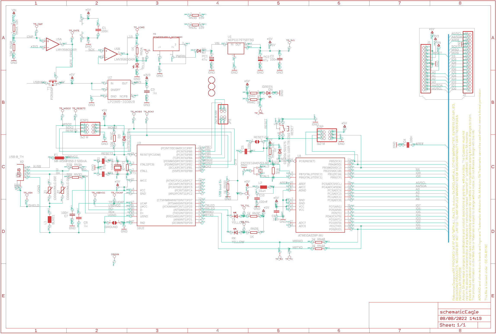
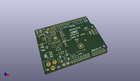
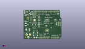
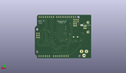
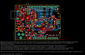
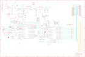

Contents
========

* [PRARREV3 > Arduino Rev3 Uno (SMD)](#prarrev3--arduino-rev3-uno-smd)
	* [Schematic](#schematic)
	* [Interactive BOM](#interactive-bom)
	* [OOMP Parts](#oomp-parts)
	* [Images](#images)
	* [Tags](#tags)
  
![][im]
# PRARREV3 > Arduino Rev3 Uno (SMD)

- ID: PROJ-ARDU-UNO-REV3-SM
- Hex ID: PRARREV3
- Name: Arduino Rev3 Uno (SMD)
- Description: Arduino Rev3 Uno (SMD)
- Long Link: [http://oom.lt/PROJ-ARDU-UNO-REV3-SM](http://oom.lt/PROJ-ARDU-UNO-REV3-SM)
- Short Link: [http://oom.lt/PRARREV3](http://oom.lt/PRARREV3)

## Schematic
  

## Interactive BOM

- Interactive BOM page: [ibom.html](https://htmlpreview.github.io/?https://github.com/oomlout/oomlout_OOMP_projects/blob/main/PROJ-ARDU-UNO-REV3-SM/kicad/bom/ibom.html)

## OOMP Parts
  

|OOMP Parts|
| :---: |
|C1,CAPC-0603-X-UNMATCHED-01,C1,100n,C-EU0603-RND,C0603-ROUND,CAPACITOR, European symbol,,,,,,,,,,,,,,,|
|C2,CAPC-0603-X-UNMATCHED-01,C2,100n,C-EU0603-RND,C0603-ROUND,CAPACITOR, European symbol,,,,,,,,,,,,,,,|
|C3,CAPC-0603-X-UNMATCHED-01,C3,1u,C-EU0603-RND,C0603-ROUND,CAPACITOR, European symbol,,,,,,,,,,,,,,,|
|C4,CAPC-0603-X-UNMATCHED-01,C4,100n,C-EU0603-RND,C0603-ROUND,CAPACITOR, European symbol,,,,,,,,,,,,,,,|
|C5,CAPC-0603-X-UNMATCHED-01,C5,100n,C-EU0603-RND,C0603-ROUND,CAPACITOR, European symbol,,,,,,,,,,,,,,,|
|C6,CAPC-0603-X-UNMATCHED-01,C6,100n,C-EU0603-RND,C0603-ROUND,CAPACITOR, European symbol,,,,,,,,,,,,,,,|
|C7,CAPC-0603-X-UNMATCHED-01,C7,100n,C-EU0603-RND,C0603-ROUND,CAPACITOR, European symbol,,,,,,,,,,,,,,,|
|C8,CAPC-0603-X-UNMATCHED-01,C8,1u,C-EU0603-RND,C0603-ROUND,CAPACITOR, European symbol,,,,,,,,,,,,,,,|
|C9,CAPC-0603-X-UNMATCHED-01,C9,22p,C-EU0603-RND,C0603-ROUND,CAPACITOR, European symbol,,,,,,,,,,,,,,,|
|C10,CAPC-0603-X-UNMATCHED-01,C10,100nF,0015_100NF_0603,C0603-ROUND,100nF 0603,0603,,,,,,,,_____,100nF_0603,_____,_____,Condensatori,100nF,|
|C11,CAPC-0603-X-UNMATCHED-01,C11,22p,C-EU0603-RND,C0603-ROUND,CAPACITOR, European symbol,,,,,,,,,,,,,,,|
|D1,DIOD-UNMATCHED-X-UNMATCHED-01,D1,M7,DIODE-SMB,SMB,DIODE,,,,,,,,,,,,,,,|
|D2,DIOD-UNMATCHED-X-UNMATCHED-01,D2,CD1206-S01575,DIODE-MINIMELF,MINIMELF,DIODE,,,,,,,,,,,,,,,|
|D3,DIOD-UNMATCHED-X-UNMATCHED-01,D3,CD1206-S01575,DIODE-MINIMELF,MINIMELF,DIODE,,,,,,,,,,,,,,,|
|F1,UNMATCHED-UNMATCHED-X-UNMATCHED-01,F1,MF-MSMF050-2 500mA,L-EUL1812,L1812,INDUCTOR, European symbol,,,,,,,,,,,,,,,|
|GROUND,UNMATCHED-UNMATCHED-X-UNMATCHED-01,FD1,DNP,FIDUCIAL-1.5MM,FD-1-1.5,Fiducial mount,,,DNP,DNP,DNP,DNP,DNP,,,,,,,DNP,|
|ICSP,UNMATCHED-UNMATCHED-X-UNMATCHED-01,FD2,DNP,FIDUCIAL-1.5MM,FD-1-1.5,Fiducial mount,,,DNP,DNP,DNP,DNP,DNP,,,,,,,DNP,|
|ICSP1,UNMATCHED-UNMATCHED-X-UNMATCHED-01,FD3,DNP,FIDUCIAL-1.5MM,FD-1-1.5,Fiducial mount,,,DNP,DNP,DNP,DNP,DNP,,,,,,,DNP,|
|J1,UNMATCHED-UNMATCHED-X-UNMATCHED-01,FRAME1,DNP,A3-FRAME-STANDARD,FRAME,Schematic frame,,DNP,DNP,DNP,DNP,DNP,DNP,,,,,,,DNP,|
|J2,UNMATCHED-UNMATCHED-X-UNMATCHED-01,GROUND,,SJ,SJ,SMD solder JUMPER,,,,,,,,,,,,,,,|
|JP2,UNMATCHED-UNMATCHED-X-UNMATCHED-01,ICSP,3x2 M,PINHD-2X3,2X03,PIN HEADER,,,,,,,,,,,,,,,|
|L,LEDS-0805-G-STAN-01,ICSP1,3x2 M,PINHD-2X3,2X03,PIN HEADER,,,,,,,,,,,,,,,|
|L1,UNMATCHED-0805-X-UNMATCHED-01,J1,-,PINHD-1X14-CUSTOM,1X14-CUSTOM,PIN HEADER,,,-,,-,-,-,,,,,,,-,|
|L2,UNMATCHED-0805-X-UNMATCHED-01,J2,-,PINHD-1X18,1X18-CUSTOM,,,,-,-,-,,-,-,,,,,,-,|
|ON,LEDS-0805-G-STAN-01,JP2,2x2 M-NM,PINHD-2X2,2X02,PIN HEADER,,,,,,,,,,,,,,,|
|ORIGIN,UNMATCHED-UNMATCHED-X-UNMATCHED-01,L,YELLOW,LEDCHIP-LED0805,CHIP-LED0805,LED,,,,,,,,,,,,,,,|
|PC1,UNMATCHED-UNMATCHED-X-UNMATCHED-01,L1,BLM21,WE-CBF_0805,0805,SMD EMI Suppression Ferrite Beads,,,,,,,,,,,,,,,|
|PC2,UNMATCHED-UNMATCHED-X-UNMATCHED-01,L2,10uH,0715_CV201210-100K,0805,10uH 0805,0805,,,,,,,,_____,CV201210-100K,_____,_____,Induttanze,10uH,|
|R1,RESE-0603-X-O105-01,ON,GREEN,LEDCHIP-LED0805,CHIP-LED0805,LED,,,,,,,,,,,,,,,|
|R2,RESE-0603-X-O105-01,ORIGIN,TP_SP,TP_SP,TP-SP,,,,,,,,,,,,,,,,|
|RESET,UNMATCHED-UNMATCHED-X-UNMATCHED-01,PC1,47u,CPOL-EUD,PANASONIC_D,POLARIZED CAPACITOR, European symbol,,,,,,,,,,,,,,,|
|RESET-EN,UNMATCHED-UNMATCHED-X-UNMATCHED-01,PC2,47u,CPOL-EUD,PANASONIC_D,POLARIZED CAPACITOR, European symbol,,,,,,,,,,,,,,,|
|RN1,UNMATCHED-UNMATCHED-X-UNMATCHED-01,R1,1M,R-EU_R0603,R0603-ROUND,RESISTOR, European symbol,,,,,,,,,,,,,,,|
|RN2,UNMATCHED-UNMATCHED-X-UNMATCHED-01,R2,1M,R-EU_R0603,R0603-ROUND,RESISTOR, European symbol,,,,,,,,,,,,,,,|
|RN3,UNMATCHED-UNMATCHED-X-UNMATCHED-01,RESET,TS42031-160R-TR-7260,TS42,TS42,TS42,,,,,,,,,,,,,,,|
|RN4,UNMATCHED-UNMATCHED-X-UNMATCHED-01,RESET-EN,,SJ,SJ,SMD solder JUMPER,,,,,,,,,,,,,,,|
|RX,LEDS-0805-G-STAN-01,RN1,10K,4R-NCAY16,CAY16,Array Chip Resistor,,,,,,,,,,,,,,,|
|T1,UNMATCHED-UNMATCHED-X-UNMATCHED-01,RN2,1K,4R-NCAY16,CAY16,Array Chip Resistor,,,,,,,,,,,,,,,|
|TP_5V1,UNMATCHED-UNMATCHED-X-UNMATCHED-01,RN3,22R,4R-NCAY16,CAY16,Array Chip Resistor,,,,,,,,,,,,,,,|
|TP_CMP,UNMATCHED-UNMATCHED-X-UNMATCHED-01,RN4,1K,4R-NCAY16,CAY16,Array Chip Resistor,,,,,,,,,,,,,,,|
|TP_DTR,UNMATCHED-UNMATCHED-X-UNMATCHED-01,RX,YELLOW,LEDCHIP-LED0805,CHIP-LED0805,LED,,,,,,,,,,,,,,,|
|TP_GATE,UNMATCHED-UNMATCHED-X-UNMATCHED-01,T1,FDN340P,PMOSSOT23,SOT-23,MOS FET,,,,,,,,,,,,,,,|
|TP_LCMD,UNMATCHED-UNMATCHED-X-UNMATCHED-01,TP_5V1,TP_SP,TP_SP,TP-SP,,,,,,,,,,,,,,,,|
|TP_LL,UNMATCHED-UNMATCHED-X-UNMATCHED-01,TP_CMP,TP_SP,TP_SP,TP-SP,,,,,,,,,,,,,,,,|
|TP_MISO2,UNMATCHED-UNMATCHED-X-UNMATCHED-01,TP_DTR,TP_SP,TP_SP,TP-SP,,,,,,,,,,,,,,,,|
|TP_MOSI2,UNMATCHED-UNMATCHED-X-UNMATCHED-01,TP_GATE,TP_SP,TP_SP,TP-SP,,,,,,,,,,,,,,,,|
|TP_ONL,UNMATCHED-UNMATCHED-X-UNMATCHED-01,TP_LCMD,TP_SP,TP_SP,TP-SP,,,,,,,,,,,,,,,,|
|TP_RESET2,UNMATCHED-UNMATCHED-X-UNMATCHED-01,TP_LL,TP_SP,TP_SP,TP-SP,,,,,,,,,,,,,,,,|
|TP_RX,UNMATCHED-UNMATCHED-X-UNMATCHED-01,TP_MISO2,TP_SP,TP_SP,TP-SP,,,,,,,,,,,,,,,,|
|TP_RXL,UNMATCHED-UNMATCHED-X-UNMATCHED-01,TP_MOSI2,TP_SP,TP_SP,TP-SP,,,,,,,,,,,,,,,,|
|TP_SCK2,UNMATCHED-UNMATCHED-X-UNMATCHED-01,TP_ONL,TP_SP,TP_SP,TP-SP,,,,,,,,,,,,,,,,|
|TP_TX,UNMATCHED-UNMATCHED-X-UNMATCHED-01,TP_RESET2,TP_SP,TP_SP,TP-SP,,,,,,,,,,,,,,,,|
|TP_TXL,UNMATCHED-UNMATCHED-X-UNMATCHED-01,TP_RX,TP_SP,TP_SP,TP-SP,,,,,,,,,,,,,,,,|
|TP_USBVCC,UNMATCHED-UNMATCHED-X-UNMATCHED-01,TP_RXL,TP_SP,TP_SP,TP-SP,,,,,,,,,,,,,,,,|
|TP_USH,UNMATCHED-UNMATCHED-X-UNMATCHED-01,TP_SCK2,TP_SP,TP_SP,TP-SP,,,,,,,,,,,,,,,,|
|TP_VUCAP,UNMATCHED-UNMATCHED-X-UNMATCHED-01,TP_TX,TP_SP,TP_SP,TP-SP,,,,,,,,,,,,,,,,|
|TX,LEDS-0805-G-STAN-01,TP_TXL,TP_SP,TP_SP,TP-SP,,,,,,,,,,,,,,,,|
|U1,UNMATCHED-UNMATCHED-X-UNMATCHED-01,TP_USBVCC,TP_SP,TP_SP,TP-SP,,,,,,,,,,,,,,,,|
|U2,UNMATCHED-SO23-X-UNMATCHED-01,TP_USH,TP_SP,TP_SP,TP-SP,,,,,,,,,,,,,,,,|
|U3,UNMATCHED-UNMATCHED-X-UNMATCHED-01,TP_VUCAP,TP_SP,TP_SP,TP-SP,,,,,,,,,,,,,,,,|
|U4,UNMATCHED-UNMATCHED-X-UNMATCHED-01,TX,YELLOW,LEDCHIP-LED0805,CHIP-LED0805,LED,,,,,,,,,,,,,,,|
|U5,UNMATCHED-UNMATCHED-X-UNMATCHED-01,U1,NCP1117ST50T3G,MC33269ST-3.3T3,SOT223,Adjustable Output Low Dropout Voltage Regulator 800 mA,,,,,,,,,,,,,,,|
|X1,UNMATCHED-UNMATCHED-X-UNMATCHED-01,U2,LP2985-33DBVR,LP2985-XXDBVR33,SOT23-DBV,ULTRALOW-POWER 50-mA LOW-DROPOUT LINEAR REGULATORS,,,,,,,,,,,,,,,|
|X2,UNMATCHED-UNMATCHED-X-UNMATCHED-01,U3,16U2,ATMEGA16U2,ATMEL_QFN32,AVR AVR® ATmega Microcontroller IC 8-Bit 16MHz 16KB (8K x 16) FLASH 32-VQFN (5x5),,,http://www.digikey.com/product-detail/en/atmel/ATMEGA16U2-MU/ATMEGA16U2-MU-ND/2050821,http://www.digikey.com/product-detail/en/atmel/ATMEGA16U2-MU/ATMEGA16U2-MU-ND/2050821,ATMEGA16U2-MU-ND,ATMEL,ATMEGA16U2-MU,,,,,,,16U2,|
|Y1,UNMATCHED-UNMATCHED-X-UNMATCHED-01,U4,ATMEGA328P-MU,ATMEGAXX8-MUR,MLF32,MICROCONTROLLER,,,,,,,,,,,,,,,|
|Y2,UNMATCHED-UNMATCHED-X-UNMATCHED-01,U5,LMV358IDGKR,LMV358MMX,MSOP08,Dual General Purpose, Low Voltage, Rail-to-Rail Output Operational Amplifiers,,,,,,,,,,,,,,,|
|Z1,UNMATCHED-0603-X-UNMATCHED-01,X1,POWERSUPPLY_DC21MMX,POWERSUPPLY_DC21MMX,POWERSUPPLY_DC-21MM,,,,,,,,,,,,,,,,|
|Z2,UNMATCHED-0603-X-UNMATCHED-01,X2,USB-B_TH,PN61729,PN61729,BERG USB connector,,,,,,,,,,,,,,,|

## Images
  
  

|kicadPcb3d|kicadPcb3dFront|kicadPcb3dBack|eagleImage|eagleSchemImage|
| :---: | :---: | :---: | :---: | :---: |
||||||

## Tags

- hexID: PRARREV3
- oompType: PROJ
- oompSize: ARDU
- oompColor: UNO
- oompDesc: REV3
- oompIndex: SM
- sources: All source files from https://store.arduino.cc/collections/boards/products/arduino-uno-rev3-smd
- linkBuyPage: https://store.arduino.cc/collections/boards/products/arduino-uno-rev3-smd
- oompID: PROJ-ARDU-UNO-REV3-SM
- oompParts: C1,CAPC-0603-X-UNMATCHED-01
- oompParts: C2,CAPC-0603-X-UNMATCHED-01
- oompParts: C3,CAPC-0603-X-UNMATCHED-01
- oompParts: C4,CAPC-0603-X-UNMATCHED-01
- oompParts: C5,CAPC-0603-X-UNMATCHED-01
- oompParts: C6,CAPC-0603-X-UNMATCHED-01
- oompParts: C7,CAPC-0603-X-UNMATCHED-01
- oompParts: C8,CAPC-0603-X-UNMATCHED-01
- oompParts: C9,CAPC-0603-X-UNMATCHED-01
- oompParts: C10,CAPC-0603-X-UNMATCHED-01
- oompParts: C11,CAPC-0603-X-UNMATCHED-01
- oompParts: D1,DIOD-UNMATCHED-X-UNMATCHED-01
- oompParts: D2,DIOD-UNMATCHED-X-UNMATCHED-01
- oompParts: D3,DIOD-UNMATCHED-X-UNMATCHED-01
- oompParts: F1,UNMATCHED-UNMATCHED-X-UNMATCHED-01
- oompParts: GROUND,UNMATCHED-UNMATCHED-X-UNMATCHED-01
- oompParts: ICSP,UNMATCHED-UNMATCHED-X-UNMATCHED-01
- oompParts: ICSP1,UNMATCHED-UNMATCHED-X-UNMATCHED-01
- oompParts: J1,UNMATCHED-UNMATCHED-X-UNMATCHED-01
- oompParts: J2,UNMATCHED-UNMATCHED-X-UNMATCHED-01
- oompParts: JP2,UNMATCHED-UNMATCHED-X-UNMATCHED-01
- oompParts: L,LEDS-0805-G-STAN-01
- oompParts: L1,UNMATCHED-0805-X-UNMATCHED-01
- oompParts: L2,UNMATCHED-0805-X-UNMATCHED-01
- oompParts: ON,LEDS-0805-G-STAN-01
- oompParts: ORIGIN,UNMATCHED-UNMATCHED-X-UNMATCHED-01
- oompParts: PC1,UNMATCHED-UNMATCHED-X-UNMATCHED-01
- oompParts: PC2,UNMATCHED-UNMATCHED-X-UNMATCHED-01
- oompParts: R1,RESE-0603-X-O105-01
- oompParts: R2,RESE-0603-X-O105-01
- oompParts: RESET,UNMATCHED-UNMATCHED-X-UNMATCHED-01
- oompParts: RESET-EN,UNMATCHED-UNMATCHED-X-UNMATCHED-01
- oompParts: RN1,UNMATCHED-UNMATCHED-X-UNMATCHED-01
- oompParts: RN2,UNMATCHED-UNMATCHED-X-UNMATCHED-01
- oompParts: RN3,UNMATCHED-UNMATCHED-X-UNMATCHED-01
- oompParts: RN4,UNMATCHED-UNMATCHED-X-UNMATCHED-01
- oompParts: RX,LEDS-0805-G-STAN-01
- oompParts: T1,UNMATCHED-UNMATCHED-X-UNMATCHED-01
- oompParts: TP_5V1,UNMATCHED-UNMATCHED-X-UNMATCHED-01
- oompParts: TP_CMP,UNMATCHED-UNMATCHED-X-UNMATCHED-01
- oompParts: TP_DTR,UNMATCHED-UNMATCHED-X-UNMATCHED-01
- oompParts: TP_GATE,UNMATCHED-UNMATCHED-X-UNMATCHED-01
- oompParts: TP_LCMD,UNMATCHED-UNMATCHED-X-UNMATCHED-01
- oompParts: TP_LL,UNMATCHED-UNMATCHED-X-UNMATCHED-01
- oompParts: TP_MISO2,UNMATCHED-UNMATCHED-X-UNMATCHED-01
- oompParts: TP_MOSI2,UNMATCHED-UNMATCHED-X-UNMATCHED-01
- oompParts: TP_ONL,UNMATCHED-UNMATCHED-X-UNMATCHED-01
- oompParts: TP_RESET2,UNMATCHED-UNMATCHED-X-UNMATCHED-01
- oompParts: TP_RX,UNMATCHED-UNMATCHED-X-UNMATCHED-01
- oompParts: TP_RXL,UNMATCHED-UNMATCHED-X-UNMATCHED-01
- oompParts: TP_SCK2,UNMATCHED-UNMATCHED-X-UNMATCHED-01
- oompParts: TP_TX,UNMATCHED-UNMATCHED-X-UNMATCHED-01
- oompParts: TP_TXL,UNMATCHED-UNMATCHED-X-UNMATCHED-01
- oompParts: TP_USBVCC,UNMATCHED-UNMATCHED-X-UNMATCHED-01
- oompParts: TP_USH,UNMATCHED-UNMATCHED-X-UNMATCHED-01
- oompParts: TP_VUCAP,UNMATCHED-UNMATCHED-X-UNMATCHED-01
- oompParts: TX,LEDS-0805-G-STAN-01
- oompParts: U1,UNMATCHED-UNMATCHED-X-UNMATCHED-01
- oompParts: U2,UNMATCHED-SO23-X-UNMATCHED-01
- oompParts: U3,UNMATCHED-UNMATCHED-X-UNMATCHED-01
- oompParts: U4,UNMATCHED-UNMATCHED-X-UNMATCHED-01
- oompParts: U5,UNMATCHED-UNMATCHED-X-UNMATCHED-01
- oompParts: X1,UNMATCHED-UNMATCHED-X-UNMATCHED-01
- oompParts: X2,UNMATCHED-UNMATCHED-X-UNMATCHED-01
- oompParts: Y1,UNMATCHED-UNMATCHED-X-UNMATCHED-01
- oompParts: Y2,UNMATCHED-UNMATCHED-X-UNMATCHED-01
- oompParts: Z1,UNMATCHED-0603-X-UNMATCHED-01
- oompParts: Z2,UNMATCHED-0603-X-UNMATCHED-01
- rawParts: C1,100n,C-EU0603-RND,C0603-ROUND,CAPACITOR, European symbol,,,,,,,,,,,,,,,
- rawParts: C2,100n,C-EU0603-RND,C0603-ROUND,CAPACITOR, European symbol,,,,,,,,,,,,,,,
- rawParts: C3,1u,C-EU0603-RND,C0603-ROUND,CAPACITOR, European symbol,,,,,,,,,,,,,,,
- rawParts: C4,100n,C-EU0603-RND,C0603-ROUND,CAPACITOR, European symbol,,,,,,,,,,,,,,,
- rawParts: C5,100n,C-EU0603-RND,C0603-ROUND,CAPACITOR, European symbol,,,,,,,,,,,,,,,
- rawParts: C6,100n,C-EU0603-RND,C0603-ROUND,CAPACITOR, European symbol,,,,,,,,,,,,,,,
- rawParts: C7,100n,C-EU0603-RND,C0603-ROUND,CAPACITOR, European symbol,,,,,,,,,,,,,,,
- rawParts: C8,1u,C-EU0603-RND,C0603-ROUND,CAPACITOR, European symbol,,,,,,,,,,,,,,,
- rawParts: C9,22p,C-EU0603-RND,C0603-ROUND,CAPACITOR, European symbol,,,,,,,,,,,,,,,
- rawParts: C10,100nF,0015_100NF_0603,C0603-ROUND,100nF 0603,0603,,,,,,,,_____,100nF_0603,_____,_____,Condensatori,100nF,
- rawParts: C11,22p,C-EU0603-RND,C0603-ROUND,CAPACITOR, European symbol,,,,,,,,,,,,,,,
- rawParts: D1,M7,DIODE-SMB,SMB,DIODE,,,,,,,,,,,,,,,
- rawParts: D2,CD1206-S01575,DIODE-MINIMELF,MINIMELF,DIODE,,,,,,,,,,,,,,,
- rawParts: D3,CD1206-S01575,DIODE-MINIMELF,MINIMELF,DIODE,,,,,,,,,,,,,,,
- rawParts: F1,MF-MSMF050-2 500mA,L-EUL1812,L1812,INDUCTOR, European symbol,,,,,,,,,,,,,,,
- rawParts: FD1,DNP,FIDUCIAL-1.5MM,FD-1-1.5,Fiducial mount,,,DNP,DNP,DNP,DNP,DNP,,,,,,,DNP,
- rawParts: FD2,DNP,FIDUCIAL-1.5MM,FD-1-1.5,Fiducial mount,,,DNP,DNP,DNP,DNP,DNP,,,,,,,DNP,
- rawParts: FD3,DNP,FIDUCIAL-1.5MM,FD-1-1.5,Fiducial mount,,,DNP,DNP,DNP,DNP,DNP,,,,,,,DNP,
- rawParts: FRAME1,DNP,A3-FRAME-STANDARD,FRAME,Schematic frame,,DNP,DNP,DNP,DNP,DNP,DNP,,,,,,,DNP,
- rawParts: GROUND,,SJ,SJ,SMD solder JUMPER,,,,,,,,,,,,,,,
- rawParts: ICSP,3x2 M,PINHD-2X3,2X03,PIN HEADER,,,,,,,,,,,,,,,
- rawParts: ICSP1,3x2 M,PINHD-2X3,2X03,PIN HEADER,,,,,,,,,,,,,,,
- rawParts: J1,-,PINHD-1X14-CUSTOM,1X14-CUSTOM,PIN HEADER,,,-,,-,-,-,,,,,,,-,
- rawParts: J2,-,PINHD-1X18,1X18-CUSTOM,,,,-,-,-,,-,-,,,,,,-,
- rawParts: JP2,2x2 M-NM,PINHD-2X2,2X02,PIN HEADER,,,,,,,,,,,,,,,
- rawParts: L,YELLOW,LEDCHIP-LED0805,CHIP-LED0805,LED,,,,,,,,,,,,,,,
- rawParts: L1,BLM21,WE-CBF_0805,0805,SMD EMI Suppression Ferrite Beads,,,,,,,,,,,,,,,
- rawParts: L2,10uH,0715_CV201210-100K,0805,10uH 0805,0805,,,,,,,,_____,CV201210-100K,_____,_____,Induttanze,10uH,
- rawParts: ON,GREEN,LEDCHIP-LED0805,CHIP-LED0805,LED,,,,,,,,,,,,,,,
- rawParts: ORIGIN,TP_SP,TP_SP,TP-SP,,,,,,,,,,,,,,,,
- rawParts: PC1,47u,CPOL-EUD,PANASONIC_D,POLARIZED CAPACITOR, European symbol,,,,,,,,,,,,,,,
- rawParts: PC2,47u,CPOL-EUD,PANASONIC_D,POLARIZED CAPACITOR, European symbol,,,,,,,,,,,,,,,
- rawParts: R1,1M,R-EU_R0603,R0603-ROUND,RESISTOR, European symbol,,,,,,,,,,,,,,,
- rawParts: R2,1M,R-EU_R0603,R0603-ROUND,RESISTOR, European symbol,,,,,,,,,,,,,,,
- rawParts: RESET,TS42031-160R-TR-7260,TS42,TS42,TS42,,,,,,,,,,,,,,,
- rawParts: RESET-EN,,SJ,SJ,SMD solder JUMPER,,,,,,,,,,,,,,,
- rawParts: RN1,10K,4R-NCAY16,CAY16,Array Chip Resistor,,,,,,,,,,,,,,,
- rawParts: RN2,1K,4R-NCAY16,CAY16,Array Chip Resistor,,,,,,,,,,,,,,,
- rawParts: RN3,22R,4R-NCAY16,CAY16,Array Chip Resistor,,,,,,,,,,,,,,,
- rawParts: RN4,1K,4R-NCAY16,CAY16,Array Chip Resistor,,,,,,,,,,,,,,,
- rawParts: RX,YELLOW,LEDCHIP-LED0805,CHIP-LED0805,LED,,,,,,,,,,,,,,,
- rawParts: T1,FDN340P,PMOSSOT23,SOT-23,MOS FET,,,,,,,,,,,,,,,
- rawParts: TP_5V1,TP_SP,TP_SP,TP-SP,,,,,,,,,,,,,,,,
- rawParts: TP_CMP,TP_SP,TP_SP,TP-SP,,,,,,,,,,,,,,,,
- rawParts: TP_DTR,TP_SP,TP_SP,TP-SP,,,,,,,,,,,,,,,,
- rawParts: TP_GATE,TP_SP,TP_SP,TP-SP,,,,,,,,,,,,,,,,
- rawParts: TP_LCMD,TP_SP,TP_SP,TP-SP,,,,,,,,,,,,,,,,
- rawParts: TP_LL,TP_SP,TP_SP,TP-SP,,,,,,,,,,,,,,,,
- rawParts: TP_MISO2,TP_SP,TP_SP,TP-SP,,,,,,,,,,,,,,,,
- rawParts: TP_MOSI2,TP_SP,TP_SP,TP-SP,,,,,,,,,,,,,,,,
- rawParts: TP_ONL,TP_SP,TP_SP,TP-SP,,,,,,,,,,,,,,,,
- rawParts: TP_RESET2,TP_SP,TP_SP,TP-SP,,,,,,,,,,,,,,,,
- rawParts: TP_RX,TP_SP,TP_SP,TP-SP,,,,,,,,,,,,,,,,
- rawParts: TP_RXL,TP_SP,TP_SP,TP-SP,,,,,,,,,,,,,,,,
- rawParts: TP_SCK2,TP_SP,TP_SP,TP-SP,,,,,,,,,,,,,,,,
- rawParts: TP_TX,TP_SP,TP_SP,TP-SP,,,,,,,,,,,,,,,,
- rawParts: TP_TXL,TP_SP,TP_SP,TP-SP,,,,,,,,,,,,,,,,
- rawParts: TP_USBVCC,TP_SP,TP_SP,TP-SP,,,,,,,,,,,,,,,,
- rawParts: TP_USH,TP_SP,TP_SP,TP-SP,,,,,,,,,,,,,,,,
- rawParts: TP_VUCAP,TP_SP,TP_SP,TP-SP,,,,,,,,,,,,,,,,
- rawParts: TX,YELLOW,LEDCHIP-LED0805,CHIP-LED0805,LED,,,,,,,,,,,,,,,
- rawParts: U1,NCP1117ST50T3G,MC33269ST-3.3T3,SOT223,Adjustable Output Low Dropout Voltage Regulator 800 mA,,,,,,,,,,,,,,,
- rawParts: U2,LP2985-33DBVR,LP2985-XXDBVR33,SOT23-DBV,ULTRALOW-POWER 50-mA LOW-DROPOUT LINEAR REGULATORS,,,,,,,,,,,,,,,
- rawParts: U3,16U2,ATMEGA16U2,ATMEL_QFN32,AVR AVR® ATmega Microcontroller IC 8-Bit 16MHz 16KB (8K x 16) FLASH 32-VQFN (5x5),,,http://www.digikey.com/product-detail/en/atmel/ATMEGA16U2-MU/ATMEGA16U2-MU-ND/2050821,http://www.digikey.com/product-detail/en/atmel/ATMEGA16U2-MU/ATMEGA16U2-MU-ND/2050821,ATMEGA16U2-MU-ND,ATMEL,ATMEGA16U2-MU,,,,,,,16U2,
- rawParts: U4,ATMEGA328P-MU,ATMEGAXX8-MUR,MLF32,MICROCONTROLLER,,,,,,,,,,,,,,,
- rawParts: U5,LMV358IDGKR,LMV358MMX,MSOP08,Dual General Purpose, Low Voltage, Rail-to-Rail Output Operational Amplifiers,,,,,,,,,,,,,,,
- rawParts: X1,POWERSUPPLY_DC21MMX,POWERSUPPLY_DC21MMX,POWERSUPPLY_DC-21MM,,,,,,,,,,,,,,,,
- rawParts: X2,USB-B_TH,PN61729,PN61729,BERG USB connector,,,,,,,,,,,,,,,
- rawParts: Y1,16MHz,XTAL/S,QS,CRYSTAL,,,,,,,,,,,,,,,
- rawParts: Y2,CSTCE16M0V53-R0 16MHZ,RESONATORMU,RESONATOR,,,,,,,,,,,,,,,,
- rawParts: Z1,CG0603MLC-05E,VARISTORCN0603,CT/CN0603,VARISTOR,,,,,,,,,,,,,,,
- rawParts: Z2,CG0603MLC-05E,VARISTORCN0603,CT/CN0603,VARISTOR,,,,,,,,,,,,,,,

[im]: kicadPcb3d_450.png
