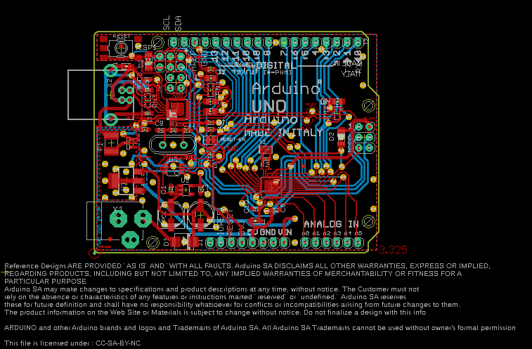

Contents
========

* [PRARREV3 > ](#prarrev3--)
	* [Schematic](#schematic)
	* [PCB](#pcb)
	* [Interactive BOM](#interactive-bom)
	* [OOMP Parts](#oomp-parts)
	* [Images](#images)
	* [Tags](#tags)
  
![][im]
# PRARREV3 > 

- ID: PROJ-ARDU-UNO-REV3-SM
- Hex ID: PRARREV3
- Name: Arduino Rev3 Uno (SMD)
- Description: Arduino Rev3 Uno (SMD)
- Long Link: [http://oom.lt/PROJ-ARDU-UNO-REV3-SM](http://oom.lt/PROJ-ARDU-UNO-REV3-SM)
- Short Link: [http://oom.lt/PRARREV3](http://oom.lt/PRARREV3)

## Schematic
  

## PCB
  

## Interactive BOM

- Interactive BOM page: [ibom.html](https://htmlpreview.github.io/?https://github.com/oomlout/oomlout_OOMP_projects/blob/main/PROJ-ARDU-UNO-REV3-SM/kicad/bom/ibom.html)

## OOMP Parts
  

|OOMP Parts|
| :---: |
|C1 C1,CAPC-0603-X-UNMATCHED-01|
|C2 C2,CAPC-0603-X-UNMATCHED-01|
|C3 C3,CAPC-0603-X-UF1-01|
|C4 C4,CAPC-0603-X-UNMATCHED-01|
|C5 C5,CAPC-0603-X-UNMATCHED-01|
|C6 C6,CAPC-0603-X-UNMATCHED-01|
|C7 C7,CAPC-0603-X-UNMATCHED-01|
|C8 C8,CAPC-0603-X-UF1-01|
|C9 C9,CAPC-0603-X-UNMATCHED-01|
|[C10 CAPC-0603-X-NF100-V50 SMD (0603) 100 nF Capacitor (Ceramic) 50v](https://github.com/oomlout/oomlout_OOMP_parts/tree/main/CAPC-0603-X-NF100-V50/)|
|C11 C11,CAPC-0603-X-UNMATCHED-01|
|D1 D1,DIOD-UNMATCHED-X-UNMATCHED-01|
|D2 D2,DIOD-UNMATCHED-X-UNMATCHED-01|
|D3 D3,DIOD-UNMATCHED-X-UNMATCHED-01|
|F1 F1,UNMATCHED-UNMATCHED-X-UNMATCHED-01|
|GROUND GROUND,UNMATCHED-UNMATCHED-X-UNMATCHED-01|
|ICSP ICSP,UNMATCHED-UNMATCHED-X-UNMATCHED-01|
|ICSP1 ICSP1,UNMATCHED-UNMATCHED-X-UNMATCHED-01|
|J1 J1,UNMATCHED-UNMATCHED-X-UNMATCHED-01|
|J2 J2,UNMATCHED-UNMATCHED-X-UNMATCHED-01|
|JP2 JP2,UNMATCHED-UNMATCHED-X-UNMATCHED-01|
|[L LEDS-0805-G-STAN-01 SMD (0805) Green LED](https://github.com/oomlout/oomlout_OOMP_parts/tree/main/LEDS-0805-G-STAN-01/)|
|L1 L1,UNMATCHED-0805-X-UNMATCHED-01|
|L2 L2,UNMATCHED-0805-X-UNMATCHED-01|
|[ON LEDS-0805-G-STAN-01 SMD (0805) Green LED](https://github.com/oomlout/oomlout_OOMP_parts/tree/main/LEDS-0805-G-STAN-01/)|
|PC1 PC1,UNMATCHED-UNMATCHED-X-UNMATCHED-01|
|PC2 PC2,UNMATCHED-UNMATCHED-X-UNMATCHED-01|
|[R1 RESE-0603-X-O105-01 SMD (0603) 1M Ohm Resistor](https://github.com/oomlout/oomlout_OOMP_parts/tree/main/RESE-0603-X-O105-01/)|
|[R2 RESE-0603-X-O105-01 SMD (0603) 1M Ohm Resistor](https://github.com/oomlout/oomlout_OOMP_parts/tree/main/RESE-0603-X-O105-01/)|
|RESET RESET,UNMATCHED-UNMATCHED-X-UNMATCHED-01|
|RESET-EN RESET-EN,UNMATCHED-UNMATCHED-X-UNMATCHED-01|
|RN1 RN1,UNMATCHED-UNMATCHED-X-UNMATCHED-01|
|RN2 RN2,UNMATCHED-UNMATCHED-X-UNMATCHED-01|
|RN3 RN3,UNMATCHED-UNMATCHED-X-UNMATCHED-01|
|RN4 RN4,UNMATCHED-UNMATCHED-X-UNMATCHED-01|
|[RX LEDS-0805-G-STAN-01 SMD (0805) Green LED](https://github.com/oomlout/oomlout_OOMP_parts/tree/main/LEDS-0805-G-STAN-01/)|
|T1 T1,UNMATCHED-UNMATCHED-X-UNMATCHED-01|
|[TX LEDS-0805-G-STAN-01 SMD (0805) Green LED](https://github.com/oomlout/oomlout_OOMP_parts/tree/main/LEDS-0805-G-STAN-01/)|
|U1 U1,UNMATCHED-UNMATCHED-X-UNMATCHED-01|
|U2 U2,UNMATCHED-SO23-X-UNMATCHED-01|
|U3 U3,UNMATCHED-UNMATCHED-X-UNMATCHED-01|
|U4 U4,UNMATCHED-UNMATCHED-X-UNMATCHED-01|
|U5 U5,UNMATCHED-UNMATCHED-X-UNMATCHED-01|
|X1 X1,UNMATCHED-UNMATCHED-X-UNMATCHED-01|
|X2 X2,UNMATCHED-UNMATCHED-X-UNMATCHED-01|
|Y1 Y1,UNMATCHED-UNMATCHED-X-UNMATCHED-01|
|Y2 Y2,UNMATCHED-UNMATCHED-X-UNMATCHED-01|
|Z1 Z1,UNMATCHED-0603-X-UNMATCHED-01|
|Z2 Z2,UNMATCHED-0603-X-UNMATCHED-01|

## Images
  
  

|kicadPcb3d|kicadPcb3dFront|kicadPcb3dBack|eagleImage|eagleSchemImage|
| :---: | :---: | :---: | :---: | :---: |
||||||

## Tags

- hexID: PRARREV3
- oompType: PROJ
- oompSize: ARDU
- oompColor: UNO
- oompDesc: REV3
- oompIndex: SM
- sources: All source files from https://store.arduino.cc/collections/boards/products/arduino-uno-rev3-smd
- linkBuyPage: https://store.arduino.cc/collections/boards/products/arduino-uno-rev3-smd
- oompID: PROJ-ARDU-UNO-REV3-SM
- oompParts: C1,CAPC-0603-X-UNMATCHED-01
- oompParts: C2,CAPC-0603-X-UNMATCHED-01
- oompParts: C3,CAPC-0603-X-UF1-01
- oompParts: C4,CAPC-0603-X-UNMATCHED-01
- oompParts: C5,CAPC-0603-X-UNMATCHED-01
- oompParts: C6,CAPC-0603-X-UNMATCHED-01
- oompParts: C7,CAPC-0603-X-UNMATCHED-01
- oompParts: C8,CAPC-0603-X-UF1-01
- oompParts: C9,CAPC-0603-X-UNMATCHED-01
- oompParts: C10,CAPC-0603-X-NF100-V50
- oompParts: C11,CAPC-0603-X-UNMATCHED-01
- oompParts: D1,DIOD-UNMATCHED-X-UNMATCHED-01
- oompParts: D2,DIOD-UNMATCHED-X-UNMATCHED-01
- oompParts: D3,DIOD-UNMATCHED-X-UNMATCHED-01
- oompParts: F1,UNMATCHED-UNMATCHED-X-UNMATCHED-01
- oompParts: GROUND,UNMATCHED-UNMATCHED-X-UNMATCHED-01
- oompParts: ICSP,UNMATCHED-UNMATCHED-X-UNMATCHED-01
- oompParts: ICSP1,UNMATCHED-UNMATCHED-X-UNMATCHED-01
- oompParts: J1,UNMATCHED-UNMATCHED-X-UNMATCHED-01
- oompParts: J2,UNMATCHED-UNMATCHED-X-UNMATCHED-01
- oompParts: JP2,UNMATCHED-UNMATCHED-X-UNMATCHED-01
- oompParts: L,LEDS-0805-G-STAN-01
- oompParts: L1,UNMATCHED-0805-X-UNMATCHED-01
- oompParts: L2,UNMATCHED-0805-X-UNMATCHED-01
- oompParts: ON,LEDS-0805-G-STAN-01
- oompParts: PC1,UNMATCHED-UNMATCHED-X-UNMATCHED-01
- oompParts: PC2,UNMATCHED-UNMATCHED-X-UNMATCHED-01
- oompParts: R1,RESE-0603-X-O105-01
- oompParts: R2,RESE-0603-X-O105-01
- oompParts: RESET,UNMATCHED-UNMATCHED-X-UNMATCHED-01
- oompParts: RESET-EN,UNMATCHED-UNMATCHED-X-UNMATCHED-01
- oompParts: RN1,UNMATCHED-UNMATCHED-X-UNMATCHED-01
- oompParts: RN2,UNMATCHED-UNMATCHED-X-UNMATCHED-01
- oompParts: RN3,UNMATCHED-UNMATCHED-X-UNMATCHED-01
- oompParts: RN4,UNMATCHED-UNMATCHED-X-UNMATCHED-01
- oompParts: RX,LEDS-0805-G-STAN-01
- oompParts: T1,UNMATCHED-UNMATCHED-X-UNMATCHED-01
- oompParts: TX,LEDS-0805-G-STAN-01
- oompParts: U1,UNMATCHED-UNMATCHED-X-UNMATCHED-01
- oompParts: U2,UNMATCHED-SO23-X-UNMATCHED-01
- oompParts: U3,UNMATCHED-UNMATCHED-X-UNMATCHED-01
- oompParts: U4,UNMATCHED-UNMATCHED-X-UNMATCHED-01
- oompParts: U5,UNMATCHED-UNMATCHED-X-UNMATCHED-01
- oompParts: X1,UNMATCHED-UNMATCHED-X-UNMATCHED-01
- oompParts: X2,UNMATCHED-UNMATCHED-X-UNMATCHED-01
- oompParts: Y1,UNMATCHED-UNMATCHED-X-UNMATCHED-01
- oompParts: Y2,UNMATCHED-UNMATCHED-X-UNMATCHED-01
- oompParts: Z1,UNMATCHED-0603-X-UNMATCHED-01
- oompParts: Z2,UNMATCHED-0603-X-UNMATCHED-01
- rawParts: C1,100n,C-EU0603-RND,C0603-ROUND,CAPACITOR, European symbol,,,,,,,,,,,,,,,
- rawParts: C2,100n,C-EU0603-RND,C0603-ROUND,CAPACITOR, European symbol,,,,,,,,,,,,,,,
- rawParts: C3,1u,C-EU0603-RND,C0603-ROUND,CAPACITOR, European symbol,,,,,,,,,,,,,,,
- rawParts: C4,100n,C-EU0603-RND,C0603-ROUND,CAPACITOR, European symbol,,,,,,,,,,,,,,,
- rawParts: C5,100n,C-EU0603-RND,C0603-ROUND,CAPACITOR, European symbol,,,,,,,,,,,,,,,
- rawParts: C6,100n,C-EU0603-RND,C0603-ROUND,CAPACITOR, European symbol,,,,,,,,,,,,,,,
- rawParts: C7,100n,C-EU0603-RND,C0603-ROUND,CAPACITOR, European symbol,,,,,,,,,,,,,,,
- rawParts: C8,1u,C-EU0603-RND,C0603-ROUND,CAPACITOR, European symbol,,,,,,,,,,,,,,,
- rawParts: C9,22p,C-EU0603-RND,C0603-ROUND,CAPACITOR, European symbol,,,,,,,,,,,,,,,
- rawParts: C10,100nF,0015_100NF_0603,C0603-ROUND,100nF 0603,0603,,,,,,,,_____,100nF_0603,_____,_____,Condensatori,100nF,
- rawParts: C11,22p,C-EU0603-RND,C0603-ROUND,CAPACITOR, European symbol,,,,,,,,,,,,,,,
- rawParts: D1,M7,DIODE-SMB,SMB,DIODE,,,,,,,,,,,,,,,
- rawParts: D2,CD1206-S01575,DIODE-MINIMELF,MINIMELF,DIODE,,,,,,,,,,,,,,,
- rawParts: D3,CD1206-S01575,DIODE-MINIMELF,MINIMELF,DIODE,,,,,,,,,,,,,,,
- rawParts: F1,MF-MSMF050-2 500mA,L-EUL1812,L1812,INDUCTOR, European symbol,,,,,,,,,,,,,,,
- rawParts: FD1,DNP,FIDUCIAL-1.5MM,FD-1-1.5,Fiducial mount,,,DNP,DNP,DNP,DNP,DNP,,,,,,,DNP,
- rawParts: FD2,DNP,FIDUCIAL-1.5MM,FD-1-1.5,Fiducial mount,,,DNP,DNP,DNP,DNP,DNP,,,,,,,DNP,
- rawParts: FD3,DNP,FIDUCIAL-1.5MM,FD-1-1.5,Fiducial mount,,,DNP,DNP,DNP,DNP,DNP,,,,,,,DNP,
- rawParts: FRAME1,DNP,A3-FRAME-STANDARD,FRAME,Schematic frame,,DNP,DNP,DNP,DNP,DNP,DNP,,,,,,,DNP,
- rawParts: GROUND,,SJ,SJ,SMD solder JUMPER,,,,,,,,,,,,,,,
- rawParts: ICSP,3x2 M,PINHD-2X3,2X03,PIN HEADER,,,,,,,,,,,,,,,
- rawParts: ICSP1,3x2 M,PINHD-2X3,2X03,PIN HEADER,,,,,,,,,,,,,,,
- rawParts: J1,-,PINHD-1X14-CUSTOM,1X14-CUSTOM,PIN HEADER,,,-,,-,-,-,,,,,,,-,
- rawParts: J2,-,PINHD-1X18,1X18-CUSTOM,,,,-,-,-,,-,-,,,,,,-,
- rawParts: JP2,2x2 M-NM,PINHD-2X2,2X02,PIN HEADER,,,,,,,,,,,,,,,
- rawParts: L,YELLOW,LEDCHIP-LED0805,CHIP-LED0805,LED,,,,,,,,,,,,,,,
- rawParts: L1,BLM21,WE-CBF_0805,0805,SMD EMI Suppression Ferrite Beads,,,,,,,,,,,,,,,
- rawParts: L2,10uH,0715_CV201210-100K,0805,10uH 0805,0805,,,,,,,,_____,CV201210-100K,_____,_____,Induttanze,10uH,
- rawParts: ON,GREEN,LEDCHIP-LED0805,CHIP-LED0805,LED,,,,,,,,,,,,,,,
- rawParts: ORIGIN,TP_SP,TP_SP,TP-SP,,,,,,,,,,,,,,,,
- rawParts: PC1,47u,CPOL-EUD,PANASONIC_D,POLARIZED CAPACITOR, European symbol,,,,,,,,,,,,,,,
- rawParts: PC2,47u,CPOL-EUD,PANASONIC_D,POLARIZED CAPACITOR, European symbol,,,,,,,,,,,,,,,
- rawParts: R1,1M,R-EU_R0603,R0603-ROUND,RESISTOR, European symbol,,,,,,,,,,,,,,,
- rawParts: R2,1M,R-EU_R0603,R0603-ROUND,RESISTOR, European symbol,,,,,,,,,,,,,,,
- rawParts: RESET,TS42031-160R-TR-7260,TS42,TS42,TS42,,,,,,,,,,,,,,,
- rawParts: RESET-EN,,SJ,SJ,SMD solder JUMPER,,,,,,,,,,,,,,,
- rawParts: RN1,10K,4R-NCAY16,CAY16,Array Chip Resistor,,,,,,,,,,,,,,,
- rawParts: RN2,1K,4R-NCAY16,CAY16,Array Chip Resistor,,,,,,,,,,,,,,,
- rawParts: RN3,22R,4R-NCAY16,CAY16,Array Chip Resistor,,,,,,,,,,,,,,,
- rawParts: RN4,1K,4R-NCAY16,CAY16,Array Chip Resistor,,,,,,,,,,,,,,,
- rawParts: RX,YELLOW,LEDCHIP-LED0805,CHIP-LED0805,LED,,,,,,,,,,,,,,,
- rawParts: T1,FDN340P,PMOSSOT23,SOT-23,MOS FET,,,,,,,,,,,,,,,
- rawParts: TP_5V1,TP_SP,TP_SP,TP-SP,,,,,,,,,,,,,,,,
- rawParts: TP_CMP,TP_SP,TP_SP,TP-SP,,,,,,,,,,,,,,,,
- rawParts: TP_DTR,TP_SP,TP_SP,TP-SP,,,,,,,,,,,,,,,,
- rawParts: TP_GATE,TP_SP,TP_SP,TP-SP,,,,,,,,,,,,,,,,
- rawParts: TP_LCMD,TP_SP,TP_SP,TP-SP,,,,,,,,,,,,,,,,
- rawParts: TP_LL,TP_SP,TP_SP,TP-SP,,,,,,,,,,,,,,,,
- rawParts: TP_MISO2,TP_SP,TP_SP,TP-SP,,,,,,,,,,,,,,,,
- rawParts: TP_MOSI2,TP_SP,TP_SP,TP-SP,,,,,,,,,,,,,,,,
- rawParts: TP_ONL,TP_SP,TP_SP,TP-SP,,,,,,,,,,,,,,,,
- rawParts: TP_RESET2,TP_SP,TP_SP,TP-SP,,,,,,,,,,,,,,,,
- rawParts: TP_RX,TP_SP,TP_SP,TP-SP,,,,,,,,,,,,,,,,
- rawParts: TP_RXL,TP_SP,TP_SP,TP-SP,,,,,,,,,,,,,,,,
- rawParts: TP_SCK2,TP_SP,TP_SP,TP-SP,,,,,,,,,,,,,,,,
- rawParts: TP_TX,TP_SP,TP_SP,TP-SP,,,,,,,,,,,,,,,,
- rawParts: TP_TXL,TP_SP,TP_SP,TP-SP,,,,,,,,,,,,,,,,
- rawParts: TP_USBVCC,TP_SP,TP_SP,TP-SP,,,,,,,,,,,,,,,,
- rawParts: TP_USH,TP_SP,TP_SP,TP-SP,,,,,,,,,,,,,,,,
- rawParts: TP_VUCAP,TP_SP,TP_SP,TP-SP,,,,,,,,,,,,,,,,
- rawParts: TX,YELLOW,LEDCHIP-LED0805,CHIP-LED0805,LED,,,,,,,,,,,,,,,
- rawParts: U1,NCP1117ST50T3G,MC33269ST-3.3T3,SOT223,Adjustable Output Low Dropout Voltage Regulator 800 mA,,,,,,,,,,,,,,,
- rawParts: U2,LP2985-33DBVR,LP2985-XXDBVR33,SOT23-DBV,ULTRALOW-POWER 50-mA LOW-DROPOUT LINEAR REGULATORS,,,,,,,,,,,,,,,
- rawParts: U3,16U2,ATMEGA16U2,ATMEL_QFN32,AVR AVR® ATmega Microcontroller IC 8-Bit 16MHz 16KB (8K x 16) FLASH 32-VQFN (5x5),,,http://www.digikey.com/product-detail/en/atmel/ATMEGA16U2-MU/ATMEGA16U2-MU-ND/2050821,http://www.digikey.com/product-detail/en/atmel/ATMEGA16U2-MU/ATMEGA16U2-MU-ND/2050821,ATMEGA16U2-MU-ND,ATMEL,ATMEGA16U2-MU,,,,,,,16U2,
- rawParts: U4,ATMEGA328P-MU,ATMEGAXX8-MUR,MLF32,MICROCONTROLLER,,,,,,,,,,,,,,,
- rawParts: U5,LMV358IDGKR,LMV358MMX,MSOP08,Dual General Purpose, Low Voltage, Rail-to-Rail Output Operational Amplifiers,,,,,,,,,,,,,,,
- rawParts: X1,POWERSUPPLY_DC21MMX,POWERSUPPLY_DC21MMX,POWERSUPPLY_DC-21MM,,,,,,,,,,,,,,,,
- rawParts: X2,USB-B_TH,PN61729,PN61729,BERG USB connector,,,,,,,,,,,,,,,
- rawParts: Y1,16MHz,XTAL/S,QS,CRYSTAL,,,,,,,,,,,,,,,
- rawParts: Y2,CSTCE16M0V53-R0 16MHZ,RESONATORMU,RESONATOR,,,,,,,,,,,,,,,,
- rawParts: Z1,CG0603MLC-05E,VARISTORCN0603,CT/CN0603,VARISTOR,,,,,,,,,,,,,,,
- rawParts: Z2,CG0603MLC-05E,VARISTORCN0603,CT/CN0603,VARISTOR,,,,,,,,,,,,,,,

[im]: kicadPcb3d_450.png
