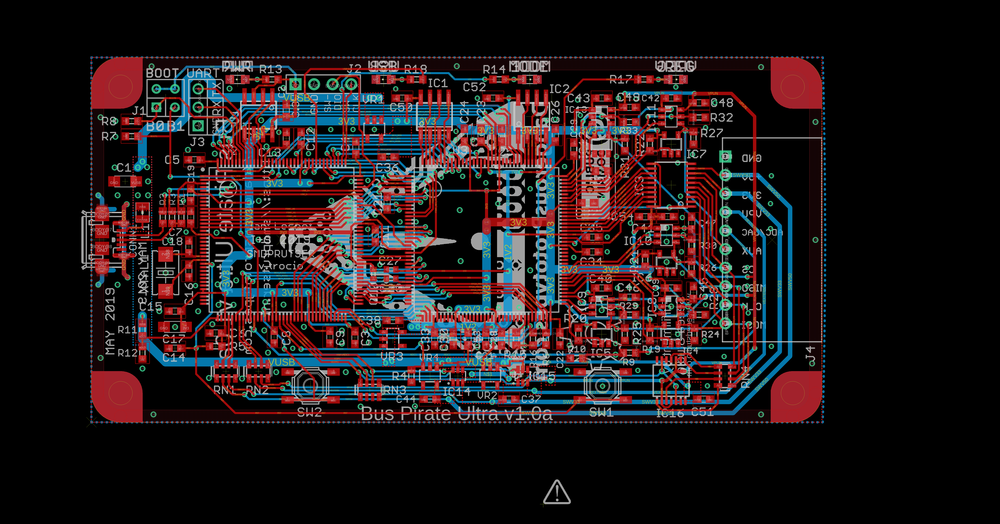
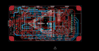

Contents
========

* [PRPR1 > ](#prpr1--)
	* [Schematic](#schematic)
	* [PCB](#pcb)
	* [OOMP Parts](#oomp-parts)
	* [Images](#images)
	* [Tags](#tags)

# PRPR1 > 

- ID: PROJ-DANP-0001-STAN-1A
- Hex ID: PRPR1
- Name: Bus Pirate Ultra 1A
- Description: Bus Pirate Ultra 1A
- Long Link: [http://oom.lt/PROJ-DANP-0001-STAN-1A](http://oom.lt/PROJ-DANP-0001-STAN-1A)
- Short Link: [http://oom.lt/PRPR1](http://oom.lt/PRPR1)

## Schematic
  

## PCB
  

## OOMP Parts
  

|OOMP ID|Name|Identifier|
| :---: | :---: | :---: |
|CAPX-UNMATCHED-X-UF10-01||C1|
|[CAPC-0603-X-NF100-V50](https://github.com/oomlout/oomlout_OOMP_parts/tree/main/CAPC-0603-X-NF100-V50/)|[SMD (0603) 100 nF Capacitor (Ceramic) 50v](https://github.com/oomlout/oomlout_OOMP_parts/tree/main/CAPC-0603-X-NF100-V50/)|[C2, C3, C4, C5, C6, C7, C8, C9, C11, C12, C13, C14, C15, C19, C21, C22, C23, C24, C25, C26, C28, C29, C30, C31, C32, C33, C34, C35, C39, C40, C41, C42, C43, C45, C46, C47, C48, C49, C50, C51, C52, C53, C54](https://github.com/oomlout/oomlout_OOMP_parts/tree/main/CAPC-0603-X-NF100-V50/)|
|CAPX-UNMATCHED-X-NF100-01||C10, C20, C27|
|[CAPC-0603-X-PF22-V50](https://github.com/oomlout/oomlout_OOMP_parts/tree/main/CAPC-0603-X-PF22-V50/)|[SMD (0603) 22 pF Capacitor (Ceramic) 50v](https://github.com/oomlout/oomlout_OOMP_parts/tree/main/CAPC-0603-X-PF22-V50/)|[C16, C18](https://github.com/oomlout/oomlout_OOMP_parts/tree/main/CAPC-0603-X-PF22-V50/)|
|CAPX-UNMATCHED-X-UF1-01||C17|
|[CAPC-0603-X-UF1-V25](https://github.com/oomlout/oomlout_OOMP_parts/tree/main/CAPC-0603-X-UF1-V25/)|[SMD (0603) 1 uF Capacitor (Ceramic) 25v](https://github.com/oomlout/oomlout_OOMP_parts/tree/main/CAPC-0603-X-UF1-V25/)|[C36, C37, C38, C44](https://github.com/oomlout/oomlout_OOMP_parts/tree/main/CAPC-0603-X-UF1-V25/)|
|UNMATCHED-UNMATCHED-X-UNMATCHED-01||CONN1, IC1, IC2, IC3, IC14, IC15, IC16, PCB1, RN1, RN2, RN3, RN4, SW1, SW2, U1, U2, U3, XTAL1|
|UNMATCHED-SO235-X-UNMATCHED-01||IC4, IC5, IC6, IC7, IC12|
|CAPX-UNMATCHED-X-UNMATCHED-01||IC8, IC9, IC10, IC11, IC13|
|HEAD-I01-X-UNMATCHED-01||J1, J2, J3|
|[HEAD-I01-X-PI10-01](https://github.com/oomlout/oomlout_OOMP_parts/tree/main/HEAD-I01-X-PI10-01/)|[2.54 mm 10 Pin Header](https://github.com/oomlout/oomlout_OOMP_parts/tree/main/HEAD-I01-X-PI10-01/)|[J4](https://github.com/oomlout/oomlout_OOMP_parts/tree/main/HEAD-I01-X-PI10-01/)|
|UNMATCHED-0805-X-UNMATCHED-01||L1|
|LEDS-UNMATCHED-Y-STAN-01||LED1, LED2, LED3, LED4, LED5, LED6, LED7, LED8|
|RESE-UNMATCHED-X-UNMATCHED-01||R1, R2, R3, R13, R14, R17, R18|
|RESE-UNMATCHED-X-O103-01||R4, R5, R6|
|[RESE-0603-X-O103-01](https://github.com/oomlout/oomlout_OOMP_parts/tree/main/RESE-0603-X-O103-01/)|[SMD (0603) 10k Ohm Resistor](https://github.com/oomlout/oomlout_OOMP_parts/tree/main/RESE-0603-X-O103-01/)|[R7, R8, R9, R10, R11, R12, R15, R16](https://github.com/oomlout/oomlout_OOMP_parts/tree/main/RESE-0603-X-O103-01/)|
|RESE-0603-X-O1003-01||R19, R20, R21, R22, R23, R28, R29, R30, R32, R33|
|[RESE-0603-X-O105-01](https://github.com/oomlout/oomlout_OOMP_parts/tree/main/RESE-0603-X-O105-01/)|[SMD (0603) 1M Ohm Resistor](https://github.com/oomlout/oomlout_OOMP_parts/tree/main/RESE-0603-X-O105-01/)|[R24, R25, R26, R27, R31](https://github.com/oomlout/oomlout_OOMP_parts/tree/main/RESE-0603-X-O105-01/)|
|VREG-SO235-X-KMIC5205-01||VR1, VR2, VR3, VR4|

## Images
  
  

|eagleImage|
| :---: |
||

## Tags

- oompType: PROJ
- oompSize: DANP
- oompColor: 0001
- oompDesc: STAN
- oompIndex: 1A
- name: Bus Pirate Ultra 1A
- gitRepo: https://github.com/DangerousPrototypes/BusPirateUltraHardware
- gitName: BusPirateUltraHardware
- eagleBoard: BPUv1a/BusPirate-ultra.v1.0a.brd
- eagleSchem: BPUv1a/BusPirate-ultra.v1.0a.sch
- hexID: PRPR1
- oompID: PROJ-DANP-0001-STAN-1A
- oompParts: C1,CAPX-UNMATCHED-X-UF10-01
- oompParts: C2,CAPC-0603-X-NF100-V50
- oompParts: C3,CAPC-0603-X-NF100-V50
- oompParts: C4,CAPC-0603-X-NF100-V50
- oompParts: C5,CAPC-0603-X-NF100-V50
- oompParts: C6,CAPC-0603-X-NF100-V50
- oompParts: C7,CAPC-0603-X-NF100-V50
- oompParts: C8,CAPC-0603-X-NF100-V50
- oompParts: C9,CAPC-0603-X-NF100-V50
- oompParts: C10,CAPX-UNMATCHED-X-NF100-01
- oompParts: C11,CAPC-0603-X-NF100-V50
- oompParts: C12,CAPC-0603-X-NF100-V50
- oompParts: C13,CAPC-0603-X-NF100-V50
- oompParts: C14,CAPC-0603-X-NF100-V50
- oompParts: C15,CAPC-0603-X-NF100-V50
- oompParts: C16,CAPC-0603-X-PF22-V50
- oompParts: C17,CAPX-UNMATCHED-X-UF1-01
- oompParts: C18,CAPC-0603-X-PF22-V50
- oompParts: C19,CAPC-0603-X-NF100-V50
- oompParts: C20,CAPX-UNMATCHED-X-NF100-01
- oompParts: C21,CAPC-0603-X-NF100-V50
- oompParts: C22,CAPC-0603-X-NF100-V50
- oompParts: C23,CAPC-0603-X-NF100-V50
- oompParts: C24,CAPC-0603-X-NF100-V50
- oompParts: C25,CAPC-0603-X-NF100-V50
- oompParts: C26,CAPC-0603-X-NF100-V50
- oompParts: C27,CAPX-UNMATCHED-X-NF100-01
- oompParts: C28,CAPC-0603-X-NF100-V50
- oompParts: C29,CAPC-0603-X-NF100-V50
- oompParts: C30,CAPC-0603-X-NF100-V50
- oompParts: C31,CAPC-0603-X-NF100-V50
- oompParts: C32,CAPC-0603-X-NF100-V50
- oompParts: C33,CAPC-0603-X-NF100-V50
- oompParts: C34,CAPC-0603-X-NF100-V50
- oompParts: C35,CAPC-0603-X-NF100-V50
- oompParts: C36,CAPC-0603-X-UF1-V25
- oompParts: C37,CAPC-0603-X-UF1-V25
- oompParts: C38,CAPC-0603-X-UF1-V25
- oompParts: C39,CAPC-0603-X-NF100-V50
- oompParts: C40,CAPC-0603-X-NF100-V50
- oompParts: C41,CAPC-0603-X-NF100-V50
- oompParts: C42,CAPC-0603-X-NF100-V50
- oompParts: C43,CAPC-0603-X-NF100-V50
- oompParts: C44,CAPC-0603-X-UF1-V25
- oompParts: C45,CAPC-0603-X-NF100-V50
- oompParts: C46,CAPC-0603-X-NF100-V50
- oompParts: C47,CAPC-0603-X-NF100-V50
- oompParts: C48,CAPC-0603-X-NF100-V50
- oompParts: C49,CAPC-0603-X-NF100-V50
- oompParts: C50,CAPC-0603-X-NF100-V50
- oompParts: C51,CAPC-0603-X-NF100-V50
- oompParts: C52,CAPC-0603-X-NF100-V50
- oompParts: C53,CAPC-0603-X-NF100-V50
- oompParts: C54,CAPC-0603-X-NF100-V50
- oompParts: CONN1,UNMATCHED-UNMATCHED-X-UNMATCHED-01
- oompParts: IC1,UNMATCHED-UNMATCHED-X-UNMATCHED-01
- oompParts: IC2,UNMATCHED-UNMATCHED-X-UNMATCHED-01
- oompParts: IC3,UNMATCHED-UNMATCHED-X-UNMATCHED-01
- oompParts: IC4,UNMATCHED-SO235-X-UNMATCHED-01
- oompParts: IC5,UNMATCHED-SO235-X-UNMATCHED-01
- oompParts: IC6,UNMATCHED-SO235-X-UNMATCHED-01
- oompParts: IC7,UNMATCHED-SO235-X-UNMATCHED-01
- oompParts: IC8,CAPX-UNMATCHED-X-UNMATCHED-01
- oompParts: IC9,CAPX-UNMATCHED-X-UNMATCHED-01
- oompParts: IC10,CAPX-UNMATCHED-X-UNMATCHED-01
- oompParts: IC11,CAPX-UNMATCHED-X-UNMATCHED-01
- oompParts: IC12,UNMATCHED-SO235-X-UNMATCHED-01
- oompParts: IC13,CAPX-UNMATCHED-X-UNMATCHED-01
- oompParts: IC14,UNMATCHED-UNMATCHED-X-UNMATCHED-01
- oompParts: IC15,UNMATCHED-UNMATCHED-X-UNMATCHED-01
- oompParts: IC16,UNMATCHED-UNMATCHED-X-UNMATCHED-01
- oompParts: J1,HEAD-I01-X-UNMATCHED-01
- oompParts: J2,HEAD-I01-X-UNMATCHED-01
- oompParts: J3,HEAD-I01-X-UNMATCHED-01
- oompParts: J4,HEAD-I01-X-PI10-01
- oompParts: L1,UNMATCHED-0805-X-UNMATCHED-01
- oompParts: LED1,LEDS-UNMATCHED-Y-STAN-01
- oompParts: LED2,LEDS-UNMATCHED-Y-STAN-01
- oompParts: LED3,LEDS-UNMATCHED-Y-STAN-01
- oompParts: LED4,LEDS-UNMATCHED-Y-STAN-01
- oompParts: LED5,LEDS-UNMATCHED-Y-STAN-01
- oompParts: LED6,LEDS-UNMATCHED-Y-STAN-01
- oompParts: LED7,LEDS-UNMATCHED-Y-STAN-01
- oompParts: LED8,LEDS-UNMATCHED-Y-STAN-01
- oompParts: PCB1,UNMATCHED-UNMATCHED-X-UNMATCHED-01
- oompParts: R1,RESE-UNMATCHED-X-UNMATCHED-01
- oompParts: R2,RESE-UNMATCHED-X-UNMATCHED-01
- oompParts: R3,RESE-UNMATCHED-X-UNMATCHED-01
- oompParts: R4,RESE-UNMATCHED-X-O103-01
- oompParts: R5,RESE-UNMATCHED-X-O103-01
- oompParts: R6,RESE-UNMATCHED-X-O103-01
- oompParts: R7,RESE-0603-X-O103-01
- oompParts: R8,RESE-0603-X-O103-01
- oompParts: R9,RESE-0603-X-O103-01
- oompParts: R10,RESE-0603-X-O103-01
- oompParts: R11,RESE-0603-X-O103-01
- oompParts: R12,RESE-0603-X-O103-01
- oompParts: R13,RESE-UNMATCHED-X-UNMATCHED-01
- oompParts: R14,RESE-UNMATCHED-X-UNMATCHED-01
- oompParts: R15,RESE-0603-X-O103-01
- oompParts: R16,RESE-0603-X-O103-01
- oompParts: R17,RESE-UNMATCHED-X-UNMATCHED-01
- oompParts: R18,RESE-UNMATCHED-X-UNMATCHED-01
- oompParts: R19,RESE-0603-X-O1003-01
- oompParts: R20,RESE-0603-X-O1003-01
- oompParts: R21,RESE-0603-X-O1003-01
- oompParts: R22,RESE-0603-X-O1003-01
- oompParts: R23,RESE-0603-X-O1003-01
- oompParts: R24,RESE-0603-X-O105-01
- oompParts: R25,RESE-0603-X-O105-01
- oompParts: R26,RESE-0603-X-O105-01
- oompParts: R27,RESE-0603-X-O105-01
- oompParts: R28,RESE-0603-X-O1003-01
- oompParts: R29,RESE-0603-X-O1003-01
- oompParts: R30,RESE-0603-X-O1003-01
- oompParts: R31,RESE-0603-X-O105-01
- oompParts: R32,RESE-0603-X-O1003-01
- oompParts: R33,RESE-0603-X-O1003-01
- oompParts: RN1,UNMATCHED-UNMATCHED-X-UNMATCHED-01
- oompParts: RN2,UNMATCHED-UNMATCHED-X-UNMATCHED-01
- oompParts: RN3,UNMATCHED-UNMATCHED-X-UNMATCHED-01
- oompParts: RN4,UNMATCHED-UNMATCHED-X-UNMATCHED-01
- oompParts: SW1,UNMATCHED-UNMATCHED-X-UNMATCHED-01
- oompParts: SW2,UNMATCHED-UNMATCHED-X-UNMATCHED-01
- oompParts: U1,UNMATCHED-UNMATCHED-X-UNMATCHED-01
- oompParts: U2,UNMATCHED-UNMATCHED-X-UNMATCHED-01
- oompParts: U3,UNMATCHED-UNMATCHED-X-UNMATCHED-01
- oompParts: VR1,VREG-SO235-X-KMIC5205-01
- oompParts: VR2,VREG-SO235-X-KMIC5205-01
- oompParts: VR3,VREG-SO235-X-KMIC5205-01
- oompParts: VR4,VREG-SO235-X-KMIC5205-01
- oompParts: XTAL1,UNMATCHED-UNMATCHED-X-UNMATCHED-01
- rawParts: C1,10uF,CPOL-EUSMCA,SMC_A,POLARIZED CAPACITOR, European symbol,,
- rawParts: C2,0.1uF,C-EUC0603,C0603,CAPACITOR, European symbol,,
- rawParts: C3,0.1uF,C-EUC0603,C0603,CAPACITOR, European symbol,,
- rawParts: C4,0.1uF,C-EUC0603,C0603,CAPACITOR, European symbol,,
- rawParts: C5,0.1uF,C-EUC0603,C0603,CAPACITOR, European symbol,,
- rawParts: C6,0.1uF,C-EUC0603,C0603,CAPACITOR, European symbol,,
- rawParts: C7,0.1uF,C-EUC0603,C0603,CAPACITOR, European symbol,,
- rawParts: C8,0.1uF,C-EUC0603,C0603,CAPACITOR, European symbol,,
- rawParts: C9,0.1uF,C-EUC0603,C0603,CAPACITOR, European symbol,,
- rawParts: C10,0.1uF,CAPACITOR_NPOL-0402,C402,Non-Polarized capacitor in various packages,,
- rawParts: C11,0.1uF,C-EUC0603,C0603,CAPACITOR, European symbol,,
- rawParts: C12,0.1uF,C-EUC0603,C0603,CAPACITOR, European symbol,,
- rawParts: C13,0.1uF,C-EUC0603,C0603,CAPACITOR, European symbol,,
- rawParts: C14,0.1uF,C-EUC0603,C0603,CAPACITOR, European symbol,,
- rawParts: C15,0.1uF,C-EUC0603,C0603,CAPACITOR, European symbol,,
- rawParts: C16,22pF,C-EUC0603,C0603,CAPACITOR, European symbol,,
- rawParts: C17,1uF,CPOL-EUSMCA,SMC_A,POLARIZED CAPACITOR, European symbol,,
- rawParts: C18,22pF,C-EUC0603,C0603,CAPACITOR, European symbol,,
- rawParts: C19,0.1uF,C-EUC0603,C0603,CAPACITOR, European symbol,,
- rawParts: C20,0.1uF,CAPACITOR_NPOL-0402,C402,Non-Polarized capacitor in various packages,,
- rawParts: C21,0.1uF,C-EUC0603,C0603,CAPACITOR, European symbol,,
- rawParts: C22,0.1uF,C-EUC0603,C0603,CAPACITOR, European symbol,,
- rawParts: C23,0.1uF,C-EUC0603,C0603,CAPACITOR, European symbol,,
- rawParts: C24,0.1uF,C-EUC0603,C0603,CAPACITOR, European symbol,,
- rawParts: C25,0.1uF,C-EUC0603,C0603,CAPACITOR, European symbol,,
- rawParts: C26,0.1uF,C-EUC0603,C0603,CAPACITOR, European symbol,,
- rawParts: C27,0.1uF,CAPACITOR_NPOL-0402,C402,Non-Polarized capacitor in various packages,,
- rawParts: C28,0.1uF,C-EUC0603,C0603,CAPACITOR, European symbol,,
- rawParts: C29,0.1uF,C-EUC0603,C0603,CAPACITOR, European symbol,,
- rawParts: C30,0.1uF,C-EUC0603,C0603,CAPACITOR, European symbol,,
- rawParts: C31,0.1uF,C-EUC0603,C0603,CAPACITOR, European symbol,,
- rawParts: C32,0.1uF,C-EUC0603,C0603,CAPACITOR, European symbol,,
- rawParts: C33,0.1uF,C-EUC0603,C0603,CAPACITOR, European symbol,,
- rawParts: C34,0.1uF,C-EUC0603,C0603,CAPACITOR, European symbol,,
- rawParts: C35,0.1uF,C-EUC0603,C0603,CAPACITOR, European symbol,,
- rawParts: C36,1uf,C-EUC0603,C0603,CAPACITOR, European symbol,,
- rawParts: C37,1uF,C-EUC0603,C0603,CAPACITOR, European symbol,,
- rawParts: C38,1uf,C-EUC0603,C0603,CAPACITOR, European symbol,,
- rawParts: C39,0.1uF,C-EUC0603,C0603,CAPACITOR, European symbol,,
- rawParts: C40,0.1uF,C-EUC0603,C0603,CAPACITOR, European symbol,,
- rawParts: C41,0.1uF,C-EUC0603,C0603,CAPACITOR, European symbol,,
- rawParts: C42,0.1uF,C-EUC0603,C0603,CAPACITOR, European symbol,,
- rawParts: C43,0.1uF,C-EUC0603,C0603,CAPACITOR, European symbol,,
- rawParts: C44,1uF,C-EUC0603,C0603,CAPACITOR, European symbol,,
- rawParts: C45,0.1uF,C-EUC0603,C0603,CAPACITOR, European symbol,,
- rawParts: C46,0.1uF,C-EUC0603,C0603,CAPACITOR, European symbol,,
- rawParts: C47,0.1uF,C-EUC0603,C0603,CAPACITOR, European symbol,,
- rawParts: C48,0.1uF,C-EUC0603,C0603,CAPACITOR, European symbol,,
- rawParts: C49,0.1uF,C-EUC0603,C0603,CAPACITOR, European symbol,,
- rawParts: C50,0.1uF,C-EUC0603,C0603,CAPACITOR, European symbol,,
- rawParts: C51,0.1uF,C-EUC0603,C0603,CAPACITOR, European symbol,,
- rawParts: C52,0.1uF,C-EUC0603,C0603,CAPACITOR, European symbol,,
- rawParts: C53,0.1uF,C-EUC0603,C0603,CAPACITOR, European symbol,,
- rawParts: C54,0.1uF,C-EUC0603,C0603,CAPACITOR, European symbol,,
- rawParts: CONN1,CON-USB-F-MICRO-B-2,CON-USB-F-MICRO-B-2,CON_USB_MICRO-B-2-SD-47589-001,Micro USB based on molex SD-47589-001,,
- rawParts: IC1,IC_MEM_23LC1024,IC_MEM_23LC1024,SOIC-8,1Mbit SPI SRAM with Serial dual interface and Serial quad interface,,
- rawParts: IC2,IC_MEM_23LC1024,IC_MEM_23LC1024,SOIC-8,1Mbit SPI SRAM with Serial dual interface and Serial quad interface,,
- rawParts: IC3,IC_74AC573,IC_74AC573-TSSOP-20,TSSOP-20,8 Transparent Latch with 3-state output,,
- rawParts: IC4,74LVC1G07DBV,74LVC1G07DBV,SOT23-5,Single Buffer/Driver With Open-Drain Output,,
- rawParts: IC5,74LVC1G07DBV,74LVC1G07DBV,SOT23-5,Single Buffer/Driver With Open-Drain Output,,
- rawParts: IC6,74LVC1G07DBV,74LVC1G07DBV,SOT23-5,Single Buffer/Driver With Open-Drain Output,,
- rawParts: IC7,74LVC1G07DBV,74LVC1G07DBV,SOT23-5,Single Buffer/Driver With Open-Drain Output,,
- rawParts: IC8,IC_BUFF_SN74LVC1T45DBV,IC_BUFF_SN74LVC1T45DBV,DBV-R-PDSO-G6,,,
- rawParts: IC9,IC_BUFF_SN74LVC1T45DBV,IC_BUFF_SN74LVC1T45DBV,DBV-R-PDSO-G6,,,
- rawParts: IC10,IC_BUFF_SN74LVC1T45DBV,IC_BUFF_SN74LVC1T45DBV,DBV-R-PDSO-G6,,,
- rawParts: IC11,IC_BUFF_SN74LVC1T45DBV,IC_BUFF_SN74LVC1T45DBV,DBV-R-PDSO-G6,,,
- rawParts: IC12,74LVC1G07DBV,74LVC1G07DBV,SOT23-5,Single Buffer/Driver With Open-Drain Output,,
- rawParts: IC13,IC_BUFF_SN74LVC1T45DBV,IC_BUFF_SN74LVC1T45DBV,DBV-R-PDSO-G6,,,
- rawParts: IC14,IC_BL1551,IC_BL1551,SC-70-6,BL1551,,
- rawParts: IC15,IC_BL1551,IC_BL1551,SC-70-6,BL1551,,
- rawParts: IC16,74HCT4066PW,4066TS,40XX_TSSOP14,Quad bilateral ANALOG SWITCH,,
- rawParts: J1,CON_HEADER_2X02-PTH,CON_HEADER_2X02-PTH,M2X2,,,
- rawParts: J2,CON_HEADER_1X04,CON_HEADER_1X04,M1X4,,,
- rawParts: J3,CON_HEADER_1X03-PTH,CON_HEADER_1X03-PTH,M1X3,,,
- rawParts: J4,CON_HEADER_1X10-RIGHT_ANGLED_PTH_SHROUDED,CON_HEADER_1X10-RIGHT_ANGLED_PTH_SHROUDED,M1X10_MALE_RIGHT_ANGLES_PTH_SHROUDED,,,
- rawParts: L1,1.5A ferrite bead,WE-KIL_0805,WE-KI_0805_B,SMD Wire Wound Ceramic Inductor WE-KIL,,
- rawParts: LED1,Optional YELLOW,LED-0805,LED-805,Light Emitting Diode,,
- rawParts: LED2,YELLOW,LED-0805,LED-805,Light Emitting Diode,,
- rawParts: LED3,YELLOW,LED-0805,LED-805,Light Emitting Diode,,
- rawParts: LED4,Optional YELLOW,LED-0805,LED-805,Light Emitting Diode,,
- rawParts: LED5,YELLOW,LED-0805,LED-805,Light Emitting Diode,,
- rawParts: LED6,Optional YELLOW,LED-0805,LED-805,Light Emitting Diode,,
- rawParts: LED7,YELLOW,LED-0805,LED-805,Light Emitting Diode,,
- rawParts: LED8,Optional YELLOW,LED-0805,LED-805,Light Emitting Diode,,
- rawParts: LOGO1,LOGO_CC-0,LOGO_CC-0,LOGO_CC-0,,,
- rawParts: PCB1,PCB_DP_RECTANGLE-50X100,PCB_DP_RECTANGLE-50X100,DP10050_V1,Dangerous Prototypes Standard Rectangular PCB sizes,,
- rawParts: R1,1.5K,RESISTOR-0603,R603,,,
- rawParts: R2,22R,RESISTOR-0603,R603,,,
- rawParts: R3,22R,RESISTOR-0603,R603,,,
- rawParts: R4,10K,RESISTOR-0603,R603,,,
- rawParts: R5,10K,RESISTOR-0603,R603,,,
- rawParts: R6,10K,RESISTOR-0603,R603,,,
- rawParts: R7,10K,R-EU_R0603,R0603,RESISTOR, European symbol,,
- rawParts: R8,10K,R-EU_R0603,R0603,RESISTOR, European symbol,,
- rawParts: R9,10K,R-EU_R0603,R0603,RESISTOR, European symbol,,
- rawParts: R10,10K,R-EU_R0603,R0603,RESISTOR, European symbol,,
- rawParts: R11,10K,R-EU_R0603,R0603,RESISTOR, European symbol,,
- rawParts: R12,10K,R-EU_R0603,R0603,RESISTOR, European symbol,,
- rawParts: R13,1K1,RESISTOR-0603,R603,,,
- rawParts: R14,1K1,RESISTOR-0603,R603,,,
- rawParts: R15,10K,R-EU_R0603,R0603,RESISTOR, European symbol,,
- rawParts: R16,10K,R-EU_R0603,R0603,RESISTOR, European symbol,,
- rawParts: R17,1K1,RESISTOR-0603,R603,,,
- rawParts: R18,1K1,RESISTOR-0603,R603,,,
- rawParts: R19,100K,R-EU_R0603,R0603,RESISTOR, European symbol,,
- rawParts: R20,100K,R-EU_R0603,R0603,RESISTOR, European symbol,,
- rawParts: R21,100K,R-EU_R0603,R0603,RESISTOR, European symbol,,
- rawParts: R22,100K,R-EU_R0603,R0603,RESISTOR, European symbol,,
- rawParts: R23,100K,R-EU_R0603,R0603,RESISTOR, European symbol,,
- rawParts: R24,1M,R-EU_R0603,R0603,RESISTOR, European symbol,,
- rawParts: R25,1M,R-EU_R0603,R0603,RESISTOR, European symbol,,
- rawParts: R26,1M,R-EU_R0603,R0603,RESISTOR, European symbol,,
- rawParts: R27,1M,R-EU_R0603,R0603,RESISTOR, European symbol,,
- rawParts: R28,100K,R-EU_R0603,R0603,RESISTOR, European symbol,,
- rawParts: R29,100K,R-EU_R0603,R0603,RESISTOR, European symbol,,
- rawParts: R30,100K,R-EU_R0603,R0603,RESISTOR, European symbol,,
- rawParts: R31,1M,R-EU_R0603,R0603,RESISTOR, European symbol,,
- rawParts: R32,100K,R-EU_R0603,R0603,RESISTOR, European symbol,,
- rawParts: R33,100K,R-EU_R0603,R0603,RESISTOR, European symbol,,
- rawParts: RN1,10k,RNETWORK,RN8P-4R-CRA06S,4 Resistor Array 0603,,
- rawParts: RN2,10k,RNETWORK,RN8P-4R-CRA06S,4 Resistor Array 0603,,
- rawParts: RN3,10k,RNETWORK,RN8P-4R-CRA06S,4 Resistor Array 0603,,
- rawParts: RN4,10k,RNETWORK,RN8P-4R-CRA06S,4 Resistor Array 0603,,
- rawParts: SW1,,SW_TACT_4P,SW_TACT_SMALL,,,
- rawParts: SW2,,SW_TACT_4P,SW_TACT_SMALL,,,
- rawParts: U1,IC_MEM_W25X40CL,IC_MEM_W25X40CL,SOIC-8,4M-Bit serial flash memory with 4KB sectors and Dual I/O SPI,,
- rawParts: U2,IC_UC_STM32F103ZX,IC_UC_STM32F103ZX,TQFP-144,STM32F103ZX,,
- rawParts: U3,IC_FPGA_ICE40HX4K,IC_FPGA_ICE40HX4K,TQFP-144,iCE40HX4K,,
- rawParts: VR1,MCP1801T-3302I/OT,MIC5205,SOT-23-5@1,150ma Low-Noise LDO Regulator,,
- rawParts: VR2,MCP1801T-3302I/OT,MIC5205,SOT-23-5@1,150ma Low-Noise LDO Regulator,,
- rawParts: VR3,MCP1801T-1202I/OT,MIC5205,SOT-23-5@1,150ma Low-Noise LDO Regulator,,
- rawParts: VR4,MCP1801T-5002I/OT,MIC5205,SOT-23-5@1,150ma Low-Noise LDO Regulator,,
- rawParts: XTAL1,8Mhz,OSC-XTAL-12M,XTAL_4X6,,,
