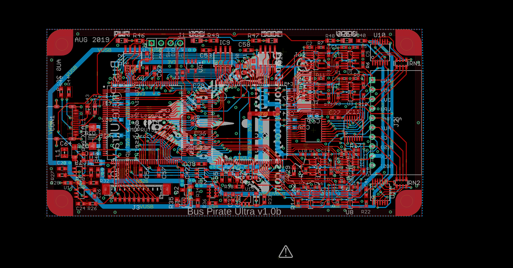

Contents
========

* [PRPR1 > ](#prpr1--)
	* [Schematic](#schematic)
	* [PCB](#pcb)
	* [OOMP Parts](#oomp-parts)
	* [Images](#images)
	* [Tags](#tags)

# PRPR1 > 

- ID: PROJ-DANP-0001-STAN-1B
- Hex ID: PRPR1
- Name: Bus Pirate Ultra 1B
- Description: Bus Pirate Ultra 1B
- Long Link: [http://oom.lt/PROJ-DANP-0001-STAN-1B](http://oom.lt/PROJ-DANP-0001-STAN-1B)
- Short Link: [http://oom.lt/PRPR1](http://oom.lt/PRPR1)

## Schematic
  

## PCB
  

## OOMP Parts
  

|OOMP ID|Name|Identifier|
| :---: | :---: | :---: |
|[CAPC-0402-X-NF100-V10](https://github.com/oomlout/oomlout_OOMP_parts/tree/main/CAPC-0402-X-NF100-V10/)|[SMD (0402) 100 nF Capacitor (Ceramic) 10v](https://github.com/oomlout/oomlout_OOMP_parts/tree/main/CAPC-0402-X-NF100-V10/)|[C1, C2, C3, C4, C5, C6, C7, C8, C9, C10, C11, C12, C13, C14, C15, C16](https://github.com/oomlout/oomlout_OOMP_parts/tree/main/CAPC-0402-X-NF100-V10/)|
|[CAPC-0603-X-NF100-V50](https://github.com/oomlout/oomlout_OOMP_parts/tree/main/CAPC-0603-X-NF100-V50/)|[SMD (0603) 100 nF Capacitor (Ceramic) 50v](https://github.com/oomlout/oomlout_OOMP_parts/tree/main/CAPC-0603-X-NF100-V50/)|[C17, C21, C22, C24, C25, C26, C27, C30, C31, C33, C34, C35, C37, C40, C41, C42, C43, C44, C45, C46, C47, C48, C49, C50, C51, C52, C53, C54, C55, C56, C57, C58, C60, C61, C62, C63](https://github.com/oomlout/oomlout_OOMP_parts/tree/main/CAPC-0603-X-NF100-V50/)|
|[CAPC-0603-X-PF22-V50](https://github.com/oomlout/oomlout_OOMP_parts/tree/main/CAPC-0603-X-PF22-V50/)|[SMD (0603) 22 pF Capacitor (Ceramic) 50v](https://github.com/oomlout/oomlout_OOMP_parts/tree/main/CAPC-0603-X-PF22-V50/)|[C18, C20](https://github.com/oomlout/oomlout_OOMP_parts/tree/main/CAPC-0603-X-PF22-V50/)|
|CAPX-UNMATCHED-X-UF1-01||C19, C29|
|CAPX-UNMATCHED-X-UF10-01||C23, C64|
|[CAPC-0603-X-UF1-V25](https://github.com/oomlout/oomlout_OOMP_parts/tree/main/CAPC-0603-X-UF1-V25/)|[SMD (0603) 1 uF Capacitor (Ceramic) 25v](https://github.com/oomlout/oomlout_OOMP_parts/tree/main/CAPC-0603-X-UF1-V25/)|[C28, C38, C39](https://github.com/oomlout/oomlout_OOMP_parts/tree/main/CAPC-0603-X-UF1-V25/)|
|CAPX-UNMATCHED-X-NF100-01||C32, C36, C59|
|UNMATCHED-UNMATCHED-X-UNMATCHED-01||CON1, IC1, IC2, IC3, IC4, IC5, IC6, IC7, IC8, IC9, IC10, IC11, PCB1, Q1, Q2, RN1, RN2, RN3, U1, U2, U3, U4, U5, U6, U7, U8, U9, U10, U11, U12, U13, U16, XTAL1|
|DIOD-S123-X-UNMATCHED-01||D1|
|UNMATCHED-SO235-X-UNMATCHED-01||IC12, U14, U15|
|HEAD-I01-X-UNMATCHED-01||J1, J3|
|[HEAD-I01-X-PI10-01](https://github.com/oomlout/oomlout_OOMP_parts/tree/main/HEAD-I01-X-PI10-01/)|[2.54 mm 10 Pin Header](https://github.com/oomlout/oomlout_OOMP_parts/tree/main/HEAD-I01-X-PI10-01/)|[J2](https://github.com/oomlout/oomlout_OOMP_parts/tree/main/HEAD-I01-X-PI10-01/)|
|UNMATCHED-0805-X-UNMATCHED-01||L1|
|LEDS-UNMATCHED-Y-STAN-01||LED1, LED2, LED3, LED4, LED5, LED6, LED7, LED8|
|RESE-0402-X-O1003-01||R1, R2, R3, R4, R5, R7, R9, R11, R13, R14, R15, R16, R17, R19, R21, R23|
|[RESE-0402-X-O105-01](https://github.com/oomlout/oomlout_OOMP_parts/tree/main/RESE-0402-X-O105-01/)|[SMD (0402) 1M Ohm Resistor](https://github.com/oomlout/oomlout_OOMP_parts/tree/main/RESE-0402-X-O105-01/)|[R6, R8, R10, R12, R18, R20, R22, R24](https://github.com/oomlout/oomlout_OOMP_parts/tree/main/RESE-0402-X-O105-01/)|
|RESE-UNMATCHED-X-O103-01||R25, R27|
|RESE-0603-X-UNMATCHED-01||R26, R33, R36, R41, R42, R43, R44, R45|
|RESE-UNMATCHED-X-UNMATCHED-01||R28, R30, R34, R35, R46, R47, R48, R49|
|[RESE-0603-X-O103-01](https://github.com/oomlout/oomlout_OOMP_parts/tree/main/RESE-0603-X-O103-01/)|[SMD (0603) 10k Ohm Resistor](https://github.com/oomlout/oomlout_OOMP_parts/tree/main/RESE-0603-X-O103-01/)|[R29, R37, R38, R39, R40](https://github.com/oomlout/oomlout_OOMP_parts/tree/main/RESE-0603-X-O103-01/)|
|RESE-UNMATCHED-X-O1003-01||R31|
|RESE-UNMATCHED-X-O503-01||R32|
|VREG-SO235-X-KMIC5205-01||VR1, VR2|

## Images
  
  

|eagleImage|
| :---: |
||

## Tags

- oompType: PROJ
- oompSize: DANP
- oompColor: 0001
- oompDesc: STAN
- oompIndex: 1B
- name: Bus Pirate Ultra 1B
- gitRepo: https://github.com/DangerousPrototypes/BusPirateUltraHardware
- gitName: BusPirateUltraHardware
- eagleBoard: BPUv1b/BusPirate-ultra.v1.0b.brd
- eagleSchem: BPUv1b/BusPirate-ultra.v1.0b.sch
- hexID: PRPR1
- oompID: PROJ-DANP-0001-STAN-1B
- oompParts: C1,CAPC-0402-X-NF100-V10
- oompParts: C2,CAPC-0402-X-NF100-V10
- oompParts: C3,CAPC-0402-X-NF100-V10
- oompParts: C4,CAPC-0402-X-NF100-V10
- oompParts: C5,CAPC-0402-X-NF100-V10
- oompParts: C6,CAPC-0402-X-NF100-V10
- oompParts: C7,CAPC-0402-X-NF100-V10
- oompParts: C8,CAPC-0402-X-NF100-V10
- oompParts: C9,CAPC-0402-X-NF100-V10
- oompParts: C10,CAPC-0402-X-NF100-V10
- oompParts: C11,CAPC-0402-X-NF100-V10
- oompParts: C12,CAPC-0402-X-NF100-V10
- oompParts: C13,CAPC-0402-X-NF100-V10
- oompParts: C14,CAPC-0402-X-NF100-V10
- oompParts: C15,CAPC-0402-X-NF100-V10
- oompParts: C16,CAPC-0402-X-NF100-V10
- oompParts: C17,CAPC-0603-X-NF100-V50
- oompParts: C18,CAPC-0603-X-PF22-V50
- oompParts: C19,CAPX-UNMATCHED-X-UF1-01
- oompParts: C20,CAPC-0603-X-PF22-V50
- oompParts: C21,CAPC-0603-X-NF100-V50
- oompParts: C22,CAPC-0603-X-NF100-V50
- oompParts: C23,CAPX-UNMATCHED-X-UF10-01
- oompParts: C24,CAPC-0603-X-NF100-V50
- oompParts: C25,CAPC-0603-X-NF100-V50
- oompParts: C26,CAPC-0603-X-NF100-V50
- oompParts: C27,CAPC-0603-X-NF100-V50
- oompParts: C28,CAPC-0603-X-UF1-V25
- oompParts: C29,CAPX-UNMATCHED-X-UF1-01
- oompParts: C30,CAPC-0603-X-NF100-V50
- oompParts: C31,CAPC-0603-X-NF100-V50
- oompParts: C32,CAPX-UNMATCHED-X-NF100-01
- oompParts: C33,CAPC-0603-X-NF100-V50
- oompParts: C34,CAPC-0603-X-NF100-V50
- oompParts: C35,CAPC-0603-X-NF100-V50
- oompParts: C36,CAPX-UNMATCHED-X-NF100-01
- oompParts: C37,CAPC-0603-X-NF100-V50
- oompParts: C38,CAPC-0603-X-UF1-V25
- oompParts: C39,CAPC-0603-X-UF1-V25
- oompParts: C40,CAPC-0603-X-NF100-V50
- oompParts: C41,CAPC-0603-X-NF100-V50
- oompParts: C42,CAPC-0603-X-NF100-V50
- oompParts: C43,CAPC-0603-X-NF100-V50
- oompParts: C44,CAPC-0603-X-NF100-V50
- oompParts: C45,CAPC-0603-X-NF100-V50
- oompParts: C46,CAPC-0603-X-NF100-V50
- oompParts: C47,CAPC-0603-X-NF100-V50
- oompParts: C48,CAPC-0603-X-NF100-V50
- oompParts: C49,CAPC-0603-X-NF100-V50
- oompParts: C50,CAPC-0603-X-NF100-V50
- oompParts: C51,CAPC-0603-X-NF100-V50
- oompParts: C52,CAPC-0603-X-NF100-V50
- oompParts: C53,CAPC-0603-X-NF100-V50
- oompParts: C54,CAPC-0603-X-NF100-V50
- oompParts: C55,CAPC-0603-X-NF100-V50
- oompParts: C56,CAPC-0603-X-NF100-V50
- oompParts: C57,CAPC-0603-X-NF100-V50
- oompParts: C58,CAPC-0603-X-NF100-V50
- oompParts: C59,CAPX-UNMATCHED-X-NF100-01
- oompParts: C60,CAPC-0603-X-NF100-V50
- oompParts: C61,CAPC-0603-X-NF100-V50
- oompParts: C62,CAPC-0603-X-NF100-V50
- oompParts: C63,CAPC-0603-X-NF100-V50
- oompParts: C64,CAPX-UNMATCHED-X-UF10-01
- oompParts: CON1,UNMATCHED-UNMATCHED-X-UNMATCHED-01
- oompParts: D1,DIOD-S123-X-UNMATCHED-01
- oompParts: IC1,UNMATCHED-UNMATCHED-X-UNMATCHED-01
- oompParts: IC2,UNMATCHED-UNMATCHED-X-UNMATCHED-01
- oompParts: IC3,UNMATCHED-UNMATCHED-X-UNMATCHED-01
- oompParts: IC4,UNMATCHED-UNMATCHED-X-UNMATCHED-01
- oompParts: IC5,UNMATCHED-UNMATCHED-X-UNMATCHED-01
- oompParts: IC6,UNMATCHED-UNMATCHED-X-UNMATCHED-01
- oompParts: IC7,UNMATCHED-UNMATCHED-X-UNMATCHED-01
- oompParts: IC8,UNMATCHED-UNMATCHED-X-UNMATCHED-01
- oompParts: IC9,UNMATCHED-UNMATCHED-X-UNMATCHED-01
- oompParts: IC10,UNMATCHED-UNMATCHED-X-UNMATCHED-01
- oompParts: IC11,UNMATCHED-UNMATCHED-X-UNMATCHED-01
- oompParts: IC12,UNMATCHED-SO235-X-UNMATCHED-01
- oompParts: J1,HEAD-I01-X-UNMATCHED-01
- oompParts: J2,HEAD-I01-X-PI10-01
- oompParts: J3,HEAD-I01-X-UNMATCHED-01
- oompParts: L1,UNMATCHED-0805-X-UNMATCHED-01
- oompParts: LED1,LEDS-UNMATCHED-Y-STAN-01
- oompParts: LED2,LEDS-UNMATCHED-Y-STAN-01
- oompParts: LED3,LEDS-UNMATCHED-Y-STAN-01
- oompParts: LED4,LEDS-UNMATCHED-Y-STAN-01
- oompParts: LED5,LEDS-UNMATCHED-Y-STAN-01
- oompParts: LED6,LEDS-UNMATCHED-Y-STAN-01
- oompParts: LED7,LEDS-UNMATCHED-Y-STAN-01
- oompParts: LED8,LEDS-UNMATCHED-Y-STAN-01
- oompParts: PCB1,UNMATCHED-UNMATCHED-X-UNMATCHED-01
- oompParts: Q1,UNMATCHED-UNMATCHED-X-UNMATCHED-01
- oompParts: Q2,UNMATCHED-UNMATCHED-X-UNMATCHED-01
- oompParts: R1,RESE-0402-X-O1003-01
- oompParts: R2,RESE-0402-X-O1003-01
- oompParts: R3,RESE-0402-X-O1003-01
- oompParts: R4,RESE-0402-X-O1003-01
- oompParts: R5,RESE-0402-X-O1003-01
- oompParts: R6,RESE-0402-X-O105-01
- oompParts: R7,RESE-0402-X-O1003-01
- oompParts: R8,RESE-0402-X-O105-01
- oompParts: R9,RESE-0402-X-O1003-01
- oompParts: R10,RESE-0402-X-O105-01
- oompParts: R11,RESE-0402-X-O1003-01
- oompParts: R12,RESE-0402-X-O105-01
- oompParts: R13,RESE-0402-X-O1003-01
- oompParts: R14,RESE-0402-X-O1003-01
- oompParts: R15,RESE-0402-X-O1003-01
- oompParts: R16,RESE-0402-X-O1003-01
- oompParts: R17,RESE-0402-X-O1003-01
- oompParts: R18,RESE-0402-X-O105-01
- oompParts: R19,RESE-0402-X-O1003-01
- oompParts: R20,RESE-0402-X-O105-01
- oompParts: R21,RESE-0402-X-O1003-01
- oompParts: R22,RESE-0402-X-O105-01
- oompParts: R23,RESE-0402-X-O1003-01
- oompParts: R24,RESE-0402-X-O105-01
- oompParts: R25,RESE-UNMATCHED-X-O103-01
- oompParts: R26,RESE-0603-X-UNMATCHED-01
- oompParts: R27,RESE-UNMATCHED-X-O103-01
- oompParts: R28,RESE-UNMATCHED-X-UNMATCHED-01
- oompParts: R29,RESE-0603-X-O103-01
- oompParts: R30,RESE-UNMATCHED-X-UNMATCHED-01
- oompParts: R31,RESE-UNMATCHED-X-O1003-01
- oompParts: R32,RESE-UNMATCHED-X-O503-01
- oompParts: R33,RESE-0603-X-UNMATCHED-01
- oompParts: R34,RESE-UNMATCHED-X-UNMATCHED-01
- oompParts: R35,RESE-UNMATCHED-X-UNMATCHED-01
- oompParts: R36,RESE-0603-X-UNMATCHED-01
- oompParts: R37,RESE-0603-X-O103-01
- oompParts: R38,RESE-0603-X-O103-01
- oompParts: R39,RESE-0603-X-O103-01
- oompParts: R40,RESE-0603-X-O103-01
- oompParts: R41,RESE-0603-X-UNMATCHED-01
- oompParts: R42,RESE-0603-X-UNMATCHED-01
- oompParts: R43,RESE-0603-X-UNMATCHED-01
- oompParts: R44,RESE-0603-X-UNMATCHED-01
- oompParts: R45,RESE-0603-X-UNMATCHED-01
- oompParts: R46,RESE-UNMATCHED-X-UNMATCHED-01
- oompParts: R47,RESE-UNMATCHED-X-UNMATCHED-01
- oompParts: R48,RESE-UNMATCHED-X-UNMATCHED-01
- oompParts: R49,RESE-UNMATCHED-X-UNMATCHED-01
- oompParts: RN1,UNMATCHED-UNMATCHED-X-UNMATCHED-01
- oompParts: RN2,UNMATCHED-UNMATCHED-X-UNMATCHED-01
- oompParts: RN3,UNMATCHED-UNMATCHED-X-UNMATCHED-01
- oompParts: U1,UNMATCHED-UNMATCHED-X-UNMATCHED-01
- oompParts: U2,UNMATCHED-UNMATCHED-X-UNMATCHED-01
- oompParts: U3,UNMATCHED-UNMATCHED-X-UNMATCHED-01
- oompParts: U4,UNMATCHED-UNMATCHED-X-UNMATCHED-01
- oompParts: U5,UNMATCHED-UNMATCHED-X-UNMATCHED-01
- oompParts: U6,UNMATCHED-UNMATCHED-X-UNMATCHED-01
- oompParts: U7,UNMATCHED-UNMATCHED-X-UNMATCHED-01
- oompParts: U8,UNMATCHED-UNMATCHED-X-UNMATCHED-01
- oompParts: U9,UNMATCHED-UNMATCHED-X-UNMATCHED-01
- oompParts: U10,UNMATCHED-UNMATCHED-X-UNMATCHED-01
- oompParts: U11,UNMATCHED-UNMATCHED-X-UNMATCHED-01
- oompParts: U12,UNMATCHED-UNMATCHED-X-UNMATCHED-01
- oompParts: U13,UNMATCHED-UNMATCHED-X-UNMATCHED-01
- oompParts: U14,UNMATCHED-SO235-X-UNMATCHED-01
- oompParts: U15,UNMATCHED-SO235-X-UNMATCHED-01
- oompParts: U16,UNMATCHED-UNMATCHED-X-UNMATCHED-01
- oompParts: VR1,VREG-SO235-X-KMIC5205-01
- oompParts: VR2,VREG-SO235-X-KMIC5205-01
- oompParts: XTAL1,UNMATCHED-UNMATCHED-X-UNMATCHED-01
- rawParts: C1,0.1uF,C-EUC0402,C0402,CAPACITOR, European symbol,C,
- rawParts: C2,0.1uF,C-EUC0402,C0402,CAPACITOR, European symbol,,
- rawParts: C3,0.1uF,C-EUC0402,C0402,CAPACITOR, European symbol,,
- rawParts: C4,0.1uF,C-EUC0402,C0402,CAPACITOR, European symbol,,
- rawParts: C5,0.1uF,C-EUC0402,C0402,CAPACITOR, European symbol,C,
- rawParts: C6,0.1uF,C-EUC0402,C0402,CAPACITOR, European symbol,,
- rawParts: C7,0.1uF,C-EUC0402,C0402,CAPACITOR, European symbol,,
- rawParts: C8,0.1uF,C-EUC0402,C0402,CAPACITOR, European symbol,,
- rawParts: C9,0.1uF,C-EUC0402,C0402,CAPACITOR, European symbol,,
- rawParts: C10,0.1uF,C-EUC0402,C0402,CAPACITOR, European symbol,,
- rawParts: C11,0.1uF,C-EUC0402,C0402,CAPACITOR, European symbol,,
- rawParts: C12,0.1uF,C-EUC0402,C0402,CAPACITOR, European symbol,,
- rawParts: C13,0.1uF,C-EUC0402,C0402,CAPACITOR, European symbol,,
- rawParts: C14,0.1uF,C-EUC0402,C0402,CAPACITOR, European symbol,,
- rawParts: C15,0.1uF,C-EUC0402,C0402,CAPACITOR, European symbol,,
- rawParts: C16,0.1uF,C-EUC0402,C0402,CAPACITOR, European symbol,,
- rawParts: C17,0.1uF,C-EUC0603,C0603,CAPACITOR, European symbol,,
- rawParts: C18,22pF,C-EUC0603,C0603,CAPACITOR, European symbol,,
- rawParts: C19,1uF,CPOL-EUSMCA,SMC_A,POLARIZED CAPACITOR, European symbol,,
- rawParts: C20,22pF,C-EUC0603,C0603,CAPACITOR, European symbol,,
- rawParts: C21,0.1uF,C-EUC0603,C0603,CAPACITOR, European symbol,,
- rawParts: C22,0.1uF,C-EUC0603,C0603,CAPACITOR, European symbol,,
- rawParts: C23,10uF,CAPACITOR_NPOL-0603,C603,Non-Polarized capacitor in various packages,,
- rawParts: C24,,C-EUC0603,C0603,CAPACITOR, European symbol,C,
- rawParts: C25,0.1uF,C-EUC0603,C0603,CAPACITOR, European symbol,,
- rawParts: C26,0.1uF,C-EUC0603,C0603,CAPACITOR, European symbol,C,
- rawParts: C27,0.1uF,C-EUC0603,C0603,CAPACITOR, European symbol,,
- rawParts: C28,1uf,C-EUC0603,C0603,CAPACITOR, European symbol,,
- rawParts: C29,1uF,CAPACITOR_NPOL-0603,C603,Non-Polarized capacitor in various packages,,
- rawParts: C30,0.1uF,C-EUC0603,C0603,CAPACITOR, European symbol,,
- rawParts: C31,0.1uF,C-EUC0603,C0603,CAPACITOR, European symbol,,
- rawParts: C32,0.1uF,CAPACITOR_NPOL-0402,C402,Non-Polarized capacitor in various packages,,
- rawParts: C33,0.1uF,C-EUC0603,C0603,CAPACITOR, European symbol,,
- rawParts: C34,0.1uF,C-EUC0603,C0603,CAPACITOR, European symbol,,
- rawParts: C35,0.1uF,C-EUC0603,C0603,CAPACITOR, European symbol,,
- rawParts: C36,0.1uF,CAPACITOR_NPOL-0402,C402,Non-Polarized capacitor in various packages,,
- rawParts: C37,0.1uF,C-EUC0603,C0603,CAPACITOR, European symbol,,
- rawParts: C38,1uF,C-EUC0603,C0603,CAPACITOR, European symbol,,
- rawParts: C39,1uf,C-EUC0603,C0603,CAPACITOR, European symbol,,
- rawParts: C40,0.1uF,C-EUC0603,C0603,CAPACITOR, European symbol,,
- rawParts: C41,0.1uF,C-EUC0603,C0603,CAPACITOR, European symbol,,
- rawParts: C42,0.1uF,C-EUC0603,C0603,CAPACITOR, European symbol,,
- rawParts: C43,0.1uF,C-EUC0603,C0603,CAPACITOR, European symbol,,
- rawParts: C44,0.1uF,C-EUC0603,C0603,CAPACITOR, European symbol,,
- rawParts: C45,0.1uF,C-EUC0603,C0603,CAPACITOR, European symbol,,
- rawParts: C46,0.1uF,C-EUC0603,C0603,CAPACITOR, European symbol,,
- rawParts: C47,0.1uF,C-EUC0603,C0603,CAPACITOR, European symbol,,
- rawParts: C48,0.1uF,C-EUC0603,C0603,CAPACITOR, European symbol,,
- rawParts: C49,0.1uF,C-EUC0603,C0603,CAPACITOR, European symbol,,
- rawParts: C50,0.1uF,C-EUC0603,C0603,CAPACITOR, European symbol,,
- rawParts: C51,0.1uF,C-EUC0603,C0603,CAPACITOR, European symbol,,
- rawParts: C52,0.1uF,C-EUC0603,C0603,CAPACITOR, European symbol,,
- rawParts: C53,0.1uF,C-EUC0603,C0603,CAPACITOR, European symbol,,
- rawParts: C54,0.1uF,C-EUC0603,C0603,CAPACITOR, European symbol,,
- rawParts: C55,0.1uF,C-EUC0603,C0603,CAPACITOR, European symbol,,
- rawParts: C56,0.1uF,C-EUC0603,C0603,CAPACITOR, European symbol,,
- rawParts: C57,0.1uF,C-EUC0603,C0603,CAPACITOR, European symbol,,
- rawParts: C58,0.1uF,C-EUC0603,C0603,CAPACITOR, European symbol,,
- rawParts: C59,0.1uF,CAPACITOR_NPOL-0402,C402,Non-Polarized capacitor in various packages,,
- rawParts: C60,0.1uF,C-EUC0603,C0603,CAPACITOR, European symbol,,
- rawParts: C61,0.1uF,C-EUC0603,C0603,CAPACITOR, European symbol,,
- rawParts: C62,0.1uF,C-EUC0603,C0603,CAPACITOR, European symbol,,
- rawParts: C63,0.1uF,C-EUC0603,C0603,CAPACITOR, European symbol,,
- rawParts: C64,10uF,CPOL-EUSMCA,SMC_A,POLARIZED CAPACITOR, European symbol,,
- rawParts: CON1,USB-C-12,USB-C-12,C-31-M-12,,,
- rawParts: D1,,DIODE-SOD-123,SOD-123,Various Diode Packages,,
- rawParts: IC1,SN74LVC1T45DBV,IC_BUFF_SN74LVC1T45DBV-EXTENDED,SC-70-6_EXTENDED_PADS,,,
- rawParts: IC2,SN74LVC1T45DBV,IC_BUFF_SN74LVC1T45DBV-EXTENDED,SC-70-6_EXTENDED_PADS,,,
- rawParts: IC3,SN74LVC1T45DBV,IC_BUFF_SN74LVC1T45DBV-EXTENDED,SC-70-6_EXTENDED_PADS,,,
- rawParts: IC4,SN74LVC1T45DBV,IC_BUFF_SN74LVC1T45DBV-EXTENDED,SC-70-6_EXTENDED_PADS,,,
- rawParts: IC5,SN74LVC1T45DBV,IC_BUFF_SN74LVC1T45DBV-EXTENDED,SC-70-6_EXTENDED_PADS,,,
- rawParts: IC6,SN74LVC1T45DBV,IC_BUFF_SN74LVC1T45DBV-EXTENDED,SC-70-6_EXTENDED_PADS,,,
- rawParts: IC7,SN74LVC1T45DBV,IC_BUFF_SN74LVC1T45DBV-EXTENDED,SC-70-6_EXTENDED_PADS,,,
- rawParts: IC8,SN74LVC1T45DBV,IC_BUFF_SN74LVC1T45DBV-EXTENDED,SC-70-6_EXTENDED_PADS,,,
- rawParts: IC9,23LC1024,IC_MEM_23LC1024,SOIC-8,1Mbit SPI SRAM with Serial dual interface and Serial quad interface,,
- rawParts: IC10,23LC1024,IC_MEM_23LC1024,SOIC-8,1Mbit SPI SRAM with Serial dual interface and Serial quad interface,,
- rawParts: IC11,74HCT4051,IC_74HCT4051,TSSOP-16,74HCT4051,,
- rawParts: IC12,MCP1824_ADJ,IC_MCP1824_ADJ,SOT-23-5,MCP1824 ADJ,,
- rawParts: J1,CON_HEADER_1X04,CON_HEADER_1X04,M1X4,,,
- rawParts: J2,CON_HEADER_1X10-RIGHT_ANGLED_PTH_SHROUDED,CON_HEADER_1X10-RIGHT_ANGLED_PTH_SHROUDED,M1X10_MALE_RIGHT_ANGLES_PTH_SHROUDED,,,
- rawParts: J3,CON_MOLEX_MALE_SMT_SH_1.25,CON_MOLEX_MALE_SMT_SH_1.25,MOLEX_533980771,Molex 1.25mm PicoBlade Header vertical SMT 10 circuits p/n: 533980771,,
- rawParts: L1,1.5A,WE-KIL_0805,WE-KI_0805_B,SMD Wire Wound Ceramic Inductor WE-KIL,,
- rawParts: LED1,Optional YELLOW,LED-0805,LED-805,Light Emitting Diode,,
- rawParts: LED2,YELLOW,LED-0805,LED-805,Light Emitting Diode,,
- rawParts: LED3,YELLOW,LED-0805,LED-805,Light Emitting Diode,,
- rawParts: LED4,Optional YELLOW,LED-0805,LED-805,Light Emitting Diode,,
- rawParts: LED5,YELLOW,LED-0805,LED-805,Light Emitting Diode,,
- rawParts: LED6,Optional YELLOW,LED-0805,LED-805,Light Emitting Diode,,
- rawParts: LED7,YELLOW,LED-0805,LED-805,Light Emitting Diode,,
- rawParts: LED8,Optional YELLOW,LED-0805,LED-805,Light Emitting Diode,,
- rawParts: LOGO1,LOGO_CC-0,LOGO_CC-0,LOGO_CC-0,,,
- rawParts: PCB1,PCB_DP_RECTANGLE-50X100,PCB_DP_RECTANGLE-50X100,DP10050_V1,Dangerous Prototypes Standard Rectangular PCB sizes,,
- rawParts: Q1,DMMT3906W,TRANSISTOR-BJT_DMMT3906W,SOT-363,Matched pair PNP small signal transistor -40V -200mA,,
- rawParts: Q2,,TRANSISTOR_FET_TSM2301CX,SOT-23,20V P-Channel Enhancement Mode MOSFET,,
- rawParts: R1,100K,R-EU_R0402,R0402,RESISTOR, European symbol,,
- rawParts: R2,100K,R-EU_R0402,R0402,RESISTOR, European symbol,,
- rawParts: R3,100K,R-EU_R0402,R0402,RESISTOR, European symbol,,
- rawParts: R4,100K,R-EU_R0402,R0402,RESISTOR, European symbol,,
- rawParts: R5,100K,R-EU_R0402,R0402,RESISTOR, European symbol,,
- rawParts: R6,1M,R-EU_R0402,R0402,RESISTOR, European symbol,,
- rawParts: R7,100K,R-EU_R0402,R0402,RESISTOR, European symbol,,
- rawParts: R8,1M,R-EU_R0402,R0402,RESISTOR, European symbol,,
- rawParts: R9,100K,R-EU_R0402,R0402,RESISTOR, European symbol,,
- rawParts: R10,1M,R-EU_R0402,R0402,RESISTOR, European symbol,,
- rawParts: R11,100K,R-EU_R0402,R0402,RESISTOR, European symbol,,
- rawParts: R12,1M,R-EU_R0402,R0402,RESISTOR, European symbol,,
- rawParts: R13,100K,R-EU_R0402,R0402,RESISTOR, European symbol,,
- rawParts: R14,100K,R-EU_R0402,R0402,RESISTOR, European symbol,,
- rawParts: R15,100K,R-EU_R0402,R0402,RESISTOR, European symbol,,
- rawParts: R16,100K,R-EU_R0402,R0402,RESISTOR, European symbol,,
- rawParts: R17,100K,R-EU_R0402,R0402,RESISTOR, European symbol,,
- rawParts: R18,1M,R-EU_R0402,R0402,RESISTOR, European symbol,,
- rawParts: R19,100K,R-EU_R0402,R0402,RESISTOR, European symbol,,
- rawParts: R20,1M,R-EU_R0402,R0402,RESISTOR, European symbol,,
- rawParts: R21,100K,R-EU_R0402,R0402,RESISTOR, European symbol,,
- rawParts: R22,1M,R-EU_R0402,R0402,RESISTOR, European symbol,,
- rawParts: R23,100K,R-EU_R0402,R0402,RESISTOR, European symbol,,
- rawParts: R24,1M,R-EU_R0402,R0402,RESISTOR, European symbol,,
- rawParts: R25,10K,RESISTOR-0603,R603,,,
- rawParts: R26,,R-EU_R0603,R0603,RESISTOR, European symbol,R,
- rawParts: R27,10K,RESISTOR-0603,R603,,,
- rawParts: R28,0R,RESISTOR-0603,R603,,,
- rawParts: R29,10K,R-EU_R0603,R0603,RESISTOR, European symbol,R,
- rawParts: R30,78.7K,RESISTOR-0603,R603,,,
- rawParts: R31,100K,RESISTOR-0603,R603,,,
- rawParts: R32,50K,RESISTOR-0603,R603,,,
- rawParts: R33,,R-EU_R0603,R0603,RESISTOR, European symbol,,
- rawParts: R34,,RESISTOR-0603,R603,,,
- rawParts: R35,,RESISTOR-0603,R603,,,
- rawParts: R36,,R-EU_R0603,R0603,RESISTOR, European symbol,,
- rawParts: R37,10K,R-EU_R0603,R0603,RESISTOR, European symbol,R,
- rawParts: R38,10K,R-EU_R0603,R0603,RESISTOR, European symbol,R,
- rawParts: R39,10K,R-EU_R0603,R0603,RESISTOR, European symbol,,
- rawParts: R40,10K,R-EU_R0603,R0603,RESISTOR, European symbol,,
- rawParts: R41,1.5K,R-EU_R0603,R0603,RESISTOR, European symbol,R,
- rawParts: R42,22R,R-EU_R0603,R0603,RESISTOR, European symbol,R,
- rawParts: R43,22R,R-EU_R0603,R0603,RESISTOR, European symbol,R,
- rawParts: R44,5K1,R-EU_R0603,R0603,RESISTOR, European symbol,R,
- rawParts: R45,5K1,R-EU_R0603,R0603,RESISTOR, European symbol,R,
- rawParts: R46,1K1,RESISTOR-0603,R603,,,
- rawParts: R47,1K1,RESISTOR-0603,R603,,,
- rawParts: R48,1K1,RESISTOR-0603,R603,,,
- rawParts: R49,1K1,RESISTOR-0603,R603,,,
- rawParts: RN1,2K,RNETWORK,RN8P-4R-CRA06S,4 Resistor Array 0603,,
- rawParts: RN2,2K,RNETWORK,RN8P-4R-CRA06S,4 Resistor Array 0603,,
- rawParts: RN3,10K,RNETWORK,RN8P-4R-CRA06S,4 Resistor Array 0603,,
- rawParts: U1,74LVC1G07DBV,IC_BUFF_74LVC1G07-EXTENDED,SC-70-5_EXTENDED_PADS,Single buffer/driver with open drain output,,
- rawParts: U2,74LVC1G07DBV,IC_BUFF_74LVC1G07-EXTENDED,SC-70-5_EXTENDED_PADS,Single buffer/driver with open drain output,,
- rawParts: U3,74LVC1G07DBV,IC_BUFF_74LVC1G07-EXTENDED,SC-70-5_EXTENDED_PADS,Single buffer/driver with open drain output,,
- rawParts: U4,74LVC1G07DBV,IC_BUFF_74LVC1G07-EXTENDED,SC-70-5_EXTENDED_PADS,Single buffer/driver with open drain output,,
- rawParts: U5,STM32F103ZX,IC_UC_STM32F103ZX,TQFP-144,STM32F103ZX,,
- rawParts: U6,74LVC1G07DBV,IC_BUFF_74LVC1G07-EXTENDED,SC-70-5_EXTENDED_PADS,Single buffer/driver with open drain output,,
- rawParts: U7,74LVC1G07DBV,IC_BUFF_74LVC1G07-EXTENDED,SC-70-5_EXTENDED_PADS,Single buffer/driver with open drain output,,
- rawParts: U8,74LVC1G07DBV,IC_BUFF_74LVC1G07-EXTENDED,SC-70-5_EXTENDED_PADS,Single buffer/driver with open drain output,,
- rawParts: U9,74LVC1G07DBV,IC_BUFF_74LVC1G07-EXTENDED,SC-70-5_EXTENDED_PADS,Single buffer/driver with open drain output,,
- rawParts: U10,74HCT4066PW,IC_74HCT4066PW,TSSOP-14,Quad single-pole single-throw analog switch,,
- rawParts: U11,74HCT4066PW,IC_74HCT4066PW,TSSOP-14,Quad single-pole single-throw analog switch,,
- rawParts: U12,W25X40CL,IC_MEM_W25X40CL,SOIC-8,4M-Bit serial flash memory with 4KB sectors and Dual I/O SPI,,
- rawParts: U13,74LVC245A,IC_BUFF_74LVC245A-TSSOP20,TSSOP-20,Octal Bus transceiver with 3-state, 3.3V supply,,
- rawParts: U14,MCP6001,IC_OP-AMP_MCP6001,SOT-23-5,1 MHz, Low-Power Op Amp,,
- rawParts: U15,MCP6001,IC_MCP6001,SOT-23-5,1 MHz, Low-Power Op Amp,,
- rawParts: U16,ICE40HX4K,IC_FPGA_ICE40HX4K,TQFP-144,iCE40HX4K,,
- rawParts: VR1,MCP1801T-3302I/OT,MIC5205,SOT-23-5@1,150ma Low-Noise LDO Regulator,,
- rawParts: VR2,MCP1801T-1202I/OT,MIC5205,SOT-23-5@1,150ma Low-Noise LDO Regulator,,
- rawParts: XTAL1,8Mhz,OSC-XTAL-12M,XTAL_4X6,,,
