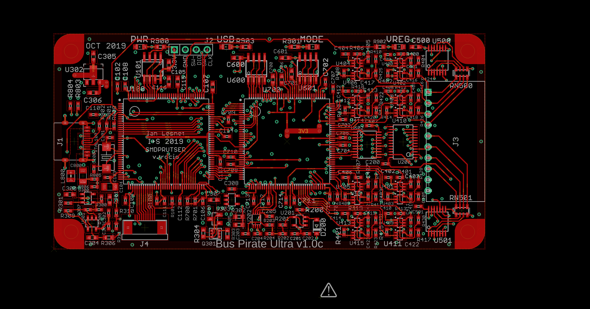
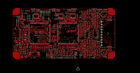

Contents
========

* [PRPR1 > ](#prpr1--)
	* [Schematic](#schematic)
	* [PCB](#pcb)
	* [OOMP Parts](#oomp-parts)
	* [Images](#images)
	* [Tags](#tags)

# PRPR1 > 

- ID: PROJ-DANP-0001-STAN-1C
- Hex ID: PRPR1
- Name: Bus Pirate Ultra 1C
- Description: Bus Pirate Ultra 1C
- Long Link: [http://oom.lt/PROJ-DANP-0001-STAN-1C](http://oom.lt/PROJ-DANP-0001-STAN-1C)
- Short Link: [http://oom.lt/PRPR1](http://oom.lt/PRPR1)

## Schematic
  

## PCB
  

## OOMP Parts
  

|OOMP ID|Name|Identifier|
| :---: | :---: | :---: |
|CAPX-UNMATCHED-X-PF22-01||C100, C101|
|CAPX-UNMATCHED-X-NF100-01||C102, C103, C105, C106, C107, C108, C109, C110, C111, C112, C113, C114, C115, C116, C200, C201, C303, C400, C401, C402, C403, C404, C405, C406, C407, C408, C409, C410, C411, C412, C413, C414, C415, C416, C417, C418, C419, C420, C421, C422, C423, C500, C501, C600, C601, C602, C700, C701, C702, C703, C704, C705, C706, C707, C708, C709, C710, C711, C712, C713, C714, C715|
|CAPX-UNMATCHED-X-UF1-01||C104, C202, C204, C205, C302, C306, C308|
|CAPX-UNMATCHED-X-PF15D-01||C203|
|CAPX-UNMATCHED-X-UF47D-01||C300, C301, C305, C307|
|CAPX-UNMATCHED-X-UF10-01||C800|
|DIOD-S123-X-K4148-01||D200|
|UNMATCHED-UNMATCHED-X-UNMATCHED-01||J1, J4, PCB1, Q300, Q301, RN500, RN501, U100, U101, U200, U202, U302, U400, U401, U402, U403, U404, U405, U406, U407, U408, U409, U410, U411, U412, U413, U414, U415, U500, U501, U600, U601, U602, U700, XTAL100|
|HEAD-I01-X-UNMATCHED-01||J2|
|[HEAD-I01-X-PI10-01](https://github.com/oomlout/oomlout_OOMP_parts/tree/main/HEAD-I01-X-PI10-01/)|[2.54 mm 10 Pin Header](https://github.com/oomlout/oomlout_OOMP_parts/tree/main/HEAD-I01-X-PI10-01/)|[J3](https://github.com/oomlout/oomlout_OOMP_parts/tree/main/HEAD-I01-X-PI10-01/)|
|UNMATCHED-0805-X-UNMATCHED-01||L800|
|LEDS-UNMATCHED-Y-STAN-01||LED900, LED901, LED902, LED903, LED904, LED905, LED906, LED907|
|RESE-UNMATCHED-X-O103-01||R100, R101, R202, R204, R302, R305, R308, R310, R311, R700, R701, R702|
|RESE-UNMATCHED-X-UNMATCHED-01||R200, R201, R203, R300, R306, R307, R309, R424, R425, R426, R427, R428, R429, R430, R431, R800, R801, R802, R803, R804, R900, R901, R902, R903|
|RESE-UNMATCHED-X-O1003-01||R301, R304, R400, R401, R402, R403, R406, R407, R408, R409, R412, R413, R414, R415, R418, R419, R420, R421|
|RESE-UNMATCHED-X-O653-01||R303|
|RESE-UNMATCHED-X-O105-01||R404, R405, R410, R411, R416, R417, R422, R423|
|RESE-UNMATCHED-X-O503-01||R805, R806|
|UNMATCHED-SO235-X-UNMATCHED-01||U201, U300, U301|
|VREG-SO235-X-KMIC5205-01||U303|

## Images
  
  

|eagleImage|
| :---: |
||

## Tags

- oompType: PROJ
- oompSize: DANP
- oompColor: 0001
- oompDesc: STAN
- oompIndex: 1C
- name: Bus Pirate Ultra 1C
- gitRepo: https://github.com/DangerousPrototypes/BusPirateUltraHardware
- gitName: BusPirateUltraHardware
- eagleBoard: BPUv1c/BusPirate-ultra.v1.0c.brd
- eagleSchem: BPUv1c/BusPirate-ultra.v1.0c.sch
- hexID: PRPR1
- oompID: PROJ-DANP-0001-STAN-1C
- oompParts: C100,CAPX-UNMATCHED-X-PF22-01
- oompParts: C101,CAPX-UNMATCHED-X-PF22-01
- oompParts: C102,CAPX-UNMATCHED-X-NF100-01
- oompParts: C103,CAPX-UNMATCHED-X-NF100-01
- oompParts: C104,CAPX-UNMATCHED-X-UF1-01
- oompParts: C105,CAPX-UNMATCHED-X-NF100-01
- oompParts: C106,CAPX-UNMATCHED-X-NF100-01
- oompParts: C107,CAPX-UNMATCHED-X-NF100-01
- oompParts: C108,CAPX-UNMATCHED-X-NF100-01
- oompParts: C109,CAPX-UNMATCHED-X-NF100-01
- oompParts: C110,CAPX-UNMATCHED-X-NF100-01
- oompParts: C111,CAPX-UNMATCHED-X-NF100-01
- oompParts: C112,CAPX-UNMATCHED-X-NF100-01
- oompParts: C113,CAPX-UNMATCHED-X-NF100-01
- oompParts: C114,CAPX-UNMATCHED-X-NF100-01
- oompParts: C115,CAPX-UNMATCHED-X-NF100-01
- oompParts: C116,CAPX-UNMATCHED-X-NF100-01
- oompParts: C200,CAPX-UNMATCHED-X-NF100-01
- oompParts: C201,CAPX-UNMATCHED-X-NF100-01
- oompParts: C202,CAPX-UNMATCHED-X-UF1-01
- oompParts: C203,CAPX-UNMATCHED-X-PF15D-01
- oompParts: C204,CAPX-UNMATCHED-X-UF1-01
- oompParts: C205,CAPX-UNMATCHED-X-UF1-01
- oompParts: C300,CAPX-UNMATCHED-X-UF47D-01
- oompParts: C301,CAPX-UNMATCHED-X-UF47D-01
- oompParts: C302,CAPX-UNMATCHED-X-UF1-01
- oompParts: C303,CAPX-UNMATCHED-X-NF100-01
- oompParts: C305,CAPX-UNMATCHED-X-UF47D-01
- oompParts: C306,CAPX-UNMATCHED-X-UF1-01
- oompParts: C307,CAPX-UNMATCHED-X-UF47D-01
- oompParts: C308,CAPX-UNMATCHED-X-UF1-01
- oompParts: C400,CAPX-UNMATCHED-X-NF100-01
- oompParts: C401,CAPX-UNMATCHED-X-NF100-01
- oompParts: C402,CAPX-UNMATCHED-X-NF100-01
- oompParts: C403,CAPX-UNMATCHED-X-NF100-01
- oompParts: C404,CAPX-UNMATCHED-X-NF100-01
- oompParts: C405,CAPX-UNMATCHED-X-NF100-01
- oompParts: C406,CAPX-UNMATCHED-X-NF100-01
- oompParts: C407,CAPX-UNMATCHED-X-NF100-01
- oompParts: C408,CAPX-UNMATCHED-X-NF100-01
- oompParts: C409,CAPX-UNMATCHED-X-NF100-01
- oompParts: C410,CAPX-UNMATCHED-X-NF100-01
- oompParts: C411,CAPX-UNMATCHED-X-NF100-01
- oompParts: C412,CAPX-UNMATCHED-X-NF100-01
- oompParts: C413,CAPX-UNMATCHED-X-NF100-01
- oompParts: C414,CAPX-UNMATCHED-X-NF100-01
- oompParts: C415,CAPX-UNMATCHED-X-NF100-01
- oompParts: C416,CAPX-UNMATCHED-X-NF100-01
- oompParts: C417,CAPX-UNMATCHED-X-NF100-01
- oompParts: C418,CAPX-UNMATCHED-X-NF100-01
- oompParts: C419,CAPX-UNMATCHED-X-NF100-01
- oompParts: C420,CAPX-UNMATCHED-X-NF100-01
- oompParts: C421,CAPX-UNMATCHED-X-NF100-01
- oompParts: C422,CAPX-UNMATCHED-X-NF100-01
- oompParts: C423,CAPX-UNMATCHED-X-NF100-01
- oompParts: C500,CAPX-UNMATCHED-X-NF100-01
- oompParts: C501,CAPX-UNMATCHED-X-NF100-01
- oompParts: C600,CAPX-UNMATCHED-X-NF100-01
- oompParts: C601,CAPX-UNMATCHED-X-NF100-01
- oompParts: C602,CAPX-UNMATCHED-X-NF100-01
- oompParts: C700,CAPX-UNMATCHED-X-NF100-01
- oompParts: C701,CAPX-UNMATCHED-X-NF100-01
- oompParts: C702,CAPX-UNMATCHED-X-NF100-01
- oompParts: C703,CAPX-UNMATCHED-X-NF100-01
- oompParts: C704,CAPX-UNMATCHED-X-NF100-01
- oompParts: C705,CAPX-UNMATCHED-X-NF100-01
- oompParts: C706,CAPX-UNMATCHED-X-NF100-01
- oompParts: C707,CAPX-UNMATCHED-X-NF100-01
- oompParts: C708,CAPX-UNMATCHED-X-NF100-01
- oompParts: C709,CAPX-UNMATCHED-X-NF100-01
- oompParts: C710,CAPX-UNMATCHED-X-NF100-01
- oompParts: C711,CAPX-UNMATCHED-X-NF100-01
- oompParts: C712,CAPX-UNMATCHED-X-NF100-01
- oompParts: C713,CAPX-UNMATCHED-X-NF100-01
- oompParts: C714,CAPX-UNMATCHED-X-NF100-01
- oompParts: C715,CAPX-UNMATCHED-X-NF100-01
- oompParts: C800,CAPX-UNMATCHED-X-UF10-01
- oompParts: D200,DIOD-S123-X-K4148-01
- oompParts: J1,UNMATCHED-UNMATCHED-X-UNMATCHED-01
- oompParts: J2,HEAD-I01-X-UNMATCHED-01
- oompParts: J3,HEAD-I01-X-PI10-01
- oompParts: J4,UNMATCHED-UNMATCHED-X-UNMATCHED-01
- oompParts: L800,UNMATCHED-0805-X-UNMATCHED-01
- oompParts: LED900,LEDS-UNMATCHED-Y-STAN-01
- oompParts: LED901,LEDS-UNMATCHED-Y-STAN-01
- oompParts: LED902,LEDS-UNMATCHED-Y-STAN-01
- oompParts: LED903,LEDS-UNMATCHED-Y-STAN-01
- oompParts: LED904,LEDS-UNMATCHED-Y-STAN-01
- oompParts: LED905,LEDS-UNMATCHED-Y-STAN-01
- oompParts: LED906,LEDS-UNMATCHED-Y-STAN-01
- oompParts: LED907,LEDS-UNMATCHED-Y-STAN-01
- oompParts: PCB1,UNMATCHED-UNMATCHED-X-UNMATCHED-01
- oompParts: Q300,UNMATCHED-UNMATCHED-X-UNMATCHED-01
- oompParts: Q301,UNMATCHED-UNMATCHED-X-UNMATCHED-01
- oompParts: R100,RESE-UNMATCHED-X-O103-01
- oompParts: R101,RESE-UNMATCHED-X-O103-01
- oompParts: R200,RESE-UNMATCHED-X-UNMATCHED-01
- oompParts: R201,RESE-UNMATCHED-X-UNMATCHED-01
- oompParts: R202,RESE-UNMATCHED-X-O103-01
- oompParts: R203,RESE-UNMATCHED-X-UNMATCHED-01
- oompParts: R204,RESE-UNMATCHED-X-O103-01
- oompParts: R300,RESE-UNMATCHED-X-UNMATCHED-01
- oompParts: R301,RESE-UNMATCHED-X-O1003-01
- oompParts: R302,RESE-UNMATCHED-X-O103-01
- oompParts: R303,RESE-UNMATCHED-X-O653-01
- oompParts: R304,RESE-UNMATCHED-X-O1003-01
- oompParts: R305,RESE-UNMATCHED-X-O103-01
- oompParts: R306,RESE-UNMATCHED-X-UNMATCHED-01
- oompParts: R307,RESE-UNMATCHED-X-UNMATCHED-01
- oompParts: R308,RESE-UNMATCHED-X-O103-01
- oompParts: R309,RESE-UNMATCHED-X-UNMATCHED-01
- oompParts: R310,RESE-UNMATCHED-X-O103-01
- oompParts: R311,RESE-UNMATCHED-X-O103-01
- oompParts: R400,RESE-UNMATCHED-X-O1003-01
- oompParts: R401,RESE-UNMATCHED-X-O1003-01
- oompParts: R402,RESE-UNMATCHED-X-O1003-01
- oompParts: R403,RESE-UNMATCHED-X-O1003-01
- oompParts: R404,RESE-UNMATCHED-X-O105-01
- oompParts: R405,RESE-UNMATCHED-X-O105-01
- oompParts: R406,RESE-UNMATCHED-X-O1003-01
- oompParts: R407,RESE-UNMATCHED-X-O1003-01
- oompParts: R408,RESE-UNMATCHED-X-O1003-01
- oompParts: R409,RESE-UNMATCHED-X-O1003-01
- oompParts: R410,RESE-UNMATCHED-X-O105-01
- oompParts: R411,RESE-UNMATCHED-X-O105-01
- oompParts: R412,RESE-UNMATCHED-X-O1003-01
- oompParts: R413,RESE-UNMATCHED-X-O1003-01
- oompParts: R414,RESE-UNMATCHED-X-O1003-01
- oompParts: R415,RESE-UNMATCHED-X-O1003-01
- oompParts: R416,RESE-UNMATCHED-X-O105-01
- oompParts: R417,RESE-UNMATCHED-X-O105-01
- oompParts: R418,RESE-UNMATCHED-X-O1003-01
- oompParts: R419,RESE-UNMATCHED-X-O1003-01
- oompParts: R420,RESE-UNMATCHED-X-O1003-01
- oompParts: R421,RESE-UNMATCHED-X-O1003-01
- oompParts: R422,RESE-UNMATCHED-X-O105-01
- oompParts: R423,RESE-UNMATCHED-X-O105-01
- oompParts: R424,RESE-UNMATCHED-X-UNMATCHED-01
- oompParts: R425,RESE-UNMATCHED-X-UNMATCHED-01
- oompParts: R426,RESE-UNMATCHED-X-UNMATCHED-01
- oompParts: R427,RESE-UNMATCHED-X-UNMATCHED-01
- oompParts: R428,RESE-UNMATCHED-X-UNMATCHED-01
- oompParts: R429,RESE-UNMATCHED-X-UNMATCHED-01
- oompParts: R430,RESE-UNMATCHED-X-UNMATCHED-01
- oompParts: R431,RESE-UNMATCHED-X-UNMATCHED-01
- oompParts: R700,RESE-UNMATCHED-X-O103-01
- oompParts: R701,RESE-UNMATCHED-X-O103-01
- oompParts: R702,RESE-UNMATCHED-X-O103-01
- oompParts: R800,RESE-UNMATCHED-X-UNMATCHED-01
- oompParts: R801,RESE-UNMATCHED-X-UNMATCHED-01
- oompParts: R802,RESE-UNMATCHED-X-UNMATCHED-01
- oompParts: R803,RESE-UNMATCHED-X-UNMATCHED-01
- oompParts: R804,RESE-UNMATCHED-X-UNMATCHED-01
- oompParts: R805,RESE-UNMATCHED-X-O503-01
- oompParts: R806,RESE-UNMATCHED-X-O503-01
- oompParts: R900,RESE-UNMATCHED-X-UNMATCHED-01
- oompParts: R901,RESE-UNMATCHED-X-UNMATCHED-01
- oompParts: R902,RESE-UNMATCHED-X-UNMATCHED-01
- oompParts: R903,RESE-UNMATCHED-X-UNMATCHED-01
- oompParts: RN500,UNMATCHED-UNMATCHED-X-UNMATCHED-01
- oompParts: RN501,UNMATCHED-UNMATCHED-X-UNMATCHED-01
- oompParts: U100,UNMATCHED-UNMATCHED-X-UNMATCHED-01
- oompParts: U101,UNMATCHED-UNMATCHED-X-UNMATCHED-01
- oompParts: U200,UNMATCHED-UNMATCHED-X-UNMATCHED-01
- oompParts: U201,UNMATCHED-SO235-X-UNMATCHED-01
- oompParts: U202,UNMATCHED-UNMATCHED-X-UNMATCHED-01
- oompParts: U300,UNMATCHED-SO235-X-UNMATCHED-01
- oompParts: U301,UNMATCHED-SO235-X-UNMATCHED-01
- oompParts: U302,UNMATCHED-UNMATCHED-X-UNMATCHED-01
- oompParts: U303,VREG-SO235-X-KMIC5205-01
- oompParts: U400,UNMATCHED-UNMATCHED-X-UNMATCHED-01
- oompParts: U401,UNMATCHED-UNMATCHED-X-UNMATCHED-01
- oompParts: U402,UNMATCHED-UNMATCHED-X-UNMATCHED-01
- oompParts: U403,UNMATCHED-UNMATCHED-X-UNMATCHED-01
- oompParts: U404,UNMATCHED-UNMATCHED-X-UNMATCHED-01
- oompParts: U405,UNMATCHED-UNMATCHED-X-UNMATCHED-01
- oompParts: U406,UNMATCHED-UNMATCHED-X-UNMATCHED-01
- oompParts: U407,UNMATCHED-UNMATCHED-X-UNMATCHED-01
- oompParts: U408,UNMATCHED-UNMATCHED-X-UNMATCHED-01
- oompParts: U409,UNMATCHED-UNMATCHED-X-UNMATCHED-01
- oompParts: U410,UNMATCHED-UNMATCHED-X-UNMATCHED-01
- oompParts: U411,UNMATCHED-UNMATCHED-X-UNMATCHED-01
- oompParts: U412,UNMATCHED-UNMATCHED-X-UNMATCHED-01
- oompParts: U413,UNMATCHED-UNMATCHED-X-UNMATCHED-01
- oompParts: U414,UNMATCHED-UNMATCHED-X-UNMATCHED-01
- oompParts: U415,UNMATCHED-UNMATCHED-X-UNMATCHED-01
- oompParts: U500,UNMATCHED-UNMATCHED-X-UNMATCHED-01
- oompParts: U501,UNMATCHED-UNMATCHED-X-UNMATCHED-01
- oompParts: U600,UNMATCHED-UNMATCHED-X-UNMATCHED-01
- oompParts: U601,UNMATCHED-UNMATCHED-X-UNMATCHED-01
- oompParts: U602,UNMATCHED-UNMATCHED-X-UNMATCHED-01
- oompParts: U700,UNMATCHED-UNMATCHED-X-UNMATCHED-01
- oompParts: XTAL100,UNMATCHED-UNMATCHED-X-UNMATCHED-01
- rawParts: C100,22pF,CAPACITOR_NPOL-0402,C402,Non-Polarized capacitor in various packages,,
- rawParts: C101,22pF,CAPACITOR_NPOL-0402,C402,Non-Polarized capacitor in various packages,,
- rawParts: C102,0.1uF,CAPACITOR_NPOL-0402,C402,Non-Polarized capacitor in various packages,,
- rawParts: C103,0.1uF,CAPACITOR_NPOL-0402,C402,Non-Polarized capacitor in various packages,,
- rawParts: C104,1uF,CAPACITOR_POL-SMC_A,SMC_A,Polarized capacitor in various packages,,
- rawParts: C105,0.1uF,CAPACITOR_NPOL-0603,C603,Non-Polarized capacitor in various packages,,
- rawParts: C106,0.1uF,CAPACITOR_NPOL-0402,C402,Non-Polarized capacitor in various packages,,
- rawParts: C107,0.1uF,CAPACITOR_NPOL-0603,C603,Non-Polarized capacitor in various packages,,
- rawParts: C108,0.1uF,CAPACITOR_NPOL-0402,C402,Non-Polarized capacitor in various packages,,
- rawParts: C109,0.1uF,CAPACITOR_NPOL-0402,C402,Non-Polarized capacitor in various packages,,
- rawParts: C110,0.1uF,CAPACITOR_NPOL-0402,C402,Non-Polarized capacitor in various packages,,
- rawParts: C111,0.1uF,CAPACITOR_NPOL-0402,C402,Non-Polarized capacitor in various packages,,
- rawParts: C112,0.1uF,CAPACITOR_NPOL-0402,C402,Non-Polarized capacitor in various packages,,
- rawParts: C113,0.1uF,CAPACITOR_NPOL-0402,C402,Non-Polarized capacitor in various packages,,
- rawParts: C114,0.1uF,CAPACITOR_NPOL-0402,C402,Non-Polarized capacitor in various packages,,
- rawParts: C115,0.1uF,CAPACITOR_NPOL-0603,C603,Non-Polarized capacitor in various packages,,
- rawParts: C116,0.1uF,CAPACITOR_NPOL-0603,C603,Non-Polarized capacitor in various packages,,
- rawParts: C200,0.1uF,CAPACITOR_NPOL-0402,C402,Non-Polarized capacitor in various packages,,
- rawParts: C201,0.1uF,CAPACITOR_NPOL-0402,C402,Non-Polarized capacitor in various packages,,
- rawParts: C202,1uF,CAPACITOR_NPOL-0402,C402,Non-Polarized capacitor in various packages,,
- rawParts: C203,1.5nF,CAPACITOR_NPOL-0402,C402,Non-Polarized capacitor in various packages,,
- rawParts: C204,1uF,CAPACITOR_NPOL-0402,C402,Non-Polarized capacitor in various packages,,
- rawParts: C205,1uF,CAPACITOR_NPOL-0402,C402,Non-Polarized capacitor in various packages,,
- rawParts: C300,4.7uF,CAPACITOR_NPOL-0603,C603,Non-Polarized capacitor in various packages,,
- rawParts: C301,4.7uF,CAPACITOR_NPOL-0603,C603,Non-Polarized capacitor in various packages,,
- rawParts: C302,1uF,CAPACITOR_NPOL-0402,C402,Non-Polarized capacitor in various packages,,
- rawParts: C303,0.1uF,CAPACITOR_NPOL-0402,C402,Non-Polarized capacitor in various packages,,
- rawParts: C304,DNP,CAPACITOR_NPOL-0603,C603,Non-Polarized capacitor in various packages,,
- rawParts: C305,4.7uF,CAPACITOR_NPOL-0603,C603,Non-Polarized capacitor in various packages,,
- rawParts: C306,1uF,CAPACITOR_NPOL-0603,C603,Non-Polarized capacitor in various packages,,
- rawParts: C307,4.7uF,CAPACITOR_NPOL-0603,C603,Non-Polarized capacitor in various packages,,
- rawParts: C308,1uF,CAPACITOR_NPOL-0402,C402,Non-Polarized capacitor in various packages,,
- rawParts: C400,0.1uF,CAPACITOR_NPOL-0402,C402,Non-Polarized capacitor in various packages,,
- rawParts: C401,0.1uF,CAPACITOR_NPOL-0402,C402,Non-Polarized capacitor in various packages,,
- rawParts: C402,0.1uF,CAPACITOR_NPOL-0402,C402,Non-Polarized capacitor in various packages,,
- rawParts: C403,0.1uF,CAPACITOR_NPOL-0402,C402,Non-Polarized capacitor in various packages,,
- rawParts: C404,0.1uF,CAPACITOR_NPOL-0402,C402,Non-Polarized capacitor in various packages,,
- rawParts: C405,0.1uF,CAPACITOR_NPOL-0402,C402,Non-Polarized capacitor in various packages,,
- rawParts: C406,0.1uF,CAPACITOR_NPOL-0402,C402,Non-Polarized capacitor in various packages,,
- rawParts: C407,0.1uF,CAPACITOR_NPOL-0402,C402,Non-Polarized capacitor in various packages,,
- rawParts: C408,0.1uF,CAPACITOR_NPOL-0402,C402,Non-Polarized capacitor in various packages,,
- rawParts: C409,0.1uF,CAPACITOR_NPOL-0402,C402,Non-Polarized capacitor in various packages,,
- rawParts: C410,0.1uF,CAPACITOR_NPOL-0402,C402,Non-Polarized capacitor in various packages,,
- rawParts: C411,0.1uF,CAPACITOR_NPOL-0402,C402,Non-Polarized capacitor in various packages,,
- rawParts: C412,0.1uF,CAPACITOR_NPOL-0402,C402,Non-Polarized capacitor in various packages,,
- rawParts: C413,0.1uF,CAPACITOR_NPOL-0402,C402,Non-Polarized capacitor in various packages,,
- rawParts: C414,0.1uF,CAPACITOR_NPOL-0402,C402,Non-Polarized capacitor in various packages,,
- rawParts: C415,0.1uF,CAPACITOR_NPOL-0402,C402,Non-Polarized capacitor in various packages,,
- rawParts: C416,0.1uF,CAPACITOR_NPOL-0402,C402,Non-Polarized capacitor in various packages,,
- rawParts: C417,0.1uF,CAPACITOR_NPOL-0402,C402,Non-Polarized capacitor in various packages,,
- rawParts: C418,0.1uF,CAPACITOR_NPOL-0402,C402,Non-Polarized capacitor in various packages,,
- rawParts: C419,0.1uF,CAPACITOR_NPOL-0402,C402,Non-Polarized capacitor in various packages,,
- rawParts: C420,0.1uF,CAPACITOR_NPOL-0402,C402,Non-Polarized capacitor in various packages,,
- rawParts: C421,0.1uF,CAPACITOR_NPOL-0402,C402,Non-Polarized capacitor in various packages,,
- rawParts: C422,0.1uF,CAPACITOR_NPOL-0402,C402,Non-Polarized capacitor in various packages,,
- rawParts: C423,0.1uF,CAPACITOR_NPOL-0402,C402,Non-Polarized capacitor in various packages,,
- rawParts: C500,0.1uF,CAPACITOR_NPOL-0603,C603,Non-Polarized capacitor in various packages,,
- rawParts: C501,0.1uF,CAPACITOR_NPOL-0402,C402,Non-Polarized capacitor in various packages,,
- rawParts: C600,0.1uF,CAPACITOR_NPOL-0603,C603,Non-Polarized capacitor in various packages,,
- rawParts: C601,0.1uF,CAPACITOR_NPOL-0603,C603,Non-Polarized capacitor in various packages,,
- rawParts: C602,0.1uF,CAPACITOR_NPOL-0402,C402,Non-Polarized capacitor in various packages,,
- rawParts: C700,0.1uF,CAPACITOR_NPOL-0603,C603,Non-Polarized capacitor in various packages,,
- rawParts: C701,0.1uF,CAPACITOR_NPOL-0603,C603,Non-Polarized capacitor in various packages,,
- rawParts: C702,0.1uF,CAPACITOR_NPOL-0402,C402,Non-Polarized capacitor in various packages,,
- rawParts: C703,0.1uF,CAPACITOR_NPOL-0402,C402,Non-Polarized capacitor in various packages,,
- rawParts: C704,0.1uF,CAPACITOR_NPOL-0402,C402,Non-Polarized capacitor in various packages,,
- rawParts: C705,0.1uF,CAPACITOR_NPOL-0402,C402,Non-Polarized capacitor in various packages,,
- rawParts: C706,0.1uF,CAPACITOR_NPOL-0603,C603,Non-Polarized capacitor in various packages,,
- rawParts: C707,0.1uF,CAPACITOR_NPOL-0402,C402,Non-Polarized capacitor in various packages,,
- rawParts: C708,0.1uF,CAPACITOR_NPOL-0402,C402,Non-Polarized capacitor in various packages,,
- rawParts: C709,0.1uF,CAPACITOR_NPOL-0402,C402,Non-Polarized capacitor in various packages,,
- rawParts: C710,0.1uF,CAPACITOR_NPOL-0402,C402,Non-Polarized capacitor in various packages,,
- rawParts: C711,0.1uF,CAPACITOR_NPOL-0402,C402,Non-Polarized capacitor in various packages,,
- rawParts: C712,0.1uF,CAPACITOR_NPOL-0402,C402,Non-Polarized capacitor in various packages,,
- rawParts: C713,0.1uF,CAPACITOR_NPOL-0402,C402,Non-Polarized capacitor in various packages,,
- rawParts: C714,0.1uF,CAPACITOR_NPOL-0402,C402,Non-Polarized capacitor in various packages,,
- rawParts: C715,0.1uF,CAPACITOR_NPOL-0402,C402,Non-Polarized capacitor in various packages,,
- rawParts: C800,10uF,CAPACITOR_POL-SMC_A,SMC_A,Polarized capacitor in various packages,,
- rawParts: D200,1N4148,DIODE-SOD-123,SOD-123,Various Diode Packages,,
- rawParts: J1,USB-C-12,USB-C-12,C-31-M-12,,,
- rawParts: J2,CON_HEADER_1X04,CON_HEADER_1X04,M1X4,,,
- rawParts: J3,CON_HEADER_1X10-RIGHT_ANGLED_PTH_SHROUDED,CON_HEADER_1X10-RIGHT_ANGLED_PTH_SHROUDED,M1X10_MALE_RIGHT_ANGLES_PTH_SHROUDED,,,
- rawParts: J4,CON-FPC_X05B20L10T,CON-FPC_X05B20L10T,X05B20L10T,10-pin 0.5mm pitch SMD FPC Connector X05B20L10T,,
- rawParts: L800,1.5A,WE-KIL_0805,WE-KI_0805_B,SMD Wire Wound Ceramic Inductor WE-KIL,,
- rawParts: LED900,YELLOW,LED-0805,LED-805,Light Emitting Diode,,
- rawParts: LED901,YELLOW,LED-0805,LED-805,Light Emitting Diode,,
- rawParts: LED902,YELLOW,LED-0805,LED-805,Light Emitting Diode,,
- rawParts: LED903,YELLOW,LED-0805,LED-805,Light Emitting Diode,,
- rawParts: LED904,Optional YELLOW,LED-0805,LED-805,Light Emitting Diode,,
- rawParts: LED905,Optional YELLOW,LED-0805,LED-805,Light Emitting Diode,,
- rawParts: LED906,Optional YELLOW,LED-0805,LED-805,Light Emitting Diode,,
- rawParts: LED907,Optional YELLOW,LED-0805,LED-805,Light Emitting Diode,,
- rawParts: LOGO1,LOGO_CC-0,LOGO_CC-0,LOGO_CC-0,,,
- rawParts: PCB1,PCB_DP_RECTANGLE-50X100,PCB_DP_RECTANGLE-50X100,DP10050_V1,Dangerous Prototypes Standard Rectangular PCB sizes,,
- rawParts: Q300,PMV65XP,TRANSISTOR_FET_TSM2301CX,SOT-23,20V P-Channel Enhancement Mode MOSFET,,
- rawParts: Q301,DMMT3906W,TRANSISTOR-BJT_DMMT3906W,SOT-363,Matched pair PNP small signal transistor -40V -200mA,,
- rawParts: R100,10K,RESISTOR-0402,R402,,,
- rawParts: R101,10K,RESISTOR-0402,R402,,,
- rawParts: R200,0R,RESISTOR-0402,R402,,,
- rawParts: R201,0R,RESISTOR-0402,R402,,,
- rawParts: R202,10K,RESISTOR-0402,R402,,,
- rawParts: R203,25R,RESISTOR-0402,R402,,,
- rawParts: R204,10K,RESISTOR-0402,R402,,,
- rawParts: R300,99.22K,RESISTOR-0402,R402,,,
- rawParts: R301,100K,RESISTOR-0402,R402,,,
- rawParts: R302,10K,RESISTOR-0603,R603,,,
- rawParts: R303,65K,RESISTOR-0603,R603,,,
- rawParts: R304,100K,RESISTOR-0603,R603,,,
- rawParts: R305,10K,RESISTOR-0603,R603,,,
- rawParts: R306,0R,RESISTOR-0603,R603,,,
- rawParts: R307,77.96K,RESISTOR-0402,R402,,,
- rawParts: R308,10K,RESISTOR-0402,R402,,,
- rawParts: R309,0R,RESISTOR-0402,R402,,,
- rawParts: R310,10K,RESISTOR-0402,R402,,,
- rawParts: R311,10K,RESISTOR-0402,R402,,,
- rawParts: R400,100K,RESISTOR-0402,R402,,,
- rawParts: R401,100K,RESISTOR-0402,R402,,,
- rawParts: R402,100K,RESISTOR-0402,R402,,,
- rawParts: R403,100K,RESISTOR-0402,R402,,,
- rawParts: R404,1M,RESISTOR-0402,R402,,,
- rawParts: R405,1M,RESISTOR-0402,R402,,,
- rawParts: R406,100K,RESISTOR-0402,R402,,,
- rawParts: R407,100K,RESISTOR-0402,R402,,,
- rawParts: R408,100K,RESISTOR-0402,R402,,,
- rawParts: R409,100K,RESISTOR-0402,R402,,,
- rawParts: R410,1M,RESISTOR-0402,R402,,,
- rawParts: R411,1M,RESISTOR-0402,R402,,,
- rawParts: R412,100K,RESISTOR-0402,R402,,,
- rawParts: R413,100K,RESISTOR-0402,R402,,,
- rawParts: R414,100K,RESISTOR-0402,R402,,,
- rawParts: R415,100K,RESISTOR-0402,R402,,,
- rawParts: R416,1M,RESISTOR-0402,R402,,,
- rawParts: R417,1M,RESISTOR-0402,R402,,,
- rawParts: R418,100K,RESISTOR-0402,R402,,,
- rawParts: R419,100K,RESISTOR-0402,R402,,,
- rawParts: R420,100K,RESISTOR-0402,R402,,,
- rawParts: R421,100K,RESISTOR-0402,R402,,,
- rawParts: R422,1M,RESISTOR-0402,R402,,,
- rawParts: R423,1M,RESISTOR-0402,R402,,,
- rawParts: R424,220R,RESISTOR-0402,R402,,,
- rawParts: R425,220R,RESISTOR-0402,R402,,,
- rawParts: R426,220R,RESISTOR-0402,R402,,,
- rawParts: R427,220R,RESISTOR-0402,R402,,,
- rawParts: R428,220R,RESISTOR-0402,R402,,,
- rawParts: R429,220R,RESISTOR-0402,R402,,,
- rawParts: R430,220R,RESISTOR-0402,R402,,,
- rawParts: R431,220R,RESISTOR-0402,R402,,,
- rawParts: R700,10K,RESISTOR-0402,R402,,,
- rawParts: R701,10K,RESISTOR-0402,R402,,,
- rawParts: R702,10K,RESISTOR-0402,R402,,,
- rawParts: R800,1.5K,RESISTOR-0402,R402,,,
- rawParts: R801,22R,RESISTOR-0402,R402,,,
- rawParts: R802,22R,RESISTOR-0402,R402,,,
- rawParts: R803,5K1,RESISTOR-0402,R402,,,
- rawParts: R804,5K1,RESISTOR-0402,R402,,,
- rawParts: R805,50K,RESISTOR-0402,R402,,,
- rawParts: R806,50K,RESISTOR-0402,R402,,,
- rawParts: R900,1K1,RESISTOR-0603,R603,,,
- rawParts: R901,1K1,RESISTOR-0603,R603,,,
- rawParts: R902,1K1,RESISTOR-0603,R603,,,
- rawParts: R903,1K1,RESISTOR-0603,R603,,,
- rawParts: RN500,2K,RNETWORK,RN8P-4R-CRA06S,4 Resistor Array 0603,,
- rawParts: RN501,2K,RNETWORK,RN8P-4R-CRA06S,4 Resistor Array 0603,,
- rawParts: U100,STM32F103ZX,IC_UC_STM32F103ZX,TQFP-144,STM32F103ZX,,
- rawParts: U101,W25X40CL,IC_MEM_W25X40CL,SOIC-8,4M-Bit serial flash memory with 4KB sectors and Dual I/O SPI,,
- rawParts: U200,74HCT4067,IC_74HCT4067,TSSOP-24,74HCT4067,,
- rawParts: U201,MCP6001,IC_OP-AMP_MCP6001,SOT-23-5,1 MHz, Low-Power Op Amp,,
- rawParts: U202,ADS7041,IC_ADC_ADS7041,VSSOP-8_DCU_PDSO_G8,Ultra-low power 10-Bit 1-MSPS SAR ADC,,
- rawParts: U300,MCP1824_ADJ,IC_MCP1824_ADJ,SOT-23-5,MCP1824 ADJ,,
- rawParts: U301,MCP6001,IC_OP-AMP_MCP6001,SOT-23-5,1 MHz, Low-Power Op Amp,,
- rawParts: U302,MCP1700,IC_MCP1700,SOT-89,Low quiescent current LDO 200~250mA Output current,,
- rawParts: U303,MCP1801T-1202I/OT,MIC5205,SOT-23-5@1,150ma Low-Noise LDO Regulator,,
- rawParts: U400,SN74LVC1T45DBV,IC_BUFF_SN74LVC1T45DBV-SC-70-6,SC-70-6,,,
- rawParts: U401,SN74LVC1T45DBV,IC_BUFF_SN74LVC1T45DBV-SC-70-6,SC-70-6,,,
- rawParts: U402,74LVC1G07DBV,IC_BUFF_74LVC1G07,SC-70-5,Single buffer/driver with open drain output,,
- rawParts: U403,74LVC1G07DBV,IC_BUFF_74LVC1G07,SC-70-5,Single buffer/driver with open drain output,,
- rawParts: U404,SN74LVC1T45DBV,IC_BUFF_SN74LVC1T45DBV-SC-70-6,SC-70-6,,,
- rawParts: U405,SN74LVC1T45DBV,IC_BUFF_SN74LVC1T45DBV-SC-70-6,SC-70-6,,,
- rawParts: U406,74LVC1G07DBV,IC_BUFF_74LVC1G07,SC-70-5,Single buffer/driver with open drain output,,
- rawParts: U407,74LVC1G07DBV,IC_BUFF_74LVC1G07,SC-70-5,Single buffer/driver with open drain output,,
- rawParts: U408,SN74LVC1T45DBV,IC_BUFF_SN74LVC1T45DBV-SC-70-6,SC-70-6,,,
- rawParts: U409,SN74LVC1T45DBV,IC_BUFF_SN74LVC1T45DBV-SC-70-6,SC-70-6,,,
- rawParts: U410,74LVC1G07DBV,IC_BUFF_74LVC1G07,SC-70-5,Single buffer/driver with open drain output,,
- rawParts: U411,74LVC1G07DBV,IC_BUFF_74LVC1G07,SC-70-5,Single buffer/driver with open drain output,,
- rawParts: U412,SN74LVC1T45DBV,IC_BUFF_SN74LVC1T45DBV-SC-70-6,SC-70-6,,,
- rawParts: U413,SN74LVC1T45DBV,IC_BUFF_SN74LVC1T45DBV-SC-70-6,SC-70-6,,,
- rawParts: U414,74LVC1G07DBV,IC_BUFF_74LVC1G07,SC-70-5,Single buffer/driver with open drain output,,
- rawParts: U415,74LVC1G07DBV,IC_BUFF_74LVC1G07,SC-70-5,Single buffer/driver with open drain output,,
- rawParts: U500,74HCT4066PW,IC_74HCT4066PW,TSSOP-14,Quad single-pole single-throw analog switch,,
- rawParts: U501,74HCT4066PW,IC_74HCT4066PW,TSSOP-14,Quad single-pole single-throw analog switch,,
- rawParts: U600,23LC1024,IC_MEM_23LC1024,SOIC-8,1Mbit SPI SRAM with Serial dual interface and Serial quad interface,,
- rawParts: U601,23LC1024,IC_MEM_23LC1024,SOIC-8,1Mbit SPI SRAM with Serial dual interface and Serial quad interface,,
- rawParts: U602,74LVC245A,IC_BUFF_74LVC245A-TSSOP20,TSSOP-20,Octal Bus transceiver with 3-state, 3.3V supply,,
- rawParts: U700,ICE40HX4K,IC_FPGA_ICE40HX4K,TQFP-144,iCE40HX4K,,
- rawParts: XTAL100,8Mhz,OSC-XTAL-12M,XTAL_4X6,,,
