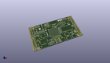
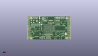
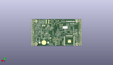
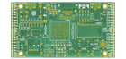
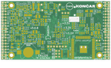

Contents
========

* [PRPR1 > ](#prpr1--)
	* [Interactive BOM](#interactive-bom)
	* [OOMP Parts](#oomp-parts)
	* [Images](#images)
	* [Tags](#tags)
  
![][im]
# PRPR1 > 

- ID: PROJ-DANP-0001-STAN-2A
- Hex ID: PRPR1
- Name: Bus Pirate Ultra 2A
- Description: Bus Pirate Ultra 2A
- Long Link: [http://oom.lt/PROJ-DANP-0001-STAN-2A](http://oom.lt/PROJ-DANP-0001-STAN-2A)
- Short Link: [http://oom.lt/PRPR1](http://oom.lt/PRPR1)

## Interactive BOM

- Interactive BOM page: [ibom.html](https://htmlpreview.github.io/?https://github.com/oomlout/oomlout_OOMP_projects/blob/main/PROJ-DANP-0001-STAN-2A/kicad/bom/ibom.html)

## OOMP Parts
  

|OOMP ID|Name|Identifier|
| :---: | :---: | :---: |
|UNMATCHED-UNMATCHED-X-UNMATCHED-01||BAT1, US2, US1, HR, U6, SD1, Y1, L3, L1, L2, Y2, AUDIO1, SW1, GPDI1, U2, U1, U8, Q2, U5, U3, U4, OLED1, U7, U11, U10, REF**, fer, J1, J2, H1, H2, H3, H4, J4, radiona, REF**, REF**, Q1, B0, B1, B2, B3, B4, B5, B6, U9|
|[CAPC-0603-X-NF220-V25](https://github.com/oomlout/oomlout_OOMP_parts/tree/main/CAPC-0603-X-NF220-V25/)|[SMD (0603) 220 nF Capacitor (Ceramic) 25v](https://github.com/oomlout/oomlout_OOMP_parts/tree/main/CAPC-0603-X-NF220-V25/)|[C37, C36, C41, C45, C40, C44, C39, C43, C38, C42, C59, C14, C60, C62](https://github.com/oomlout/oomlout_OOMP_parts/tree/main/CAPC-0603-X-NF220-V25/)|
|RESE-0603-X-O541-01||R37, R36, R62, R41, R42, R43, R44, R45, R46, R47, R48, R35, R15, R58, R19, R61, R65|
|[LEDS-0805-R-STAN-01](https://github.com/oomlout/oomlout_OOMP_parts/tree/main/LEDS-0805-R-STAN-01/)|[SMD (0805) Red LED](https://github.com/oomlout/oomlout_OOMP_parts/tree/main/LEDS-0805-R-STAN-01/)|[D19, D0, D4, D11](https://github.com/oomlout/oomlout_OOMP_parts/tree/main/LEDS-0805-R-STAN-01/)|
|[LEDS-0805-G-STAN-01](https://github.com/oomlout/oomlout_OOMP_parts/tree/main/LEDS-0805-G-STAN-01/)|[SMD (0805) Green LED](https://github.com/oomlout/oomlout_OOMP_parts/tree/main/LEDS-0805-G-STAN-01/)|[D18, D2, D6](https://github.com/oomlout/oomlout_OOMP_parts/tree/main/LEDS-0805-G-STAN-01/)|
|[LEDS-0805-L-STAN-01](https://github.com/oomlout/oomlout_OOMP_parts/tree/main/LEDS-0805-L-STAN-01/)|[SMD (0805) Blue LED](https://github.com/oomlout/oomlout_OOMP_parts/tree/main/LEDS-0805-L-STAN-01/)|[D22, D3, D7](https://github.com/oomlout/oomlout_OOMP_parts/tree/main/LEDS-0805-L-STAN-01/)|
|LEDS-0805-O-STAN-01||D1, D5|
|[CAPC-0805-X-UF22-V63D](https://github.com/oomlout/oomlout_OOMP_parts/tree/main/CAPC-0805-X-UF22-V63D/)|[SMD (0805) 22 uF Capacitor (Ceramic) 6.3v](https://github.com/oomlout/oomlout_OOMP_parts/tree/main/CAPC-0805-X-UF22-V63D/)|[C1, C15, C21, C12, C11, C9, C3, C4, C5, C58, C54, C55, C8, C7, C61](https://github.com/oomlout/oomlout_OOMP_parts/tree/main/CAPC-0805-X-UF22-V63D/)|
|[RESE-0603-X-O153-01](https://github.com/oomlout/oomlout_OOMP_parts/tree/main/RESE-0603-X-O153-01/)|[SMD (0603) 15k Ohm Resistor](https://github.com/oomlout/oomlout_OOMP_parts/tree/main/RESE-0603-X-O153-01/)|[R9, R55, R32, R33, R34, R31, R13, R64, R63](https://github.com/oomlout/oomlout_OOMP_parts/tree/main/RESE-0603-X-O153-01/)|
|UNMATCHED-0603-X-UNMATCHED-01||RA2, RA1, RA3, RB2, RB3, RB1|
|[RESE-0603-X-O103-01](https://github.com/oomlout/oomlout_OOMP_parts/tree/main/RESE-0603-X-O103-01/)|[SMD (0603) 10k Ohm Resistor](https://github.com/oomlout/oomlout_OOMP_parts/tree/main/RESE-0603-X-O103-01/)|[R27, R12, R28, R11](https://github.com/oomlout/oomlout_OOMP_parts/tree/main/RESE-0603-X-O103-01/)|
|RESE-0603-X-UNMATCHED-01||R40, R29, R14, R57, R18, R6, R8, R66, R54, R38, R22, R23, R5|
|[CAPC-0603-X-NF22-V50](https://github.com/oomlout/oomlout_OOMP_parts/tree/main/CAPC-0603-X-NF22-V50/)|[SMD (0603) 22 nF Capacitor (Ceramic) 50v](https://github.com/oomlout/oomlout_OOMP_parts/tree/main/CAPC-0603-X-NF22-V50/)|[C49, C48, C34, C33, C52, C51, C35, C50, C53, C26, C25, C30, C27, C28, C29, C32, C31](https://github.com/oomlout/oomlout_OOMP_parts/tree/main/CAPC-0603-X-NF22-V50/)|
|[CAPC-0805-X-UF22D-V25](https://github.com/oomlout/oomlout_OOMP_parts/tree/main/CAPC-0805-X-UF22D-V25/)|[SMD (0805) 2.2 uF Capacitor (Ceramic) 25v](https://github.com/oomlout/oomlout_OOMP_parts/tree/main/CAPC-0805-X-UF22D-V25/)|[C23, C47, C24, C46, C22, C16, C13, C19, C20, C17](https://github.com/oomlout/oomlout_OOMP_parts/tree/main/CAPC-0805-X-UF22D-V25/)|
|[RESE-0603-X-O472-01](https://github.com/oomlout/oomlout_OOMP_parts/tree/main/RESE-0603-X-O472-01/)|[SMD (0603) 4.7k Ohm Resistor](https://github.com/oomlout/oomlout_OOMP_parts/tree/main/RESE-0603-X-O472-01/)|[R30, R26, R25, R4, R3, R1](https://github.com/oomlout/oomlout_OOMP_parts/tree/main/RESE-0603-X-O472-01/)|
|CAPC-0603-X-PF470-01||C10, C18, C2, C6|
|RESE-0603-X-O131-01||R7, R17, R60, R21, R51, R10, R39|
|[RESE-0603-X-O271-01](https://github.com/oomlout/oomlout_OOMP_parts/tree/main/RESE-0603-X-O271-01/)|[SMD (0603) 270 Ohm Resistor](https://github.com/oomlout/oomlout_OOMP_parts/tree/main/RESE-0603-X-O271-01/)|[R16, R59, R20](https://github.com/oomlout/oomlout_OOMP_parts/tree/main/RESE-0603-X-O271-01/)|
|[RESE-0603-X-O270-01](https://github.com/oomlout/oomlout_OOMP_parts/tree/main/RESE-0603-X-O270-01/)|[SMD (0603) 27 Ohm Resistor](https://github.com/oomlout/oomlout_OOMP_parts/tree/main/RESE-0603-X-O270-01/)|[R50, R49, R53, R52](https://github.com/oomlout/oomlout_OOMP_parts/tree/main/RESE-0603-X-O270-01/)|
|RESE-0603-X-O1003-01||R24|
|[RESE-0603-X-O183-01](https://github.com/oomlout/oomlout_OOMP_parts/tree/main/RESE-0603-X-O183-01/)|[SMD (0603) 18k Ohm Resistor](https://github.com/oomlout/oomlout_OOMP_parts/tree/main/RESE-0603-X-O183-01/)|[R2](https://github.com/oomlout/oomlout_OOMP_parts/tree/main/RESE-0603-X-O183-01/)|
|CAPC-0603-X-PF33D-01||C57, C56|
|DIOD-S323-X-UNMATCHED-01||D24, D17, D10, D13, D14, D16, D23, D25, D26, D27, D29, D20, D21, D12, D15|
|[HEAD-I01-X-PI02-01](https://github.com/oomlout/oomlout_OOMP_parts/tree/main/HEAD-I01-X-PI02-01/)|[2.54 mm 2 Pin Header](https://github.com/oomlout/oomlout_OOMP_parts/tree/main/HEAD-I01-X-PI02-01/)|[J3](https://github.com/oomlout/oomlout_OOMP_parts/tree/main/HEAD-I01-X-PI02-01/)|
|[HEAD-I01-X-PI03-01](https://github.com/oomlout/oomlout_OOMP_parts/tree/main/HEAD-I01-X-PI03-01/)|[2.54 mm 3 Pin Header](https://github.com/oomlout/oomlout_OOMP_parts/tree/main/HEAD-I01-X-PI03-01/)|[J5](https://github.com/oomlout/oomlout_OOMP_parts/tree/main/HEAD-I01-X-PI03-01/)|
|UNMATCHED-0805-X-UNMATCHED-01||RV3, L5, L4|
|DIOD-UNMATCHED-X-UNMATCHED-01||D8|

## Images
  
  

|kicadPcb3d|kicadPcb3dFront|kicadPcb3dBack|pcbdraw|pcbdrawback|
| :---: | :---: | :---: | :---: | :---: |
||||||

## Tags

- oompType: PROJ
- oompSize: DANP
- oompColor: 0001
- oompDesc: STAN
- oompIndex: 2A
- name: Bus Pirate Ultra 2A
- gitRepo: https://github.com/DangerousPrototypes/BusPirateUltraHardware
- gitName: BusPirateUltraHardware
- kicadBoard: BPUv2a/BPUv2a.kicad_pcb
- kicadSchem: BPUv2a/BPUv2a.kicad_sch
- hexID: PRPR1
- oompID: PROJ-DANP-0001-STAN-2A
- oompParts: BAT1,UNMATCHED-UNMATCHED-X-UNMATCHED-01
- oompParts: US2,UNMATCHED-UNMATCHED-X-UNMATCHED-01
- oompParts: US1,UNMATCHED-UNMATCHED-X-UNMATCHED-01
- oompParts: HR,UNMATCHED-UNMATCHED-X-UNMATCHED-01
- oompParts: U6,UNMATCHED-UNMATCHED-X-UNMATCHED-01
- oompParts: SD1,UNMATCHED-UNMATCHED-X-UNMATCHED-01
- oompParts: Y1,UNMATCHED-UNMATCHED-X-UNMATCHED-01
- oompParts: L3,UNMATCHED-UNMATCHED-X-UNMATCHED-01
- oompParts: L1,UNMATCHED-UNMATCHED-X-UNMATCHED-01
- oompParts: L2,UNMATCHED-UNMATCHED-X-UNMATCHED-01
- oompParts: Y2,UNMATCHED-UNMATCHED-X-UNMATCHED-01
- oompParts: AUDIO1,UNMATCHED-UNMATCHED-X-UNMATCHED-01
- oompParts: SW1,UNMATCHED-UNMATCHED-X-UNMATCHED-01
- oompParts: GPDI1,UNMATCHED-UNMATCHED-X-UNMATCHED-01
- oompParts: U2,UNMATCHED-UNMATCHED-X-UNMATCHED-01
- oompParts: U1,UNMATCHED-UNMATCHED-X-UNMATCHED-01
- oompParts: U8,UNMATCHED-UNMATCHED-X-UNMATCHED-01
- oompParts: C37,CAPC-0603-X-NF220-V25
- oompParts: C36,CAPC-0603-X-NF220-V25
- oompParts: C41,CAPC-0603-X-NF220-V25
- oompParts: C45,CAPC-0603-X-NF220-V25
- oompParts: C40,CAPC-0603-X-NF220-V25
- oompParts: C44,CAPC-0603-X-NF220-V25
- oompParts: C39,CAPC-0603-X-NF220-V25
- oompParts: C43,CAPC-0603-X-NF220-V25
- oompParts: C38,CAPC-0603-X-NF220-V25
- oompParts: C42,CAPC-0603-X-NF220-V25
- oompParts: C59,CAPC-0603-X-NF220-V25
- oompParts: C14,CAPC-0603-X-NF220-V25
- oompParts: C60,CAPC-0603-X-NF220-V25
- oompParts: C62,CAPC-0603-X-NF220-V25
- oompParts: R37,RESE-0603-X-O541-01
- oompParts: R36,RESE-0603-X-O541-01
- oompParts: R62,RESE-0603-X-O541-01
- oompParts: R41,RESE-0603-X-O541-01
- oompParts: R42,RESE-0603-X-O541-01
- oompParts: R43,RESE-0603-X-O541-01
- oompParts: R44,RESE-0603-X-O541-01
- oompParts: R45,RESE-0603-X-O541-01
- oompParts: R46,RESE-0603-X-O541-01
- oompParts: R47,RESE-0603-X-O541-01
- oompParts: R48,RESE-0603-X-O541-01
- oompParts: R35,RESE-0603-X-O541-01
- oompParts: R15,RESE-0603-X-O541-01
- oompParts: R58,RESE-0603-X-O541-01
- oompParts: R19,RESE-0603-X-O541-01
- oompParts: R61,RESE-0603-X-O541-01
- oompParts: R65,RESE-0603-X-O541-01
- oompParts: D19,LEDS-0805-R-STAN-01
- oompParts: D0,LEDS-0805-R-STAN-01
- oompParts: D4,LEDS-0805-R-STAN-01
- oompParts: D11,LEDS-0805-R-STAN-01
- oompParts: D18,LEDS-0805-G-STAN-01
- oompParts: D2,LEDS-0805-G-STAN-01
- oompParts: D6,LEDS-0805-G-STAN-01
- oompParts: D22,LEDS-0805-L-STAN-01
- oompParts: D3,LEDS-0805-L-STAN-01
- oompParts: D7,LEDS-0805-L-STAN-01
- oompParts: D1,LEDS-0805-O-STAN-01
- oompParts: D5,LEDS-0805-O-STAN-01
- oompParts: C1,CAPC-0805-X-UF22-V63D
- oompParts: C15,CAPC-0805-X-UF22-V63D
- oompParts: C21,CAPC-0805-X-UF22-V63D
- oompParts: C12,CAPC-0805-X-UF22-V63D
- oompParts: C11,CAPC-0805-X-UF22-V63D
- oompParts: C9,CAPC-0805-X-UF22-V63D
- oompParts: C3,CAPC-0805-X-UF22-V63D
- oompParts: C4,CAPC-0805-X-UF22-V63D
- oompParts: C5,CAPC-0805-X-UF22-V63D
- oompParts: C58,CAPC-0805-X-UF22-V63D
- oompParts: C54,CAPC-0805-X-UF22-V63D
- oompParts: C55,CAPC-0805-X-UF22-V63D
- oompParts: C8,CAPC-0805-X-UF22-V63D
- oompParts: C7,CAPC-0805-X-UF22-V63D
- oompParts: C61,CAPC-0805-X-UF22-V63D
- oompParts: R9,RESE-0603-X-O153-01
- oompParts: R55,RESE-0603-X-O153-01
- oompParts: R32,RESE-0603-X-O153-01
- oompParts: R33,RESE-0603-X-O153-01
- oompParts: R34,RESE-0603-X-O153-01
- oompParts: RA2,UNMATCHED-0603-X-UNMATCHED-01
- oompParts: R31,RESE-0603-X-O153-01
- oompParts: RA1,UNMATCHED-0603-X-UNMATCHED-01
- oompParts: R13,RESE-0603-X-O153-01
- oompParts: R64,RESE-0603-X-O153-01
- oompParts: R63,RESE-0603-X-O153-01
- oompParts: RA3,UNMATCHED-0603-X-UNMATCHED-01
- oompParts: R27,RESE-0603-X-O103-01
- oompParts: R12,RESE-0603-X-O103-01
- oompParts: R28,RESE-0603-X-O103-01
- oompParts: R11,RESE-0603-X-O103-01
- oompParts: R40,RESE-0603-X-UNMATCHED-01
- oompParts: R29,RESE-0603-X-UNMATCHED-01
- oompParts: R14,RESE-0603-X-UNMATCHED-01
- oompParts: R57,RESE-0603-X-UNMATCHED-01
- oompParts: R18,RESE-0603-X-UNMATCHED-01
- oompParts: R6,RESE-0603-X-UNMATCHED-01
- oompParts: R8,RESE-0603-X-UNMATCHED-01
- oompParts: R66,RESE-0603-X-UNMATCHED-01
- oompParts: R54,RESE-0603-X-UNMATCHED-01
- oompParts: R38,RESE-0603-X-UNMATCHED-01
- oompParts: C49,CAPC-0603-X-NF22-V50
- oompParts: C48,CAPC-0603-X-NF22-V50
- oompParts: C34,CAPC-0603-X-NF22-V50
- oompParts: C33,CAPC-0603-X-NF22-V50
- oompParts: C52,CAPC-0603-X-NF22-V50
- oompParts: C51,CAPC-0603-X-NF22-V50
- oompParts: C35,CAPC-0603-X-NF22-V50
- oompParts: C50,CAPC-0603-X-NF22-V50
- oompParts: C53,CAPC-0603-X-NF22-V50
- oompParts: C26,CAPC-0603-X-NF22-V50
- oompParts: C25,CAPC-0603-X-NF22-V50
- oompParts: C30,CAPC-0603-X-NF22-V50
- oompParts: C27,CAPC-0603-X-NF22-V50
- oompParts: C28,CAPC-0603-X-NF22-V50
- oompParts: C29,CAPC-0603-X-NF22-V50
- oompParts: C32,CAPC-0603-X-NF22-V50
- oompParts: C31,CAPC-0603-X-NF22-V50
- oompParts: C23,CAPC-0805-X-UF22D-V25
- oompParts: C47,CAPC-0805-X-UF22D-V25
- oompParts: C24,CAPC-0805-X-UF22D-V25
- oompParts: C46,CAPC-0805-X-UF22D-V25
- oompParts: C22,CAPC-0805-X-UF22D-V25
- oompParts: C16,CAPC-0805-X-UF22D-V25
- oompParts: C13,CAPC-0805-X-UF22D-V25
- oompParts: C19,CAPC-0805-X-UF22D-V25
- oompParts: C20,CAPC-0805-X-UF22D-V25
- oompParts: C17,CAPC-0805-X-UF22D-V25
- oompParts: RB2,UNMATCHED-0603-X-UNMATCHED-01
- oompParts: R30,RESE-0603-X-O472-01
- oompParts: R26,RESE-0603-X-O472-01
- oompParts: R25,RESE-0603-X-O472-01
- oompParts: R4,RESE-0603-X-O472-01
- oompParts: R3,RESE-0603-X-O472-01
- oompParts: R1,RESE-0603-X-O472-01
- oompParts: C10,CAPC-0603-X-PF470-01
- oompParts: C18,CAPC-0603-X-PF470-01
- oompParts: C2,CAPC-0603-X-PF470-01
- oompParts: C6,CAPC-0603-X-PF470-01
- oompParts: R7,RESE-0603-X-O131-01
- oompParts: R17,RESE-0603-X-O131-01
- oompParts: R60,RESE-0603-X-O131-01
- oompParts: R21,RESE-0603-X-O131-01
- oompParts: R51,RESE-0603-X-O131-01
- oompParts: R10,RESE-0603-X-O131-01
- oompParts: R39,RESE-0603-X-O131-01
- oompParts: R16,RESE-0603-X-O271-01
- oompParts: R59,RESE-0603-X-O271-01
- oompParts: R20,RESE-0603-X-O271-01
- oompParts: R50,RESE-0603-X-O270-01
- oompParts: R49,RESE-0603-X-O270-01
- oompParts: R53,RESE-0603-X-O270-01
- oompParts: R52,RESE-0603-X-O270-01
- oompParts: R24,RESE-0603-X-O1003-01
- oompParts: R22,RESE-0603-X-UNMATCHED-01
- oompParts: R23,RESE-0603-X-UNMATCHED-01
- oompParts: RB3,UNMATCHED-0603-X-UNMATCHED-01
- oompParts: RB1,UNMATCHED-0603-X-UNMATCHED-01
- oompParts: R2,RESE-0603-X-O183-01
- oompParts: C57,CAPC-0603-X-PF33D-01
- oompParts: C56,CAPC-0603-X-PF33D-01
- oompParts: Q2,UNMATCHED-UNMATCHED-X-UNMATCHED-01
- oompParts: R5,RESE-0603-X-UNMATCHED-01
- oompParts: D24,DIOD-S323-X-UNMATCHED-01
- oompParts: D17,DIOD-S323-X-UNMATCHED-01
- oompParts: D10,DIOD-S323-X-UNMATCHED-01
- oompParts: D13,DIOD-S323-X-UNMATCHED-01
- oompParts: D14,DIOD-S323-X-UNMATCHED-01
- oompParts: D16,DIOD-S323-X-UNMATCHED-01
- oompParts: D23,DIOD-S323-X-UNMATCHED-01
- oompParts: D25,DIOD-S323-X-UNMATCHED-01
- oompParts: D26,DIOD-S323-X-UNMATCHED-01
- oompParts: D27,DIOD-S323-X-UNMATCHED-01
- oompParts: D29,DIOD-S323-X-UNMATCHED-01
- oompParts: D20,DIOD-S323-X-UNMATCHED-01
- oompParts: D21,DIOD-S323-X-UNMATCHED-01
- oompParts: U5,UNMATCHED-UNMATCHED-X-UNMATCHED-01
- oompParts: U3,UNMATCHED-UNMATCHED-X-UNMATCHED-01
- oompParts: U4,UNMATCHED-UNMATCHED-X-UNMATCHED-01
- oompParts: OLED1,UNMATCHED-UNMATCHED-X-UNMATCHED-01
- oompParts: U7,UNMATCHED-UNMATCHED-X-UNMATCHED-01
- oompParts: U11,UNMATCHED-UNMATCHED-X-UNMATCHED-01
- oompParts: U10,UNMATCHED-UNMATCHED-X-UNMATCHED-01
- oompParts: REF**,UNMATCHED-UNMATCHED-X-UNMATCHED-01
- oompParts: fer,UNMATCHED-UNMATCHED-X-UNMATCHED-01
- oompParts: J1,UNMATCHED-UNMATCHED-X-UNMATCHED-01
- oompParts: J2,UNMATCHED-UNMATCHED-X-UNMATCHED-01
- oompParts: H1,UNMATCHED-UNMATCHED-X-UNMATCHED-01
- oompParts: H2,UNMATCHED-UNMATCHED-X-UNMATCHED-01
- oompParts: H3,UNMATCHED-UNMATCHED-X-UNMATCHED-01
- oompParts: H4,UNMATCHED-UNMATCHED-X-UNMATCHED-01
- oompParts: J4,UNMATCHED-UNMATCHED-X-UNMATCHED-01
- oompParts: radiona,UNMATCHED-UNMATCHED-X-UNMATCHED-01
- oompParts: REF**,UNMATCHED-UNMATCHED-X-UNMATCHED-01
- oompParts: REF**,UNMATCHED-UNMATCHED-X-UNMATCHED-01
- oompParts: D12,DIOD-S323-X-UNMATCHED-01
- oompParts: D15,DIOD-S323-X-UNMATCHED-01
- oompParts: J3,HEAD-I01-X-PI02-01
- oompParts: J5,HEAD-I01-X-PI03-01
- oompParts: RV3,UNMATCHED-0805-X-UNMATCHED-01
- oompParts: D8,DIOD-UNMATCHED-X-UNMATCHED-01
- oompParts: Q1,UNMATCHED-UNMATCHED-X-UNMATCHED-01
- oompParts: B0,UNMATCHED-UNMATCHED-X-UNMATCHED-01
- oompParts: B1,UNMATCHED-UNMATCHED-X-UNMATCHED-01
- oompParts: B2,UNMATCHED-UNMATCHED-X-UNMATCHED-01
- oompParts: B3,UNMATCHED-UNMATCHED-X-UNMATCHED-01
- oompParts: B4,UNMATCHED-UNMATCHED-X-UNMATCHED-01
- oompParts: B5,UNMATCHED-UNMATCHED-X-UNMATCHED-01
- oompParts: B6,UNMATCHED-UNMATCHED-X-UNMATCHED-01
- oompParts: L5,UNMATCHED-0805-X-UNMATCHED-01
- oompParts: L4,UNMATCHED-0805-X-UNMATCHED-01
- oompParts: U9,UNMATCHED-UNMATCHED-X-UNMATCHED-01
- rawParts: BAT1,CR1225,Keystone_3000_1x12mm-CoinCell,Keystone_3000_1x12mm-CoinCell,,,,
- rawParts: US2,MICRO_USB,USB-MICRO-B-FCI-10118192-0001LF,USB-MICRO-B-FCI-10118192-0001LF,,,,
- rawParts: US1,MICRO_USB,USB-MICRO-B-FCI-10118192-0001LF,USB-MICRO-B-FCI-10118192-0001LF,,,,
- rawParts: HR,HR,hrvatski,hrvatski,,,,
- rawParts: U6,FT231XS,FT231X-SSOP-20_4.4x6.5mm_Pitch0.65mm,FT231X-SSOP-20_4.4x6.5mm_Pitch0.65mm,,,,
- rawParts: SD1,SCHD3A0100,SCHD3A100,SCHD3A100,,,,
- rawParts: Y1,FNETHE025,Crystal_SMD_7050_4Pads,Crystal_SMD_7050_4Pads,,,,
- rawParts: L3,2.2uH,L_1008_1210,L_1008_1210,,,,
- rawParts: L1,2.2uH,L_1008_1210,L_1008_1210,,,,
- rawParts: L2,2.2uH,L_1008_1210,L_1008_1210,,,,
- rawParts: Y2,32768Hz,Crystal_SMD_ABS25,Crystal_SMD_ABS25,,,,
- rawParts: AUDIO1,JACK_TRS_6PINS,CUI_SJ-43516-SMT,CUI_SJ-43516-SMT,,,,
- rawParts: SW1,SW_DIP_x04,SW_DIP_x4_W8.61mm_Slide_LowProfile,SW_DIP_x4_W8.61mm_Slide_LowProfile,,,,
- rawParts: GPDI1,GPDI-D,CONN-10029449-111RLF,CONN-10029449-111RLF,,,,
- rawParts: U2,MT48LC16M16A2TG,TSOP54,TSOP54,,,,
- rawParts: U1,LFE5U-85F-6BG381C,BGA-381_pitch0.8mm_dia0.4mm,BGA-381_pitch0.8mm_dia0.4mm,,,,
- rawParts: U8,MAX11125,MAX1112x-TQFN-28-1EP_5x5mm_Pitch0.5mm,MAX1112x-TQFN-28-1EP_5x5mm_Pitch0.5mm,,,,
- rawParts: C37,220nF,C_0603_1608Metric,C_0603_1608Metric,,,,
- rawParts: C36,220nF,C_0603_1608Metric,C_0603_1608Metric,,,,
- rawParts: C41,220nF,C_0603_1608Metric,C_0603_1608Metric,,,,
- rawParts: C45,220nF,C_0603_1608Metric,C_0603_1608Metric,,,,
- rawParts: C40,220nF,C_0603_1608Metric,C_0603_1608Metric,,,,
- rawParts: C44,220nF,C_0603_1608Metric,C_0603_1608Metric,,,,
- rawParts: C39,220nF,C_0603_1608Metric,C_0603_1608Metric,,,,
- rawParts: C43,220nF,C_0603_1608Metric,C_0603_1608Metric,,,,
- rawParts: C38,220nF,C_0603_1608Metric,C_0603_1608Metric,,,,
- rawParts: C42,220nF,C_0603_1608Metric,C_0603_1608Metric,,,,
- rawParts: C59,220nF,C_0603_1608Metric,C_0603_1608Metric,,,,
- rawParts: C14,220nF,C_0603_1608Metric,C_0603_1608Metric,,,,
- rawParts: C60,220nF,C_0603_1608Metric,C_0603_1608Metric,,,,
- rawParts: C62,220nF,C_0603_1608Metric,C_0603_1608Metric,,,,
- rawParts: R37,549,R_0603_1608Metric,R_0603_1608Metric,,,,
- rawParts: R36,549,R_0603_1608Metric,R_0603_1608Metric,,,,
- rawParts: R62,549,R_0603_1608Metric,R_0603_1608Metric,,,,
- rawParts: R41,549,R_0603_1608Metric,R_0603_1608Metric,,,,
- rawParts: R42,549,R_0603_1608Metric,R_0603_1608Metric,,,,
- rawParts: R43,549,R_0603_1608Metric,R_0603_1608Metric,,,,
- rawParts: R44,549,R_0603_1608Metric,R_0603_1608Metric,,,,
- rawParts: R45,549,R_0603_1608Metric,R_0603_1608Metric,,,,
- rawParts: R46,549,R_0603_1608Metric,R_0603_1608Metric,,,,
- rawParts: R47,549,R_0603_1608Metric,R_0603_1608Metric,,,,
- rawParts: R48,549,R_0603_1608Metric,R_0603_1608Metric,,,,
- rawParts: R35,549,R_0603_1608Metric,R_0603_1608Metric,,,,
- rawParts: R15,549,R_0603_1608Metric,R_0603_1608Metric,,,,
- rawParts: R58,549,R_0603_1608Metric,R_0603_1608Metric,,,,
- rawParts: R19,549,R_0603_1608Metric,R_0603_1608Metric,,,,
- rawParts: R61,549,R_0603_1608Metric,R_0603_1608Metric,,,,
- rawParts: R65,549,R_0603_1608Metric,R_0603_1608Metric,,,,
- rawParts: D19,RED,LED_0805_2012Metric,LED_0805_2012Metric,,,,
- rawParts: D0,RED,LED_0805_2012Metric,LED_0805_2012Metric,,,,
- rawParts: D4,RED,LED_0805_2012Metric,LED_0805_2012Metric,,,,
- rawParts: D11,RED,LED_0805_2012Metric,LED_0805_2012Metric,,,,
- rawParts: D18,GREEN,LED_0805_2012Metric,LED_0805_2012Metric,,,,
- rawParts: D2,GREEN,LED_0805_2012Metric,LED_0805_2012Metric,,,,
- rawParts: D6,GREEN,LED_0805_2012Metric,LED_0805_2012Metric,,,,
- rawParts: D22,BLUE,LED_0805_2012Metric,LED_0805_2012Metric,,,,
- rawParts: D3,BLUE,LED_0805_2012Metric,LED_0805_2012Metric,,,,
- rawParts: D7,BLUE,LED_0805_2012Metric,LED_0805_2012Metric,,,,
- rawParts: D1,ORANGE,LED_0805_2012Metric,LED_0805_2012Metric,,,,
- rawParts: D5,ORANGE,LED_0805_2012Metric,LED_0805_2012Metric,,,,
- rawParts: C1,22uF,C_0805_2012Metric,C_0805_2012Metric,,,,
- rawParts: C15,22uF,C_0805_2012Metric,C_0805_2012Metric,,,,
- rawParts: C21,22uF,C_0805_2012Metric,C_0805_2012Metric,,,,
- rawParts: C12,22uF,C_0805_2012Metric,C_0805_2012Metric,,,,
- rawParts: C11,22uF,C_0805_2012Metric,C_0805_2012Metric,,,,
- rawParts: C9,22uF,C_0805_2012Metric,C_0805_2012Metric,,,,
- rawParts: C3,22uF,C_0805_2012Metric,C_0805_2012Metric,,,,
- rawParts: C4,22uF,C_0805_2012Metric,C_0805_2012Metric,,,,
- rawParts: C5,22uF,C_0805_2012Metric,C_0805_2012Metric,,,,
- rawParts: C58,22uF,C_0805_2012Metric,C_0805_2012Metric,,,,
- rawParts: C54,22uF,C_0805_2012Metric,C_0805_2012Metric,,,,
- rawParts: C55,22uF,C_0805_2012Metric,C_0805_2012Metric,,,,
- rawParts: C8,22uF,C_0805_2012Metric,C_0805_2012Metric,,,,
- rawParts: C7,22uF,C_0805_2012Metric,C_0805_2012Metric,,,,
- rawParts: C61,22uF,C_0805_2012Metric,C_0805_2012Metric,,,,
- rawParts: R9,15k,R_0603_1608Metric,R_0603_1608Metric,,,,
- rawParts: R55,15k,R_0603_1608Metric,R_0603_1608Metric,,,,
- rawParts: R32,15k,R_0603_1608Metric,R_0603_1608Metric,,,,
- rawParts: R33,15k,R_0603_1608Metric,R_0603_1608Metric,,,,
- rawParts: R34,15k,R_0603_1608Metric,R_0603_1608Metric,,,,
- rawParts: RA2,15k,R_0603_1608Metric,R_0603_1608Metric,,,,
- rawParts: R31,15k,R_0603_1608Metric,R_0603_1608Metric,,,,
- rawParts: RA1,15k,R_0603_1608Metric,R_0603_1608Metric,,,,
- rawParts: R13,15k,R_0603_1608Metric,R_0603_1608Metric,,,,
- rawParts: R64,15k,R_0603_1608Metric,R_0603_1608Metric,,,,
- rawParts: R63,15k,R_0603_1608Metric,R_0603_1608Metric,,,,
- rawParts: RA3,15k,R_0603_1608Metric,R_0603_1608Metric,,,,
- rawParts: R27,10k,R_0603_1608Metric,R_0603_1608Metric,,,,
- rawParts: R12,10k,R_0603_1608Metric,R_0603_1608Metric,,,,
- rawParts: R28,10k,R_0603_1608Metric,R_0603_1608Metric,,,,
- rawParts: R11,10k,R_0603_1608Metric,R_0603_1608Metric,,,,
- rawParts: R40,1.1k,R_0603_1608Metric,R_0603_1608Metric,,,,
- rawParts: R29,1.1k,R_0603_1608Metric,R_0603_1608Metric,,,,
- rawParts: R14,1.1k,R_0603_1608Metric,R_0603_1608Metric,,,,
- rawParts: R57,1.1k,R_0603_1608Metric,R_0603_1608Metric,,,,
- rawParts: R18,1.1k,R_0603_1608Metric,R_0603_1608Metric,,,,
- rawParts: R6,1.1k,R_0603_1608Metric,R_0603_1608Metric,,,,
- rawParts: R8,1.1k,R_0603_1608Metric,R_0603_1608Metric,,,,
- rawParts: R66,1.1k,R_0603_1608Metric,R_0603_1608Metric,,,,
- rawParts: R54,1.1k,R_0603_1608Metric,R_0603_1608Metric,,,,
- rawParts: R38,0.47,R_0603_1608Metric,R_0603_1608Metric,,,,
- rawParts: C49,22nF,C_0603_1608Metric,C_0603_1608Metric,,,,
- rawParts: C48,22nF,C_0603_1608Metric,C_0603_1608Metric,,,,
- rawParts: C34,22nF,C_0603_1608Metric,C_0603_1608Metric,,,,
- rawParts: C33,22nF,C_0603_1608Metric,C_0603_1608Metric,,,,
- rawParts: C52,22nF,C_0603_1608Metric,C_0603_1608Metric,,,,
- rawParts: C51,22nF,C_0603_1608Metric,C_0603_1608Metric,,,,
- rawParts: C35,22nF,C_0603_1608Metric,C_0603_1608Metric,,,,
- rawParts: C50,22nF,C_0603_1608Metric,C_0603_1608Metric,,,,
- rawParts: C53,22nF,C_0603_1608Metric,C_0603_1608Metric,,,,
- rawParts: C26,22nF,C_0603_1608Metric,C_0603_1608Metric,,,,
- rawParts: C25,22nF,C_0603_1608Metric,C_0603_1608Metric,,,,
- rawParts: C30,22nF,C_0603_1608Metric,C_0603_1608Metric,,,,
- rawParts: C27,22nF,C_0603_1608Metric,C_0603_1608Metric,,,,
- rawParts: C28,22nF,C_0603_1608Metric,C_0603_1608Metric,,,,
- rawParts: C29,22nF,C_0603_1608Metric,C_0603_1608Metric,,,,
- rawParts: C32,22nF,C_0603_1608Metric,C_0603_1608Metric,,,,
- rawParts: C31,22nF,C_0603_1608Metric,C_0603_1608Metric,,,,
- rawParts: C23,2.2uF,C_0805_2012Metric,C_0805_2012Metric,,,,
- rawParts: C47,2.2uF,C_0805_2012Metric,C_0805_2012Metric,,,,
- rawParts: C24,2.2uF,C_0805_2012Metric,C_0805_2012Metric,,,,
- rawParts: C46,2.2uF,C_0805_2012Metric,C_0805_2012Metric,,,,
- rawParts: C22,2.2uF,C_0805_2012Metric,C_0805_2012Metric,,,,
- rawParts: C16,2.2uF,C_0805_2012Metric,C_0805_2012Metric,,,,
- rawParts: C13,2.2uF,C_0805_2012Metric,C_0805_2012Metric,,,,
- rawParts: C19,2.2uF,C_0805_2012Metric,C_0805_2012Metric,,,,
- rawParts: C20,2.2uF,C_0805_2012Metric,C_0805_2012Metric,,,,
- rawParts: C17,2.2uF,C_0805_2012Metric,C_0805_2012Metric,,,,
- rawParts: RB2,4.7k,R_0603_1608Metric,R_0603_1608Metric,,,,
- rawParts: R30,4.7k,R_0603_1608Metric,R_0603_1608Metric,,,,
- rawParts: R26,4.7k,R_0603_1608Metric,R_0603_1608Metric,,,,
- rawParts: R25,4.7k,R_0603_1608Metric,R_0603_1608Metric,,,,
- rawParts: R4,4.7k,R_0603_1608Metric,R_0603_1608Metric,,,,
- rawParts: R3,4.7k,R_0603_1608Metric,R_0603_1608Metric,,,,
- rawParts: R1,4.7k,R_0603_1608Metric,R_0603_1608Metric,,,,
- rawParts: C10,470pF,C_0603_1608Metric,C_0603_1608Metric,,,,
- rawParts: C18,470pF,C_0603_1608Metric,C_0603_1608Metric,,,,
- rawParts: C2,470pF,C_0603_1608Metric,C_0603_1608Metric,,,,
- rawParts: C6,470pF,C_0603_1608Metric,C_0603_1608Metric,,,,
- rawParts: R7,130,R_0603_1608Metric,R_0603_1608Metric,,,,
- rawParts: R17,130,R_0603_1608Metric,R_0603_1608Metric,,,,
- rawParts: R60,130,R_0603_1608Metric,R_0603_1608Metric,,,,
- rawParts: R21,130,R_0603_1608Metric,R_0603_1608Metric,,,,
- rawParts: R51,130,R_0603_1608Metric,R_0603_1608Metric,,,,
- rawParts: R10,130,R_0603_1608Metric,R_0603_1608Metric,,,,
- rawParts: R39,130,R_0603_1608Metric,R_0603_1608Metric,,,,
- rawParts: R16,270,R_0603_1608Metric,R_0603_1608Metric,,,,
- rawParts: R59,270,R_0603_1608Metric,R_0603_1608Metric,,,,
- rawParts: R20,270,R_0603_1608Metric,R_0603_1608Metric,,,,
- rawParts: R50,27,R_0603_1608Metric,R_0603_1608Metric,,,,
- rawParts: R49,27,R_0603_1608Metric,R_0603_1608Metric,,,,
- rawParts: R53,27,R_0603_1608Metric,R_0603_1608Metric,,,,
- rawParts: R52,27,R_0603_1608Metric,R_0603_1608Metric,,,,
- rawParts: R24,100k,R_0603_1608Metric,R_0603_1608Metric,,,,
- rawParts: R22,3.3k,R_0603_1608Metric,R_0603_1608Metric,,,,
- rawParts: R23,3.3k,R_0603_1608Metric,R_0603_1608Metric,,,,
- rawParts: RB3,3.3k,R_0603_1608Metric,R_0603_1608Metric,,,,
- rawParts: RB1,18k,R_0603_1608Metric,R_0603_1608Metric,,,,
- rawParts: R2,18k,R_0603_1608Metric,R_0603_1608Metric,,,,
- rawParts: C57,3.3pF,C_0603_1608Metric,C_0603_1608Metric,,,,
- rawParts: C56,3.3pF,C_0603_1608Metric,C_0603_1608Metric,,,,
- rawParts: Q2,2N7002,SOT-23,SOT-23,,,,
- rawParts: R5,2.2M,R_0603_1608Metric,R_0603_1608Metric,,,,
- rawParts: D24,1N914,D_SOD-323_HandSoldering,D_SOD-323_HandSoldering,,,,
- rawParts: D17,1N914,D_SOD-323_HandSoldering,D_SOD-323_HandSoldering,,,,
- rawParts: D10,1N914,D_SOD-323_HandSoldering,D_SOD-323_HandSoldering,,,,
- rawParts: D13,1N914,D_SOD-323_HandSoldering,D_SOD-323_HandSoldering,,,,
- rawParts: D14,1N914,D_SOD-323_HandSoldering,D_SOD-323_HandSoldering,,,,
- rawParts: D16,1N914,D_SOD-323_HandSoldering,D_SOD-323_HandSoldering,,,,
- rawParts: D23,1N914,D_SOD-323_HandSoldering,D_SOD-323_HandSoldering,,,,
- rawParts: D25,1N914,D_SOD-323_HandSoldering,D_SOD-323_HandSoldering,,,,
- rawParts: D26,1N914,D_SOD-323_HandSoldering,D_SOD-323_HandSoldering,,,,
- rawParts: D27,1N914,D_SOD-323_HandSoldering,D_SOD-323_HandSoldering,,,,
- rawParts: D29,1N914,D_SOD-323_HandSoldering,D_SOD-323_HandSoldering,,,,
- rawParts: D20,3.6V,D_SOD-323_HandSoldering,D_SOD-323_HandSoldering,,,,
- rawParts: D21,3.6V,D_SOD-323_HandSoldering,D_SOD-323_HandSoldering,,,,
- rawParts: U5,TLV62569DBV,TSOT-25,TSOT-25,,,,
- rawParts: U3,TLV62569DBV,TSOT-25,TSOT-25,,,,
- rawParts: U4,TLV62569DBV,TSOT-25,TSOT-25,,,,
- rawParts: OLED1,SSD_1331,oled_13xx,oled_13xx,,,,
- rawParts: U7,MCP7940NT,SOT96-1,SOT96-1,,,,
- rawParts: U11,PCA9306D,SM8,SM8,,,,
- rawParts: U10,IS25LP128F-JBLE,SOA008-150-208mil,SOA008-150-208mil,,,,
- rawParts: REF**,inem,inem,inem,,,,
- rawParts: fer,fer,fer4mm6,fer4mm6,,,,
- rawParts: J1,CONN_02X20,Socket_Strip_Angled_2x20,Socket_Strip_Angled_2x20,,,,
- rawParts: J2,CONN_02X20,Socket_Strip_Angled_2x20,Socket_Strip_Angled_2x20,,,,
- rawParts: H1,HOLE,MountingHole_3.2mm_M3_ISO14580_Pad,MountingHole_3.2mm_M3_ISO14580_Pad,,,,
- rawParts: H2,HOLE,MountingHole_3.2mm_M3_ISO14580_Pad,MountingHole_3.2mm_M3_ISO14580_Pad,,,,
- rawParts: H3,HOLE,MountingHole_3.2mm_M3_ISO14580_Pad,MountingHole_3.2mm_M3_ISO14580_Pad,,,,
- rawParts: H4,HOLE,MountingHole_3.2mm_M3_ISO14580_Pad,MountingHole_3.2mm_M3_ISO14580_Pad,,,,
- rawParts: J4,CONN_02X03,Socket_Strip_Straight_2x03,Socket_Strip_Straight_2x03,,,,
- rawParts: radiona,radiona,radiona,radiona,,,,
- rawParts: REF**,emard12mm,emard12mm,emard12mm,,,,
- rawParts: REF**,emard12mm,emard12mm,emard12mm,,,,
- rawParts: D12,BAT54W,D_SOD-323_HandSoldering,D_SOD-323_HandSoldering,,,,
- rawParts: D15,BAT54W,D_SOD-323_HandSoldering,D_SOD-323_HandSoldering,,,,
- rawParts: J3,WIFI_OFF,PinHeader_1x02_P2.54mm_Vertical,PinHeader_1x02_P2.54mm_Vertical,,,,
- rawParts: J5,VJ1,PinHeader_1x03_P2.54mm_Vertical,PinHeader_1x03_P2.54mm_Vertical,,,,
- rawParts: RV3,0,R_0805_2012Metric_Pad1.29x1.40mm_HandSolder,R_0805_2012Metric_Pad1.29x1.40mm_HandSolder,,,,
- rawParts: D8,STPS2L30AF,D_SMA,D_SMA,,,,
- rawParts: Q1,BC857,SOT-23,SOT-23,,,,
- rawParts: B0,PTS645,SW_SPST_PTS645,SW_SPST_PTS645,,,,
- rawParts: B1,PTS645,SW_SPST_PTS645,SW_SPST_PTS645,,,,
- rawParts: B2,PTS645,SW_SPST_PTS645,SW_SPST_PTS645,,,,
- rawParts: B3,PTS645,SW_SPST_PTS645,SW_SPST_PTS645,,,,
- rawParts: B4,PTS645,SW_SPST_PTS645,SW_SPST_PTS645,,,,
- rawParts: B5,PTS645,SW_SPST_PTS645,SW_SPST_PTS645,,,,
- rawParts: B6,PTS645,SW_SPST_PTS645,SW_SPST_PTS645,,,,
- rawParts: L5,33uH,L_0805_2012Metric_Pad1.15x1.40mm_HandSolder,L_0805_2012Metric_Pad1.15x1.40mm_HandSolder,,,,
- rawParts: L4,33uH,L_0805_2012Metric_Pad1.15x1.40mm_HandSolder,L_0805_2012Metric_Pad1.15x1.40mm_HandSolder,,,,
- rawParts: U9,ESP32-WROOM,ESP32-WROOM32,ESP32-WROOM32,,,,

[im]: kicadPcb3d_450.png
