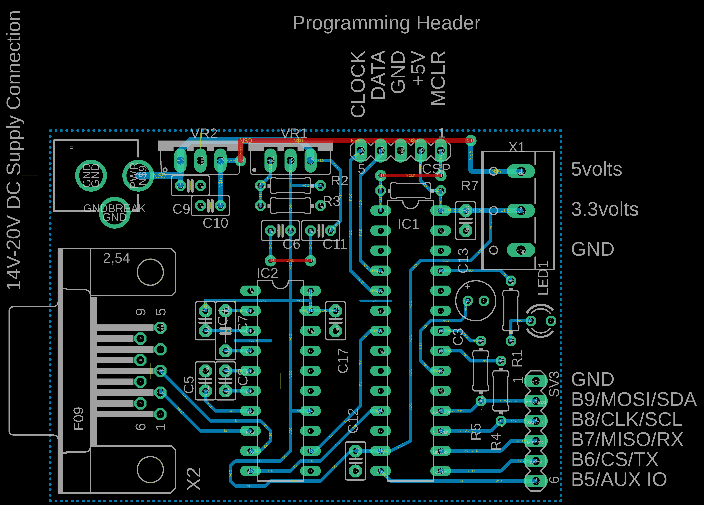
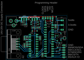
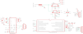

Contents
========

* [PRPR2 > ](#prpr2--)
	* [Schematic](#schematic)
	* [PCB](#pcb)
	* [OOMP Parts](#oomp-parts)
	* [Images](#images)
	* [Tags](#tags)

# PRPR2 > 

- ID: PROJ-DANP-0002-STAN-V0A
- Hex ID: PRPR2
- Name: Bus Pirate v0a
- Description: Bus Pirate v0a
- Long Link: [http://oom.lt/PROJ-DANP-0002-STAN-V0A](http://oom.lt/PROJ-DANP-0002-STAN-V0A)
- Short Link: [http://oom.lt/PRPR2](http://oom.lt/PRPR2)

## Schematic
  

## PCB
  

## OOMP Parts
  

|OOMP ID|Name|Identifier|
| :---: | :---: | :---: |
|CAPX-UNMATCHED-X-UF10-01||C3|
|CAPX-UNMATCHED-X-NF100-01||C4, C5, C6, C7, C8, C9, C10, C11, C12, C13, C17|
|UNMATCHED-UNMATCHED-X-UNMATCHED-01||IC1, IC2, VR1, VR2, X1, X2|
|HEAD-I01-X-UNMATCHED-01||ICSP, SV3|
|[DCJP-21D-X-STAN-01](https://github.com/oomlout/oomlout_OOMP_parts/tree/main/DCJP-21D-X-STAN-01/)|[2.1 mm DC Jack](https://github.com/oomlout/oomlout_OOMP_parts/tree/main/DCJP-21D-X-STAN-01/)|[J1](https://github.com/oomlout/oomlout_OOMP_parts/tree/main/DCJP-21D-X-STAN-01/)|
|LEDS-UNMATCHED-G-STAN-01||LED1|
|RESE-UNMATCHED-X-UNMATCHED-01||R1, R2, R3, R4, R5|
|RESE-UNMATCHED-X-O202-01||R7|

## Images
  
  

|eagleImage|eagleSchemImage|
| :---: | :---: |
|||

## Tags

- oompType: PROJ
- oompSize: DANP
- oompColor: 0002
- oompDesc: STAN
- oompIndex: V0A
- name: Bus Pirate v0a
- gitRepo: https://github.com/DangerousPrototypes/Bus_Pirate
- gitName: Bus_Pirate
- eagleBoard: hardware/v0a/BusPirate-24Fv0a.brd
- eagleSchem: hardware/v0a/BusPirate-24Fv0a.sch
- hexID: PRPR2
- oompID: PROJ-DANP-0002-STAN-V0A
- oompParts: C3,CAPX-UNMATCHED-X-UF10-01
- oompParts: C4,CAPX-UNMATCHED-X-NF100-01
- oompParts: C5,CAPX-UNMATCHED-X-NF100-01
- oompParts: C6,CAPX-UNMATCHED-X-NF100-01
- oompParts: C7,CAPX-UNMATCHED-X-NF100-01
- oompParts: C8,CAPX-UNMATCHED-X-NF100-01
- oompParts: C9,CAPX-UNMATCHED-X-NF100-01
- oompParts: C10,CAPX-UNMATCHED-X-NF100-01
- oompParts: C11,CAPX-UNMATCHED-X-NF100-01
- oompParts: C12,CAPX-UNMATCHED-X-NF100-01
- oompParts: C13,CAPX-UNMATCHED-X-NF100-01
- oompParts: C17,CAPX-UNMATCHED-X-NF100-01
- oompParts: IC1,UNMATCHED-UNMATCHED-X-UNMATCHED-01
- oompParts: IC2,UNMATCHED-UNMATCHED-X-UNMATCHED-01
- oompParts: ICSP,HEAD-I01-X-UNMATCHED-01
- oompParts: J1,DCJP-21D-X-STAN-01
- oompParts: LED1,LEDS-UNMATCHED-G-STAN-01
- oompParts: R1,RESE-UNMATCHED-X-UNMATCHED-01
- oompParts: R2,RESE-UNMATCHED-X-UNMATCHED-01
- oompParts: R3,RESE-UNMATCHED-X-UNMATCHED-01
- oompParts: R4,RESE-UNMATCHED-X-UNMATCHED-01
- oompParts: R5,RESE-UNMATCHED-X-UNMATCHED-01
- oompParts: R7,RESE-UNMATCHED-X-O202-01
- oompParts: SV3,HEAD-I01-X-UNMATCHED-01
- oompParts: VR1,UNMATCHED-UNMATCHED-X-UNMATCHED-01
- oompParts: VR2,UNMATCHED-UNMATCHED-X-UNMATCHED-01
- oompParts: X1,UNMATCHED-UNMATCHED-X-UNMATCHED-01
- oompParts: X2,UNMATCHED-UNMATCHED-X-UNMATCHED-01
- rawParts: C3,10uF,CPOL-EUE2-5,E2-5,POLARIZED CAPACITOR, European symbol,,
- rawParts: C4,0.1uF,C2.5/2,C2.5-2,CAPACITOR,,
- rawParts: C5,0.1uF,C2.5/2,C2.5-2,CAPACITOR,,
- rawParts: C6,0.1uf,C-EU025-025X050,C025-025X050,CAPACITOR, European symbol,,
- rawParts: C7,0.1uF,C5/2.5,C5B2.5,CAPACITOR,,
- rawParts: C8,0.1uF,C2.5/2,C2.5-2,CAPACITOR,,
- rawParts: C9,0.1uf,C-EU025-025X050,C025-025X050,CAPACITOR, European symbol,,
- rawParts: C10,0.1uf,C-EU025-025X050,C025-025X050,CAPACITOR, European symbol,,
- rawParts: C11,0.1uf,C-EU025-025X050,C025-025X050,CAPACITOR, European symbol,,
- rawParts: C12,0.1uF,C2.5/2,C2.5-2,CAPACITOR,,
- rawParts: C13,0.1uF,C2.5/2,C2.5-2,CAPACITOR,,
- rawParts: C17,0.1uF,C2.5/2,C2.5-2,CAPACITOR,,
- rawParts: IC1,PIC24FJ64GA002-DIP,PIC24FJ64GA002-DIP,DIL28-3,,,
- rawParts: IC2,MAX3223CPP,MAX3223CPP,DIL20,RS-232 Transceivers with AutoShutdown,,
- rawParts: ICSP,,MA05-1,MA05-1,PIN HEADER,,
- rawParts: J1,POWER_JACKPTH,POWER_JACKPTH,POWER_JACK_PTH,Power Jack,,
- rawParts: LED1,,LED3MM,LED3MM,LED,,
- rawParts: R1,330R,R-EU_0204/7,0204/7,RESISTOR, European symbol,,
- rawParts: R2,240R,R-EU_0204/7,0204/7,RESISTOR, European symbol,,
- rawParts: R3,390R,R-EU_0204/7,0204/7,RESISTOR, European symbol,,
- rawParts: R4,2k2,R-EU_0204/7,0204/7,RESISTOR, European symbol,,
- rawParts: R5,2k2,R-EU_0204/7,0204/7,RESISTOR, European symbol,,
- rawParts: R7,2K,R-EU_0204/7,0204/7,RESISTOR, European symbol,,
- rawParts: SV3,,MA06-1,MA06-1,PIN HEADER,,
- rawParts: VR1,,LM317TS,317TS,VOLTAGE REGULATOR,,
- rawParts: VR2,7805TV,7805TV,TO220V,Positive VOLTAGE REGULATOR,,
- rawParts: X1,,W237-103,W237-103,WAGO SCREW CLAMP,,
- rawParts: X2,,F09H,F09H,SUB-D,,
