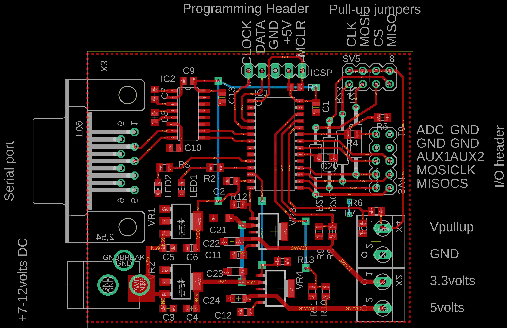
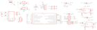

Contents
========

* [PRPR2 > ](#prpr2--)
	* [Schematic](#schematic)
	* [PCB](#pcb)
	* [OOMP Parts](#oomp-parts)
	* [Images](#images)
	* [Tags](#tags)

# PRPR2 > 

- ID: PROJ-DANP-0002-STAN-V1A
- Hex ID: PRPR2
- Name: Bus Pirate v1a
- Description: Bus Pirate v1a
- Long Link: [http://oom.lt/PROJ-DANP-0002-STAN-V1A](http://oom.lt/PROJ-DANP-0002-STAN-V1A)
- Short Link: [http://oom.lt/PRPR2](http://oom.lt/PRPR2)

## Schematic
  

## PCB
  

## OOMP Parts
  

|OOMP ID|Name|Identifier|
| :---: | :---: | :---: |
|[CAPC-0805-X-NF100-V50](https://github.com/oomlout/oomlout_OOMP_parts/tree/main/CAPC-0805-X-NF100-V50/)|[SMD (0805) 100 nF Capacitor (Ceramic) 50v](https://github.com/oomlout/oomlout_OOMP_parts/tree/main/CAPC-0805-X-NF100-V50/)|[C1, C2, C3, C4, C5, C6, C7, C8, C9, C10, C11, C12, C13](https://github.com/oomlout/oomlout_OOMP_parts/tree/main/CAPC-0805-X-NF100-V50/)|
|CAPX-UNMATCHED-X-UF10-01||C20, C21, C22, C23, C24|
|UNMATCHED-UNMATCHED-X-UNMATCHED-01||IC1, IC2, VR1, VR2, VR3, VR4, X2, X3, X4|
|HEAD-I01-X-UNMATCHED-01||ICSP, SV4, SV5|
|[DCJP-21D-X-STAN-01](https://github.com/oomlout/oomlout_OOMP_parts/tree/main/DCJP-21D-X-STAN-01/)|[2.1 mm DC Jack](https://github.com/oomlout/oomlout_OOMP_parts/tree/main/DCJP-21D-X-STAN-01/)|[J1](https://github.com/oomlout/oomlout_OOMP_parts/tree/main/DCJP-21D-X-STAN-01/)|
|[LEDS-0805-G-STAN-01](https://github.com/oomlout/oomlout_OOMP_parts/tree/main/LEDS-0805-G-STAN-01/)|[SMD (0805) Green LED](https://github.com/oomlout/oomlout_OOMP_parts/tree/main/LEDS-0805-G-STAN-01/)|[LED1, LED2](https://github.com/oomlout/oomlout_OOMP_parts/tree/main/LEDS-0805-G-STAN-01/)|
|[RESE-0805-X-O202-01](https://github.com/oomlout/oomlout_OOMP_parts/tree/main/RESE-0805-X-O202-01/)|[SMD (0805) 2k Ohm Resistor](https://github.com/oomlout/oomlout_OOMP_parts/tree/main/RESE-0805-X-O202-01/)|[R1](https://github.com/oomlout/oomlout_OOMP_parts/tree/main/RESE-0805-X-O202-01/)|
|RESE-0805-X-UNMATCHED-01||R2, R3|
|[RESE-0805-X-O103-01](https://github.com/oomlout/oomlout_OOMP_parts/tree/main/RESE-0805-X-O103-01/)|[SMD (0805) 10k Ohm Resistor](https://github.com/oomlout/oomlout_OOMP_parts/tree/main/RESE-0805-X-O103-01/)|[R4, R5, R6, R7, R8, R9, R10, R11, R12, R13](https://github.com/oomlout/oomlout_OOMP_parts/tree/main/RESE-0805-X-O103-01/)|
|RESE-UNMATCHED-X-UNMATCHED-01||R20, R21, R22, R23|

## Images
  
  

|eagleImage|eagleSchemImage|
| :---: | :---: |
|||

## Tags

- oompType: PROJ
- oompSize: DANP
- oompColor: 0002
- oompDesc: STAN
- oompIndex: V1A
- name: Bus Pirate v1a
- gitRepo: https://github.com/DangerousPrototypes/Bus_Pirate
- gitName: Bus_Pirate
- eagleBoard: hardware/v1a/BusPirate-24Fv1a.final.brd
- eagleSchem: hardware/v1a/BusPirate-24Fv1a.final.sch
- hexID: PRPR2
- oompID: PROJ-DANP-0002-STAN-V1A
- oompParts: C1,CAPC-0805-X-NF100-V50
- oompParts: C2,CAPC-0805-X-NF100-V50
- oompParts: C3,CAPC-0805-X-NF100-V50
- oompParts: C4,CAPC-0805-X-NF100-V50
- oompParts: C5,CAPC-0805-X-NF100-V50
- oompParts: C6,CAPC-0805-X-NF100-V50
- oompParts: C7,CAPC-0805-X-NF100-V50
- oompParts: C8,CAPC-0805-X-NF100-V50
- oompParts: C9,CAPC-0805-X-NF100-V50
- oompParts: C10,CAPC-0805-X-NF100-V50
- oompParts: C11,CAPC-0805-X-NF100-V50
- oompParts: C12,CAPC-0805-X-NF100-V50
- oompParts: C13,CAPC-0805-X-NF100-V50
- oompParts: C20,CAPX-UNMATCHED-X-UF10-01
- oompParts: C21,CAPX-UNMATCHED-X-UF10-01
- oompParts: C22,CAPX-UNMATCHED-X-UF10-01
- oompParts: C23,CAPX-UNMATCHED-X-UF10-01
- oompParts: C24,CAPX-UNMATCHED-X-UF10-01
- oompParts: IC1,UNMATCHED-UNMATCHED-X-UNMATCHED-01
- oompParts: IC2,UNMATCHED-UNMATCHED-X-UNMATCHED-01
- oompParts: ICSP,HEAD-I01-X-UNMATCHED-01
- oompParts: J1,DCJP-21D-X-STAN-01
- oompParts: LED1,LEDS-0805-G-STAN-01
- oompParts: LED2,LEDS-0805-G-STAN-01
- oompParts: R1,RESE-0805-X-O202-01
- oompParts: R2,RESE-0805-X-UNMATCHED-01
- oompParts: R3,RESE-0805-X-UNMATCHED-01
- oompParts: R4,RESE-0805-X-O103-01
- oompParts: R5,RESE-0805-X-O103-01
- oompParts: R6,RESE-0805-X-O103-01
- oompParts: R7,RESE-0805-X-O103-01
- oompParts: R8,RESE-0805-X-O103-01
- oompParts: R9,RESE-0805-X-O103-01
- oompParts: R10,RESE-0805-X-O103-01
- oompParts: R11,RESE-0805-X-O103-01
- oompParts: R12,RESE-0805-X-O103-01
- oompParts: R13,RESE-0805-X-O103-01
- oompParts: R20,RESE-UNMATCHED-X-UNMATCHED-01
- oompParts: R21,RESE-UNMATCHED-X-UNMATCHED-01
- oompParts: R22,RESE-UNMATCHED-X-UNMATCHED-01
- oompParts: R23,RESE-UNMATCHED-X-UNMATCHED-01
- oompParts: SV4,HEAD-I01-X-UNMATCHED-01
- oompParts: SV5,HEAD-I01-X-UNMATCHED-01
- oompParts: VR1,UNMATCHED-UNMATCHED-X-UNMATCHED-01
- oompParts: VR2,UNMATCHED-UNMATCHED-X-UNMATCHED-01
- oompParts: VR3,UNMATCHED-UNMATCHED-X-UNMATCHED-01
- oompParts: VR4,UNMATCHED-UNMATCHED-X-UNMATCHED-01
- oompParts: X2,UNMATCHED-UNMATCHED-X-UNMATCHED-01
- oompParts: X3,UNMATCHED-UNMATCHED-X-UNMATCHED-01
- oompParts: X4,UNMATCHED-UNMATCHED-X-UNMATCHED-01
- rawParts: C1,0.1uF,C-EUC0805,C0805,CAPACITOR, European symbol,,
- rawParts: C2,0.1uF,C-EUC0805,C0805,CAPACITOR, European symbol,,
- rawParts: C3,0.1uf,C-EUC0805,C0805,CAPACITOR, European symbol,,
- rawParts: C4,0.1uf,C-EUC0805,C0805,CAPACITOR, European symbol,,
- rawParts: C5,0.1uf,C-EUC0805,C0805,CAPACITOR, European symbol,,
- rawParts: C6,0.1uf,C-EUC0805,C0805,CAPACITOR, European symbol,,
- rawParts: C7,0.1uF,C-EUC0805,C0805,CAPACITOR, European symbol,,
- rawParts: C8,0.1uF,C-EUC0805,C0805,CAPACITOR, European symbol,,
- rawParts: C9,0.1uF,C-EUC0805,C0805,CAPACITOR, European symbol,,
- rawParts: C10,0.1uF,C-EUC0805,C0805,CAPACITOR, European symbol,,
- rawParts: C11,0.1uf,C-EUC0805,C0805,CAPACITOR, European symbol,,
- rawParts: C12,0.1uf,C-EUC0805,C0805,CAPACITOR, European symbol,,
- rawParts: C13,0.1uF,C-EUC0805,C0805,CAPACITOR, European symbol,,
- rawParts: C20,10uF,CPOL-EUSMCA,SMC_A,POLARIZED CAPACITOR, European symbol,,
- rawParts: C21,10uF,CPOL-EUSMCA,SMC_A,POLARIZED CAPACITOR, European symbol,,
- rawParts: C22,10uF,CPOL-EUSMCA,SMC_A,POLARIZED CAPACITOR, European symbol,,
- rawParts: C23,10uF,CPOL-EUSMCA,SMC_A,POLARIZED CAPACITOR, European symbol,,
- rawParts: C24,10uF,CPOL-EUSMCA,SMC_A,POLARIZED CAPACITOR, European symbol,,
- rawParts: IC1,,PIC24FJ64GA002,SO28W,,,
- rawParts: IC2,MAX3232CSE,MAX3232CSE,SO16,True RS-232 Transceivers 3.0V to 5.5V, Low-Power,,
- rawParts: ICSP,,MA05-1,MA05-1,PIN HEADER,,
- rawParts: J1,POWER_JACKPTH,POWER_JACKPTH,POWER_JACK_PTH,Power Jack,,
- rawParts: LED1,,LEDCHIP-LED0805,CHIP-LED0805,LED,,
- rawParts: LED2,,LEDCHIP-LED0805,CHIP-LED0805,LED,,
- rawParts: R1,2K,R-EU_R0805,R0805,RESISTOR, European symbol,,
- rawParts: R2,330R,R-EU_M0805,M0805,RESISTOR, European symbol,,
- rawParts: R3,330R,R-EU_M0805,M0805,RESISTOR, European symbol,,
- rawParts: R4,10K,R-EU_M0805,M0805,RESISTOR, European symbol,,
- rawParts: R5,10K,R-EU_M0805,M0805,RESISTOR, European symbol,,
- rawParts: R6,10K,R-EU_M0805,M0805,RESISTOR, European symbol,,
- rawParts: R7,10K,R-EU_M0805,M0805,RESISTOR, European symbol,,
- rawParts: R8,10K,R-EU_M0805,M0805,RESISTOR, European symbol,,
- rawParts: R9,10K,R-EU_M0805,M0805,RESISTOR, European symbol,,
- rawParts: R10,10K,R-EU_M0805,M0805,RESISTOR, European symbol,,
- rawParts: R11,10K,R-EU_M0805,M0805,RESISTOR, European symbol,,
- rawParts: R12,10K,R-EU_M0805,M0805,RESISTOR, European symbol,,
- rawParts: R13,10K,R-EU_M0805,M0805,RESISTOR, European symbol,,
- rawParts: R20,,R-EU_0207/12,0207/12,RESISTOR, European symbol,,
- rawParts: R21,,R-EU_0207/12,0207/12,RESISTOR, European symbol,,
- rawParts: R22,,R-EU_0207/12,0207/12,RESISTOR, European symbol,,
- rawParts: R23,,R-EU_0207/12,0207/12,RESISTOR, European symbol,,
- rawParts: SV4,,MA05-2,MA05-2,PIN HEADER,,
- rawParts: SV5,,MA04-2,MA04-2,PIN HEADER,,
- rawParts: VR1,3.3V,LD117AS12TR,SOT223,Low drop fixed and adjustable positive voltage regulators 1 A,,
- rawParts: VR2,5V,LD117AS12TR,SOT223,Low drop fixed and adjustable positive voltage regulators 1 A,,
- rawParts: VR3,TPS796XX,TPS796XX,SOT223-6,,,
- rawParts: VR4,TPS796XX,TPS796XX,SOT223-6,,,
- rawParts: X2,,W237-102,W237-102,WAGO SCREW CLAMP,,
- rawParts: X3,,F09H,F09H,SUB-D,,
- rawParts: X4,,W237-102,W237-102,WAGO SCREW CLAMP,,
