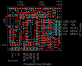
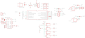

Contents
========

* [PRPR2 > ](#prpr2--)
	* [Schematic](#schematic)
	* [PCB](#pcb)
	* [OOMP Parts](#oomp-parts)
	* [Images](#images)
	* [Tags](#tags)

# PRPR2 > 

- ID: PROJ-DANP-0002-STAN-V25
- Hex ID: PRPR2
- Name: Bus Pirate v25
- Description: Bus Pirate v25
- Long Link: [http://oom.lt/PROJ-DANP-0002-STAN-V25](http://oom.lt/PROJ-DANP-0002-STAN-V25)
- Short Link: [http://oom.lt/PRPR2](http://oom.lt/PRPR2)

## Schematic
  

## PCB
  

## OOMP Parts
  

|OOMP ID|Name|Identifier|
| :---: | :---: | :---: |
|[CAPC-0805-X-NF100-V50](https://github.com/oomlout/oomlout_OOMP_parts/tree/main/CAPC-0805-X-NF100-V50/)|[SMD (0805) 100 nF Capacitor (Ceramic) 50v](https://github.com/oomlout/oomlout_OOMP_parts/tree/main/CAPC-0805-X-NF100-V50/)|[C1, C2, C3, C4, C5](https://github.com/oomlout/oomlout_OOMP_parts/tree/main/CAPC-0805-X-NF100-V50/)|
|CAPX-UNMATCHED-X-UF10-01||C20, C21, C22, C23, C24|
|HEAD-I01-X-UNMATCHED-01||I/O|
|UNMATCHED-UNMATCHED-X-UNMATCHED-01||IC1, IC2, IC3, J2|
|[HEAD-I01-X-PI05-01](https://github.com/oomlout/oomlout_OOMP_parts/tree/main/HEAD-I01-X-PI05-01/)|[2.54 mm 5 Pin Header](https://github.com/oomlout/oomlout_OOMP_parts/tree/main/HEAD-I01-X-PI05-01/)|[ICSP](https://github.com/oomlout/oomlout_OOMP_parts/tree/main/HEAD-I01-X-PI05-01/)|
|UNMATCHED-0805-X-UNMATCHED-01||L1, R30A, R31A, R32A|
|[LEDS-0805-G-STAN-01](https://github.com/oomlout/oomlout_OOMP_parts/tree/main/LEDS-0805-G-STAN-01/)|[SMD (0805) Green LED](https://github.com/oomlout/oomlout_OOMP_parts/tree/main/LEDS-0805-G-STAN-01/)|[LED1, LED1A, LED2, LED2A, LED3, LED3A, LED4](https://github.com/oomlout/oomlout_OOMP_parts/tree/main/LEDS-0805-G-STAN-01/)|
|[RESE-0805-X-O202-01](https://github.com/oomlout/oomlout_OOMP_parts/tree/main/RESE-0805-X-O202-01/)|[SMD (0805) 2k Ohm Resistor](https://github.com/oomlout/oomlout_OOMP_parts/tree/main/RESE-0805-X-O202-01/)|[R1](https://github.com/oomlout/oomlout_OOMP_parts/tree/main/RESE-0805-X-O202-01/)|
|RESE-0805-X-UNMATCHED-01||R3, R30, R31, R32|
|[RESE-0805-X-O103-01](https://github.com/oomlout/oomlout_OOMP_parts/tree/main/RESE-0805-X-O103-01/)|[SMD (0805) 10k Ohm Resistor](https://github.com/oomlout/oomlout_OOMP_parts/tree/main/RESE-0805-X-O103-01/)|[R10, R11, R12, R13, R14, R15, R16, R17, R18, R19, R20, R21, R22, R23](https://github.com/oomlout/oomlout_OOMP_parts/tree/main/RESE-0805-X-O103-01/)|
|[HEAD-I01-X-PI03-01](https://github.com/oomlout/oomlout_OOMP_parts/tree/main/HEAD-I01-X-PI03-01/)|[2.54 mm 3 Pin Header](https://github.com/oomlout/oomlout_OOMP_parts/tree/main/HEAD-I01-X-PI03-01/)|[ST](https://github.com/oomlout/oomlout_OOMP_parts/tree/main/HEAD-I01-X-PI03-01/)|
|VREG-SO235-X-KMIC5205-01||VR2, VR3, VR4|

## Images
  
  

|eagleImage|eagleSchemImage|
| :---: | :---: |
|||

## Tags

- oompType: PROJ
- oompSize: DANP
- oompColor: 0002
- oompDesc: STAN
- oompIndex: V25
- name: Bus Pirate v25
- gitRepo: https://github.com/DangerousPrototypes/Bus_Pirate
- gitName: Bus_Pirate
- eagleBoard: hardware/v2go/BusPirate-v25.brd
- eagleSchem: hardware/v2go/BusPirate-v25.sch
- hexID: PRPR2
- oompID: PROJ-DANP-0002-STAN-V25
- oompParts: C1,CAPC-0805-X-NF100-V50
- oompParts: C2,CAPC-0805-X-NF100-V50
- oompParts: C3,CAPC-0805-X-NF100-V50
- oompParts: C4,CAPC-0805-X-NF100-V50
- oompParts: C5,CAPC-0805-X-NF100-V50
- oompParts: C20,CAPX-UNMATCHED-X-UF10-01
- oompParts: C21,CAPX-UNMATCHED-X-UF10-01
- oompParts: C22,CAPX-UNMATCHED-X-UF10-01
- oompParts: C23,CAPX-UNMATCHED-X-UF10-01
- oompParts: C24,CAPX-UNMATCHED-X-UF10-01
- oompParts: I/O,HEAD-I01-X-UNMATCHED-01
- oompParts: IC1,UNMATCHED-UNMATCHED-X-UNMATCHED-01
- oompParts: IC2,UNMATCHED-UNMATCHED-X-UNMATCHED-01
- oompParts: IC3,UNMATCHED-UNMATCHED-X-UNMATCHED-01
- oompParts: ICSP,HEAD-I01-X-PI05-01
- oompParts: J2,UNMATCHED-UNMATCHED-X-UNMATCHED-01
- oompParts: L1,UNMATCHED-0805-X-UNMATCHED-01
- oompParts: LED1,LEDS-0805-G-STAN-01
- oompParts: LED1A,LEDS-0805-G-STAN-01
- oompParts: LED2,LEDS-0805-G-STAN-01
- oompParts: LED2A,LEDS-0805-G-STAN-01
- oompParts: LED3,LEDS-0805-G-STAN-01
- oompParts: LED3A,LEDS-0805-G-STAN-01
- oompParts: LED4,LEDS-0805-G-STAN-01
- oompParts: R1,RESE-0805-X-O202-01
- oompParts: R3,RESE-0805-X-UNMATCHED-01
- oompParts: R10,RESE-0805-X-O103-01
- oompParts: R11,RESE-0805-X-O103-01
- oompParts: R12,RESE-0805-X-O103-01
- oompParts: R13,RESE-0805-X-O103-01
- oompParts: R14,RESE-0805-X-O103-01
- oompParts: R15,RESE-0805-X-O103-01
- oompParts: R16,RESE-0805-X-O103-01
- oompParts: R17,RESE-0805-X-O103-01
- oompParts: R18,RESE-0805-X-O103-01
- oompParts: R19,RESE-0805-X-O103-01
- oompParts: R20,RESE-0805-X-O103-01
- oompParts: R21,RESE-0805-X-O103-01
- oompParts: R22,RESE-0805-X-O103-01
- oompParts: R23,RESE-0805-X-O103-01
- oompParts: R30,RESE-0805-X-UNMATCHED-01
- oompParts: R30A,UNMATCHED-0805-X-UNMATCHED-01
- oompParts: R31,RESE-0805-X-UNMATCHED-01
- oompParts: R31A,UNMATCHED-0805-X-UNMATCHED-01
- oompParts: R32,RESE-0805-X-UNMATCHED-01
- oompParts: R32A,UNMATCHED-0805-X-UNMATCHED-01
- oompParts: ST,HEAD-I01-X-PI03-01
- oompParts: VR2,VREG-SO235-X-KMIC5205-01
- oompParts: VR3,VREG-SO235-X-KMIC5205-01
- oompParts: VR4,VREG-SO235-X-KMIC5205-01
- rawParts: C1,0.1uF,C-EUC0805,C0805,CAPACITOR, European symbol,,
- rawParts: C2,0.1uF,C-EUC0805,C0805,CAPACITOR, European symbol,,
- rawParts: C3,0.1uf,C-EUC0805,C0805,CAPACITOR, European symbol,,
- rawParts: C4,0.1uF,C-EUC0805,C0805,CAPACITOR, European symbol,,
- rawParts: C5,0.1uF,C-EUC0805,C0805,CAPACITOR, European symbol,,
- rawParts: C20,10uF,CPOL-EUSMCA,SMC_A,POLARIZED CAPACITOR, European symbol,,
- rawParts: C21,10uF,CPOL-EUSMCA,SMC_A,POLARIZED CAPACITOR, European symbol,,
- rawParts: C22,10uF,CPOL-EUSMCA,SMC_A,POLARIZED CAPACITOR, European symbol,,
- rawParts: C23,10uF,CPOL-EUSMCA,SMC_A,POLARIZED CAPACITOR, European symbol,,
- rawParts: C24,10uF,CPOL-EUSMCA,SMC_A,POLARIZED CAPACITOR, European symbol,,
- rawParts: I/O,M05X2PTH,M05X2PTH,AVR_ICSP,Header 5x2,,
- rawParts: IC1,PIC24J64GA002,PIC24FJ64GA002,SO28W,,,
- rawParts: IC2,FT232RLSSOP,FT232RLSSOP,SSOP28DB,USB UART,,
- rawParts: IC3,4066D,4066D,SO14,Quad bilateral ANALOG SWITCH,,
- rawParts: ICSP,M05X1PTH,M05,1X05,Header 5,,
- rawParts: J2,USBSMD,USBSMD,USB-MINIB,USB Connectors,,
- rawParts: L1,700mA+ ferrite bead,WE-KIL_0805,WE-KI_0805_B,SMD Wire Wound Ceramic Inductor WE-KIL,,
- rawParts: LED1,,LEDCHIP-LED0805,CHIP-LED0805,LED,,
- rawParts: LED1A,,LEDCHIP-LED0805,CHIP-LED0805,LED,,
- rawParts: LED2,,LEDCHIP-LED0805,CHIP-LED0805,LED,,
- rawParts: LED2A,,LEDCHIP-LED0805,CHIP-LED0805,LED,,
- rawParts: LED3,,LEDCHIP-LED0805,CHIP-LED0805,LED,,
- rawParts: LED3A,,LEDCHIP-LED0805,CHIP-LED0805,LED,,
- rawParts: LED4,,LEDCHIP-LED0805,CHIP-LED0805,LED,,
- rawParts: R1,2K,R-EU_R0805,R0805,RESISTOR, European symbol,,
- rawParts: R3,1K1,R-EU_M0805,M0805,RESISTOR, European symbol,,
- rawParts: R10,10K,R-EU_M0805,M0805,RESISTOR, European symbol,,
- rawParts: R11,10K,R-EU_M0805,M0805,RESISTOR, European symbol,,
- rawParts: R12,10K,R-EU_M0805,M0805,RESISTOR, European symbol,,
- rawParts: R13,10K,R-EU_M0805,M0805,RESISTOR, European symbol,,
- rawParts: R14,10K,R-EU_M0805,M0805,RESISTOR, European symbol,,
- rawParts: R15,10K,R-EU_M0805,M0805,RESISTOR, European symbol,,
- rawParts: R16,10K,R-EU_M0805,M0805,RESISTOR, European symbol,,
- rawParts: R17,10K,R-EU_M0805,M0805,RESISTOR, European symbol,,
- rawParts: R18,10K,R-EU_M0805,M0805,RESISTOR, European symbol,,
- rawParts: R19,10K,R-EU_R0805,R0805,RESISTOR, European symbol,,
- rawParts: R20,10K,R-EU_R0805,R0805,RESISTOR, European symbol,,
- rawParts: R21,10K,R-EU_R0805,R0805,RESISTOR, European symbol,,
- rawParts: R22,10K,R-EU_R0805,R0805,RESISTOR, European symbol,,
- rawParts: R23,10K,R-EU_R0805,R0805,RESISTOR, European symbol,,
- rawParts: R30,1K1,R-EU_M0805,M0805,RESISTOR, European symbol,,
- rawParts: R30A,1K1,R-EU_M0805,M0805,RESISTOR, European symbol,,
- rawParts: R31,390R,R-EU_M0805,M0805,RESISTOR, European symbol,,
- rawParts: R31A,390R,R-EU_M0805,M0805,RESISTOR, European symbol,,
- rawParts: R32,390R,R-EU_M0805,M0805,RESISTOR, European symbol,,
- rawParts: R32A,390R,R-EU_M0805,M0805,RESISTOR, European symbol,,
- rawParts: ST,M03X1PTH,M03PTH,1X03,Header 3,,
- rawParts: VR2,MIC5205-3.3YM5,V_REG_LDOSMD,SOT23-5,Voltage Regulator LDO,,
- rawParts: VR3,MIC5205-3.3YM5,V_REG_LDOSMD,SOT23-5,Voltage Regulator LDO,,
- rawParts: VR4,MIC5205-5.0YM5,V_REG_LDOSMD,SOT23-5,Voltage Regulator LDO,,
