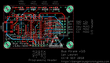
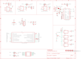

Contents
========

* [PRPR2 > ](#prpr2--)
	* [Schematic](#schematic)
	* [PCB](#pcb)
	* [OOMP Parts](#oomp-parts)
	* [Images](#images)
	* [Tags](#tags)

# PRPR2 > 

- ID: PROJ-DANP-0002-STAN-V35C
- Hex ID: PRPR2
- Name: Bus Pirate v35c
- Description: Bus Pirate v35c
- Long Link: [http://oom.lt/PROJ-DANP-0002-STAN-V35C](http://oom.lt/PROJ-DANP-0002-STAN-V35C)
- Short Link: [http://oom.lt/PRPR2](http://oom.lt/PRPR2)

## Schematic
  

## PCB
  

## OOMP Parts
  

|OOMP ID|Name|Identifier|
| :---: | :---: | :---: |
|CAPX-UNMATCHED-X-NF100-01||C1, C2, C3, C4, C5, C6|
|CAPX-UNMATCHED-X-UF1-01||C7, C8, C9|
|CAPX-UNMATCHED-X-UF10-01||C10, C11|
|HEAD-I01-X-PI2X05-01||I/O|
|UNMATCHED-UNMATCHED-X-UNMATCHED-01||IC1, IC2, IC3, J1, RN1, RN2, RN3|
|[HEAD-I01-X-PI05-01](https://github.com/oomlout/oomlout_OOMP_parts/tree/main/HEAD-I01-X-PI05-01/)|[2.54 mm 5 Pin Header](https://github.com/oomlout/oomlout_OOMP_parts/tree/main/HEAD-I01-X-PI05-01/)|[ICSP](https://github.com/oomlout/oomlout_OOMP_parts/tree/main/HEAD-I01-X-PI05-01/)|
|UNMATCHED-0805-X-UNMATCHED-01||L1|
|[LEDS-0805-G-STAN-01](https://github.com/oomlout/oomlout_OOMP_parts/tree/main/LEDS-0805-G-STAN-01/)|[SMD (0805) Green LED](https://github.com/oomlout/oomlout_OOMP_parts/tree/main/LEDS-0805-G-STAN-01/)|[LED1, LED1A, LED2, LED2A, LED3, LED3A, LED4, LED4A](https://github.com/oomlout/oomlout_OOMP_parts/tree/main/LEDS-0805-G-STAN-01/)|
|RESE-UNMATCHED-X-O202-01||R1, R5|
|RESE-UNMATCHED-X-UNMATCHED-01||R2, R3, R4, R6|
|UNMATCHED-SO235-X-UNMATCHED-01||VR1, VR2, VR3|

## Images
  
  

|eagleImage|eagleSchemImage|
| :---: | :---: |
|||

## Tags

- oompType: PROJ
- oompSize: DANP
- oompColor: 0002
- oompDesc: STAN
- oompIndex: V35C
- name: Bus Pirate v35c
- gitRepo: https://github.com/DangerousPrototypes/Bus_Pirate
- gitName: Bus_Pirate
- eagleBoard: hardware/v3.5/BusPiratev3.5c-SOIC.brd
- eagleSchem: hardware/v3.5/BusPiratev3.5c-SOIC.sch
- hexID: PRPR2
- oompID: PROJ-DANP-0002-STAN-V35C
- oompParts: C1,CAPX-UNMATCHED-X-NF100-01
- oompParts: C2,CAPX-UNMATCHED-X-NF100-01
- oompParts: C3,CAPX-UNMATCHED-X-NF100-01
- oompParts: C4,CAPX-UNMATCHED-X-NF100-01
- oompParts: C5,CAPX-UNMATCHED-X-NF100-01
- oompParts: C6,CAPX-UNMATCHED-X-NF100-01
- oompParts: C7,CAPX-UNMATCHED-X-UF1-01
- oompParts: C8,CAPX-UNMATCHED-X-UF1-01
- oompParts: C9,CAPX-UNMATCHED-X-UF1-01
- oompParts: C10,CAPX-UNMATCHED-X-UF10-01
- oompParts: C11,CAPX-UNMATCHED-X-UF10-01
- oompParts: I/O,HEAD-I01-X-PI2X05-01
- oompParts: IC1,UNMATCHED-UNMATCHED-X-UNMATCHED-01
- oompParts: IC2,UNMATCHED-UNMATCHED-X-UNMATCHED-01
- oompParts: IC3,UNMATCHED-UNMATCHED-X-UNMATCHED-01
- oompParts: ICSP,HEAD-I01-X-PI05-01
- oompParts: J1,UNMATCHED-UNMATCHED-X-UNMATCHED-01
- oompParts: L1,UNMATCHED-0805-X-UNMATCHED-01
- oompParts: LED1,LEDS-0805-G-STAN-01
- oompParts: LED1A,LEDS-0805-G-STAN-01
- oompParts: LED2,LEDS-0805-G-STAN-01
- oompParts: LED2A,LEDS-0805-G-STAN-01
- oompParts: LED3,LEDS-0805-G-STAN-01
- oompParts: LED3A,LEDS-0805-G-STAN-01
- oompParts: LED4,LEDS-0805-G-STAN-01
- oompParts: LED4A,LEDS-0805-G-STAN-01
- oompParts: R1,RESE-UNMATCHED-X-O202-01
- oompParts: R2,RESE-UNMATCHED-X-UNMATCHED-01
- oompParts: R3,RESE-UNMATCHED-X-UNMATCHED-01
- oompParts: R4,RESE-UNMATCHED-X-UNMATCHED-01
- oompParts: R5,RESE-UNMATCHED-X-O202-01
- oompParts: R6,RESE-UNMATCHED-X-UNMATCHED-01
- oompParts: RN1,UNMATCHED-UNMATCHED-X-UNMATCHED-01
- oompParts: RN2,UNMATCHED-UNMATCHED-X-UNMATCHED-01
- oompParts: RN3,UNMATCHED-UNMATCHED-X-UNMATCHED-01
- oompParts: VR1,UNMATCHED-SO235-X-UNMATCHED-01
- oompParts: VR2,UNMATCHED-SO235-X-UNMATCHED-01
- oompParts: VR3,UNMATCHED-SO235-X-UNMATCHED-01
- rawParts: C1,0.1uF,CAPC603,C603,,,
- rawParts: C2,0.1uF,CAPC603,C603,,,
- rawParts: C3,0.1uf,CAPC603,C603,,,
- rawParts: C4,0.1uF,CAPC603,C603,,,
- rawParts: C5,0.1uF,CAPC603,C603,,,
- rawParts: C6,0.1uF,CAPC603,C603,,,
- rawParts: C7,1uf,CAPC603,C603,,,
- rawParts: C8,1uF,CAPC603,C603,,,
- rawParts: C9,1uF,CAPC603,C603,,,
- rawParts: C10,10uF,CPOL-EUSMCA,SMC_A,POLARIZED CAPACITOR, European symbol,,
- rawParts: C11,10uF,CPOL-EUSMCA,SMC_A,POLARIZED CAPACITOR, European symbol,,
- rawParts: H1,MOUNT-PAD-ROUND3.0,MOUNT-PAD-ROUND3.0,3,0-PAD,MOUNTING PAD, round,,
- rawParts: H2,MOUNT-PAD-ROUND3.0,MOUNT-PAD-ROUND3.0,3,0-PAD,MOUNTING PAD, round,,
- rawParts: H3,MOUNT-PAD-ROUND3.0,MOUNT-PAD-ROUND3.0,3,0-PAD,MOUNTING PAD, round,,
- rawParts: H4,MOUNT-PAD-ROUND3.0,MOUNT-PAD-ROUND3.0,3,0-PAD,MOUNTING PAD, round,,
- rawParts: I/O,HEADER2X5-SHRD-PTH-B,HEADER2X5-SHRD-PTH-B,PINSHRD_PTH_2X05B,Shrouded pin header, 2.54mm pitch,,
- rawParts: IC1,PIC24FJ64GA002,PIC24FJ64GA002,SO28W,,,
- rawParts: IC2,FT232RLSSOP,FT232RLSSOP,SSOP28DB,USB UART,,
- rawParts: IC3,4066,4066,TSSOP14,Quad bilateral ANALOG SWITCH,,
- rawParts: ICSP,M05X1PTH,M05,1X05,Header 5,,
- rawParts: J1,CONN_USB,CONN_USB,CONN_USB_MINI-B,USB connector,,
- rawParts: L1,700mA+ ferrite bead,WE-KIL_0805,WE-KI_0805_B,SMD Wire Wound Ceramic Inductor WE-KIL,,
- rawParts: LED1,,LEDCHIP-LED0805,CHIP-LED0805,LED,,
- rawParts: LED1A,,LEDCHIP-LED0805,CHIP-LED0805,LED,,
- rawParts: LED2,,LEDCHIP-LED0805,CHIP-LED0805,LED,,
- rawParts: LED2A,,LEDCHIP-LED0805,CHIP-LED0805,LED,,
- rawParts: LED3,,LEDCHIP-LED0805,CHIP-LED0805,LED,,
- rawParts: LED3A,,LEDCHIP-LED0805,CHIP-LED0805,LED,,
- rawParts: LED4,,LEDCHIP-LED0805,CHIP-LED0805,LED,,
- rawParts: LED4A,,LEDCHIP-LED0805,CHIP-LED0805,LED,,
- rawParts: R1,2K,RESISTORR603,R603,,,
- rawParts: R2,1K1,RESISTORR603,R603,,,
- rawParts: R3,1K1,RESISTORR603,R603,,,
- rawParts: R4,1K1,RESISTORR603,R603,,,
- rawParts: R5,2K,RESISTORR603,R603,,,
- rawParts: R6,1K1,RESISTORR603,R603,,,
- rawParts: RN1,10k,RNETWORK,RN8P-4R-CRA06S,4 Resistor Array 0603,,
- rawParts: RN2,10k,RNETWORK,RN8P-4R-CRA06S,4 Resistor Array 0603,,
- rawParts: RN3,10k,RNETWORK,RN8P-4R-CRA06S,4 Resistor Array 0603,,
- rawParts: VR1,MCP1801T-3302I/OT,V_REG_LDOSMD,SOT23-5,Voltage Regulator LDO,,
- rawParts: VR2,MCP1801T-3302I/OT,V_REG_LDOSMD,SOT23-5,Voltage Regulator LDO,,
- rawParts: VR3,MCP1801T-5002I/OT,V_REG_LDOSMD,SOT23-5,Voltage Regulator LDO,,
