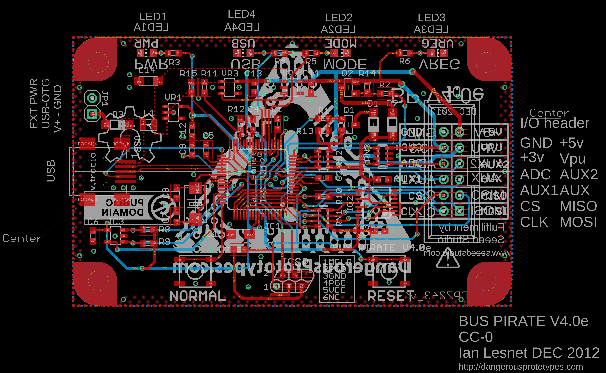
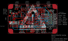
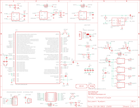

Contents
========

* [PRPR2 > ](#prpr2--)
	* [Schematic](#schematic)
	* [PCB](#pcb)
	* [OOMP Parts](#oomp-parts)
	* [Images](#images)
	* [Tags](#tags)

# PRPR2 > 

- ID: PROJ-DANP-0002-STAN-V4E
- Hex ID: PRPR2
- Name: Bus Pirate v4e
- Description: Bus Pirate v4e
- Long Link: [http://oom.lt/PROJ-DANP-0002-STAN-V4E](http://oom.lt/PROJ-DANP-0002-STAN-V4E)
- Short Link: [http://oom.lt/PRPR2](http://oom.lt/PRPR2)

## Schematic
  

## PCB
  

## OOMP Parts
  

|OOMP ID|Name|Identifier|
| :---: | :---: | :---: |
|[CAPC-0603-X-NF100-V50](https://github.com/oomlout/oomlout_OOMP_parts/tree/main/CAPC-0603-X-NF100-V50/)|[SMD (0603) 100 nF Capacitor (Ceramic) 50v](https://github.com/oomlout/oomlout_OOMP_parts/tree/main/CAPC-0603-X-NF100-V50/)|[C1, C2, C3, C4, C5, C6, C7, C8, C9, C10](https://github.com/oomlout/oomlout_OOMP_parts/tree/main/CAPC-0603-X-NF100-V50/)|
|[CAPC-0603-X-UF1-V25](https://github.com/oomlout/oomlout_OOMP_parts/tree/main/CAPC-0603-X-UF1-V25/)|[SMD (0603) 1 uF Capacitor (Ceramic) 25v](https://github.com/oomlout/oomlout_OOMP_parts/tree/main/CAPC-0603-X-UF1-V25/)|[C11, C12, C13](https://github.com/oomlout/oomlout_OOMP_parts/tree/main/CAPC-0603-X-UF1-V25/)|
|CAPX-UNMATCHED-X-UF10-01||C14, C15|
|DIOD-UNMATCHED-X-UNMATCHED-01||D1, D2, D3|
|UNMATCHED-UNMATCHED-X-UNMATCHED-01||IC1, IC2, NORMAL, PCB1, RESET, RN1, RN2, RN3, USB, X1|
|UNMATCHED-SO235-X-UNMATCHED-01||IC3|
|HEAD-I01-X-UNMATCHED-01||ICSP|
|HEAD-I01-X-PI2X06-01||IO|
|[HEAD-I01-X-PI02-01](https://github.com/oomlout/oomlout_OOMP_parts/tree/main/HEAD-I01-X-PI02-01/)|[2.54 mm 2 Pin Header](https://github.com/oomlout/oomlout_OOMP_parts/tree/main/HEAD-I01-X-PI02-01/)|[JP1](https://github.com/oomlout/oomlout_OOMP_parts/tree/main/HEAD-I01-X-PI02-01/)|
|UNMATCHED-0805-X-UNMATCHED-01||L1|
|[LEDS-0805-G-STAN-01](https://github.com/oomlout/oomlout_OOMP_parts/tree/main/LEDS-0805-G-STAN-01/)|[SMD (0805) Green LED](https://github.com/oomlout/oomlout_OOMP_parts/tree/main/LEDS-0805-G-STAN-01/)|[LED1, LED1A, LED2, LED2A, LED3, LED3A, LED4, LED4A](https://github.com/oomlout/oomlout_OOMP_parts/tree/main/LEDS-0805-G-STAN-01/)|
|UNMATCHED-SO23-X-UNMATCHED-01||Q1, Q2|
|RESE-UNMATCHED-X-O102-01||R1|
|[RESE-0603-X-O102-01](https://github.com/oomlout/oomlout_OOMP_parts/tree/main/RESE-0603-X-O102-01/)|[SMD (0603) 1k Ohm Resistor](https://github.com/oomlout/oomlout_OOMP_parts/tree/main/RESE-0603-X-O102-01/)|[R2](https://github.com/oomlout/oomlout_OOMP_parts/tree/main/RESE-0603-X-O102-01/)|
|RESE-UNMATCHED-X-UNMATCHED-01||R3, R4, R5, R6|
|[RESE-0603-X-O202-01](https://github.com/oomlout/oomlout_OOMP_parts/tree/main/RESE-0603-X-O202-01/)|[SMD (0603) 2k Ohm Resistor](https://github.com/oomlout/oomlout_OOMP_parts/tree/main/RESE-0603-X-O202-01/)|[R7, R8, R9, R10](https://github.com/oomlout/oomlout_OOMP_parts/tree/main/RESE-0603-X-O202-01/)|
|[RESE-0603-X-O103-01](https://github.com/oomlout/oomlout_OOMP_parts/tree/main/RESE-0603-X-O103-01/)|[SMD (0603) 10k Ohm Resistor](https://github.com/oomlout/oomlout_OOMP_parts/tree/main/RESE-0603-X-O103-01/)|[R11, R12, R14](https://github.com/oomlout/oomlout_OOMP_parts/tree/main/RESE-0603-X-O103-01/)|
|RESE-UNMATCHED-X-O103-01||R13|
|RESE-0603-X-O1003-01||R15|
|VREG-SO235-X-KMIC5205-01||VR1, VR2, VR3|

## Images
  
  

|eagleImage|eagleSchemImage|
| :---: | :---: |
|||

## Tags

- oompType: PROJ
- oompSize: DANP
- oompColor: 0002
- oompDesc: STAN
- oompIndex: V4E
- name: Bus Pirate v4e
- gitRepo: https://github.com/DangerousPrototypes/Bus_Pirate
- gitName: Bus_Pirate
- eagleBoard: hardware/v4/BusPirate-v4e.brd
- eagleSchem: hardware/v4/BusPirate-v4e.sch
- hexID: PRPR2
- oompID: PROJ-DANP-0002-STAN-V4E
- oompParts: C1,CAPC-0603-X-NF100-V50
- oompParts: C2,CAPC-0603-X-NF100-V50
- oompParts: C3,CAPC-0603-X-NF100-V50
- oompParts: C4,CAPC-0603-X-NF100-V50
- oompParts: C5,CAPC-0603-X-NF100-V50
- oompParts: C6,CAPC-0603-X-NF100-V50
- oompParts: C7,CAPC-0603-X-NF100-V50
- oompParts: C8,CAPC-0603-X-NF100-V50
- oompParts: C9,CAPC-0603-X-NF100-V50
- oompParts: C10,CAPC-0603-X-NF100-V50
- oompParts: C11,CAPC-0603-X-UF1-V25
- oompParts: C12,CAPC-0603-X-UF1-V25
- oompParts: C13,CAPC-0603-X-UF1-V25
- oompParts: C14,CAPX-UNMATCHED-X-UF10-01
- oompParts: C15,CAPX-UNMATCHED-X-UF10-01
- oompParts: D1,DIOD-UNMATCHED-X-UNMATCHED-01
- oompParts: D2,DIOD-UNMATCHED-X-UNMATCHED-01
- oompParts: D3,DIOD-UNMATCHED-X-UNMATCHED-01
- oompParts: IC1,UNMATCHED-UNMATCHED-X-UNMATCHED-01
- oompParts: IC2,UNMATCHED-UNMATCHED-X-UNMATCHED-01
- oompParts: IC3,UNMATCHED-SO235-X-UNMATCHED-01
- oompParts: ICSP,HEAD-I01-X-UNMATCHED-01
- oompParts: IO,HEAD-I01-X-PI2X06-01
- oompParts: JP1,HEAD-I01-X-PI02-01
- oompParts: L1,UNMATCHED-0805-X-UNMATCHED-01
- oompParts: LED1,LEDS-0805-G-STAN-01
- oompParts: LED1A,LEDS-0805-G-STAN-01
- oompParts: LED2,LEDS-0805-G-STAN-01
- oompParts: LED2A,LEDS-0805-G-STAN-01
- oompParts: LED3,LEDS-0805-G-STAN-01
- oompParts: LED3A,LEDS-0805-G-STAN-01
- oompParts: LED4,LEDS-0805-G-STAN-01
- oompParts: LED4A,LEDS-0805-G-STAN-01
- oompParts: NORMAL,UNMATCHED-UNMATCHED-X-UNMATCHED-01
- oompParts: PCB1,UNMATCHED-UNMATCHED-X-UNMATCHED-01
- oompParts: Q1,UNMATCHED-SO23-X-UNMATCHED-01
- oompParts: Q2,UNMATCHED-SO23-X-UNMATCHED-01
- oompParts: R1,RESE-UNMATCHED-X-O102-01
- oompParts: R2,RESE-0603-X-O102-01
- oompParts: R3,RESE-UNMATCHED-X-UNMATCHED-01
- oompParts: R4,RESE-UNMATCHED-X-UNMATCHED-01
- oompParts: R5,RESE-UNMATCHED-X-UNMATCHED-01
- oompParts: R6,RESE-UNMATCHED-X-UNMATCHED-01
- oompParts: R7,RESE-0603-X-O202-01
- oompParts: R8,RESE-0603-X-O202-01
- oompParts: R9,RESE-0603-X-O202-01
- oompParts: R10,RESE-0603-X-O202-01
- oompParts: R11,RESE-0603-X-O103-01
- oompParts: R12,RESE-0603-X-O103-01
- oompParts: R13,RESE-UNMATCHED-X-O103-01
- oompParts: R14,RESE-0603-X-O103-01
- oompParts: R15,RESE-0603-X-O1003-01
- oompParts: RESET,UNMATCHED-UNMATCHED-X-UNMATCHED-01
- oompParts: RN1,UNMATCHED-UNMATCHED-X-UNMATCHED-01
- oompParts: RN2,UNMATCHED-UNMATCHED-X-UNMATCHED-01
- oompParts: RN3,UNMATCHED-UNMATCHED-X-UNMATCHED-01
- oompParts: USB,UNMATCHED-UNMATCHED-X-UNMATCHED-01
- oompParts: VR1,VREG-SO235-X-KMIC5205-01
- oompParts: VR2,VREG-SO235-X-KMIC5205-01
- oompParts: VR3,VREG-SO235-X-KMIC5205-01
- oompParts: X1,UNMATCHED-UNMATCHED-X-UNMATCHED-01
- rawParts: C1,0.1uF,C-EUC0603,C0603,CAPACITOR, European symbol,,
- rawParts: C2,0.1uF,C-EUC0603,C0603,CAPACITOR, European symbol,,
- rawParts: C3,0.1uF,C-EUC0603,C0603,CAPACITOR, European symbol,,
- rawParts: C4,0.1uF,C-EUC0603,C0603,CAPACITOR, European symbol,,
- rawParts: C5,0.1uF,C-EUC0603,C0603,CAPACITOR, European symbol,,
- rawParts: C6,0.1uF,C-EUC0603,C0603,CAPACITOR, European symbol,,
- rawParts: C7,0.1uF,C-EUC0603,C0603,CAPACITOR, European symbol,,
- rawParts: C8,0.1uF,C-EUC0603,C0603,CAPACITOR, European symbol,,
- rawParts: C9,0.1uF,C-EUC0603,C0603,CAPACITOR, European symbol,,
- rawParts: C10,0.1uF,C-EUC0603,C0603,CAPACITOR, European symbol,,
- rawParts: C11,1uF,C-EUC0603,C0603,CAPACITOR, European symbol,,
- rawParts: C12,1uf,C-EUC0603,C0603,CAPACITOR, European symbol,,
- rawParts: C13,1uF,C-EUC0603,C0603,CAPACITOR, European symbol,,
- rawParts: C14,10uF,CPOL-EUSMCA,SMC_A,POLARIZED CAPACITOR, European symbol,,
- rawParts: C15,10uF,CPOL-EUSMCA,SMC_A,POLARIZED CAPACITOR, European symbol,,
- rawParts: D1,,MBR0520LT,SOD123,SCHOTTKY BARRIER RECTIFIER,,
- rawParts: D2,,MBR0520LT,SOD123,SCHOTTKY BARRIER RECTIFIER,,
- rawParts: D3,,MBR0520LT,SOD123,SCHOTTKY BARRIER RECTIFIER,,
- rawParts: IC1,PIC24FJ256GB106,PIC24FJ256GB106,TQFP64-10X10,16-Bit Flash Microcontroller with USB On-The-Go(OTG),,
- rawParts: IC2,4066TS,4066TS,40XX_TSSOP14,Quad bilateral ANALOG SWITCH,,
- rawParts: IC3,24AASOT-23-5,24AA,SOT-23-5,,24AA,
- rawParts: ICSP,CON_HEADER_PRG_PIC_ICSP-POGO-FOOTPRINT,CON_HEADER_PRG_PIC_ICSP-POGO-FOOTPRINT,CON_POGO_ICSP_TARGET,5-pin PIC In Circuit Serial Programming header,,
- rawParts: IO,PINSHRD-PTH-2X06,PINSHRD-PTH-2X06,PINSHRD_PTH_2X06,Shrouded pin header, 2.54mm pitch,,
- rawParts: JP1,,PINHD-1X02_2.54-S,1X02-S,PIN HEADER,,
- rawParts: L1,700mA+ ferrite bead,WE-KIL_0805,WE-KI_0805_B,SMD Wire Wound Ceramic Inductor WE-KIL,,
- rawParts: LED1,,LEDCHIP-LED0805,CHIP-LED0805,LED,,
- rawParts: LED1A,,LEDCHIP-LED0805,CHIP-LED0805,LED,,
- rawParts: LED2,,LEDCHIP-LED0805,CHIP-LED0805,LED,,
- rawParts: LED2A,,LEDCHIP-LED0805,CHIP-LED0805,LED,,
- rawParts: LED3,,LEDCHIP-LED0805,CHIP-LED0805,LED,,
- rawParts: LED3A,,LEDCHIP-LED0805,CHIP-LED0805,LED,,
- rawParts: LED4,,LEDCHIP-LED0805,CHIP-LED0805,LED,,
- rawParts: LED4A,,LEDCHIP-LED0805,CHIP-LED0805,LED,,
- rawParts: LOGO1,LOGO_CC-0,LOGO_CC-0,LOGO_CC-0,,,
- rawParts: NORMAL,SMD_TACT_SMALL,SMD_TACT_SMALL,TACT_SWITCH_SMALL,,,
- rawParts: PCB1,PCB_DP_RECTANGLE-43X70,PCB_DP_RECTANGLE-43X70,DP7043_V1,Dangerous Prototypes Standard Rectangular PCB sizes,,
- rawParts: Q1,,MMBTA56-SOT23,SOT23,PNP Transistor,,
- rawParts: Q2,,MMBTA56-SOT23,SOT23,PNP Transistor,,
- rawParts: R1,1K,RESISTOR-0603,R603,,,
- rawParts: R2,1K,R-EU_R0603,R0603,RESISTOR, European symbol,,
- rawParts: R3,1K1,RESISTOR-0603,R603,,,
- rawParts: R4,1K1,RESISTOR-0603,R603,,,
- rawParts: R5,1K1,RESISTOR-0603,R603,,,
- rawParts: R6,1K1,RESISTOR-0603,R603,,,
- rawParts: R7,2K,R-EU_R0603,R0603,RESISTOR, European symbol,,
- rawParts: R8,2K,R-EU_R0603,R0603,RESISTOR, European symbol,,
- rawParts: R9,2K,R-EU_R0603,R0603,RESISTOR, European symbol,,
- rawParts: R10,2K,R-EU_R0603,R0603,RESISTOR, European symbol,,
- rawParts: R11,10K,R-EU_R0603,R0603,RESISTOR, European symbol,,
- rawParts: R12,10K,R-EU_R0603,R0603,RESISTOR, European symbol,,
- rawParts: R13,10K,RESISTOR-0603,R603,,,
- rawParts: R14,10K,R-EU_R0603,R0603,RESISTOR, European symbol,,
- rawParts: R15,100K,R-EU_R0603,R0603,RESISTOR, European symbol,,
- rawParts: RESET,SMD_TACT_SMALL,SMD_TACT_SMALL,TACT_SWITCH_SMALL,,,
- rawParts: RN1,10k,RNETWORK,RN8P-4R-CRA06S,4 Resistor Array 0603,,
- rawParts: RN2,10k,RNETWORK,RN8P-4R-CRA06S,4 Resistor Array 0603,,
- rawParts: RN3,10k,RNETWORK,RN8P-4R-CRA06S,4 Resistor Array 0603,,
- rawParts: USB,USB mini-b,CON-USB-MINI-BUSB1,CONN_USB_MINI-B,USB connector,,
- rawParts: VR1,MCP1801T-3302I/OT,MIC5205,SOT-23-5,150ma Low-Noise LDO Regulator,,
- rawParts: VR2,MCP1801T-3302I/OT,MIC5205,SOT-23-5,150ma Low-Noise LDO Regulator,,
- rawParts: VR3,MCP1801T-5002I/OT,MIC5205,SOT-23-5,150ma Low-Noise LDO Regulator,,
- rawParts: X1,CRYSTAL_212M_,CRYSTAL_212M_,4X6,,,
