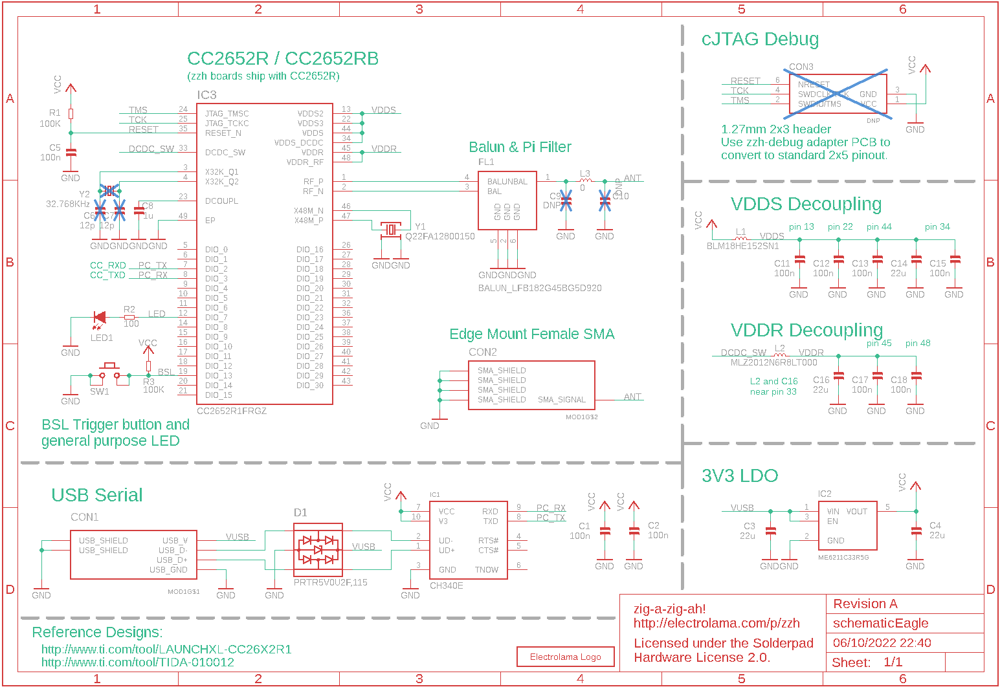
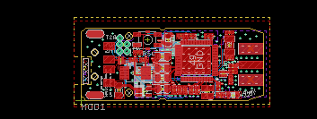
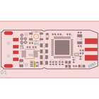
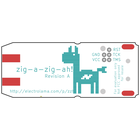
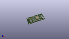
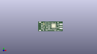
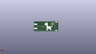
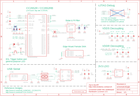
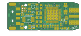
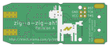

Contents
========

* [PRE1 > ](#pre1--)
	* [Schematic](#schematic)
	* [PCB](#pcb)
	* [Interactive BOM](#interactive-bom)
	* [OOMP Parts](#oomp-parts)
	* [Images](#images)
	* [Tags](#tags)
  
![][im]
# PRE1 > 

- ID: PROJ-ELLA-0001-STAN-01
- Hex ID: PRE1
- Name: Zig A Zig Ah
- Description: Zig A Zig Ah
- Long Link: [http://oom.lt/PROJ-ELLA-0001-STAN-01](http://oom.lt/PROJ-ELLA-0001-STAN-01)
- Short Link: [http://oom.lt/PRE1](http://oom.lt/PRE1)

## Schematic
  

## PCB
  

## Interactive BOM

- Interactive BOM page: [ibom.html](https://htmlpreview.github.io/?https://github.com/oomlout/oomlout_OOMP_projects/blob/main/PROJ-ELLA-0001-STAN-01/kicad/bom/ibom.html)

## OOMP Parts
  

|OOMP ID|Name|Identifier|
| :---: | :---: | :---: |
|CAPC-0402-X-UNMATCHED-01||C1, C2, C5, C6, C7, C11, C12, C13, C15, C17, C18|
|[CAPC-0805-X-UF22-V63D](https://github.com/oomlout/oomlout_OOMP_parts/tree/main/CAPC-0805-X-UF22-V63D/)|[SMD (0805) 22 uF Capacitor (Ceramic) 6.3v](https://github.com/oomlout/oomlout_OOMP_parts/tree/main/CAPC-0805-X-UF22-V63D/)|[C3, C4, C14, C16](https://github.com/oomlout/oomlout_OOMP_parts/tree/main/CAPC-0805-X-UF22-V63D/)|
|[CAPC-0402-X-UF1-V63D](https://github.com/oomlout/oomlout_OOMP_parts/tree/main/CAPC-0402-X-UF1-V63D/)|[SMD (0402) 1 uF Capacitor (Ceramic) 6.3v](https://github.com/oomlout/oomlout_OOMP_parts/tree/main/CAPC-0402-X-UF1-V63D/)|[C8](https://github.com/oomlout/oomlout_OOMP_parts/tree/main/CAPC-0402-X-UF1-V63D/)|
|DIOD-UNMATCHED-X-UNMATCHED-01||D1|
|UNMATCHED-UNMATCHED-X-UNMATCHED-01||FL1, IC1, IC2, IC3, MOD1, SW1, Y1, Y2|
|UNMATCHED-0603-X-UNMATCHED-01||L1|
|UNMATCHED-0805-X-UNMATCHED-01||L2|
|UNMATCHED-0402-X-UNMATCHED-01||L3|
|[LEDS-0603-G-STAN-01](https://github.com/oomlout/oomlout_OOMP_parts/tree/main/LEDS-0603-G-STAN-01/)|[SMD (0603) Green LED](https://github.com/oomlout/oomlout_OOMP_parts/tree/main/LEDS-0603-G-STAN-01/)|[LED1](https://github.com/oomlout/oomlout_OOMP_parts/tree/main/LEDS-0603-G-STAN-01/)|
|RESE-0402-X-O1003-01||R1, R3|
|[RESE-0402-X-O101-01](https://github.com/oomlout/oomlout_OOMP_parts/tree/main/RESE-0402-X-O101-01/)|[SMD (0402) 100 Ohm Resistor](https://github.com/oomlout/oomlout_OOMP_parts/tree/main/RESE-0402-X-O101-01/)|[R2](https://github.com/oomlout/oomlout_OOMP_parts/tree/main/RESE-0402-X-O101-01/)|

## Images
  
  

|bominteractivefront|bominteractiveback|kicadPcb3d|kicadPcb3dFront|kicadPcb3dBack|eagleImage|eagleSchemImage|pcbdraw|pcbdrawback|
| :---: | :---: | :---: | :---: | :---: | :---: | :---: | :---: | :---: |
||||||||||

## Tags

- oompType: PROJ
- oompSize: ELLA
- oompColor: 0001
- oompDesc: STAN
- oompIndex: 01
- name: Zig A Zig Ah
- gitRepo: https://github.com/electrolama/zig-a-zig-ah
- gitName: zig-a-zig-ah
- eagleBoard: zzh/Revision A/zzh.brd
- eagleSchem: zzh/Revision A/zzh.sch
- hexID: PRE1
- oompID: PROJ-ELLA-0001-STAN-01
- oompParts: C1,CAPC-0402-X-UNMATCHED-01
- oompParts: C2,CAPC-0402-X-UNMATCHED-01
- oompParts: C3,CAPC-0805-X-UF22-V63D
- oompParts: C4,CAPC-0805-X-UF22-V63D
- oompParts: C5,CAPC-0402-X-UNMATCHED-01
- oompParts: C6,CAPC-0402-X-UNMATCHED-01
- oompParts: C7,CAPC-0402-X-UNMATCHED-01
- oompParts: C8,CAPC-0402-X-UF1-V63D
- oompParts: C11,CAPC-0402-X-UNMATCHED-01
- oompParts: C12,CAPC-0402-X-UNMATCHED-01
- oompParts: C13,CAPC-0402-X-UNMATCHED-01
- oompParts: C14,CAPC-0805-X-UF22-V63D
- oompParts: C15,CAPC-0402-X-UNMATCHED-01
- oompParts: C16,CAPC-0805-X-UF22-V63D
- oompParts: C17,CAPC-0402-X-UNMATCHED-01
- oompParts: C18,CAPC-0402-X-UNMATCHED-01
- oompParts: D1,DIOD-UNMATCHED-X-UNMATCHED-01
- oompParts: FL1,UNMATCHED-UNMATCHED-X-UNMATCHED-01
- oompParts: IC1,UNMATCHED-UNMATCHED-X-UNMATCHED-01
- oompParts: IC2,UNMATCHED-UNMATCHED-X-UNMATCHED-01
- oompParts: IC3,UNMATCHED-UNMATCHED-X-UNMATCHED-01
- oompParts: L1,UNMATCHED-0603-X-UNMATCHED-01
- oompParts: L2,UNMATCHED-0805-X-UNMATCHED-01
- oompParts: L3,UNMATCHED-0402-X-UNMATCHED-01
- oompParts: LED1,LEDS-0603-G-STAN-01
- oompParts: MOD1,UNMATCHED-UNMATCHED-X-UNMATCHED-01
- oompParts: R1,RESE-0402-X-O1003-01
- oompParts: R2,RESE-0402-X-O101-01
- oompParts: R3,RESE-0402-X-O1003-01
- oompParts: SW1,UNMATCHED-UNMATCHED-X-UNMATCHED-01
- oompParts: Y1,UNMATCHED-UNMATCHED-X-UNMATCHED-01
- oompParts: Y2,UNMATCHED-UNMATCHED-X-UNMATCHED-01
- rawParts: C1,100n,CAP-0402,_PKG_C_0402,,,,,,,,,,,,,,
- rawParts: C2,100n,CAP-0402,_PKG_C_0402,,,,,,,,,,,,,,
- rawParts: C3,22u,CAP-0805,_PKG_C_0805,,,,,,,,,,,,,,
- rawParts: C4,22u,CAP-0805,_PKG_C_0805,,,,,,,,,,,,,,
- rawParts: C5,100n,CAP-0402,_PKG_C_0402,,,,,,,,,,,,,,
- rawParts: C6,12p,CAP-0402,_PKG_C_0402,,,,,,,,,,,,,,
- rawParts: C7,12p,CAP-0402,_PKG_C_0402,,,,,,,,,,,,,,
- rawParts: C8,1u,CAP-0402,_PKG_C_0402,,,,,,,,,,,,,,
- rawParts: C9,DNP,CAP-0402,_PKG_C_0402,,,,,,,,,,,,,,
- rawParts: C10,DNP,CAP-0402,_PKG_C_0402,,,,,,,,,,,,,,
- rawParts: C11,100n,CAP-0402,_PKG_C_0402,,,,,,,,,,,,,,
- rawParts: C12,100n,CAP-0402,_PKG_C_0402,,,,,,,,,,,,,,
- rawParts: C13,100n,CAP-0402,_PKG_C_0402,,,,,,,,,,,,,,
- rawParts: C14,22u,CAP-0805,_PKG_C_0805,,,,,,,,,,,,,,
- rawParts: C15,100n,CAP-0402,_PKG_C_0402,,,,,,,,,,,,,,
- rawParts: C16,22u,CAP-0805,_PKG_C_0805,,,,,,,,,,,,,,
- rawParts: C17,100n,CAP-0402,_PKG_C_0402,,,,,,,,,,,,,,
- rawParts: C18,100n,CAP-0402,_PKG_C_0402,,,,,,,,,,,,,,
- rawParts: CON3,DNP,DEBUG_CORTEX-SWD/CJTAG-5PIN-CUT5,DEBUG_CORTEX_5PIN,,,,,,,,,,,,,,
- rawParts: D1,PRTR5V0U2F,115,DIODE-TVS-PRTR5V0U2F,_PKG_SOT886_JEDEC-MO-252,ESD Suppressor, NXP, PRTR5V0U2F,ESD Suppressor, NXP, PRTR5V0U2F,,0.5mm,,Nexperia,PRTR5V0U2F,115,,,771-PRTR5V0U2F-T/R,https://www.mouser.com/Search/Refine.aspx?Keyword=771-PRTR5V0U2F-T%2FR,8166931P,http://uk.rs-online.com/web/p/products/8166931P,
- rawParts: FL1,BALUN_LFB182G45BG5D920,BALUN_LFB182G45BG5D920,LFB182G45BG5D920,Balance Matching BAND PASS FILTER,Balance Matching BAND PASS FILTER,,mm,,Murata Electronics,LFB182G45BG5D920,,,81-LFB182G45BG5D920,https://www.mouser.com/Search/Refine.aspx?Keyword=81-LFB182G45BG5D920,,,
- rawParts: IC1,CH340E,INTERFACE-CH340E,_PKG_MSOP10_TI-DGS10,,,,,,,,,,,,,,
- rawParts: IC2,ME6211C33R5G,POWER-LDO-ME6211C33R5G,SOT65P212X110-5N,,,,,,,,,,,,,,
- rawParts: IC3,CC2652R1FRGZ,WMCU-CC2652R1FRGZ,QFN50P700X700X100-49N,Texas Instruments SimpleLink? Multi-Standard CC2652R Wireless MCU 48-VQFN -40 to 85,Texas Instruments SimpleLink? Multi-Standard CC2652R Wireless MCU 48-VQFN -40 to 85,,1mm,,Texas Instruments,CC2652R1FRGZT,,,595-CC2652R1FRGZT,https://www.mouser.com/Search/Refine.aspx?Keyword=595-CC2652R1FRGZT,,,
- rawParts: L1,BLM18HE152SN1,INDUCTOR-0603,_PKG_L_0603,,,,,,,,,,,,,,
- rawParts: L2,MLZ2012N6R8LT000,INDUCTOR-0805,_PKG_C_0805,,,,,,,,,,,,,,
- rawParts: L3,0,INDUCTOR-0402,_PKG_L_0402,,,,,,,,,,,,,,
- rawParts: LED1,,LED-0603,_PKG_LED_0603,,,,,,,,,,,,,,
- rawParts: MOD1,,ZZH_MODULE,ZZH_MODULE,,,,,,,,,,,,,,
- rawParts: R1,100K,RES-0402,_PKG_C_0402,,,,,,,,,,,,,,
- rawParts: R2,100,RES-0402,_PKG_C_0402,,,,,,,,,,,,,,
- rawParts: R3,100K,RES-0402,_PKG_C_0402,,,,,,,,,,,,,,
- rawParts: SW1,K2-1177SW-D4DW-06,PUSHBUTTON-K2-1177SW-D4DW-06,K2-1177SW-D4DW-06,,,,,,,,,,,,,,
- rawParts: U$5,LOGO-ELECTROLAMA,LOGO-ELECTROLAMA,ELECTROLAMA,,,,,,,,,,,,,,
- rawParts: Y1,Q22FA12800150,48.000MHZ_CX2016DB48000C0FPLC1,XTAL-4P-2016,48MHz ±10ppm Crystal 7pF 50 Ohms 4-SMD, No Lead,,1253-2042-1-ND,,,,,KYOCERA,CX2016DB48000C0FPLC1,,,,,
- rawParts: Y2,32.768KHz,32.768KHZ_Q13FC1350000400,XTAL-2P-3215,SMD Crystal Resonators 32.768KHz +/-20ppm SMD-3215_2P RoHS,,,,C32346,,,SEIKO EPSON,Q13FC1350000400,,,,,

[im]: kicadPcb3d_450.png
