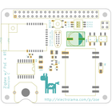
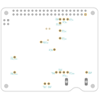
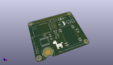
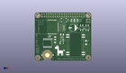
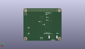
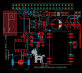
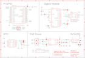

Contents
========

* [PRE2 > ](#pre2--)
	* [Schematic](#schematic)
	* [PCB](#pcb)
	* [Interactive BOM](#interactive-bom)
	* [OOMP Parts](#oomp-parts)
	* [Images](#images)
	* [Tags](#tags)
  
![][im]
# PRE2 > 

- ID: PROJ-ELLA-0002-STAN-0C
- Hex ID: PRE2
- Name: Zoe Rev C
- Description: Zoe Rev C
- Long Link: [http://oom.lt/PROJ-ELLA-0002-STAN-0C](http://oom.lt/PROJ-ELLA-0002-STAN-0C)
- Short Link: [http://oom.lt/PRE2](http://oom.lt/PRE2)

## Schematic
  

## PCB
  

## Interactive BOM

- Interactive BOM page: [ibom.html](https://htmlpreview.github.io/?https://github.com/oomlout/oomlout_OOMP_projects/blob/main/PROJ-ELLA-0002-STAN-0C/kicad/bom/ibom.html)

## OOMP Parts
  

|OOMP ID|Name|Identifier|
| :---: | :---: | :---: |
|UNMATCHED-UNMATCHED-X-UNMATCHED-01||BAT1, BR1, BR2, CON1, IC1, IC2, MOD1, MOD2, MOD3, SW1, SW2, TP1, TP2, TP3, TP4, TP5, TP6, TP7, TP8, TP9, TP10, TP11, TP12, TP13, TP14, TP15, TP16, TP17, TP18|
|[CAPC-0805-X-UF22-V63D](https://github.com/oomlout/oomlout_OOMP_parts/tree/main/CAPC-0805-X-UF22-V63D/)|[SMD (0805) 22 uF Capacitor (Ceramic) 6.3v](https://github.com/oomlout/oomlout_OOMP_parts/tree/main/CAPC-0805-X-UF22-V63D/)|[C1, C2](https://github.com/oomlout/oomlout_OOMP_parts/tree/main/CAPC-0805-X-UF22-V63D/)|
|[CAPC-0603-X-NF100-V50](https://github.com/oomlout/oomlout_OOMP_parts/tree/main/CAPC-0603-X-NF100-V50/)|[SMD (0603) 100 nF Capacitor (Ceramic) 50v](https://github.com/oomlout/oomlout_OOMP_parts/tree/main/CAPC-0603-X-NF100-V50/)|[C4, C5](https://github.com/oomlout/oomlout_OOMP_parts/tree/main/CAPC-0603-X-NF100-V50/)|
|CAPC-0603-X-UF22-01||C6|
|CAPX-UNMATCHED-X-UF470-01||C7|
|DIOD-UNMATCHED-X-UNMATCHED-01||D1|
|RESE-0603-X-UNMATCHED-01||R4|
|RESE-1206-X-UNMATCHED-01||R5, R6|

## Images
  
  

|bominteractivefront|bominteractiveback|kicadPcb3d|kicadPcb3dFront|kicadPcb3dBack|kicadSchem|eagleImage|eagleSchemImage|
| :---: | :---: | :---: | :---: | :---: | :---: | :---: | :---: |
|||||||||

## Tags

- oompType: PROJ
- oompSize: ELLA
- oompColor: 0002
- oompDesc: STAN
- oompIndex: 0C
- name: Zoe Rev C
- gitRepo: https://github.com/electrolama/zoe
- gitName: zoe
- eagleBoard: /Revision C/pi-zigbee-poe-rtc.brd
- eagleSchem: /Revision C/pi-zigbee-poe-rtc.sch
- hexID: PRE2
- oompID: PROJ-ELLA-0002-STAN-0C
- oompParts: BAT1,UNMATCHED-UNMATCHED-X-UNMATCHED-01
- oompParts: BR1,UNMATCHED-UNMATCHED-X-UNMATCHED-01
- oompParts: BR2,UNMATCHED-UNMATCHED-X-UNMATCHED-01
- oompParts: C1,CAPC-0805-X-UF22-V63D
- oompParts: C2,CAPC-0805-X-UF22-V63D
- oompParts: C4,CAPC-0603-X-NF100-V50
- oompParts: C5,CAPC-0603-X-NF100-V50
- oompParts: C6,CAPC-0603-X-UF22-01
- oompParts: C7,CAPX-UNMATCHED-X-UF470-01
- oompParts: CON1,UNMATCHED-UNMATCHED-X-UNMATCHED-01
- oompParts: D1,DIOD-UNMATCHED-X-UNMATCHED-01
- oompParts: IC1,UNMATCHED-UNMATCHED-X-UNMATCHED-01
- oompParts: IC2,UNMATCHED-UNMATCHED-X-UNMATCHED-01
- oompParts: MOD1,UNMATCHED-UNMATCHED-X-UNMATCHED-01
- oompParts: MOD2,UNMATCHED-UNMATCHED-X-UNMATCHED-01
- oompParts: MOD3,UNMATCHED-UNMATCHED-X-UNMATCHED-01
- oompParts: R4,RESE-0603-X-UNMATCHED-01
- oompParts: R5,RESE-1206-X-UNMATCHED-01
- oompParts: R6,RESE-1206-X-UNMATCHED-01
- oompParts: SW1,UNMATCHED-UNMATCHED-X-UNMATCHED-01
- oompParts: SW2,UNMATCHED-UNMATCHED-X-UNMATCHED-01
- oompParts: TP1,UNMATCHED-UNMATCHED-X-UNMATCHED-01
- oompParts: TP2,UNMATCHED-UNMATCHED-X-UNMATCHED-01
- oompParts: TP3,UNMATCHED-UNMATCHED-X-UNMATCHED-01
- oompParts: TP4,UNMATCHED-UNMATCHED-X-UNMATCHED-01
- oompParts: TP5,UNMATCHED-UNMATCHED-X-UNMATCHED-01
- oompParts: TP6,UNMATCHED-UNMATCHED-X-UNMATCHED-01
- oompParts: TP7,UNMATCHED-UNMATCHED-X-UNMATCHED-01
- oompParts: TP8,UNMATCHED-UNMATCHED-X-UNMATCHED-01
- oompParts: TP9,UNMATCHED-UNMATCHED-X-UNMATCHED-01
- oompParts: TP10,UNMATCHED-UNMATCHED-X-UNMATCHED-01
- oompParts: TP11,UNMATCHED-UNMATCHED-X-UNMATCHED-01
- oompParts: TP12,UNMATCHED-UNMATCHED-X-UNMATCHED-01
- oompParts: TP13,UNMATCHED-UNMATCHED-X-UNMATCHED-01
- oompParts: TP14,UNMATCHED-UNMATCHED-X-UNMATCHED-01
- oompParts: TP15,UNMATCHED-UNMATCHED-X-UNMATCHED-01
- oompParts: TP16,UNMATCHED-UNMATCHED-X-UNMATCHED-01
- oompParts: TP17,UNMATCHED-UNMATCHED-X-UNMATCHED-01
- oompParts: TP18,UNMATCHED-UNMATCHED-X-UNMATCHED-01
- rawParts: BAT1,KEYSTONE 3001,BATTERY,KEYSTONE_3001,,,,,,,,,,
- rawParts: BR1,MB6S,DIODE-RECTIFIER-MB6S,SOP254P665X270-4N,MICRO COMMERCIAL COMPONENTS - MB6S-TP - BRIDGE RECTIFIER, 500mA, 600V,MICRO COMMERCIAL COMPONENTS - MB6S-TP - BRIDGE RECTIFIER, 500mA, 600V,2.7mm,Micro Commercial Components (MCC),MB6S-TP,833-MB6S-TP,https://www.mouser.com/Search/Refine.aspx?Keyword=833-MB6S-TP,,,
- rawParts: BR2,MB6S,DIODE-RECTIFIER-MB6S,SOP254P665X270-4N,MICRO COMMERCIAL COMPONENTS - MB6S-TP - BRIDGE RECTIFIER, 500mA, 600V,MICRO COMMERCIAL COMPONENTS - MB6S-TP - BRIDGE RECTIFIER, 500mA, 600V,2.7mm,Micro Commercial Components (MCC),MB6S-TP,833-MB6S-TP,https://www.mouser.com/Search/Refine.aspx?Keyword=833-MB6S-TP,,,
- rawParts: C1,22u,CAP-0805,_PKG_C_0805,,,,,,,,,,
- rawParts: C2,22u,CAP-0805,_PKG_C_0805,,,,,,,,,,
- rawParts: C4,100n,CAP-0603,_PKG_C_0603,,,,,,,,,,
- rawParts: C5,100n,CAP-0603,_PKG_C_0603,,,,,,,,,,
- rawParts: C6,2u2,CAP-0603,_PKG_C_0603,,,,,,,,,,
- rawParts: C7,470u,CAP-POL-ELCO-D8-L10.5,_CAP_ELCO_D8_L10.5,,,,,,,,,,
- rawParts: CON1,,TC2050-IDC-NL_CC-DEBUGGER,TC2050-IDC-NL,,,,,,,,,,
- rawParts: D1,SMAJ58CA,DIODE-TVS-SMAJ58CA,DIOM5126X250N-NOPOL,DIODE, TVS, 58V, 300W, 2SMA Taiwan Semi SMAJ58CA Bi-Directional TVS Diode, 2-Pin SMA,DIODE, TVS, 58V, 300W, 2SMA Taiwan Semi SMAJ58CA Bi-Directional TVS Diode, 2-Pin SMA,2.5mm,Taiwan Semiconductor,SMAJ58CA,N/A,https://www.mouser.com/Search/Refine.aspx?Keyword=N%2FA,,,
- rawParts: IC1,TLV70333DBVR,LDO-TLV70333DBVR,SOT95P280X145-5N,300mA Low-IQ Low-Dropout (LDO) Regulator,300mA Low-IQ Low-Dropout (LDO) Regulator,1.45mm,Texas Instruments,TLV70333DBVR,595-TLV70333DBVR,https://www.mouser.com/Search/Refine.aspx?Keyword=595-TLV70333DBVR,,,
- rawParts: IC2,,RTC-DS3231SN#,SOIC127P1032X265-16N,Real Time Clock Serial Maxim DS3231SN# Real Time Clock, Battery Backup, Calendar, Clock, I2C, 5.5 V, 16-Pin SOIC,Real Time Clock Serial Maxim DS3231SN# Real Time Clock, Battery Backup, Calendar, Clock, I2C, 5.5 V, 16-Pin SOIC,2.65mm,Maxim Integrated,DS3231SN#,700-DS3231SN#,https://www.mouser.com/Search/Refine.aspx?Keyword=700-DS3231SN%23,1897251,http://uk.rs-online.com/web/p/products/1897251,
- rawParts: MOD1,E18-MS1PA1-IPX/PCB,EBYTE-E18-MS1PA1,EBYTE-E18-MS1PA1,,,,,,,,,,
- rawParts: MOD2,AG9805-MT,SILVERTEL_AG9800M,SILVERTEL_AG9800M,,,,,,,,,,
- rawParts: MOD3,RPI-HAT-FULL,RPI-HAT-FULL,RPI-HAT-FULL,,,,,,,,,,
- rawParts: R4,4K7,RES-0603,_PKG_C_0603,,,,,,,,,,
- rawParts: R5,0,TP_DUAL_1206,TP_DUAL_1206,To accomodate either0R 1206 link (oversized pads)2 x Harwin S2751-46R SMD Test Points (Digikey Link),,,,,,,,,
- rawParts: R6,0,TP_DUAL_1206,TP_DUAL_1206,To accomodate either0R 1206 link (oversized pads)2 x Harwin S2751-46R SMD Test Points (Digikey Link),,,,,,,,,
- rawParts: SW1,DSHP03TS-S,SWITCH-DIP03-SMD,DSHP03TS-S,,,,,,,,,,
- rawParts: SW2,,SPNO-XKB-TS-1187A,XKB-TS-1187A,,,,,,,,,,
- rawParts: TP1,TP,TP,TP_DOT,,,,,,,,,,
- rawParts: TP2,TP,TP,TP_DOT,,,,,,,,,,
- rawParts: TP3,TP,TP,TP_DOT,,,,,,,,,,
- rawParts: TP4,TP,TP,TP_DOT,,,,,,,,,,
- rawParts: TP5,TP,TP,TP_DOT,,,,,,,,,,
- rawParts: TP6,TP,TP,TP_DOT,,,,,,,,,,
- rawParts: TP7,TP,TP,TP_DOT,,,,,,,,,,
- rawParts: TP8,TP,TP,TP_DOT,,,,,,,,,,
- rawParts: TP9,TP,TP,TP_DOT,,,,,,,,,,
- rawParts: TP10,TP,TP,TP_DOT,,,,,,,,,,
- rawParts: TP11,TP,TP,TP_DOT,,,,,,,,,,
- rawParts: TP12,TP,TP,TP_DOT,,,,,,,,,,
- rawParts: TP13,TP,TP,TP_DOT,,,,,,,,,,
- rawParts: TP14,TP,TP,TP_DOT,,,,,,,,,,
- rawParts: TP15,TP,TP,TP_DOT,,,,,,,,,,
- rawParts: TP16,TP,TP,TP_DOT,,,,,,,,,,
- rawParts: TP17,TP,TP,TP_DOT,,,,,,,,,,
- rawParts: TP18,TP-HOOK,TP-HOOK,TP_S2751-46R,,,,,,,,,,
- rawParts: U$1,LOGO-ELECTROLAMA,LOGO-ELECTROLAMA,ELECTROLAMA,,,,,,,,,,

[im]: kicadPcb3d_450.png
