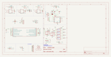
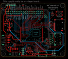
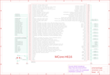

Contents
========

* [PRPR3 > ](#prpr3--)
	* [Schematic](#schematic)
	* [PCB](#pcb)
	* [OOMP Parts](#oomp-parts)
	* [Images](#images)
	* [Tags](#tags)

# PRPR3 > 

- ID: PROJ-ELLA-0003-STAN-01
- Hex ID: PRPR3
- Name: mcore h616 breakout
- Description: mcore h616 breakout
- Long Link: [http://oom.lt/PROJ-ELLA-0003-STAN-01](http://oom.lt/PROJ-ELLA-0003-STAN-01)
- Short Link: [http://oom.lt/PRPR3](http://oom.lt/PRPR3)

## Schematic
  

## PCB
  

## OOMP Parts
  

|OOMP ID|Name|Identifier|
| :---: | :---: | :---: |
|CAPC-1206-X-UF47-01||C1, C3, C4, C7, C8, C10|
|[CAPC-0402-X-NF100-V10](https://github.com/oomlout/oomlout_OOMP_parts/tree/main/CAPC-0402-X-NF100-V10/)|[SMD (0402) 100 nF Capacitor (Ceramic) 10v](https://github.com/oomlout/oomlout_OOMP_parts/tree/main/CAPC-0402-X-NF100-V10/)|[C2, C6, C9, C11, C12, C13, C14, C15, C16](https://github.com/oomlout/oomlout_OOMP_parts/tree/main/CAPC-0402-X-NF100-V10/)|
|[CAPC-0402-X-NF10-V50](https://github.com/oomlout/oomlout_OOMP_parts/tree/main/CAPC-0402-X-NF10-V50/)|[SMD (0402) 10 nF Capacitor (Ceramic) 50v](https://github.com/oomlout/oomlout_OOMP_parts/tree/main/CAPC-0402-X-NF10-V50/)|[C5](https://github.com/oomlout/oomlout_OOMP_parts/tree/main/CAPC-0402-X-NF10-V50/)|
|UNMATCHED-UNMATCHED-X-UNMATCHED-01||CON1, CON2, CON3, CON4, CON5, CON6, IC1, J4, J6, MOD1, SW1, TP1, TP2, TP3, TP4|
|DIOD-UNMATCHED-X-UNMATCHED-01||D1, D2, D3, D4|
|[HEAD-I01-X-PI04-01](https://github.com/oomlout/oomlout_OOMP_parts/tree/main/HEAD-I01-X-PI04-01/)|[2.54 mm 4 Pin Header](https://github.com/oomlout/oomlout_OOMP_parts/tree/main/HEAD-I01-X-PI04-01/)|[J1](https://github.com/oomlout/oomlout_OOMP_parts/tree/main/HEAD-I01-X-PI04-01/)|
|[HEAD-I01-X-PI03-01](https://github.com/oomlout/oomlout_OOMP_parts/tree/main/HEAD-I01-X-PI03-01/)|[2.54 mm 3 Pin Header](https://github.com/oomlout/oomlout_OOMP_parts/tree/main/HEAD-I01-X-PI03-01/)|[J2](https://github.com/oomlout/oomlout_OOMP_parts/tree/main/HEAD-I01-X-PI03-01/)|
|[HEAD-I01-X-PI02-01](https://github.com/oomlout/oomlout_OOMP_parts/tree/main/HEAD-I01-X-PI02-01/)|[2.54 mm 2 Pin Header](https://github.com/oomlout/oomlout_OOMP_parts/tree/main/HEAD-I01-X-PI02-01/)|[J3, J5](https://github.com/oomlout/oomlout_OOMP_parts/tree/main/HEAD-I01-X-PI02-01/)|
|UNMATCHED-0805-X-UNMATCHED-01||L1|
|[LEDS-0805-G-STAN-01](https://github.com/oomlout/oomlout_OOMP_parts/tree/main/LEDS-0805-G-STAN-01/)|[SMD (0805) Green LED](https://github.com/oomlout/oomlout_OOMP_parts/tree/main/LEDS-0805-G-STAN-01/)|[LED1](https://github.com/oomlout/oomlout_OOMP_parts/tree/main/LEDS-0805-G-STAN-01/)|
|RESE-0402-X-UNMATCHED-01||R1, R2, R7, R9, R10, R13, R14, R15, R16|
|[RESE-0402-X-O101-01](https://github.com/oomlout/oomlout_OOMP_parts/tree/main/RESE-0402-X-O101-01/)|[SMD (0402) 100 Ohm Resistor](https://github.com/oomlout/oomlout_OOMP_parts/tree/main/RESE-0402-X-O101-01/)|[R3, R8, R11, R12, R18, R20, R21](https://github.com/oomlout/oomlout_OOMP_parts/tree/main/RESE-0402-X-O101-01/)|
|[RESE-0402-X-O103-01](https://github.com/oomlout/oomlout_OOMP_parts/tree/main/RESE-0402-X-O103-01/)|[SMD (0402) 10k Ohm Resistor](https://github.com/oomlout/oomlout_OOMP_parts/tree/main/RESE-0402-X-O103-01/)|[R4, R5, R17, R19](https://github.com/oomlout/oomlout_OOMP_parts/tree/main/RESE-0402-X-O103-01/)|
|[RESE-0402-X-O102-01](https://github.com/oomlout/oomlout_OOMP_parts/tree/main/RESE-0402-X-O102-01/)|[SMD (0402) 1k Ohm Resistor](https://github.com/oomlout/oomlout_OOMP_parts/tree/main/RESE-0402-X-O102-01/)|[R6](https://github.com/oomlout/oomlout_OOMP_parts/tree/main/RESE-0402-X-O102-01/)|

## Images
  
  

|kicadSchem|eagleImage|eagleSchemImage|
| :---: | :---: | :---: |
||||

## Tags

- oompType: PROJ
- oompSize: ELLA
- oompColor: 0003
- oompDesc: STAN
- oompIndex: 01
- name: mcore h616 breakout
- gitRepo: https://github.com/electrolama/mcore-h616-breakout
- gitName: mcore-h616-breakout
- eagleBoard: hardware/Revision A1/mcore-h616-breakout-RevA1.brd
- eagleSchem: hardware/Revision A1/mcore-h616-breakout-RevA1.sch
- hexID: PRPR3
- oompID: PROJ-ELLA-0003-STAN-01
- oompParts: C1,CAPC-1206-X-UF47-01
- oompParts: C2,CAPC-0402-X-NF100-V10
- oompParts: C3,CAPC-1206-X-UF47-01
- oompParts: C4,CAPC-1206-X-UF47-01
- oompParts: C5,CAPC-0402-X-NF10-V50
- oompParts: C6,CAPC-0402-X-NF100-V10
- oompParts: C7,CAPC-1206-X-UF47-01
- oompParts: C8,CAPC-1206-X-UF47-01
- oompParts: C9,CAPC-0402-X-NF100-V10
- oompParts: C10,CAPC-1206-X-UF47-01
- oompParts: C11,CAPC-0402-X-NF100-V10
- oompParts: C12,CAPC-0402-X-NF100-V10
- oompParts: C13,CAPC-0402-X-NF100-V10
- oompParts: C14,CAPC-0402-X-NF100-V10
- oompParts: C15,CAPC-0402-X-NF100-V10
- oompParts: C16,CAPC-0402-X-NF100-V10
- oompParts: CON1,UNMATCHED-UNMATCHED-X-UNMATCHED-01
- oompParts: CON2,UNMATCHED-UNMATCHED-X-UNMATCHED-01
- oompParts: CON3,UNMATCHED-UNMATCHED-X-UNMATCHED-01
- oompParts: CON4,UNMATCHED-UNMATCHED-X-UNMATCHED-01
- oompParts: CON5,UNMATCHED-UNMATCHED-X-UNMATCHED-01
- oompParts: CON6,UNMATCHED-UNMATCHED-X-UNMATCHED-01
- oompParts: D1,DIOD-UNMATCHED-X-UNMATCHED-01
- oompParts: D2,DIOD-UNMATCHED-X-UNMATCHED-01
- oompParts: D3,DIOD-UNMATCHED-X-UNMATCHED-01
- oompParts: D4,DIOD-UNMATCHED-X-UNMATCHED-01
- oompParts: IC1,UNMATCHED-UNMATCHED-X-UNMATCHED-01
- oompParts: J1,HEAD-I01-X-PI04-01
- oompParts: J2,HEAD-I01-X-PI03-01
- oompParts: J3,HEAD-I01-X-PI02-01
- oompParts: J4,UNMATCHED-UNMATCHED-X-UNMATCHED-01
- oompParts: J5,HEAD-I01-X-PI02-01
- oompParts: J6,UNMATCHED-UNMATCHED-X-UNMATCHED-01
- oompParts: L1,UNMATCHED-0805-X-UNMATCHED-01
- oompParts: LED1,LEDS-0805-G-STAN-01
- oompParts: MOD1,UNMATCHED-UNMATCHED-X-UNMATCHED-01
- oompParts: R1,RESE-0402-X-UNMATCHED-01
- oompParts: R2,RESE-0402-X-UNMATCHED-01
- oompParts: R3,RESE-0402-X-O101-01
- oompParts: R4,RESE-0402-X-O103-01
- oompParts: R5,RESE-0402-X-O103-01
- oompParts: R6,RESE-0402-X-O102-01
- oompParts: R7,RESE-0402-X-UNMATCHED-01
- oompParts: R8,RESE-0402-X-O101-01
- oompParts: R9,RESE-0402-X-UNMATCHED-01
- oompParts: R10,RESE-0402-X-UNMATCHED-01
- oompParts: R11,RESE-0402-X-O101-01
- oompParts: R12,RESE-0402-X-O101-01
- oompParts: R13,RESE-0402-X-UNMATCHED-01
- oompParts: R14,RESE-0402-X-UNMATCHED-01
- oompParts: R15,RESE-0402-X-UNMATCHED-01
- oompParts: R16,RESE-0402-X-UNMATCHED-01
- oompParts: R17,RESE-0402-X-O103-01
- oompParts: R18,RESE-0402-X-O101-01
- oompParts: R19,RESE-0402-X-O103-01
- oompParts: R20,RESE-0402-X-O101-01
- oompParts: R21,RESE-0402-X-O101-01
- oompParts: SW1,UNMATCHED-UNMATCHED-X-UNMATCHED-01
- oompParts: TP1,UNMATCHED-UNMATCHED-X-UNMATCHED-01
- oompParts: TP2,UNMATCHED-UNMATCHED-X-UNMATCHED-01
- oompParts: TP3,UNMATCHED-UNMATCHED-X-UNMATCHED-01
- oompParts: TP4,UNMATCHED-UNMATCHED-X-UNMATCHED-01
- rawParts: C1,47u,CAP-1206,_PKG_C_1206,,,,,,,,C96123,,,,,,,,,,,,
- rawParts: C2,100n,CAP-0402,_PKG_C_0402,,,,,,,,C307331,,,,,,,,,,,,
- rawParts: C3,47u,CAP-1206,_PKG_C_1206,,,,,,,,C96123,,,,,,,,,,,,
- rawParts: C4,47u,CAP-1206,_PKG_C_1206,,,,,,,,C96123,,,,,,,,,,,,
- rawParts: C5,10n,CAP-0402,_PKG_C_0402,,,,,,,,C15195,,,,,,,,,,,,
- rawParts: C6,100n,CAP-0402,_PKG_C_0402,,,,,,,,C307331,,,,,,,,,,,,
- rawParts: C7,47u,CAP-1206,_PKG_C_1206,,,,,,,,C96123,,,,,,,,,,,,
- rawParts: C8,47u,CAP-1206,_PKG_C_1206,,,,,,,,C96123,,,,,,,,,,,,
- rawParts: C9,100n,CAP-0402,_PKG_C_0402,,,,,,,,C307331,,,,,,,,,,,,
- rawParts: C10,47u,CAP-1206,_PKG_C_1206,,,,,,,,C96123,,,,,,,,,,,,
- rawParts: C11,100n,CAP-0402,_PKG_C_0402,,,,,,,,C307331,,,,,,,,,,,,
- rawParts: C12,100n,CAP-0402,_PKG_C_0402,,,,,,,,C307331,,,,,,,,,,,,
- rawParts: C13,100n,CAP-0402,_PKG_C_0402,,,,,,,,C307331,,,,,,,,,,,,
- rawParts: C14,100n,CAP-0402,_PKG_C_0402,,,,,,,,C307331,,,,,,,,,,,,
- rawParts: C15,100n,CAP-0402,_PKG_C_0402,,,,,,,,C307331,,,,,,,,,,,,
- rawParts: C16,100n,CAP-0402,_PKG_C_0402,,,,,,,,C307331,,,,,,,,,,,,
- rawParts: CON1,,USB-A-FEMALE-JING-912-121A2023S10100,JING_912-121A2023S10100,,,,,,,,C42428,,,,,,,,,,,,
- rawParts: CON2,,USB-A-FEMALE-JING-912-121A2023S10100,JING_912-121A2023S10100,,,,,,,,C42428,,,,,,,,,,,,
- rawParts: CON3,,USBC_USB-C-12,USBC_C-31-M-12,,,,,,,,C165948,,,,,,,,,,,,
- rawParts: CON4,C136421 - HDMI-519,685119136923,685119136923,WR-COM Mini HDMI SMT Horizontal,,,https://www.we-online.com/catalog/datasheet/685119136923.pdf,,Receptacle,,C136421,,,SMT,,,685119136923, 19 ,,0.5A,Horizontal,40VAC,
- rawParts: CON5,LPJG0926HENL,RJ45_POE_LPJG0926HENL,LPJG0926HENL,LPJG0926HENL,,,,LPJG0926HENL,,13.5mm,,LINK-PP,LPJG0926HENL,,,,,,,,,,
- rawParts: CON6,C111196 - TF-15x15,TF/SHENZHEN-SPECIAL,TF/SHENZHEN-SPECIAL,,,,,,,,C111196,,,,,,,,,,,,
- rawParts: D1,SRV05-4-P-T7,DIODE-TVS-SRV05-4,SOT95P280X145-6N,SRV05 Series 4 Ch 3.5 pF 15 Vclamp Steering Diode/TVS Array Combo - SOT-23-6,,,,SRV05 Series 4 Ch 3.5 pF 15 Vclamp Steering Diode/TVS Array Combo - SOT-23-6,,1.45mm,C85364,ProTek Devices,SRV05-4-P-T7,,,,,,,,,,
- rawParts: D2,SRV05-4-P-T7,DIODE-TVS-SRV05-4,SOT95P280X145-6N,SRV05 Series 4 Ch 3.5 pF 15 Vclamp Steering Diode/TVS Array Combo - SOT-23-6,,,,SRV05 Series 4 Ch 3.5 pF 15 Vclamp Steering Diode/TVS Array Combo - SOT-23-6,,1.45mm,C85364,ProTek Devices,SRV05-4-P-T7,,,,,,,,,,
- rawParts: D3,RB520S30T1G,DIODE-SCHOTTKY-RB520S30,_PKG_SOD523,https://lcsc.com/product-detail/Schottky-Barrier-Diodes-SBD_ON-Semicon_RB520S30T1G_ON-Semicon-ON-RB520S30T1G_C154821.html,,,,,,,C154821,,,,,,,,,,,,
- rawParts: D4,RB520S30T1G,DIODE-SCHOTTKY-RB520S30,_PKG_SOD523,https://lcsc.com/product-detail/Schottky-Barrier-Diodes-SBD_ON-Semicon_RB520S30T1G_ON-Semicon-ON-RB520S30T1G_C154821.html,,,,,,,C154821,,,,,,,,,,,,
- rawParts: IC1,LD1117-3.3,POWER-LDO-LD1117-SOT223-4,_PKG_SOT223-4_TI-DCY4,,,,,,,,C6186,,,,,,,,,,,,
- rawParts: J1,,CONN_04LOCK,1X04_LOCK,Multi connection point. Often used as Generic Header-pin footprint for 0.1 inch spaced/style header connections,,,,,,,,,,,,,,,CONN-09696,,,,
- rawParts: J2,,CONN_03LOCK,1X03_LOCK,Multi connection point. Often used as Generic Header-pin footprint for 0.1 inch spaced/style header connections,,,,,,,,,,,,,,,,,,,
- rawParts: J3,,CONN_02LOCK,1X02_LOCK,Multi connection point. Often used as Generic Header-pin footprint for 0.1 inch spaced/style header connections,,,,,,,,,,,,,,,,,,,
- rawParts: J4,,CON_2.54MM_TH_2X20,CON_2.54MM_TH_2X20,,,,,,,,,,,,,,,,,,,,
- rawParts: J5,,CONN_02LOCK,1X02_LOCK,Multi connection point. Often used as Generic Header-pin footprint for 0.1 inch spaced/style header connections,,,,,,,,,,,,,,,,,,,
- rawParts: J6,,CON_2.54MM_TH_2X2,CON_2.54MM_TH_2X2,,,,,,,,,,,,,,,,,,,,
- rawParts: L1,FB,INDUCTOR-0805,_PKG_C_0805,,,,,,,,C75661,,,,,,,,,,,,
- rawParts: LED1,,LED-0805,_PKG_LED_0805,,,,,,,,C2296,,,,,,,,,,,,
- rawParts: MOD1,,WIDORA_MCORE-H616_V1,MCORE-H616_V1,No description set,,,,,,,,,,,,,,,,,,,
- rawParts: R1,5k1,RES-0402,_PKG_R_0402,,,,,,,,C25905,,,,,,,,,,,,
- rawParts: R2,5k1,RES-0402,_PKG_R_0402,,,,,,,,C25905,,,,,,,,,,,,
- rawParts: R3,100,RES-0402,_PKG_R_0402,,,,,,,,C25076,,,,,,,,,,,,
- rawParts: R4,10k,RES-0402,_PKG_R_0402,,,,,,,,C25744,,,,,,,,,,,,
- rawParts: R5,10k,RES-0402,_PKG_R_0402,,,,,,,,C25744,,,,,,,,,,,,
- rawParts: R6,1k,RES-0402,_PKG_R_0402,,,,,,,,C11702,,,,,,,,,,,,
- rawParts: R7,27k 1%,RES-0402,_PKG_R_0402,,,,,,,,C25771,,,,,,,,,,,,
- rawParts: R8,100,RES-0402,_PKG_R_0402,,,,,,,,C25076,,,,,,,,,,,,
- rawParts: R9,1k8,RES-0402,_PKG_R_0402,,,,,,,,C25871,,,,,,,,,,,,
- rawParts: R10,1k8,RES-0402,_PKG_R_0402,,,,,,,,C25871,,,,,,,,,,,,
- rawParts: R11,100,RES-0402,_PKG_R_0402,,,,,,,,C25076,,,,,,,,,,,,
- rawParts: R12,100,RES-0402,_PKG_R_0402,,,,,,,,C25076,,,,,,,,,,,,
- rawParts: R13,49.9Ω,RES-0402,_PKG_R_0402,,,,,,,,C25120,,,,,,,,,,,,
- rawParts: R14,49.9Ω,RES-0402,_PKG_R_0402,,,,,,,,C25120,,,,,,,,,,,,
- rawParts: R15,49.9Ω,RES-0402,_PKG_R_0402,,,,,,,,C25120,,,,,,,,,,,,
- rawParts: R16,49.9Ω,RES-0402,_PKG_R_0402,,,,,,,,C25120,,,,,,,,,,,,
- rawParts: R17,10k,RES-0402,_PKG_R_0402,,,,,,,,C25744,,,,,,,,,,,,
- rawParts: R18,100,RES-0402,_PKG_R_0402,,,,,,,,C25076,,,,,,,,,,,,
- rawParts: R19,10k,RES-0402,_PKG_R_0402,,,,,,,,C25744,,,,,,,,,,,,
- rawParts: R20,100,RES-0402,_PKG_R_0402,,,,,,,,C25076,,,,,,,,,,,,
- rawParts: R21,100,RES-0402,_PKG_R_0402,,,,,,,,C25076,,,,,,,,,,,,
- rawParts: SW1,SPNO,PUSHBUTTON-6X6MM,GENERIC_SPNO_4P_6X6MM,,,,,,,,C620316,,,,,,,,,,,,
- rawParts: TP1,TP,TP,TP_DOT_1.5X1.5MM,,,,,,,,,,,,,,,,,,,,
- rawParts: TP2,TP,TP,TP_DOT_1.5X1.5MM,,,,,,,,,,,,,,,,,,,,
- rawParts: TP3,TP,TP,TP_DOT_1.5X1.5MM,,,,,,,,,,,,,,,,,,,,
- rawParts: TP4,TP,TP,TP_DOT_1.5X1.5MM,,,,,,,,,,,,,,,,,,,,
