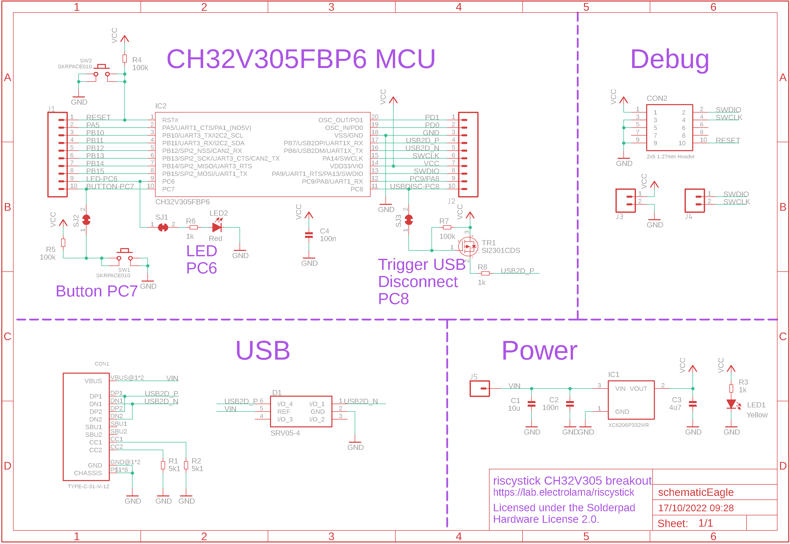
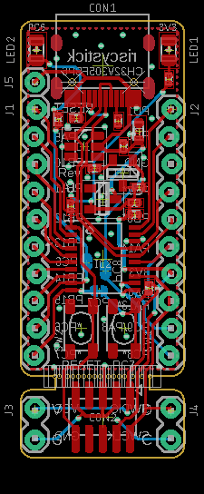

Contents
========

* [PRPR4 > ](#prpr4--)
	* [Schematic](#schematic)
	* [PCB](#pcb)
	* [OOMP Parts](#oomp-parts)
	* [Tags](#tags)

# PRPR4 > 

- ID: PROJ-ELLA-0004-STAN-01
- Hex ID: PRPR4
- Name: riscystick
- Description: riscystick
- Long Link: [http://oom.lt/PROJ-ELLA-0004-STAN-01](http://oom.lt/PROJ-ELLA-0004-STAN-01)
- Short Link: [http://oom.lt/PRPR4](http://oom.lt/PRPR4)

## Schematic
  

## PCB
  

## OOMP Parts
  

|OOMP ID|Name|Identifier|
| :---: | :---: | :---: |
|[CAPC-0603-X-UF10-V63D](https://github.com/oomlout/oomlout_OOMP_parts/tree/main/CAPC-0603-X-UF10-V63D/)|[SMD (0603) 10 uF Capacitor (Ceramic) 6.3v](https://github.com/oomlout/oomlout_OOMP_parts/tree/main/CAPC-0603-X-UF10-V63D/)|[C1](https://github.com/oomlout/oomlout_OOMP_parts/tree/main/CAPC-0603-X-UF10-V63D/)|
|[CAPC-0402-X-NF100-V10](https://github.com/oomlout/oomlout_OOMP_parts/tree/main/CAPC-0402-X-NF100-V10/)|[SMD (0402) 100 nF Capacitor (Ceramic) 10v](https://github.com/oomlout/oomlout_OOMP_parts/tree/main/CAPC-0402-X-NF100-V10/)|[C2, C4](https://github.com/oomlout/oomlout_OOMP_parts/tree/main/CAPC-0402-X-NF100-V10/)|
|CAPC-0402-X-UF47-01||C3|
|UNMATCHED-UNMATCHED-X-UNMATCHED-01||CON1, CON2, IC1, IC2, SJ1, SJ2, SJ3, SW1, SW2, TR1|
|DIOD-UNMATCHED-X-UNMATCHED-01||D1|
|[HEAD-I01-X-PI10-01](https://github.com/oomlout/oomlout_OOMP_parts/tree/main/HEAD-I01-X-PI10-01/)|[2.54 mm 10 Pin Header](https://github.com/oomlout/oomlout_OOMP_parts/tree/main/HEAD-I01-X-PI10-01/)|[J1, J2](https://github.com/oomlout/oomlout_OOMP_parts/tree/main/HEAD-I01-X-PI10-01/)|
|[HEAD-I01-X-PI02-01](https://github.com/oomlout/oomlout_OOMP_parts/tree/main/HEAD-I01-X-PI02-01/)|[2.54 mm 2 Pin Header](https://github.com/oomlout/oomlout_OOMP_parts/tree/main/HEAD-I01-X-PI02-01/)|[J3, J4](https://github.com/oomlout/oomlout_OOMP_parts/tree/main/HEAD-I01-X-PI02-01/)|
|HEAD-I01-X-PI01-01||J5|
|[LEDS-0805-Y-STAN-01](https://github.com/oomlout/oomlout_OOMP_parts/tree/main/LEDS-0805-Y-STAN-01/)|[SMD (0805) Yellow LED](https://github.com/oomlout/oomlout_OOMP_parts/tree/main/LEDS-0805-Y-STAN-01/)|[LED1](https://github.com/oomlout/oomlout_OOMP_parts/tree/main/LEDS-0805-Y-STAN-01/)|
|[LEDS-0805-R-STAN-01](https://github.com/oomlout/oomlout_OOMP_parts/tree/main/LEDS-0805-R-STAN-01/)|[SMD (0805) Red LED](https://github.com/oomlout/oomlout_OOMP_parts/tree/main/LEDS-0805-R-STAN-01/)|[LED2](https://github.com/oomlout/oomlout_OOMP_parts/tree/main/LEDS-0805-R-STAN-01/)|
|RESE-0402-X-UNMATCHED-01||R1, R2|
|[RESE-0402-X-O102-01](https://github.com/oomlout/oomlout_OOMP_parts/tree/main/RESE-0402-X-O102-01/)|[SMD (0402) 1k Ohm Resistor](https://github.com/oomlout/oomlout_OOMP_parts/tree/main/RESE-0402-X-O102-01/)|[R3, R6, R8](https://github.com/oomlout/oomlout_OOMP_parts/tree/main/RESE-0402-X-O102-01/)|
|RESE-0402-X-O1003-01||R4, R5, R7|

## Tags

- oompType: PROJ
- oompSize: ELLA
- oompColor: 0004
- oompDesc: STAN
- oompIndex: 01
- name: riscystick
- gitRepo: https://github.com/electrolama/riscystick
- gitName: riscystick
- eagleBoard: hardware/Revision A1/riscystick-RevA1.brd
- eagleSchem: hardware/Revision A1/riscystick-RevA1.sch
- hexID: PRPR4
- oompID: PROJ-ELLA-0004-STAN-01
- oompParts: C1,CAPC-0603-X-UF10-V63D
- oompParts: C2,CAPC-0402-X-NF100-V10
- oompParts: C3,CAPC-0402-X-UF47-01
- oompParts: C4,CAPC-0402-X-NF100-V10
- oompParts: CON1,UNMATCHED-UNMATCHED-X-UNMATCHED-01
- oompParts: CON2,UNMATCHED-UNMATCHED-X-UNMATCHED-01
- oompParts: D1,DIOD-UNMATCHED-X-UNMATCHED-01
- oompParts: IC1,UNMATCHED-UNMATCHED-X-UNMATCHED-01
- oompParts: IC2,UNMATCHED-UNMATCHED-X-UNMATCHED-01
- oompParts: J1,HEAD-I01-X-PI10-01
- oompParts: J2,HEAD-I01-X-PI10-01
- oompParts: J3,HEAD-I01-X-PI02-01
- oompParts: J4,HEAD-I01-X-PI02-01
- oompParts: J5,HEAD-I01-X-PI01-01
- oompParts: LED1,LEDS-0805-Y-STAN-01
- oompParts: LED2,LEDS-0805-R-STAN-01
- oompParts: R1,RESE-0402-X-UNMATCHED-01
- oompParts: R2,RESE-0402-X-UNMATCHED-01
- oompParts: R3,RESE-0402-X-O102-01
- oompParts: R4,RESE-0402-X-O1003-01
- oompParts: R5,RESE-0402-X-O1003-01
- oompParts: R6,RESE-0402-X-O102-01
- oompParts: R7,RESE-0402-X-O1003-01
- oompParts: R8,RESE-0402-X-O102-01
- oompParts: SJ1,UNMATCHED-UNMATCHED-X-UNMATCHED-01
- oompParts: SJ2,UNMATCHED-UNMATCHED-X-UNMATCHED-01
- oompParts: SJ3,UNMATCHED-UNMATCHED-X-UNMATCHED-01
- oompParts: SW1,UNMATCHED-UNMATCHED-X-UNMATCHED-01
- oompParts: SW2,UNMATCHED-UNMATCHED-X-UNMATCHED-01
- oompParts: TR1,UNMATCHED-UNMATCHED-X-UNMATCHED-01
- rawParts: C1,10u,CAP-0603,_PKG_C_0603,,,,,,C96446,,,,,
- rawParts: C2,100n,CAP-0402,_PKG_C_0402,,,,,,C1525,,,,,
- rawParts: C3,4u7,CAP-0402,_PKG_C_0402,,,,,,C23733,,,,,
- rawParts: C4,100n,CAP-0402,_PKG_C_0402,,,,,,C1525,,,,,
- rawParts: CON1,TYPE-C-31-M-12,USBC_USB-C-12,USBC_C-31-M-12,,,,,,C165948,,,,,
- rawParts: CON2,2x5 1.27mm Header,CON_1.27MM_SMD_2X5_NOSHROUD,PZ127VS-12-10-H10-A38,,,,,,C2935458,,,,,
- rawParts: D1,SRV05-4,DIODE-TVS-SRV05-4,SOT95P280X145-6N,SRV05 Series 4 Ch 3.5 pF 15 Vclamp Steering Diode/TVS Array Combo - SOT-23-6,,,SRV05 Series 4 Ch 3.5 pF 15 Vclamp Steering Diode/TVS Array Combo - SOT-23-6,1.45mm,C558453,ProTek Devices,SRV05-4-P-T7,,,
- rawParts: IC1,XC6206P332MR,POWER-LDO-XC6206P??MR,SOT96P237X111-3N,,,,,,C5446,,,,,
- rawParts: IC2,CH32V305FBP6,MCU-CH32V305F,TSSOP20-WCH,,,,,,,,,,,
- rawParts: J1,,CONN_10LOCK,1X10_LOCK,Multi connection point. Often used as Generic Header-pin footprint for 0.1 inch spaced/style header connections,,,,,,,,,,
- rawParts: J2,,CONN_10LOCK,1X10_LOCK,Multi connection point. Often used as Generic Header-pin footprint for 0.1 inch spaced/style header connections,,,,,,,,,,
- rawParts: J3,,CONN_02LOCK,1X02_LOCK,Multi connection point. Often used as Generic Header-pin footprint for 0.1 inch spaced/style header connections,,,,,,,,,,
- rawParts: J4,,CONN_02LOCK,1X02_LOCK,Multi connection point. Often used as Generic Header-pin footprint for 0.1 inch spaced/style header connections,,,,,,,,,,
- rawParts: J5,,CONN_01,1X01,Single connection point. Often used as Generic Header-pin footprint for 0.1 inch spaced/style header connections,,,,,,,,,,
- rawParts: LED1,Yellow,LED-0805,_PKG_LED_0805,,,,,,C2296,,,,,
- rawParts: LED2,Red,LED-0805,_PKG_LED_0805,,,,,,C84256,,,,,
- rawParts: R1,5k1,RES-0402,_PKG_R_0402,,,,,,C25905,,,,,
- rawParts: R2,5k1,RES-0402,_PKG_R_0402,,,,,,C25905,,,,,
- rawParts: R3,1k,RES-0402,_PKG_R_0402,,,,,,C11702,,,,,
- rawParts: R4,100k,RES-0402,_PKG_R_0402,,,,,,C25741,,,,,
- rawParts: R5,100k,RES-0402,_PKG_R_0402,,,,,,C25741,,,,,
- rawParts: R6,1k,RES-0402,_PKG_R_0402,,,,,,C11702,,,,,
- rawParts: R7,100k,RES-0402,_PKG_R_0402,,,,,,C25741,,,,,
- rawParts: R8,1k,RES-0402,_PKG_R_0402,,,,,,C11702,,,,,
- rawParts: SJ1,,SJ-SHORT,SJ-SHORT,,,,,,,,,,,
- rawParts: SJ2,,SJ-SHORT,SJ-SHORT,,,,,,,,,,,
- rawParts: SJ3,,SJ-SHORT,SJ-SHORT,,,,,,,,,,,
- rawParts: SW1,SKRPACE010,PUSHBUTTON-4.2X3.2MM,PUSHBUTTON-4.2X3.2MM,,,,,,C139797,,,,,
- rawParts: SW2,SKRPACE010,PUSHBUTTON-4.2X3.2MM,PUSHBUTTON-4.2X3.2MM,,,,,,C139797,,,,,
- rawParts: TR1,SI2301CDS,MOSFET-P-SI2301CDS,SOT96P237X111-3N,,,,,,C10487,,,,,
