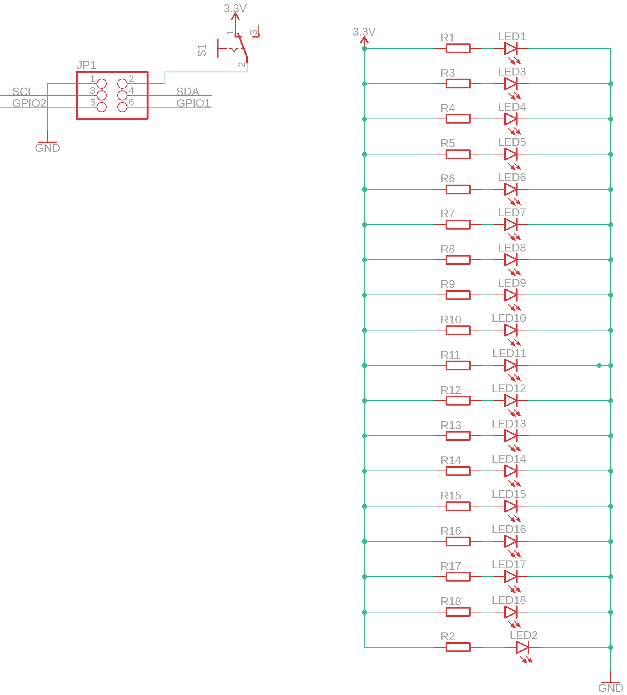
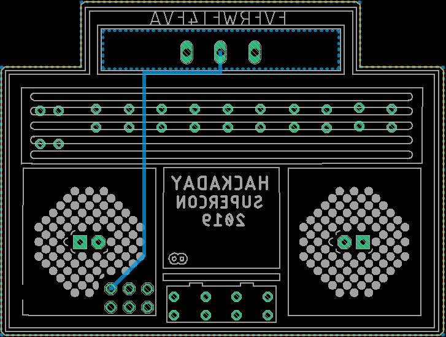

Contents
========

* [PRPR6 > ](#prpr6--)
	* [Schematic](#schematic)
	* [PCB](#pcb)
	* [OOMP Parts](#oomp-parts)
	* [Tags](#tags)

# PRPR6 > 

- ID: PROJ-ELLA-0006-STAN-01
- Hex ID: PRPR6
- Name: disaster01
- Description: disaster01
- Long Link: [http://oom.lt/PROJ-ELLA-0006-STAN-01](http://oom.lt/PROJ-ELLA-0006-STAN-01)
- Short Link: [http://oom.lt/PRPR6](http://oom.lt/PRPR6)

## Schematic
  

## PCB
  

## OOMP Parts
  

|OOMP ID|Name|Identifier|
| :---: | :---: | :---: |
|[HEAD-I01-X-PI2X03-01](https://github.com/oomlout/oomlout_OOMP_parts/tree/main/HEAD-I01-X-PI2X03-01/)|[2.54 mm 6 Pin (2x3) Header](https://github.com/oomlout/oomlout_OOMP_parts/tree/main/HEAD-I01-X-PI2X03-01/)|[JP1](https://github.com/oomlout/oomlout_OOMP_parts/tree/main/HEAD-I01-X-PI2X03-01/)|
|LEDS-UNMATCHED-G-STAN-01||LED1, LED2, LED3, LED4, LED5, LED6, LED7, LED8, LED9, LED10, LED11, LED12, LED13, LED14, LED15, LED16, LED17, LED18|
|RESE-0402-X-UNMATCHED-01||R1, R2, R3, R4, R5, R6, R7, R8, R9, R10, R11, R12, R13, R14, R15, R16, R17, R18|
|UNMATCHED-UNMATCHED-X-UNMATCHED-01||S1|

## Tags

- oompType: PROJ
- oompSize: ELLA
- oompColor: 0006
- oompDesc: STAN
- oompIndex: 01
- name: disaster01
- gitRepo: https://github.com/electrolama/disaster01
- gitName: disaster01
- eagleBoard: disaster01.brd
- eagleSchem: disaster01.sch
- hexID: PRPR6
- oompID: PROJ-ELLA-0006-STAN-01
- oompParts: JP1,HEAD-I01-X-PI2X03-01
- oompParts: LED1,LEDS-UNMATCHED-G-STAN-01
- oompParts: LED2,LEDS-UNMATCHED-G-STAN-01
- oompParts: LED3,LEDS-UNMATCHED-G-STAN-01
- oompParts: LED4,LEDS-UNMATCHED-G-STAN-01
- oompParts: LED5,LEDS-UNMATCHED-G-STAN-01
- oompParts: LED6,LEDS-UNMATCHED-G-STAN-01
- oompParts: LED7,LEDS-UNMATCHED-G-STAN-01
- oompParts: LED8,LEDS-UNMATCHED-G-STAN-01
- oompParts: LED9,LEDS-UNMATCHED-G-STAN-01
- oompParts: LED10,LEDS-UNMATCHED-G-STAN-01
- oompParts: LED11,LEDS-UNMATCHED-G-STAN-01
- oompParts: LED12,LEDS-UNMATCHED-G-STAN-01
- oompParts: LED13,LEDS-UNMATCHED-G-STAN-01
- oompParts: LED14,LEDS-UNMATCHED-G-STAN-01
- oompParts: LED15,LEDS-UNMATCHED-G-STAN-01
- oompParts: LED16,LEDS-UNMATCHED-G-STAN-01
- oompParts: LED17,LEDS-UNMATCHED-G-STAN-01
- oompParts: LED18,LEDS-UNMATCHED-G-STAN-01
- oompParts: R1,RESE-0402-X-UNMATCHED-01
- oompParts: R2,RESE-0402-X-UNMATCHED-01
- oompParts: R3,RESE-0402-X-UNMATCHED-01
- oompParts: R4,RESE-0402-X-UNMATCHED-01
- oompParts: R5,RESE-0402-X-UNMATCHED-01
- oompParts: R6,RESE-0402-X-UNMATCHED-01
- oompParts: R7,RESE-0402-X-UNMATCHED-01
- oompParts: R8,RESE-0402-X-UNMATCHED-01
- oompParts: R9,RESE-0402-X-UNMATCHED-01
- oompParts: R10,RESE-0402-X-UNMATCHED-01
- oompParts: R11,RESE-0402-X-UNMATCHED-01
- oompParts: R12,RESE-0402-X-UNMATCHED-01
- oompParts: R13,RESE-0402-X-UNMATCHED-01
- oompParts: R14,RESE-0402-X-UNMATCHED-01
- oompParts: R15,RESE-0402-X-UNMATCHED-01
- oompParts: R16,RESE-0402-X-UNMATCHED-01
- oompParts: R17,RESE-0402-X-UNMATCHED-01
- oompParts: R18,RESE-0402-X-UNMATCHED-01
- oompParts: S1,UNMATCHED-UNMATCHED-X-UNMATCHED-01
- rawParts: JP1,,PINHD-2X3,2X03,PIN HEADER,62,
- rawParts: LED1,,LED3MM,LED3MM,LED,97,
- rawParts: LED2,,LED10MM,LED10MM,LED,2,
- rawParts: LED3,,LED3MM,LED3MM,LED,97,
- rawParts: LED4,,LED3MM,LED3MM,LED,97,
- rawParts: LED5,,LED3MM,LED3MM,LED,97,
- rawParts: LED6,,LED3MM,LED3MM,LED,97,
- rawParts: LED7,,LED3MM,LED3MM,LED,97,
- rawParts: LED8,,LED3MM,LED3MM,LED,97,
- rawParts: LED9,,LED3MM,LED3MM,LED,97,
- rawParts: LED10,,LED3MM,LED3MM,LED,97,
- rawParts: LED11,,LED3MM,LED3MM,LED,97,
- rawParts: LED12,,LED3MM,LED3MM,LED,97,
- rawParts: LED13,,LED3MM,LED3MM,LED,97,
- rawParts: LED14,,LED3MM,LED3MM,LED,97,
- rawParts: LED15,,LED3MM,LED3MM,LED,97,
- rawParts: LED16,,LED3MM,LED3MM,LED,97,
- rawParts: LED17,,LED3MM,LED3MM,LED,97,
- rawParts: LED18,,LED10MM,LED10MM,LED,2,
- rawParts: R1,,R-EU_R0402,R0402,RESISTOR, European symbol,,
- rawParts: R2,,R-EU_R0402,R0402,RESISTOR, European symbol,,
- rawParts: R3,,R-EU_R0402,R0402,RESISTOR, European symbol,,
- rawParts: R4,,R-EU_R0402,R0402,RESISTOR, European symbol,,
- rawParts: R5,,R-EU_R0402,R0402,RESISTOR, European symbol,,
- rawParts: R6,,R-EU_R0402,R0402,RESISTOR, European symbol,,
- rawParts: R7,,R-EU_R0402,R0402,RESISTOR, European symbol,,
- rawParts: R8,,R-EU_R0402,R0402,RESISTOR, European symbol,,
- rawParts: R9,,R-EU_R0402,R0402,RESISTOR, European symbol,,
- rawParts: R10,,R-EU_R0402,R0402,RESISTOR, European symbol,,
- rawParts: R11,,R-EU_R0402,R0402,RESISTOR, European symbol,,
- rawParts: R12,,R-EU_R0402,R0402,RESISTOR, European symbol,,
- rawParts: R13,,R-EU_R0402,R0402,RESISTOR, European symbol,,
- rawParts: R14,,R-EU_R0402,R0402,RESISTOR, European symbol,,
- rawParts: R15,,R-EU_R0402,R0402,RESISTOR, European symbol,,
- rawParts: R16,,R-EU_R0402,R0402,RESISTOR, European symbol,,
- rawParts: R17,,R-EU_R0402,R0402,RESISTOR, European symbol,,
- rawParts: R18,,R-EU_R0402,R0402,RESISTOR, European symbol,,
- rawParts: S1,,255SB,255SB,SLIDING SWITCH,11,
