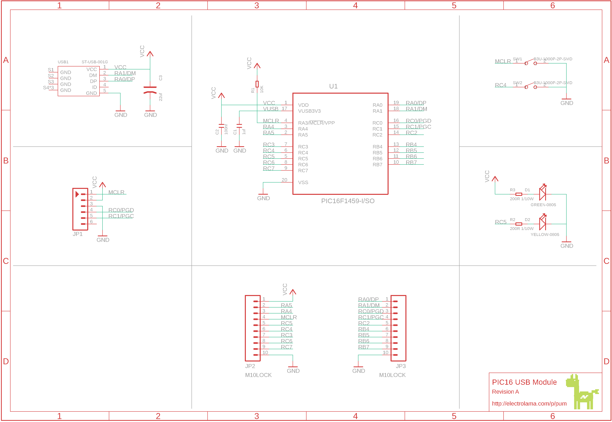
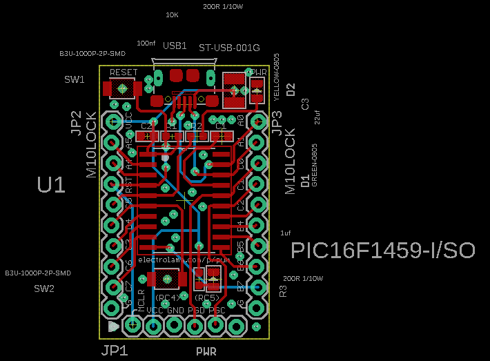

Contents
========

* [PRPR8 > ](#prpr8--)
	* [Schematic](#schematic)
	* [PCB](#pcb)
	* [OOMP Parts](#oomp-parts)
	* [Tags](#tags)

# PRPR8 > 

- ID: PROJ-ELLA-0008-STAN-01
- Hex ID: PRPR8
- Name: pic16-usb-module
- Description: pic16-usb-module
- Long Link: [http://oom.lt/PROJ-ELLA-0008-STAN-01](http://oom.lt/PROJ-ELLA-0008-STAN-01)
- Short Link: [http://oom.lt/PRPR8](http://oom.lt/PRPR8)

## Schematic
  

## PCB
  

## OOMP Parts
  

|OOMP ID|Name|Identifier|
| :---: | :---: | :---: |
|[CAPC-0603-X-UF1-V25](https://github.com/oomlout/oomlout_OOMP_parts/tree/main/CAPC-0603-X-UF1-V25/)|[SMD (0603) 1 uF Capacitor (Ceramic) 25v](https://github.com/oomlout/oomlout_OOMP_parts/tree/main/CAPC-0603-X-UF1-V25/)|[C1](https://github.com/oomlout/oomlout_OOMP_parts/tree/main/CAPC-0603-X-UF1-V25/)|
|[CAPC-0603-X-NF100-V50](https://github.com/oomlout/oomlout_OOMP_parts/tree/main/CAPC-0603-X-NF100-V50/)|[SMD (0603) 100 nF Capacitor (Ceramic) 50v](https://github.com/oomlout/oomlout_OOMP_parts/tree/main/CAPC-0603-X-NF100-V50/)|[C2](https://github.com/oomlout/oomlout_OOMP_parts/tree/main/CAPC-0603-X-NF100-V50/)|
|CAPX-UNMATCHED-X-UF22-01||C3|
|[LEDS-0805-G-STAN-01](https://github.com/oomlout/oomlout_OOMP_parts/tree/main/LEDS-0805-G-STAN-01/)|[SMD (0805) Green LED](https://github.com/oomlout/oomlout_OOMP_parts/tree/main/LEDS-0805-G-STAN-01/)|[D1](https://github.com/oomlout/oomlout_OOMP_parts/tree/main/LEDS-0805-G-STAN-01/)|
|[LEDS-0805-Y-STAN-01](https://github.com/oomlout/oomlout_OOMP_parts/tree/main/LEDS-0805-Y-STAN-01/)|[SMD (0805) Yellow LED](https://github.com/oomlout/oomlout_OOMP_parts/tree/main/LEDS-0805-Y-STAN-01/)|[D2](https://github.com/oomlout/oomlout_OOMP_parts/tree/main/LEDS-0805-Y-STAN-01/)|
|[HEAD-I01-X-PI06-01](https://github.com/oomlout/oomlout_OOMP_parts/tree/main/HEAD-I01-X-PI06-01/)|[2.54 mm 6 Pin Header](https://github.com/oomlout/oomlout_OOMP_parts/tree/main/HEAD-I01-X-PI06-01/)|[JP1](https://github.com/oomlout/oomlout_OOMP_parts/tree/main/HEAD-I01-X-PI06-01/)|
|[HEAD-I01-X-PI10-01](https://github.com/oomlout/oomlout_OOMP_parts/tree/main/HEAD-I01-X-PI10-01/)|[2.54 mm 10 Pin Header](https://github.com/oomlout/oomlout_OOMP_parts/tree/main/HEAD-I01-X-PI10-01/)|[JP2, JP3](https://github.com/oomlout/oomlout_OOMP_parts/tree/main/HEAD-I01-X-PI10-01/)|
|[RESE-0603-X-O103-01](https://github.com/oomlout/oomlout_OOMP_parts/tree/main/RESE-0603-X-O103-01/)|[SMD (0603) 10k Ohm Resistor](https://github.com/oomlout/oomlout_OOMP_parts/tree/main/RESE-0603-X-O103-01/)|[R1](https://github.com/oomlout/oomlout_OOMP_parts/tree/main/RESE-0603-X-O103-01/)|
|RESE-0603-X-UNMATCHED-01||R2, R3|
|UNMATCHED-UNMATCHED-X-UNMATCHED-01||SW1, SW2, U1, USB1|

## Tags

- oompType: PROJ
- oompSize: ELLA
- oompColor: 0008
- oompDesc: STAN
- oompIndex: 01
- name: pic16-usb-module
- gitRepo: https://github.com/electrolama/pic16-usb-module
- gitName: pic16-usb-module
- eagleBoard: pum.brd
- eagleSchem: pum.sch
- hexID: PRPR8
- oompID: PROJ-ELLA-0008-STAN-01
- oompParts: C1,CAPC-0603-X-UF1-V25
- oompParts: C2,CAPC-0603-X-NF100-V50
- oompParts: C3,CAPX-UNMATCHED-X-UF22-01
- oompParts: D1,LEDS-0805-G-STAN-01
- oompParts: D2,LEDS-0805-Y-STAN-01
- oompParts: JP1,HEAD-I01-X-PI06-01
- oompParts: JP2,HEAD-I01-X-PI10-01
- oompParts: JP3,HEAD-I01-X-PI10-01
- oompParts: R1,RESE-0603-X-O103-01
- oompParts: R2,RESE-0603-X-UNMATCHED-01
- oompParts: R3,RESE-0603-X-UNMATCHED-01
- oompParts: SW1,UNMATCHED-UNMATCHED-X-UNMATCHED-01
- oompParts: SW2,UNMATCHED-UNMATCHED-X-UNMATCHED-01
- oompParts: U1,UNMATCHED-UNMATCHED-X-UNMATCHED-01
- oompParts: USB1,UNMATCHED-UNMATCHED-X-UNMATCHED-01
- rawParts: C1,1uf,CERAMIC-1UF-25V-10%-X7R(0603),C0603,302010139,CC0603KRX7R8BB105,,,,,1uf,
- rawParts: C2,100nf,CERAMIC-100NF-50V-10%-X7R(0603),C0603,302010138,CC0603KRX7R9BB104,,,,,100nf,
- rawParts: C3,22uf,TANTALUM-SMD-22UF-16V(AVX-B),AVX-B,302020013,TAJB226*016#NJ,,,,,22uf,
- rawParts: D1,GREEN-0805,SMD-LED-CLEAR-GREEN(0805),LED-0805,304090057,17-215SYGC/S530-E2/TR8,,,,,GREEN-0805,
- rawParts: D2,YELLOW-0805,SMD-LED-CLEAR-YELLOW(0805),LED-0805,304090039,17-215UYC/S530-A3/TR8,,,,,YELLOW-0805,
- rawParts: JP1,,M06LOCK,1X06_LOCK,Header 6,,,,,,,
- rawParts: JP2,M10LOCK,M10LOCK,1X10_LOCK,Header 10,,,,,,,
- rawParts: JP3,M10LOCK,M10LOCK,1X10_LOCK,Header 10,,,,,,,
- rawParts: R1,10K,SMD-RES-10K-1%-1/10W(0603),R0603,301010299,RC0603FR-0710KL,,,,,10K,
- rawParts: R2,200R 1/10W,SMD-RES-200R-5%-1/10W(0603),R0603,301010218,RC0603JR-07200RL,,,,,200R 1/10W,
- rawParts: R3,200R 1/10W,SMD-RES-200R-5%-1/10W(0603),R0603,301010218,RC0603JR-07200RL,,,,,200R 1/10W,
- rawParts: SW1,B3U-1000P-2P-SMD,SMD-BUTTON(2P-3.0X2.5X1.2+0.4MM)-B3U-1000P-2P-SMD,SW2-2.6-3.0X2.5X1.2+0.4MM,311020047,B3U-1000P-2P-SMD,,,,,B3U-1000P-2P-SMD,
- rawParts: SW2,B3U-1000P-2P-SMD,SMD-BUTTON(2P-3.0X2.5X1.2+0.4MM)-B3U-1000P-2P-SMD,SW2-2.6-3.0X2.5X1.2+0.4MM,311020047,B3U-1000P-2P-SMD,,,,,B3U-1000P-2P-SMD,
- rawParts: U1,PIC16F1459-I/SO,PIC16F1459-I/SO,SOIC127P1030X265-20N,8-Bit USB Microcontrollers,SOIC-20,PIC16F1459-I/SO,2305817,83T7220,SOIC-20,MICROCHIP,,
- rawParts: USB1,ST-USB-001G,MICRO-USB-SMD-B-WITHOUT-POST-W/P(ST-USB-001G),MICRO-USB5+4P-SMD-0.65-B,320010000,ST-USB-001G,,,,,ST-USB-001G,
