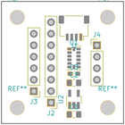
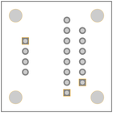
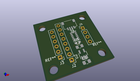
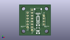
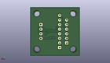
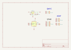

Contents
========

* [PRI1 > ](#pri1--)
	* [Interactive BOM](#interactive-bom)
	* [OOMP Parts](#oomp-parts)
	* [Images](#images)
	* [Tags](#tags)
  
![][im]
# PRI1 > 

- ID: PROJ-IBBC-0001-STAN-01
- Hex ID: PRI1
- Name: ADXL345 Breakout
- Description: ADXL345 Breakout
- Long Link: [http://oom.lt/PROJ-IBBC-0001-STAN-01](http://oom.lt/PROJ-IBBC-0001-STAN-01)
- Short Link: [http://oom.lt/PRI1](http://oom.lt/PRI1)

## Interactive BOM

- Interactive BOM page: [ibom.html](https://htmlpreview.github.io/?https://github.com/oomlout/oomlout_OOMP_projects/blob/main/PROJ-IBBC-0001-STAN-01/kicad/bom/ibom.html)

## OOMP Parts
  

|OOMP ID|Name|Identifier|
| :---: | :---: | :---: |
|[VREG-SO235-X-KAP2112K-V33D](https://github.com/oomlout/oomlout_OOMP_parts/tree/main/VREG-SO235-X-KAP2112K-V33D/)|[SMD (SOT-23-5) AP2112K Voltage Regulator 3.3v](https://github.com/oomlout/oomlout_OOMP_parts/tree/main/VREG-SO235-X-KAP2112K-V33D/)|[U2](https://github.com/oomlout/oomlout_OOMP_parts/tree/main/VREG-SO235-X-KAP2112K-V33D/)|
|[HEAD-JSTSH-X-PI04-RS](https://github.com/oomlout/oomlout_OOMP_parts/tree/main/HEAD-JSTSH-X-PI04-RS/)|[JST XH (1 mm) 4 Pin Header Right Angle (SMD)](https://github.com/oomlout/oomlout_OOMP_parts/tree/main/HEAD-JSTSH-X-PI04-RS/)|[J1](https://github.com/oomlout/oomlout_OOMP_parts/tree/main/HEAD-JSTSH-X-PI04-RS/)|
|[HEAD-I01-X-PI08-01](https://github.com/oomlout/oomlout_OOMP_parts/tree/main/HEAD-I01-X-PI08-01/)|[2.54 mm 8 Pin Header](https://github.com/oomlout/oomlout_OOMP_parts/tree/main/HEAD-I01-X-PI08-01/)|[J2](https://github.com/oomlout/oomlout_OOMP_parts/tree/main/HEAD-I01-X-PI08-01/)|
|[CAPC-0603-X-NF100-V50](https://github.com/oomlout/oomlout_OOMP_parts/tree/main/CAPC-0603-X-NF100-V50/)|[SMD (0603) 100 nF Capacitor (Ceramic) 50v](https://github.com/oomlout/oomlout_OOMP_parts/tree/main/CAPC-0603-X-NF100-V50/)|[C3](https://github.com/oomlout/oomlout_OOMP_parts/tree/main/CAPC-0603-X-NF100-V50/)|
|[CAPC-0805-X-UF10-V10](https://github.com/oomlout/oomlout_OOMP_parts/tree/main/CAPC-0805-X-UF10-V10/)|[SMD (0805) 10 uF Capacitor (Ceramic) 10v](https://github.com/oomlout/oomlout_OOMP_parts/tree/main/CAPC-0805-X-UF10-V10/)|[C2, C1](https://github.com/oomlout/oomlout_OOMP_parts/tree/main/CAPC-0805-X-UF10-V10/)|
|[HEAD-I01-X-PI06-01](https://github.com/oomlout/oomlout_OOMP_parts/tree/main/HEAD-I01-X-PI06-01/)|[2.54 mm 6 Pin Header](https://github.com/oomlout/oomlout_OOMP_parts/tree/main/HEAD-I01-X-PI06-01/)|[J3](https://github.com/oomlout/oomlout_OOMP_parts/tree/main/HEAD-I01-X-PI06-01/)|
|[SENS-LG14-X-K345-01](https://github.com/oomlout/oomlout_OOMP_parts/tree/main/SENS-LG14-X-K345-01/)|[14 Pin SMD (LGA) Digital Accelerometer (ADXL345) Sensor](https://github.com/oomlout/oomlout_OOMP_parts/tree/main/SENS-LG14-X-K345-01/)|[U1](https://github.com/oomlout/oomlout_OOMP_parts/tree/main/SENS-LG14-X-K345-01/)|
|[HEAD-I01-X-PI04-01](https://github.com/oomlout/oomlout_OOMP_parts/tree/main/HEAD-I01-X-PI04-01/)|[2.54 mm 4 Pin Header](https://github.com/oomlout/oomlout_OOMP_parts/tree/main/HEAD-I01-X-PI04-01/)|[J4](https://github.com/oomlout/oomlout_OOMP_parts/tree/main/HEAD-I01-X-PI04-01/)|

## Images
  
  

|bominteractivefront|bominteractiveback|kicadPcb3d|kicadPcb3dFront|kicadPcb3dBack|kicadschem|
| :---: | :---: | :---: | :---: | :---: | :---: |
|||||||

## Tags

- oompType: PROJ
- oompSize: IBBC
- oompColor: 0001
- oompDesc: STAN
- oompIndex: 01
- name: ADXL345 Breakout
- gitRepo: https://github.com/oomlout/IBBC_0001
- gitName: IBBC_0001
- kicadBoard: working/IBBC_0001/IBBC_0001.kicad_pcb
- kicadSchem: working/IBBC_0001/IBBC_0001.kicad_sch
- hexID: PRI1
- oompID: PROJ-IBBC-0001-STAN-01
- oompParts: U2,VREG-SO235-X-KAP2112K-V33D
- oompParts: J1,HEAD-JSTSH-X-PI04-RS
- oompParts: J2,HEAD-I01-X-PI08-01
- oompParts: C3,CAPC-0603-X-NF100-V50
- oompParts: C2,CAPC-0805-X-UF10-V10
- oompParts: C1,CAPC-0805-X-UF10-V10
- oompParts: J3,HEAD-I01-X-PI06-01
- oompParts: U1,SENS-LG14-X-K345-01
- oompParts: J4,HEAD-I01-X-PI04-01
- rawParts: U2,AP2112K-3.3,SOT-23-5_HandSoldering,SOT-23-5_HandSoldering,,,,
- rawParts: J1,Conn_01x04,JST_SH_SM04B-SRSS-TB_1x04-1MP_P1.00mm_Horizontal,JST_SH_SM04B-SRSS-TB_1x04-1MP_P1.00mm_Horizontal,,,,
- rawParts: J2,Conn_01x08,PinHeader_1x08_P2.54mm_Vertical,PinHeader_1x08_P2.54mm_Vertical,,,,
- rawParts: C3,100nf,C_0603_1608Metric_Pad1.08x0.95mm_HandSolder,C_0603_1608Metric_Pad1.08x0.95mm_HandSolder,,,,
- rawParts: C2,10uf,C_0805_2012Metric_Pad1.18x1.45mm_HandSolder,C_0805_2012Metric_Pad1.18x1.45mm_HandSolder,,,,
- rawParts: C1,10uf,C_0805_2012Metric_Pad1.18x1.45mm_HandSolder,C_0805_2012Metric_Pad1.18x1.45mm_HandSolder,,,,
- rawParts: J3,Conn_01x06,PinHeader_1x06_P2.54mm_Vertical,PinHeader_1x06_P2.54mm_Vertical,,,,
- rawParts: U1,ADXL343,LGA-14_3x5mm_P0.8mm_LayoutBorder1x6y,LGA-14_3x5mm_P0.8mm_LayoutBorder1x6y,,,,
- rawParts: J4,Conn_01x04,PinHeader_1x04_P2.54mm_Vertical,PinHeader_1x04_P2.54mm_Vertical,,,,

[im]: kicadPcb3d_450.png
