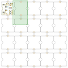
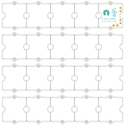
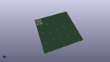
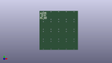
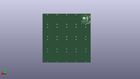
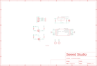

Contents
========

* [PRS20054 > ](#prs20054--)
	* [Schematic](#schematic)
	* [Interactive BOM](#interactive-bom)
	* [OOMP Parts](#oomp-parts)
	* [Images](#images)
	* [Tags](#tags)
  
![][im]
# PRS20054 > 

- ID: PROJ-SEED-20054-STAN-01
- Hex ID: PRS20054
- Name: Grove - ADXL345 - 3-Axis Digital Accelerometer(+/-16g)
- Description: Grove - ADXL345 - 3-Axis Digital Accelerometer(+/-16g)
- Long Link: [http://oom.lt/PROJ-SEED-20054-STAN-01](http://oom.lt/PROJ-SEED-20054-STAN-01)
- Short Link: [http://oom.lt/PRS20054](http://oom.lt/PRS20054)

## Schematic
  

## Interactive BOM

- Interactive BOM page: [ibom.html](https://htmlpreview.github.io/?https://github.com/oomlout/oomlout_OOMP_projects/blob/main/PROJ-SEED-20054-STAN-01/kicad/bom/ibom.html)

## OOMP Parts
  

|OOMP ID|Name|Identifier|
| :---: | :---: | :---: |
|[CAPC-0805-X-UF10-V10](https://github.com/oomlout/oomlout_OOMP_parts/tree/main/CAPC-0805-X-UF10-V10/)|[SMD (0805) 10 uF Capacitor (Ceramic) 10v](https://github.com/oomlout/oomlout_OOMP_parts/tree/main/CAPC-0805-X-UF10-V10/)|[C5, C6](https://github.com/oomlout/oomlout_OOMP_parts/tree/main/CAPC-0805-X-UF10-V10/)|
|UNMATCHED-UNMATCHED-X-UNMATCHED-01||J1, P1, P4, P5, P6, TP1, TP2, TP3, TP4|
|UNMATCHED-SO23-X-UNMATCHED-01||Q1, Q2, U5|
|[RESE-0603-X-O472-01](https://github.com/oomlout/oomlout_OOMP_parts/tree/main/RESE-0603-X-O472-01/)|[SMD (0603) 4.7k Ohm Resistor](https://github.com/oomlout/oomlout_OOMP_parts/tree/main/RESE-0603-X-O472-01/)|[R2, R3, R4, R5](https://github.com/oomlout/oomlout_OOMP_parts/tree/main/RESE-0603-X-O472-01/)|
|[SENS-LG14-X-K345-01](https://github.com/oomlout/oomlout_OOMP_parts/tree/main/SENS-LG14-X-K345-01/)|[14 Pin SMD (LGA) Digital Accelerometer (ADXL345) Sensor](https://github.com/oomlout/oomlout_OOMP_parts/tree/main/SENS-LG14-X-K345-01/)|[U1](https://github.com/oomlout/oomlout_OOMP_parts/tree/main/SENS-LG14-X-K345-01/)|

## Images
  
  

|bominteractivefront|bominteractiveback|kicadPcb3d|kicadPcb3dFront|kicadPcb3dBack|eagleSchemImage|
| :---: | :---: | :---: | :---: | :---: | :---: |
|||||||

## Tags

- oompType: PROJ
- oompSize: SEED
- oompColor: 20054
- oompDesc: STAN
- oompIndex: 01
- name: Grove - ADXL345 - 3-Axis Digital Accelerometer(+/-16g)
- gitName: 
- hexID: PRS20054
- oompID: PROJ-SEED-20054-STAN-01
- oompParts: C5,CAPC-0805-X-UF10-V10
- oompParts: C6,CAPC-0805-X-UF10-V10
- oompParts: J1,UNMATCHED-UNMATCHED-X-UNMATCHED-01
- oompParts: P1,UNMATCHED-UNMATCHED-X-UNMATCHED-01
- oompParts: P4,UNMATCHED-UNMATCHED-X-UNMATCHED-01
- oompParts: P5,UNMATCHED-UNMATCHED-X-UNMATCHED-01
- oompParts: P6,UNMATCHED-UNMATCHED-X-UNMATCHED-01
- oompParts: Q1,UNMATCHED-SO23-X-UNMATCHED-01
- oompParts: Q2,UNMATCHED-SO23-X-UNMATCHED-01
- oompParts: R2,RESE-0603-X-O472-01
- oompParts: R3,RESE-0603-X-O472-01
- oompParts: R4,RESE-0603-X-O472-01
- oompParts: R5,RESE-0603-X-O472-01
- oompParts: TP1,UNMATCHED-UNMATCHED-X-UNMATCHED-01
- oompParts: TP2,UNMATCHED-UNMATCHED-X-UNMATCHED-01
- oompParts: TP3,UNMATCHED-UNMATCHED-X-UNMATCHED-01
- oompParts: TP4,UNMATCHED-UNMATCHED-X-UNMATCHED-01
- oompParts: U1,SENS-LG14-X-K345-01
- oompParts: U5,UNMATCHED-SO23-X-UNMATCHED-01
- rawParts: C5,10uF,C-0805,C0805,Ceramic Capacitors,,
- rawParts: C6,10uF,C-0805,C0805,Ceramic Capacitors,,
- rawParts: C7,DNP,CAP-AVX-A,AVX-A,Electrolytic Capacitors,Tantalum Capacitors and Super Capacitors,,
- rawParts: J1,SMD Grove,TWIG-4P-2.0-SMD-FEMALE-REINFORCEDD,4P-SMD-2.0,,,
- rawParts: P1,,PAD-MARKANNULAR,ROUND-MARK-1.0,,DNP,
- rawParts: P2,DNP,PAD60/30,1P-65/35MIL,,,
- rawParts: P3,DNP,PAD60/30,1P-65/35MIL,,,
- rawParts: P4,,PAD-MARKANNULAR,ROUND-MARK-1.0,,DNP,
- rawParts: P5,,PAD-MARKANNULAR,ROUND-MARK-1.0,,DNP,
- rawParts: P6,,PAD-MARKANNULAR,ROUND-MARK-1.0,,DNP,
- rawParts: Q1,2N7002,MOSFET-NSOT23,SOT23,IRLL014:,,
- rawParts: Q2,2N7002,MOSFET-NSOT23,SOT23,IRLL014:,,
- rawParts: R2,4.7K,R-0603,R0603,,,
- rawParts: R3,4.7K,R-0603,R0603,,,
- rawParts: R4,4.7K,R-0603,R0603,,,
- rawParts: R5,4.7K,R-0603,R0603,,,
- rawParts: TP1,,PAD-TEST-POINT4545,TP_4545,,DNP,
- rawParts: TP2,,PAD-TEST-POINT4545,TP_4545,,DNP,
- rawParts: TP3,,PAD-TEST-POINT4545,TP_4545,,DNP,
- rawParts: TP4,,PAD-TEST-POINT4545,TP_4545,,DNP,
- rawParts: U1,ADXL345,ADXL345,LGA14,3-Axis,+/-2g / +/-4g / +/-8g / +/-16g Digital Accelerometer,,
- rawParts: U5,XC6206P252MR-G,XC6206MR,SOT23,LOW ESR Cap.Compatible Positive Voltage Regulators,,

[im]: kicadPcb3d_450.png
