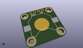
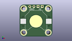
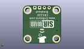
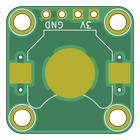
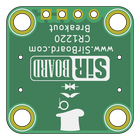

Contents
========

* [PRPR1 > ](#prpr1--)
	* [Interactive BOM](#interactive-bom)
	* [OOMP Parts](#oomp-parts)
	* [Images](#images)
	* [Tags](#tags)
  
![][im]
# PRPR1 > 

- ID: PROJ-SIRB-0001-STAN-01
- Hex ID: PRPR1
- Name: CR1220 Breakout Board (sirboard)
- Description: CR1220 Breakout Board (sirboard)
- Long Link: [http://oom.lt/PROJ-SIRB-0001-STAN-01](http://oom.lt/PROJ-SIRB-0001-STAN-01)
- Short Link: [http://oom.lt/PRPR1](http://oom.lt/PRPR1)

## Interactive BOM

- Interactive BOM page: [ibom.html](https://htmlpreview.github.io/?https://github.com/oomlout/oomlout_OOMP_projects/blob/main/PROJ-SIRB-0001-STAN-01/kicad/bom/ibom.html)

## OOMP Parts
  

|OOMP ID|Name|Identifier|
| :---: | :---: | :---: |
|[HEAD-I01-X-PI04-01](https://github.com/oomlout/oomlout_OOMP_parts/tree/main/HEAD-I01-X-PI04-01/)|[2.54 mm 4 Pin Header](https://github.com/oomlout/oomlout_OOMP_parts/tree/main/HEAD-I01-X-PI04-01/)|[J1](https://github.com/oomlout/oomlout_OOMP_parts/tree/main/HEAD-I01-X-PI04-01/)|
|UNMATCHED-UNMATCHED-X-UNMATCHED-01||BT1|

## Images
  
  

|kicadPcb3d|kicadPcb3dFront|kicadPcb3dBack|pcbdraw|pcbdrawback|
| :---: | :---: | :---: | :---: | :---: |
||||||

## Tags

- oompType: PROJ
- oompSize: SIRB
- oompColor: 0001
- oompDesc: STAN
- oompIndex: 01
- name: CR1220 Breakout Board (sirboard)
- gitRepo: https://github.com/sirboard/BreakoutBoards
- gitName: BreakoutBoards
- kicadBoard: CR1220/CR1220.kicad_pcb
- kicadSchem: CR1220/CR1220.kicad_sch
- hexID: PRPR1
- oompID: PROJ-SIRB-0001-STAN-01
- oompParts: J1,HEAD-I01-X-PI04-01
- oompParts: BT1,UNMATCHED-UNMATCHED-X-UNMATCHED-01
- rawParts: G***,LOGO,SirBoard127x40,SirBoard127x40,,,,
- rawParts: G***,LOGO,logo76x107,logo76x107,,,,
- rawParts: J1,Conn_01x04,PinHeader_1x04_P2.54mm_Vertical,PinHeader_1x04_P2.54mm_Vertical,,,,
- rawParts: BT1,Battery_Cell,BatteryHolder_Keystone_3000_1x12mm,BatteryHolder_Keystone_3000_1x12mm,,,,

[im]: kicadPcb3d_450.png
