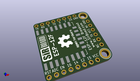
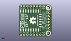
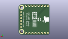
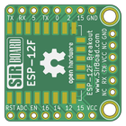
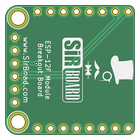

Contents
========

* [PRPR3 > ](#prpr3--)
	* [Interactive BOM](#interactive-bom)
	* [OOMP Parts](#oomp-parts)
	* [Images](#images)
	* [Tags](#tags)
  
![][im]
# PRPR3 > 

- ID: PROJ-SIRB-0003-STAN-01
- Hex ID: PRPR3
- Name: ESP-12F Breakout Board (sirboard)
- Description: ESP-12F Breakout Board (sirboard)
- Long Link: [http://oom.lt/PROJ-SIRB-0003-STAN-01](http://oom.lt/PROJ-SIRB-0003-STAN-01)
- Short Link: [http://oom.lt/PRPR3](http://oom.lt/PRPR3)

## Interactive BOM

- Interactive BOM page: [ibom.html](https://htmlpreview.github.io/?https://github.com/oomlout/oomlout_OOMP_projects/blob/main/PROJ-SIRB-0003-STAN-01/kicad/bom/ibom.html)

## OOMP Parts
  

|OOMP ID|Name|Identifier|
| :---: | :---: | :---: |
|UNMATCHED-UNMATCHED-X-UNMATCHED-01||ESP-12F|
|[HEAD-I01-X-PI06-01](https://github.com/oomlout/oomlout_OOMP_parts/tree/main/HEAD-I01-X-PI06-01/)|[2.54 mm 6 Pin Header](https://github.com/oomlout/oomlout_OOMP_parts/tree/main/HEAD-I01-X-PI06-01/)|[J3](https://github.com/oomlout/oomlout_OOMP_parts/tree/main/HEAD-I01-X-PI06-01/)|
|[HEAD-I01-X-PI08-01](https://github.com/oomlout/oomlout_OOMP_parts/tree/main/HEAD-I01-X-PI08-01/)|[2.54 mm 8 Pin Header](https://github.com/oomlout/oomlout_OOMP_parts/tree/main/HEAD-I01-X-PI08-01/)|[J1, J2](https://github.com/oomlout/oomlout_OOMP_parts/tree/main/HEAD-I01-X-PI08-01/)|

## Images
  
  

|kicadPcb3d|kicadPcb3dFront|kicadPcb3dBack|pcbdraw|pcbdrawback|
| :---: | :---: | :---: | :---: | :---: |
||||||

## Tags

- oompType: PROJ
- oompSize: SIRB
- oompColor: 0003
- oompDesc: STAN
- oompIndex: 01
- name: ESP-12F Breakout Board (sirboard)
- gitRepo: https://github.com/sirboard/BreakoutBoards
- gitName: BreakoutBoards
- kicadBoard: ESP-12F/ESP-12F.kicad_pcb
- kicadSchem: ESP-12F/ESP-12F.kicad_sch
- hexID: PRPR3
- oompID: PROJ-SIRB-0003-STAN-01
- oompParts: ESP-12F,UNMATCHED-UNMATCHED-X-UNMATCHED-01
- oompParts: J3,HEAD-I01-X-PI06-01
- oompParts: J1,HEAD-I01-X-PI08-01
- oompParts: J2,HEAD-I01-X-PI08-01
- rawParts: ESP-12F,ESP-12F,ESP-12E,ESP-12E,,,,
- rawParts: G***,LOGO,SirBoard112x35,SirBoard112x35,,,,
- rawParts: J3,Conn_01x06,PinHeader_1x06_P2.54mm_Horizontal,PinHeader_1x06_P2.54mm_Horizontal,,,,
- rawParts: G***,LOGO,SirBoard127x40,SirBoard127x40,,,,
- rawParts: G***,LOGO,logo94x134,logo94x134,,,,
- rawParts: J1,Conn_01x08,PinHeader_1x08_P2.54mm_Vertical,PinHeader_1x08_P2.54mm_Vertical,,,,
- rawParts: J2,Conn_01x08,PinHeader_1x08_P2.54mm_Vertical,PinHeader_1x08_P2.54mm_Vertical,,,,

[im]: kicadPcb3d_450.png
