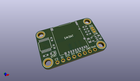
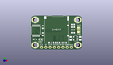
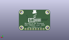
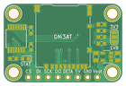
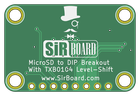

Contents
========

* [PRPR5 > ](#prpr5--)
	* [Interactive BOM](#interactive-bom)
	* [OOMP Parts](#oomp-parts)
	* [Images](#images)
	* [Tags](#tags)
  
![][im]
# PRPR5 > 

- ID: PROJ-SIRB-0005-STAN-01
- Hex ID: PRPR5
- Name: MicroSD_DualVoltage Breakout Board (sirboard)
- Description: MicroSD_DualVoltage Breakout Board (sirboard)
- Long Link: [http://oom.lt/PROJ-SIRB-0005-STAN-01](http://oom.lt/PROJ-SIRB-0005-STAN-01)
- Short Link: [http://oom.lt/PRPR5](http://oom.lt/PRPR5)

## Interactive BOM

- Interactive BOM page: [ibom.html](https://htmlpreview.github.io/?https://github.com/oomlout/oomlout_OOMP_projects/blob/main/PROJ-SIRB-0005-STAN-01/kicad/bom/ibom.html)

## OOMP Parts
  

|OOMP ID|Name|Identifier|
| :---: | :---: | :---: |
|UNMATCHED-UNMATCHED-X-UNMATCHED-01||DM3AT, U2|
|[RESE-0603-X-O103-01](https://github.com/oomlout/oomlout_OOMP_parts/tree/main/RESE-0603-X-O103-01/)|[SMD (0603) 10k Ohm Resistor](https://github.com/oomlout/oomlout_OOMP_parts/tree/main/RESE-0603-X-O103-01/)|[R4, R3](https://github.com/oomlout/oomlout_OOMP_parts/tree/main/RESE-0603-X-O103-01/)|
|[CAPC-0805-X-UF10-V10](https://github.com/oomlout/oomlout_OOMP_parts/tree/main/CAPC-0805-X-UF10-V10/)|[SMD (0805) 10 uF Capacitor (Ceramic) 10v](https://github.com/oomlout/oomlout_OOMP_parts/tree/main/CAPC-0805-X-UF10-V10/)|[C2, C1](https://github.com/oomlout/oomlout_OOMP_parts/tree/main/CAPC-0805-X-UF10-V10/)|
|UNMATCHED-SO235-X-UNMATCHED-01||U1|
|RESE-0603-X-UNMATCHED-01||R1, R2|
|[HEAD-I01-X-PI08-01](https://github.com/oomlout/oomlout_OOMP_parts/tree/main/HEAD-I01-X-PI08-01/)|[2.54 mm 8 Pin Header](https://github.com/oomlout/oomlout_OOMP_parts/tree/main/HEAD-I01-X-PI08-01/)|[J1](https://github.com/oomlout/oomlout_OOMP_parts/tree/main/HEAD-I01-X-PI08-01/)|
|[RESE-0603-X-O102-01](https://github.com/oomlout/oomlout_OOMP_parts/tree/main/RESE-0603-X-O102-01/)|[SMD (0603) 1k Ohm Resistor](https://github.com/oomlout/oomlout_OOMP_parts/tree/main/RESE-0603-X-O102-01/)|[R6](https://github.com/oomlout/oomlout_OOMP_parts/tree/main/RESE-0603-X-O102-01/)|
|[LEDS-0603-G-STAN-01](https://github.com/oomlout/oomlout_OOMP_parts/tree/main/LEDS-0603-G-STAN-01/)|[SMD (0603) Green LED](https://github.com/oomlout/oomlout_OOMP_parts/tree/main/LEDS-0603-G-STAN-01/)|[STAT](https://github.com/oomlout/oomlout_OOMP_parts/tree/main/LEDS-0603-G-STAN-01/)|
|[CAPC-0603-X-NF100-V50](https://github.com/oomlout/oomlout_OOMP_parts/tree/main/CAPC-0603-X-NF100-V50/)|[SMD (0603) 100 nF Capacitor (Ceramic) 50v](https://github.com/oomlout/oomlout_OOMP_parts/tree/main/CAPC-0603-X-NF100-V50/)|[C4, C3](https://github.com/oomlout/oomlout_OOMP_parts/tree/main/CAPC-0603-X-NF100-V50/)|

## Images
  
  

|kicadPcb3d|kicadPcb3dFront|kicadPcb3dBack|pcbdraw|pcbdrawback|
| :---: | :---: | :---: | :---: | :---: |
||||||

## Tags

- oompType: PROJ
- oompSize: SIRB
- oompColor: 0005
- oompDesc: STAN
- oompIndex: 01
- name: MicroSD_DualVoltage Breakout Board (sirboard)
- gitRepo: https://github.com/sirboard/BreakoutBoards
- gitName: BreakoutBoards
- kicadBoard: MicroSD_DualVoltage/MicroSD_DualVoltage.kicad_pcb
- kicadSchem: MicroSD_DualVoltage/MicroSD_DualVoltage.kicad_sch
- hexID: PRPR5
- oompID: PROJ-SIRB-0005-STAN-01
- oompParts: DM3AT,UNMATCHED-UNMATCHED-X-UNMATCHED-01
- oompParts: R4,RESE-0603-X-O103-01
- oompParts: R3,RESE-0603-X-O103-01
- oompParts: C2,CAPC-0805-X-UF10-V10
- oompParts: C1,CAPC-0805-X-UF10-V10
- oompParts: U1,UNMATCHED-SO235-X-UNMATCHED-01
- oompParts: R1,RESE-0603-X-UNMATCHED-01
- oompParts: R2,RESE-0603-X-UNMATCHED-01
- oompParts: J1,HEAD-I01-X-PI08-01
- oompParts: R6,RESE-0603-X-O102-01
- oompParts: STAT,LEDS-0603-G-STAN-01
- oompParts: U2,UNMATCHED-UNMATCHED-X-UNMATCHED-01
- oompParts: C4,CAPC-0603-X-NF100-V50
- oompParts: C3,CAPC-0603-X-NF100-V50
- rawParts: G***,LOGO,SirBoard127x40,SirBoard127x40,,,,
- rawParts: G***,LOGO,logo76x107,logo76x107,,,,
- rawParts: DM3AT,Micro_SD_Card_Det,microSD_HC_Hirose_DM3AT-SF-PEJM5,microSD_HC_Hirose_DM3AT-SF-PEJM5,,,,
- rawParts: R4,10K,R_0603_1608Metric,R_0603_1608Metric,,,,
- rawParts: R3,10K,R_0603_1608Metric,R_0603_1608Metric,,,,
- rawParts: C2,10uF,C_0805_2012Metric,C_0805_2012Metric,,,,
- rawParts: C1,10uF,C_0805_2012Metric,C_0805_2012Metric,,,,
- rawParts: U1,AP7365,SOT-23-5,SOT-23-5,,,,
- rawParts: R1,31K6,R_0603_1608Metric,R_0603_1608Metric,,,,
- rawParts: R2,12K4,R_0603_1608Metric,R_0603_1608Metric,,,,
- rawParts: J1,Conn_01x08,PinHeader_1x08_P2.54mm_Vertical,PinHeader_1x08_P2.54mm_Vertical,,,,
- rawParts: R6,1K,R_0603_1608Metric,R_0603_1608Metric,,,,
- rawParts: STAT,LED,LED_0603_1608Metric,LED_0603_1608Metric,,,,
- rawParts: U2,TXB0104PW,TSSOP-14_4.4x5mm_P0.65mm,TSSOP-14_4.4x5mm_P0.65mm,,,,
- rawParts: C4,100nF,C_0603_1608Metric,C_0603_1608Metric,,,,
- rawParts: C3,100nF,C_0603_1608Metric,C_0603_1608Metric,,,,

[im]: kicadPcb3d_450.png
