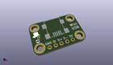
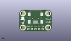
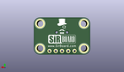
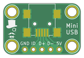
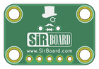

Contents
========

* [PRPR7 > ](#prpr7--)
	* [Interactive BOM](#interactive-bom)
	* [OOMP Parts](#oomp-parts)
	* [Images](#images)
	* [Tags](#tags)
  
![][im]
# PRPR7 > 

- ID: PROJ-SIRB-0007-STAN-01
- Hex ID: PRPR7
- Name: MiniUSB Breakout Board (sirboard)
- Description: MiniUSB Breakout Board (sirboard)
- Long Link: [http://oom.lt/PROJ-SIRB-0007-STAN-01](http://oom.lt/PROJ-SIRB-0007-STAN-01)
- Short Link: [http://oom.lt/PRPR7](http://oom.lt/PRPR7)

## Interactive BOM

- Interactive BOM page: [ibom.html](https://htmlpreview.github.io/?https://github.com/oomlout/oomlout_OOMP_projects/blob/main/PROJ-SIRB-0007-STAN-01/kicad/bom/ibom.html)

## OOMP Parts
  

|OOMP ID|Name|Identifier|
| :---: | :---: | :---: |
|UNMATCHED-UNMATCHED-X-UNMATCHED-01||J1|
|[HEAD-I01-X-PI05-01](https://github.com/oomlout/oomlout_OOMP_parts/tree/main/HEAD-I01-X-PI05-01/)|[2.54 mm 5 Pin Header](https://github.com/oomlout/oomlout_OOMP_parts/tree/main/HEAD-I01-X-PI05-01/)|[J2](https://github.com/oomlout/oomlout_OOMP_parts/tree/main/HEAD-I01-X-PI05-01/)|

## Images
  
  

|kicadPcb3d|kicadPcb3dFront|kicadPcb3dBack|pcbdraw|pcbdrawback|
| :---: | :---: | :---: | :---: | :---: |
||||||

## Tags

- oompType: PROJ
- oompSize: SIRB
- oompColor: 0007
- oompDesc: STAN
- oompIndex: 01
- name: MiniUSB Breakout Board (sirboard)
- gitRepo: https://github.com/sirboard/BreakoutBoards
- gitName: BreakoutBoards
- kicadBoard: MiniUSB/MiniUSB.kicad_pcb
- kicadSchem: MiniUSB/MiniUSB.kicad_sch
- hexID: PRPR7
- oompID: PROJ-SIRB-0007-STAN-01
- oompParts: J1,UNMATCHED-UNMATCHED-X-UNMATCHED-01
- oompParts: J2,HEAD-I01-X-PI05-01
- rawParts: G***,LOGO,logo54x76,logo54x76,,,,
- rawParts: J1,USB_B_Mini,SirBoard_USB_Mini-B,SirBoard_USB_Mini-B,,,,
- rawParts: G***,LOGO,logo63x89,logo63x89,,,,
- rawParts: G***,LOGO,SirBoard112x35,SirBoard112x35,,,,
- rawParts: J2,Conn_01x05,PinHeader_1x05_P2.54mm_Vertical,PinHeader_1x05_P2.54mm_Vertical,,,,

[im]: kicadPcb3d_450.png
