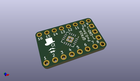
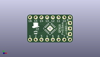
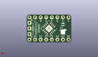
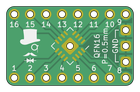
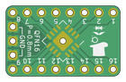

Contents
========

* [PRPR8 > ](#prpr8--)
	* [Interactive BOM](#interactive-bom)
	* [OOMP Parts](#oomp-parts)
	* [Images](#images)
	* [Tags](#tags)
  
![][im]
# PRPR8 > 

- ID: PROJ-SIRB-0008-STAN-01
- Hex ID: PRPR8
- Name: QFN16 Breakout Board (sirboard)
- Description: QFN16 Breakout Board (sirboard)
- Long Link: [http://oom.lt/PROJ-SIRB-0008-STAN-01](http://oom.lt/PROJ-SIRB-0008-STAN-01)
- Short Link: [http://oom.lt/PRPR8](http://oom.lt/PRPR8)

## Interactive BOM

- Interactive BOM page: [ibom.html](https://htmlpreview.github.io/?https://github.com/oomlout/oomlout_OOMP_projects/blob/main/PROJ-SIRB-0008-STAN-01/kicad/bom/ibom.html)

## OOMP Parts
  

|OOMP ID|Name|Identifier|
| :---: | :---: | :---: |
|[HEAD-I01-X-PI03-01](https://github.com/oomlout/oomlout_OOMP_parts/tree/main/HEAD-I01-X-PI03-01/)|[2.54 mm 3 Pin Header](https://github.com/oomlout/oomlout_OOMP_parts/tree/main/HEAD-I01-X-PI03-01/)|[J5](https://github.com/oomlout/oomlout_OOMP_parts/tree/main/HEAD-I01-X-PI03-01/)|
|UNMATCHED-UNMATCHED-X-UNMATCHED-01||J2, J4|
|[HEAD-I01-X-PI08-01](https://github.com/oomlout/oomlout_OOMP_parts/tree/main/HEAD-I01-X-PI08-01/)|[2.54 mm 8 Pin Header](https://github.com/oomlout/oomlout_OOMP_parts/tree/main/HEAD-I01-X-PI08-01/)|[J3, J1](https://github.com/oomlout/oomlout_OOMP_parts/tree/main/HEAD-I01-X-PI08-01/)|

## Images
  
  

|kicadPcb3d|kicadPcb3dFront|kicadPcb3dBack|pcbdraw|pcbdrawback|
| :---: | :---: | :---: | :---: | :---: |
||||||

## Tags

- oompType: PROJ
- oompSize: SIRB
- oompColor: 0008
- oompDesc: STAN
- oompIndex: 01
- name: QFN16 Breakout Board (sirboard)
- gitRepo: https://github.com/sirboard/BreakoutBoards
- gitName: BreakoutBoards
- kicadBoard: QFN16/QFN16.kicad_pcb
- kicadSchem: QFN16/QFN16.kicad_sch
- hexID: PRPR8
- oompID: PROJ-SIRB-0008-STAN-01
- oompParts: J5,HEAD-I01-X-PI03-01
- oompParts: J2,UNMATCHED-UNMATCHED-X-UNMATCHED-01
- oompParts: J4,UNMATCHED-UNMATCHED-X-UNMATCHED-01
- oompParts: J3,HEAD-I01-X-PI08-01
- oompParts: J1,HEAD-I01-X-PI08-01
- rawParts: G***,LOGO,logo54x76,logo54x76,,,,
- rawParts: G***,LOGO,logo54x76,logo54x76,,,,
- rawParts: J5,Conn_01x03,PinHeader_1x03_P2.54mm_Vertical,PinHeader_1x03_P2.54mm_Vertical,,,,
- rawParts: J2,Conn_02x08_Counter_Clockwise,QFN-16-1EP_4x4mm_P0.65mm_EP2.1x2.1mm,QFN-16-1EP_4x4mm_P0.65mm_EP2.1x2.1mm,,,,
- rawParts: J4,Conn_02x08_Counter_Clockwise,QFN-16-1EP_5x5mm_P0.8mm_EP2.7x2.7mm,QFN-16-1EP_5x5mm_P0.8mm_EP2.7x2.7mm,,,,
- rawParts: J3,Conn_01x08,PinHeader_1x08_P2.54mm_Vertical,PinHeader_1x08_P2.54mm_Vertical,,,,
- rawParts: J1,Conn_01x08,PinHeader_1x08_P2.54mm_Vertical,PinHeader_1x08_P2.54mm_Vertical,,,,

[im]: kicadPcb3d_450.png
