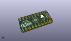
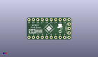
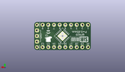
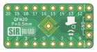
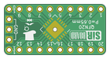

Contents
========

* [PRPR9 > ](#prpr9--)
	* [Interactive BOM](#interactive-bom)
	* [OOMP Parts](#oomp-parts)
	* [Images](#images)
	* [Tags](#tags)
  
![][im]
# PRPR9 > 

- ID: PROJ-SIRB-0009-STAN-01
- Hex ID: PRPR9
- Name: QFN20 Breakout Board (sirboard)
- Description: QFN20 Breakout Board (sirboard)
- Long Link: [http://oom.lt/PROJ-SIRB-0009-STAN-01](http://oom.lt/PROJ-SIRB-0009-STAN-01)
- Short Link: [http://oom.lt/PRPR9](http://oom.lt/PRPR9)

## Interactive BOM

- Interactive BOM page: [ibom.html](https://htmlpreview.github.io/?https://github.com/oomlout/oomlout_OOMP_projects/blob/main/PROJ-SIRB-0009-STAN-01/kicad/bom/ibom.html)

## OOMP Parts
  

|OOMP ID|Name|Identifier|
| :---: | :---: | :---: |
|[HEAD-I01-X-PI10-01](https://github.com/oomlout/oomlout_OOMP_parts/tree/main/HEAD-I01-X-PI10-01/)|[2.54 mm 10 Pin Header](https://github.com/oomlout/oomlout_OOMP_parts/tree/main/HEAD-I01-X-PI10-01/)|[J1, J3](https://github.com/oomlout/oomlout_OOMP_parts/tree/main/HEAD-I01-X-PI10-01/)|
|[HEAD-I01-X-PI03-01](https://github.com/oomlout/oomlout_OOMP_parts/tree/main/HEAD-I01-X-PI03-01/)|[2.54 mm 3 Pin Header](https://github.com/oomlout/oomlout_OOMP_parts/tree/main/HEAD-I01-X-PI03-01/)|[J5](https://github.com/oomlout/oomlout_OOMP_parts/tree/main/HEAD-I01-X-PI03-01/)|
|UNMATCHED-UNMATCHED-X-UNMATCHED-01||J4, J2|

## Images
  
  

|kicadPcb3d|kicadPcb3dFront|kicadPcb3dBack|pcbdraw|pcbdrawback|
| :---: | :---: | :---: | :---: | :---: |
||||||

## Tags

- oompType: PROJ
- oompSize: SIRB
- oompColor: 0009
- oompDesc: STAN
- oompIndex: 01
- name: QFN20 Breakout Board (sirboard)
- gitRepo: https://github.com/sirboard/BreakoutBoards
- gitName: BreakoutBoards
- kicadBoard: QFN20/QFN20.kicad_pcb
- kicadSchem: QFN20/QFN20.kicad_sch
- hexID: PRPR9
- oompID: PROJ-SIRB-0009-STAN-01
- oompParts: J1,HEAD-I01-X-PI10-01
- oompParts: J3,HEAD-I01-X-PI10-01
- oompParts: J5,HEAD-I01-X-PI03-01
- oompParts: J4,UNMATCHED-UNMATCHED-X-UNMATCHED-01
- oompParts: J2,UNMATCHED-UNMATCHED-X-UNMATCHED-01
- rawParts: G***,LOGO,SirBoard79x25,SirBoard79x25,,,,
- rawParts: G***,LOGO,SirBoard79x25,SirBoard79x25,,,,
- rawParts: G***,LOGO,logo54x76,logo54x76,,,,
- rawParts: G***,LOGO,logo54x76,logo54x76,,,,
- rawParts: J1,Conn_01x10,PinHeader_1x10_P2.54mm_Vertical,PinHeader_1x10_P2.54mm_Vertical,,,,
- rawParts: J3,Conn_01x10,PinHeader_1x10_P2.54mm_Vertical,PinHeader_1x10_P2.54mm_Vertical,,,,
- rawParts: J5,Conn_01x03,PinHeader_1x03_P2.54mm_Vertical,PinHeader_1x03_P2.54mm_Vertical,,,,
- rawParts: J4,Conn_02x10_Counter_Clockwise,QFN-20-1EP_5x5mm_P0.65mm_EP3.35x3.35mm,QFN-20-1EP_5x5mm_P0.65mm_EP3.35x3.35mm,,,,
- rawParts: J2,Conn_02x10_Counter_Clockwise,QFN-20-1EP_4x4mm_P0.5mm_EP2.5x2.5mm,QFN-20-1EP_4x4mm_P0.5mm_EP2.5x2.5mm,,,,

[im]: kicadPcb3d_450.png
