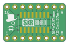

Contents
========

* [PRPR10 > ](#prpr10--)
	* [Interactive BOM](#interactive-bom)
	* [OOMP Parts](#oomp-parts)
	* [Images](#images)
	* [Tags](#tags)
  
![][im]
# PRPR10 > 

- ID: PROJ-SIRB-0010-STAN-01
- Hex ID: PRPR10
- Name: SOIC16 Breakout Board (sirboard)
- Description: SOIC16 Breakout Board (sirboard)
- Long Link: [http://oom.lt/PROJ-SIRB-0010-STAN-01](http://oom.lt/PROJ-SIRB-0010-STAN-01)
- Short Link: [http://oom.lt/PRPR10](http://oom.lt/PRPR10)

## Interactive BOM

- Interactive BOM page: [ibom.html](https://htmlpreview.github.io/?https://github.com/oomlout/oomlout_OOMP_projects/blob/main/PROJ-SIRB-0010-STAN-01/kicad/bom/ibom.html)

## OOMP Parts
  

|OOMP ID|Name|Identifier|
| :---: | :---: | :---: |
|UNMATCHED-UNMATCHED-X-UNMATCHED-01||REF**, J1|
|[HEAD-I01-X-PI08-01](https://github.com/oomlout/oomlout_OOMP_parts/tree/main/HEAD-I01-X-PI08-01/)|[2.54 mm 8 Pin Header](https://github.com/oomlout/oomlout_OOMP_parts/tree/main/HEAD-I01-X-PI08-01/)|[J3, J2](https://github.com/oomlout/oomlout_OOMP_parts/tree/main/HEAD-I01-X-PI08-01/)|

## Images
  
  

|kicadPcb3d|kicadPcb3dFront|kicadPcb3dBack|pcbdraw|pcbdrawback|
| :---: | :---: | :---: | :---: | :---: |
||||||

## Tags

- oompType: PROJ
- oompSize: SIRB
- oompColor: 0010
- oompDesc: STAN
- oompIndex: 01
- name: SOIC16 Breakout Board (sirboard)
- gitRepo: https://github.com/sirboard/BreakoutBoards
- gitName: BreakoutBoards
- kicadBoard: SOIC16/SOIC16.kicad_pcb
- kicadSchem: SOIC16/SOIC16.kicad_sch
- hexID: PRPR10
- oompID: PROJ-SIRB-0010-STAN-01
- oompParts: REF**,UNMATCHED-UNMATCHED-X-UNMATCHED-01
- oompParts: J3,HEAD-I01-X-PI08-01
- oompParts: J2,HEAD-I01-X-PI08-01
- oompParts: J1,UNMATCHED-UNMATCHED-X-UNMATCHED-01
- rawParts: G***,LOGO,SirBoard79x25,SirBoard79x25,,,,
- rawParts: REF**,TSSOP-16_4.4x5mm_P0.65mm,TSSOP-16_4.4x5mm_P0.65mm,TSSOP-16_4.4x5mm_P0.65mm,,,,
- rawParts: J3,Conn_01x08,PinHeader_1x08_P2.54mm_Vertical,PinHeader_1x08_P2.54mm_Vertical,,,,
- rawParts: J2,Conn_01x08,PinHeader_1x08_P2.54mm_Vertical,PinHeader_1x08_P2.54mm_Vertical,,,,
- rawParts: G***,LOGO,logo54x76,logo54x76,,,,
- rawParts: G***,LOGO,logo63x89,logo63x89,,,,
- rawParts: J1,Conn_02x08_Counter_Clockwise,SOIC-16_3.9x9.9mm_P1.27mm,SOIC-16_3.9x9.9mm_P1.27mm,,,,

[im]: kicadPcb3d_450.png
