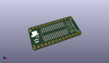
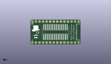
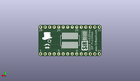
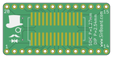
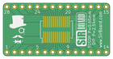

Contents
========

* [PRPR13 > ](#prpr13--)
	* [Interactive BOM](#interactive-bom)
	* [OOMP Parts](#oomp-parts)
	* [Images](#images)
	* [Tags](#tags)
  
![][im]
# PRPR13 > 

- ID: PROJ-SIRB-0013-STAN-01
- Hex ID: PRPR13
- Name: SOIC28 Breakout Board (sirboard)
- Description: SOIC28 Breakout Board (sirboard)
- Long Link: [http://oom.lt/PROJ-SIRB-0013-STAN-01](http://oom.lt/PROJ-SIRB-0013-STAN-01)
- Short Link: [http://oom.lt/PRPR13](http://oom.lt/PRPR13)

## Interactive BOM

- Interactive BOM page: [ibom.html](https://htmlpreview.github.io/?https://github.com/oomlout/oomlout_OOMP_projects/blob/main/PROJ-SIRB-0013-STAN-01/kicad/bom/ibom.html)

## OOMP Parts
  

|OOMP ID|Name|Identifier|
| :---: | :---: | :---: |
|UNMATCHED-UNMATCHED-X-UNMATCHED-01||J2, J4|
|[HEAD-I01-X-PI14-01](https://github.com/oomlout/oomlout_OOMP_parts/tree/main/HEAD-I01-X-PI14-01/)|[2.54 mm 14 Pin Header](https://github.com/oomlout/oomlout_OOMP_parts/tree/main/HEAD-I01-X-PI14-01/)|[J1, J3](https://github.com/oomlout/oomlout_OOMP_parts/tree/main/HEAD-I01-X-PI14-01/)|

## Images
  
  

|kicadPcb3d|kicadPcb3dFront|kicadPcb3dBack|pcbdraw|pcbdrawback|
| :---: | :---: | :---: | :---: | :---: |
||||||

## Tags

- oompType: PROJ
- oompSize: SIRB
- oompColor: 0013
- oompDesc: STAN
- oompIndex: 01
- name: SOIC28 Breakout Board (sirboard)
- gitRepo: https://github.com/sirboard/BreakoutBoards
- gitName: BreakoutBoards
- kicadBoard: SOIC28/SOIC28.kicad_pcb
- kicadSchem: SOIC28/SOIC28.kicad_sch
- hexID: PRPR13
- oompID: PROJ-SIRB-0013-STAN-01
- oompParts: J2,UNMATCHED-UNMATCHED-X-UNMATCHED-01
- oompParts: J4,UNMATCHED-UNMATCHED-X-UNMATCHED-01
- oompParts: J1,HEAD-I01-X-PI14-01
- oompParts: J3,HEAD-I01-X-PI14-01
- rawParts: G***,LOGO,logo94x134,logo94x134,,,,
- rawParts: G***,LOGO,logo94x134,logo94x134,,,,
- rawParts: J2,Conn_02x14_Counter_Clockwise,SOIC-28W_7.5x18.7mm_P1.27mm,SOIC-28W_7.5x18.7mm_P1.27mm,,,,
- rawParts: J4,Conn_02x14_Counter_Clockwise,SSOP-28_5.3x10.2mm_P0.65mm,SSOP-28_5.3x10.2mm_P0.65mm,,,,
- rawParts: J1,Conn_01x14,PinHeader_1x14_P2.54mm_Vertical,PinHeader_1x14_P2.54mm_Vertical,,,,
- rawParts: J3,Conn_01x14,PinHeader_1x14_P2.54mm_Vertical,PinHeader_1x14_P2.54mm_Vertical,,,,
- rawParts: G***,LOGO,SirBoard112x35,SirBoard112x35,,,,

[im]: kicadPcb3d_450.png
