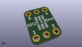
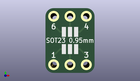
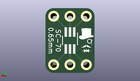
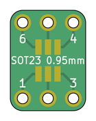
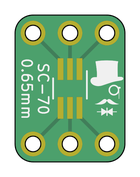

Contents
========

* [PRPR14 > ](#prpr14--)
	* [Interactive BOM](#interactive-bom)
	* [OOMP Parts](#oomp-parts)
	* [Images](#images)
	* [Tags](#tags)
  
![][im]
# PRPR14 > 

- ID: PROJ-SIRB-0014-STAN-01
- Hex ID: PRPR14
- Name: SOT6 Breakout Board (sirboard)
- Description: SOT6 Breakout Board (sirboard)
- Long Link: [http://oom.lt/PROJ-SIRB-0014-STAN-01](http://oom.lt/PROJ-SIRB-0014-STAN-01)
- Short Link: [http://oom.lt/PRPR14](http://oom.lt/PRPR14)

## Interactive BOM

- Interactive BOM page: [ibom.html](https://htmlpreview.github.io/?https://github.com/oomlout/oomlout_OOMP_projects/blob/main/PROJ-SIRB-0014-STAN-01/kicad/bom/ibom.html)

## OOMP Parts
  

|OOMP ID|Name|Identifier|
| :---: | :---: | :---: |
|UNMATCHED-UNMATCHED-X-UNMATCHED-01||J4, J3|
|[HEAD-I01-X-PI03-01](https://github.com/oomlout/oomlout_OOMP_parts/tree/main/HEAD-I01-X-PI03-01/)|[2.54 mm 3 Pin Header](https://github.com/oomlout/oomlout_OOMP_parts/tree/main/HEAD-I01-X-PI03-01/)|[J2, J1](https://github.com/oomlout/oomlout_OOMP_parts/tree/main/HEAD-I01-X-PI03-01/)|

## Images
  
  

|kicadPcb3d|kicadPcb3dFront|kicadPcb3dBack|pcbdraw|pcbdrawback|
| :---: | :---: | :---: | :---: | :---: |
||||||

## Tags

- oompType: PROJ
- oompSize: SIRB
- oompColor: 0014
- oompDesc: STAN
- oompIndex: 01
- name: SOT6 Breakout Board (sirboard)
- gitRepo: https://github.com/sirboard/BreakoutBoards
- gitName: BreakoutBoards
- kicadBoard: SOT6/SOT6.kicad_pcb
- kicadSchem: SOT6/SOT6.kicad_sch
- hexID: PRPR14
- oompID: PROJ-SIRB-0014-STAN-01
- oompParts: J4,UNMATCHED-UNMATCHED-X-UNMATCHED-01
- oompParts: J3,UNMATCHED-UNMATCHED-X-UNMATCHED-01
- oompParts: J2,HEAD-I01-X-PI03-01
- oompParts: J1,HEAD-I01-X-PI03-01
- rawParts: J4,Conn_02x03_Counter_Clockwise,SOT-363_SC-70-6_Handsoldering,SOT-363_SC-70-6_Handsoldering,,,,
- rawParts: J3,Conn_02x03_Counter_Clockwise,SOT-23-6_Handsoldering,SOT-23-6_Handsoldering,,,,
- rawParts: G***,LOGO,logo38x53,logo38x53,,,,
- rawParts: J2,Conn_01x03,PinHeader_1x03_P2.54mm_Vertical,PinHeader_1x03_P2.54mm_Vertical,,,,
- rawParts: J1,Conn_01x03,PinHeader_1x03_P2.54mm_Vertical,PinHeader_1x03_P2.54mm_Vertical,,,,

[im]: kicadPcb3d_450.png
