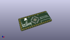
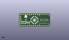
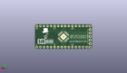
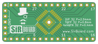
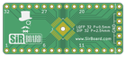

Contents
========

* [PRPR15 > ](#prpr15--)
	* [Interactive BOM](#interactive-bom)
	* [OOMP Parts](#oomp-parts)
	* [Images](#images)
	* [Tags](#tags)
  
![][im]
# PRPR15 > 

- ID: PROJ-SIRB-0015-STAN-01
- Hex ID: PRPR15
- Name: TQFP32 Breakout Board (sirboard)
- Description: TQFP32 Breakout Board (sirboard)
- Long Link: [http://oom.lt/PROJ-SIRB-0015-STAN-01](http://oom.lt/PROJ-SIRB-0015-STAN-01)
- Short Link: [http://oom.lt/PRPR15](http://oom.lt/PRPR15)

## Interactive BOM

- Interactive BOM page: [ibom.html](https://htmlpreview.github.io/?https://github.com/oomlout/oomlout_OOMP_projects/blob/main/PROJ-SIRB-0015-STAN-01/kicad/bom/ibom.html)

## OOMP Parts
  

|OOMP ID|Name|Identifier|
| :---: | :---: | :---: |
|[HEAD-I01-X-PI05-01](https://github.com/oomlout/oomlout_OOMP_parts/tree/main/HEAD-I01-X-PI05-01/)|[2.54 mm 5 Pin Header](https://github.com/oomlout/oomlout_OOMP_parts/tree/main/HEAD-I01-X-PI05-01/)|[J6](https://github.com/oomlout/oomlout_OOMP_parts/tree/main/HEAD-I01-X-PI05-01/)|
|UNMATCHED-UNMATCHED-X-UNMATCHED-01||, J4, J5, J3|
|[HEAD-I01-X-PI16-01](https://github.com/oomlout/oomlout_OOMP_parts/tree/main/HEAD-I01-X-PI16-01/)|[2.54 mm 16 Pin Header](https://github.com/oomlout/oomlout_OOMP_parts/tree/main/HEAD-I01-X-PI16-01/)|[J2, J1](https://github.com/oomlout/oomlout_OOMP_parts/tree/main/HEAD-I01-X-PI16-01/)|

## Images
  
  

|kicadPcb3d|kicadPcb3dFront|kicadPcb3dBack|pcbdraw|pcbdrawback|
| :---: | :---: | :---: | :---: | :---: |
||||||

## Tags

- oompType: PROJ
- oompSize: SIRB
- oompColor: 0015
- oompDesc: STAN
- oompIndex: 01
- name: TQFP32 Breakout Board (sirboard)
- gitRepo: https://github.com/sirboard/BreakoutBoards
- gitName: BreakoutBoards
- kicadBoard: TQFP32/TQFP32.kicad_pcb
- kicadSchem: TQFP32/TQFP32.kicad_sch
- hexID: PRPR15
- oompID: PROJ-SIRB-0015-STAN-01
- oompParts: J6,HEAD-I01-X-PI05-01
- oompParts: ,UNMATCHED-UNMATCHED-X-UNMATCHED-01
- oompParts: J4,UNMATCHED-UNMATCHED-X-UNMATCHED-01
- oompParts: J5,UNMATCHED-UNMATCHED-X-UNMATCHED-01
- oompParts: J3,UNMATCHED-UNMATCHED-X-UNMATCHED-01
- oompParts: J2,HEAD-I01-X-PI16-01
- oompParts: J1,HEAD-I01-X-PI16-01
- rawParts: G***,LOGO,SirBoard112x35,SirBoard112x35,,,,
- rawParts: G***,LOGO,SirBoard112x35,SirBoard112x35,,,,
- rawParts: G***,LOGO,logo76x107,logo76x107,,,,
- rawParts: G***,LOGO,logo76x107,logo76x107,,,,
- rawParts: J6,Conn_01x05,PinHeader_1x05_P2.54mm_Vertical,PinHeader_1x05_P2.54mm_Vertical,,,,
- rawParts: ,,,,,,,
- rawParts: J4,Conn_02x16_Counter_Clockwise,LQFP-32_5x5mm_P0.5mm,LQFP-32_5x5mm_P0.5mm,,,,
- rawParts: J5,Conn_02x16_Counter_Clockwise,QFN-32-1EP_4x4mm_P0.4mm_EP2.65x2.65mm,QFN-32-1EP_4x4mm_P0.4mm_EP2.65x2.65mm,,,,
- rawParts: J3,Conn_02x16_Counter_Clockwise,TQFP-32_7x7mm_P0.8mm,TQFP-32_7x7mm_P0.8mm,,,,
- rawParts: J2,Conn_01x16,PinHeader_1x16_P2.54mm_Vertical,PinHeader_1x16_P2.54mm_Vertical,,,,
- rawParts: J1,Conn_01x16,PinHeader_1x16_P2.54mm_Vertical,PinHeader_1x16_P2.54mm_Vertical,,,,

[im]: kicadPcb3d_450.png
